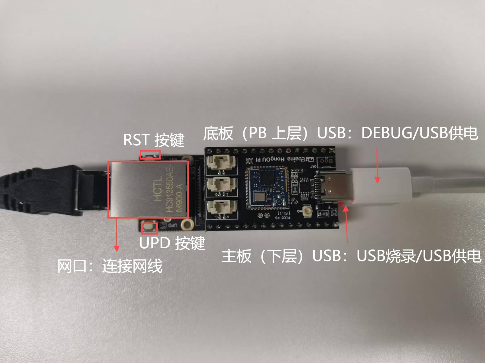
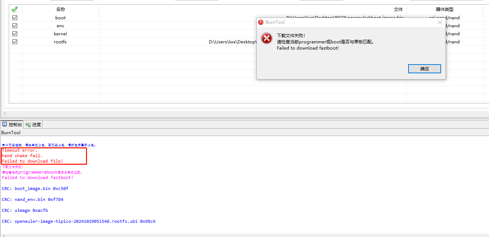

.. _hipico-burn:

HiPico镜像烧录
#####################

HiPico使用ToolPlatform工具烧录HiPico开发板。

`点此跳转下载烧录工具 <https://pan.baidu.com/s/1kjZ_qx_URgCbEnhGCSebog?pwd=f1cf>`__

1.准备工作
-----------

烧录工具
~~~~~~~~

解压ToolPlatform-CAM-5.6.58-win32-x86_64.zip之后，双击目录中\ **ToolPlatform.exe**\ 即可使用。

镜像包内容
~~~~~~~~~~

烧录镜像前需要准备好镜像包，包括以下文件：

1. burn_table.xml：烧录分区表

2. boot_image.bin：u-boot镜像

3. nand_env.bin：u-boot环境变量

4. uImage：Linux内核镜像

5. openeuler-image-hipico-\*.rootfs.ubi：根文件系统镜像

硬件连接
~~~~~~~~~~

若选择网络烧录，需连接网口和底板（即PB板）USB，网线可直接连接PC或与PC同网段路由/交换机；底板USB连接PC端。

若选择USB烧录，必须连接主板（即PICO板）USB至PC端，可以不接底板（PB板）。

网络连接示意如下。

.. image:: images/wx_17302726487813.png

.. _2网络烧录:

2.网络烧录
----------

1. 打开烧录工具，第一次打开时会提示选择芯片，选择\ **Hi3516CV610**。

    .. image:: images/image-20241027222134378.png

2. 点击BurnTool进入烧录界面。

    .. image:: images/image-20241027222240284.png

3. 选择烧录方式及镜像包。

   网络烧录选择传输方式为网口，刷新本地PC配置，选择按分区烧写，打开分区表文件。

    .. image:: images/image-20241030112908718.png
 
    .. image:: images/image-20241030114043195.png

   ToolPlatform 选择本地PC配置说明：

   a.  根据设备管理器->端口，查看连接板端的串口，选择工具中的串口。

        .. image:: images/image-20241030113424150.png

   b.  运行CMD命令提示符窗口，运行ipconfig，查看本机IP信息，选择工具中的服务器IP。

        .. image:: images/image-20241030113656811.png

4. 选择rootfs镜像。

   镜像包中分区表文件未写明rootfs镜像名称，自行选择对应的镜像文件。

    .. image:: images/image-20241030115141283.png

5. 开始烧录。

   点击烧写后，下方控制台打印蓝色字体“串口已经连接，请给单板上电，若已经上电，请断电后重新上电。”点按RST按键，重新上电。出现“#####”打印，即开始烧录。

    .. image:: images/image-20241030115512916.png

6. 下方的控制台会显示烧录的详细过程，烧录错误时可根据控制台中的信息判断错误原因。

    .. image:: images/image-20241030131805870.png

7. 烧录成功。

    .. image:: images/image-20241030131859441.png

.. _3usb烧录:

3.USB烧录
---------

.. _31-usb驱动安装:

3.1 USB驱动安装
~~~~~~~~~~~~~~~

hitools工具可使用\ **串口、网络、USB**\ 接口进行烧录。若不使用USB烧录则不需要进行安装USB驱动的步骤。

1. 运行\ **zadig_2.5.exe**\ 文件。

    .. image:: images/image-20241027214656594.png

2. 选择 Options->List All Devices，将 List All Devices 勾上。

    .. image:: images/image-20241027214854749.png

3. 进入update模式：按下update按键不松手，随后\ **重新上下电**\ 或者\ **按下并松开reset按键**\ ，随后可松开update按键。

4. 在红色方框位置选择正确的设备（USBBurn），然后方框内选择驱动（libusbK）。点击“Install Driver”（未安装过）或者“Replace Driver”（已安装过）。

    .. image:: images/image-20241027220855071.png

    .. image:: images/image-20241027221410263.png

    .. image:: images/image-20241027221445335.png

5. 重新进入update模式按照上述的方式继续安装\ **libusb-win32**。

    .. image:: images/image-20241027221257451.png

.. _22-usb烧录镜像:

3.2 USB烧录镜像
~~~~~~~~~~~~~~~

1. 打开烧录工具，第一次打开时会提示选择芯片，选择\ **Hi3516CV610**。

    .. image:: images/image-20241027222134378.png

2. 点击BurnTool进入烧录界面。

    .. image:: images/image-20241027222240284.png

3. 选择烧录方式及镜像包。

    .. image:: images/image-20241027222610538.png

4. 选择rootfs镜像。

    .. image:: images/image-20241027223022906.png

    .. image:: images/image-20241027223052428.png

5. 开始烧录。

    .. image:: images/image-20241027223453489.png

6. 下方的控制台会显示烧录的详细过程，烧录错误时可根据控制台中的信息判断错误原因。

    .. image:: images/image-20241027223542816.png

7. 烧录成功。

    .. image:: images/image-20241027223742358.png

.. _4常见烧录报错处理:

4.常见烧录报错处理
------------------

控制台会显示烧录的详细过程，若报错，查看控制台打印详细信息做出处理。仅列出部分常见报错。

.. _41-打开串口失败可能已经打开或者不存在:

4.1 打开串口失败，可能已经打开或者不存在。
~~~~~~~~~~~~~~~~~~~~~~~~~~~~~~~~~~~~~~~~~~

| 控制台打印报错信息：打开串口COM*失败，可能已经打开或者不存在。
| 检查配置，点击烧写后报该错，请检查是否有其他工具正在使用该串口，若有请断开连接。通常情况下，物理串口是单一连接一个外部设备的。

.. image:: images/image-20241030130649741.png

.. _42-timeout-err:

4.2 Timeout err.
~~~~~~~~~~~~~~~~

控制台打印报错信息：Timeout err.

检查配置，点击烧写后一段时间未执行复位操作或重新上电操作，导致超时，下载文件失败。重新烧写，按下reset键。出现“#####”正常烧录u-boot。

.. _44-报错网络下载tftp超时:

4.4 报错网络下载TFTP超时
~~~~~~~~~~~~~~~~~~~~~~~~

| 检查配置，板端与主机可ping通，烧录时卡在env部分，报错网络下载TFTP超时，检查网络连接。
| 也可能是网络连接不稳定，推荐服务器IP选择静态IP，检查网络通信是否正常，网线是否可用。需要关闭防火墙。

.. _5pc端设置静态ip:

5.PC端设置静态IP
----------------

Windows系统，打开设置->网络和Internet->高级网络设置-更改适配器选项。

或者打开控制面板->网络和Internet->网络和共享中心。

右键单击以太网->属性，或点击以太网->属性；选择Internet。
协议版本4（TCP/IPv4）->属性；

.. image:: images/image-20241030132625638.png

选择使用下面的IP地址，输入修改的IP地址，子网掩码，默认网关；确定->关闭。

.. image:: images/image-20241030132834332.png

.. _6若没有分区表文件xml文件）自行选择镜像文件填写长度进行烧录并保存:

6.若没有分区表文件（xml文件），自行选择镜像文件，填写长度进行烧录并保存
-----------------------------------------------------------------------

烧录顺序为boot_image.bin->nand_env.bin->uImage->rootfs.ubi，长度建议512K，512K，4M，-（表示剩余空间），勾选需要烧录的文件，之后可点击分区表文件后“保存”按键保存分区表。

.. image:: images/image-20241030131525947.png

