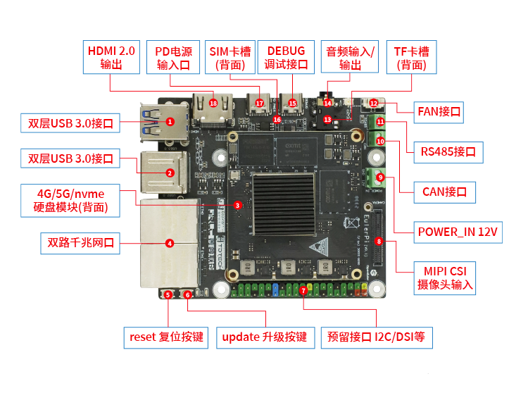

.. _board_hieulerpi_hardware_features:

海鸥派硬件特性
##########################################

海鸥派（HiEuler Pi）是由南京启诺信息研发的开发板,产品型号为 Mark1。主控采用的是SS928，该芯片内置 32bit RISC-V MCU\@500MHz，四核 ARM Cortex A55\@1.4GHz，
AI算力高达10.4TopsINT8，双内核异构引擎，同时支持 4K\@60fps H.265/H.264 多码流编解码，支持3FWDR、六轴防抖、硬件拼接等多种图像增强和处理算法，为用户提供了卓越
的图像处理能力。还支持智能降噪、4 目全景拼接以及双目深度处理，同时提供多路智能视觉分析（目标识别/运动跟踪/周界防范等）。

海鸥派是一款应用于机器人/机器视觉/工业控制领域的开发板，支持CAN，485等接口灵活满足面向工业领域开发者的不同选型要求，软硬协同以实现系统最优的开发效率。
同时海鸥派在工业领域提出一套完整的 OS for AI 开发环境，能够支持多类机器人算法与应用的高效部署。
**硬件外设接口参考图**

**开发板主要特性**

* RAM：板载 4/8GB LPDDR4X
* ROM：板载 32/64GB EMMC5.1
* 支持 2 路千兆网口
* 支持 4 路 sensor 扩展
* 支持 1 路 MIC 输入和立体声线性输出
* 支持 1 路 RS485
* 支持 4 路 USB 接口
* 支持 1 路 TF 卡（SDIO）
* 支持一路 CAN 总线
* 支持 PD3.0/2.0，BC1.2 等快充协议
* 支持 1 路 MIPI-DSI
* 支持 1 路 HDMI 输出
* 支持 1 路 PCIE2.0x1 的 M.2 接口
* 支持一路星闪模块（或者 USB WiFi 模块）

**SS928芯片主要特性**

* 处理器系统
    - CPU：ARM Cortex-A55\@1.4GHz x4
    - NPU
        - 10.4TOPS\@INT8
        - NNN(dlite 核)×1
        - 4.8TOPS\@INT8，可支持 INT4/FP16
        - SVP_NNN（dpico 核）×1
        - 5.6TOPS\@INT8
    - DSP：Vision Q6 DSP x2
    - SVP：智能视频加速引擎(IVE/KCF+DPU) x1
    - MCU: 32 bit RISC-V MCU\@500MHz
* 视频编解码
    - H.264 BP/MP/HP
    - H.265 Main Profile
    - H.264/H.265 编解码最大分辨率为 8192 x 8192
    - H.264/H.265 编码支持 I/P 帧
    - H.264/H.265 多码流编码能力：
        - 3840 x 2160\@60fps + 1280x720\@30fps
        - 7680 x 4320\@15fps
    - H.264/H.265/MPEG-4 多码流解码能力：3840 x 2160\@60fps + 1920x1080\@60fps
    - 支持最多 8 个区域的编码前 OSD 叠加
    - 支持 CBR/VBR/AVBR/FIXQP/QPMAP 等多种码率控制模式
    - 输出码率最大值 100Mbps
    - 支持 8 个感兴趣区域（ROI）编码
    - 支持 JPEG Baseline 编解码： JPEG 编解码最大分辨率 16384x16384
    - JPEG 最大性能
        - 编码：3840 x 2160\@60fps(YUV420)
        - 解码：3840 x 2160\@75fps(YUV420)
* 视频输入
    - 支持 8-Lane image sensor 串行输入，支持 MIPI/LVDS/Sub-LVDS/HiSPi 多种接口
    - 支持 2x4-Lane 或 4x2-Lane 等多种组合，最 高支持4 路sensor 串行输入
    - 最大分辨率 8192 x 8192
    - 支持 8/10/12/14 Bit RGB Bayer DC 时序视频输入，时钟频率最高150MHz
    - 支持 BT.601、BT.656、BT.1120 视频输入接口
    - 支持主流 CMOS 电平热成像传感器
* 数字图像处理（ISP）
    - ISP 支持分时复用处理多路 sensor 输入视频
    - 支持 3A（AE/AWB/AF）功能，3A 的控制用户可调节
    - 支持去固定模式噪声（FPN）: 支持坏点校正、镜头阴影校正
    - 最高支持三帧 WDR 及 Advanced Local Tone Mapping
    - 支持多级 3D 去噪、图像边缘增强、去雾、动态对比度增强等处理功能 支持 3D-LUT 色彩调节
    - 支持镜头畸变校正，支持鱼眼矫正
    - 支持 6-DoF 数字防抖及 Rolling-Shutter 校正
    - 支持图像 Mirror、Flip、90 度/270 度旋转
    - 提供 PC 端 ISP 调节工具
* 视频与图形处理
    - 支持图形和图像 1/15.5～16x 缩放功能
    - 支持多达 4 路视频全景拼接
        - 输入 2 路 3840x2160，输出 4320x3840
        - 输入 4 路 2688x1520，输出 6080x2688
    - 支持视频层、图形层叠加
    - 支持色彩空间转换
* 视频输出
    - 支持 HDMI2.0 接口输出
    - 支持 4-Lane Mipi DSI/CSI 接口输出，最高 2.5Gbps/lane
    - 内置模拟标清 CVBS 输出
    - 支持 8/16/24 bit RGB、BT.656、BT.1120 等数字接口
    - 同时支持 2 个独立高清视频输出:支持任意两种接口非同源输出, 其中一路可支持 PIP(Picture In Picture)
    - 最大输出能力 3840x2160\@60fps + 1920x1080\@60fps
* 音频接口与处理
    - 内置 Audio codec，支持 16bit 语音输入和输出
    - 支持 I2S 接口
    - 支持多声道时分复用传输模式（TDM）
    - 支持 HDMI Audio 输出
    - 通过软件实现多协议语音编解码
    - 支持音频 3A（AEC/ANR/ALC）处理
    - 支持 G.711/G.726/AAC/等音频编码格式
* 安全隔离与引擎
    - 支持安全启动
    - 支持基于 TrustZone 的 REE/TEE 硬件隔离方案
    - 硬件实现 AES 对称加密算法
    - 硬件实现 RSA2048/3072/4096 签名校验算法
    - 硬件实现基于 HASH 的 SHA/256/384/512、HMAC_SHA256/384/512 算法 硬件实现随机数发生器
    - 集成 30Kbit OTP 存储空间供客户使用
* 网络接口
    - 2 个千兆以太网接口: 支持 RGMII、RMII 两种接口模式
    - 支持 TSO、UFO、COE 等加速单元
    - 支持 Jumbo Frame
* 外围接口
    - 支持上电复位（POR）和外部输入复位
    - 集成 4 通道 LSADC
    - 多个 UART、I2C、SPI、GPIO 接口
    - 2 个 SDIO3.0 接口: SDIO0 支持 SDXC 卡，最大容量 2TB, SDIO1 支持对接 WiFi 模组
    - 2 个 USB3.0/USB2.0 接口: USB0 仅 Host 接口, USB1 Host/Device 可切换
    - 2-Lane PCIe2.0 高速接口:支持 RC/EP 模式，可配置为 2-Lane PCIe2.0，可配置为 1-Lane PCIe2.0 + USB3.0
* 外部存储器接口
    - DDR4/LPDDR4/LPDDR4x 接口
        - 支持 4 x 16bit DDR4
        - 支持 2 x 32bit LPDDR4/LPDDR4x
        - DDR4 最高速率 3200Mbps
        - LPDDR4/LPDDR4x 最高速率 3733Mbps
        - 最大容量 8GB
    - SPI Nor/SPI Nand Flash 接口
        - 支持 1、2、4 线模式
        - SPI Nor Flash 支持 3Byte、4Byte 地址模式
    - NAND Flash 接口
        - 支持 SLC、MLC 异步接口器件
        - 支持 2/4/8/16KB 页大小
        - 支持 8/16/24/28/40/64bit ECC（以 1KB 为单位）
    - eMMC5.1 接口，最大容量 2TB
    - 可选择从 eMMC、SPI Nor/SPI Nand Flash、 NAND Flash 或PCIe 从片启动

其他更多材料请参考 `易百纳社区  <https://www.ebaina.com/>`_
