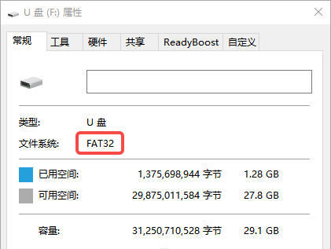
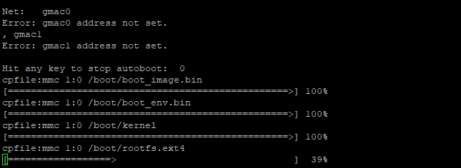
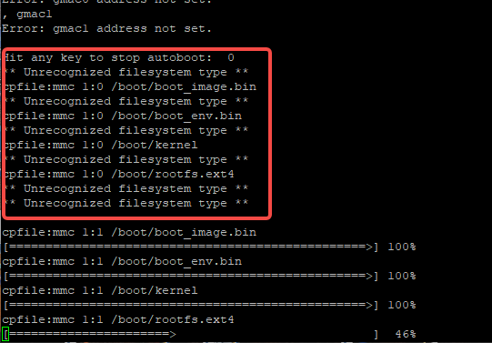
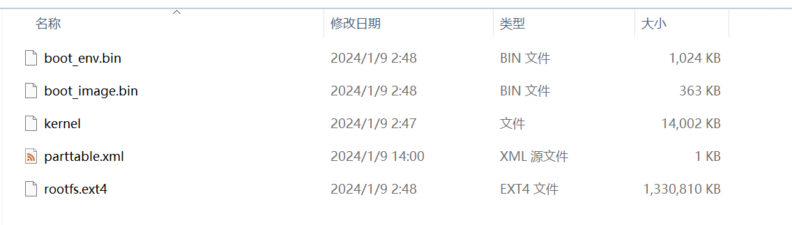
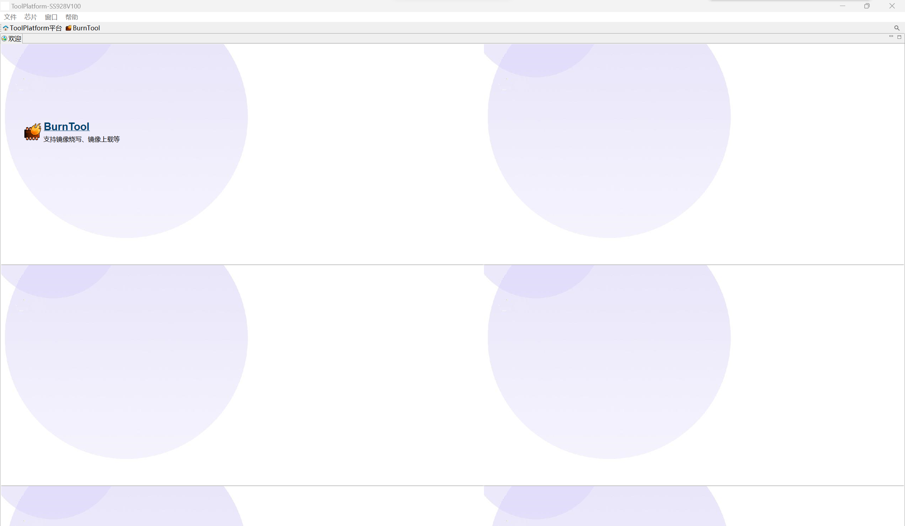
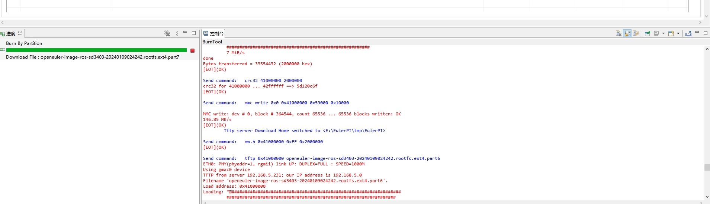

.. _hieuler_update:

欧拉派海鸥系列镜像升级与启动
============================

一、简介
--------

**欧拉派-海鸥** 系列为用户提供以下两种升级方式：

1. ToolPlatform工具网络升级

2. SD卡升级

这两种升级方式都是将文件写入到板载的EMMC存储中，系统默认也从此处启动。除此之外还支持SD卡启动，需要额外配置启动参数，具体操作参考 :ref:`SD卡启动` 的部分。

二、SD卡升级
------------

若不清楚这文件系统和系统分区可以忽略下面一小段备注，继续后面的操作。

   【备注】
   ：SD卡升级功能支持fat32格式和ext4格式的文件系统，在升级时会逐个扫描SD卡的每个分区，直到找到升级文件。

1) 检查文件系统格式
~~~~~~~~~~~~~~~~~~~

在windows中插入SD卡，查看SD卡的文件系统格式，若为FAT32则无需操作，若不是则需要格式化。

2) 拷贝固件
~~~~~~~~~~~

若要进行SD卡升级，需要将固件拷贝到SD卡中，并按以下文件名命名，放在SD卡根目录的boot目录下。

.. code:: 

   .
   └── boot
       ├── boot_env.bin             # uboot
       ├── boot_image.bin        # uboot环境变量
       ├── kernel                            # linux内核
       └── rootfs.ext4                   # 根文件系统

由于FAT32文件系统单文件最大仅支持4G的大小，在升级时除正常的单文件升级外还支持分块文件的升级。分块名为原始文件后追加分区编号，\ **编号从0开始**\ ，编号不允许带无意义的0，例如\ **rootfs.ext401**.

.. code:: 

   .
   └── boot
       ├── boot_env.bin          # uboot
       ├── boot_image.bin     # uboot环境变量
       ├── kernel                         # linux内核
       ├── rootfs.ext40             # 根文件系统
       ├── rootfs.ext41
       ├── rootfs.ext42
       ├── rootfs.ext43
       ├── rootfs.ext44
       └── rootfs.ext45

3) 升级固件
~~~~~~~~~~~

按住update按键，点按reset按键，在reset按键松开之后1~2s即可松开update按键。如果能连接串口可以看到以下输出则表示正在升级。

出现以下问题属于正常现象，在分区中未找到升级固件，只要最终出现升级进度条即可。

.. _ToolPlatform工具:

三、ToolPlatform工具
--------------------

ToolPlatform工具是烧录芯片镜像的最基本工具，未烧录任何芯片的裸板，或者uboot启动损坏都可以使用该工具重新烧录镜像。若正常使用SD卡升级则无需进行本章的操作。

使用ToolPlatform工具烧录时除了四个固件文件，还需要一个分区表，分区表描述了烧录文件的位置，烧录分区的大小等信息。

初次打开软件可能进入以下页面。

点击图中最醒目的BurnTool即可进入正常烧录的界面。

.. image:: update.image/image-20240109191644850.png

选择分区表后显示以下界面，点击烧写按键开始烧写，烧写开始时须复位开发板。

.. image:: update.image/image-20240109191741414.png

下方的控制台在烧录过程中会打印大量日志，在烧录过程中若出现错误可提供更多的错误信息以检查问题。

.. _SD卡启动:

四、SD卡启动
------------

1) 创建启动SD卡
~~~~~~~~~~~~~~~

启动SD卡只需在SD卡中创建ext4格式的文件系统即可，并通过修改\ ``sd_rootfs_num``\ 环境变量指定正确的分区。

   【注】：

   1. 若正常进行分区sd卡的第一分区，分区号为1，后续分区以此类推。

   2. 若不创建分区表直接在SD卡上创建文件系统，分区号为0。

   3. 默认从2号分区启动。

.. code:: bash

   # fdisk 创建分区表，具体设备节点根据实际情况修改
   sudo fidsk /dev/sdb
   # mkfs.ext4创建文件系统
   sudo mkfs.ext4 /dev/sdb1
   # 将分区镜像写入分区
   sudo dd if=rootfs.ext4 of=/dev/sdb1

.. code:: bash

   # 在uboot终端中执行以下命令设置SD卡启动分区
   setenv sd_rootfs_num 1

2) 从SD卡启动
~~~~~~~~~~~~~

若要从SD卡启动则需要修改启动参数\ ``boot_media``\ ，在uboot的串口终端中输入\ ``print boot_media``\ 命令可查看当前的启动方式，boot_media为\ ``emmc``\ 时从板载的emmc启动，boot_media为\ ``sd``\ 时从SD卡启动。

.. code:: 

   # print boot_media
   boot_media=emmc

设置从SD卡启动

.. code:: bash

   # 设置从SD卡启动
   setenv boot_media sd
   # 设置从EMMC启动
   setenv boot_media emmc

..

   【注】：

   1. SD卡启动必须为ext4格式的文件系统

   2. 默认从SD卡的第二分区启动，若要修改启动分区可修改环境变量\ ``sd_rootfs_num``

五、常见问题
------------

-  系统无法启动

   1. 验证环境变量和分区规划是否匹配

   2. 指定的分区位置根文件系统是否损坏

-  系统无法升级

   1. 验证升级分区是否正常

   2. 升级文件的路径是否正确

   3. 文件系统格式是否正确

   【注】：可直接执行\ ``run updatecmd``\ 尝试升级查看报错

-  无法看到系统打印信息，过一段时间会弹出一段编码

   这种情况可能是uboot损坏导致的无法启动，参考 :ref:`ToolPlatform工具` 重新烧录uboot和env

   .. image:: update.image/image-20240118173740655.png

