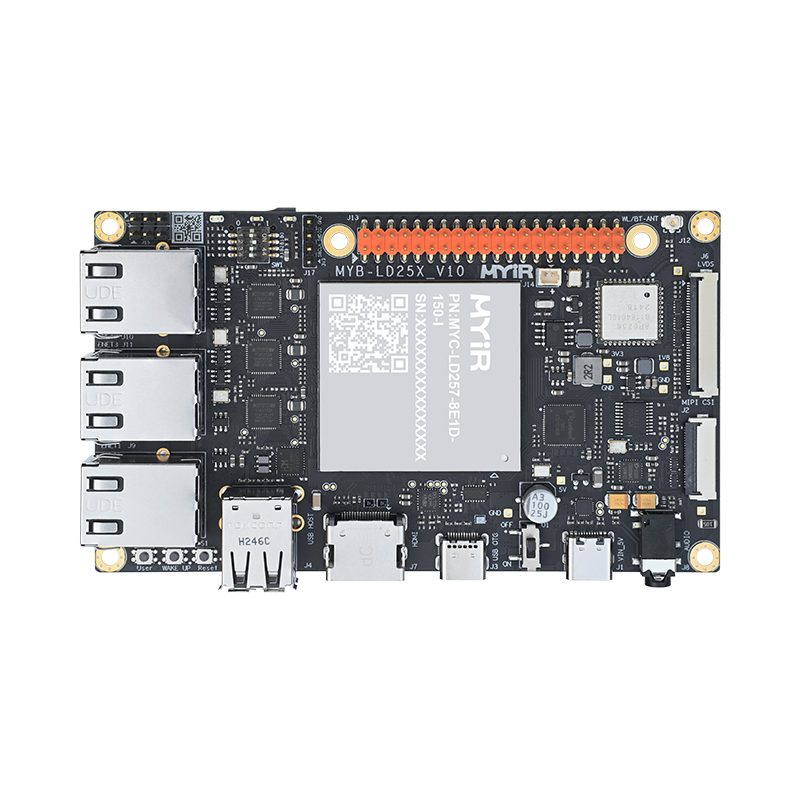

.. _board_myir_myd_ld25x:

米尔科技MYD-LD25X开发板                                                              
###########################
 

板卡介绍
====================

STM32MP257D是ST推出的搭载了双核 Cortex-A35 @1.5 GHz和Cortex-M33@400MHz的微处理器，它集成1.35 TOPS的NPU加速器和3D GPU, 支持H.264/VP8 1920*1080@60FPS视频编解码，
支持丰富的多媒体资源，例如24-bit RGB/MIPI-DSI/Dual-link LVDS/Lite-ISPMIPICSI/DCMI。处理器还支持3路千兆以太网/3路CAN FD/1路1lane PCIE2.0/1路USB3.0&2.0OTG/1路USB2.0 HOST
/3路SDIO3.0/9路UART接口/1路16bit FMC等；适用于高端工业HMI、边缘计算网关、新能源充电桩、储能EMS系统、工业自动化PLC、运动控制器等场景。

米尔电子基于STM32MP257D处理器推出了开发套件MYD-LD25X，套件由核心板MYC-LD25X和底板MYB-LD25X组成，核心板与底板采用LGA贴片焊接方式。更多信息请参考米尔科技官网：
`MYD-LD25X介绍 <https://www.myir.cn/shows/148/78.html>`_

    MYD-LD25X开发板

构建介绍
=======================

1. 构建机器和oebuild工具准备： 参照正常流程准备好构建环境

2. 构建镜像

（1）初始化myd-ld25x配置：

   .. code-block:: console

        cd <path-to-your-workspace>
        oebuild generate -p myd-ld25x-oee -d myd-ld25x-oee

    当前默认配置包含了嵌入式AI、TSN和嵌入式图形的基本配置，具体可以参考 :file: `.oebuild/myd-ld25x-oee.yaml`

（2）构建myd-ld25x镜像

    .. code-block:: console

        cd <path-to-your-workspace>/myd-ld25x-oee
        oebuild bitbake
        # oebuild bitbake执行后将进入构建交互环境
        bitbake openeuler-image

    .. note::
        1. myd-ld25x-oee所需要的软件包中有一部分暂时未在openEuler中托管，构建过程中需要访问github等外部源

3. 烧录镜像

    最终构建好的的相关产物位于构建目录中的 :file:`temp/deploy/images/myd-ld25x-oee/` 目录下，包含了myd-ld25x-oee诸多镜像文件，需要从中提取
    烧录相关的目录和镜像，可以参考如下结构，并通过STM32CubeProgrammer工具在Windows环境下通过USB直接烧录到开发板的emmc存储中。

    .. figure:: images/burn_folder.png
        :align: center
        :alt: MYD-LD25X烧录文件结构
        
        烧录相关文件结构
