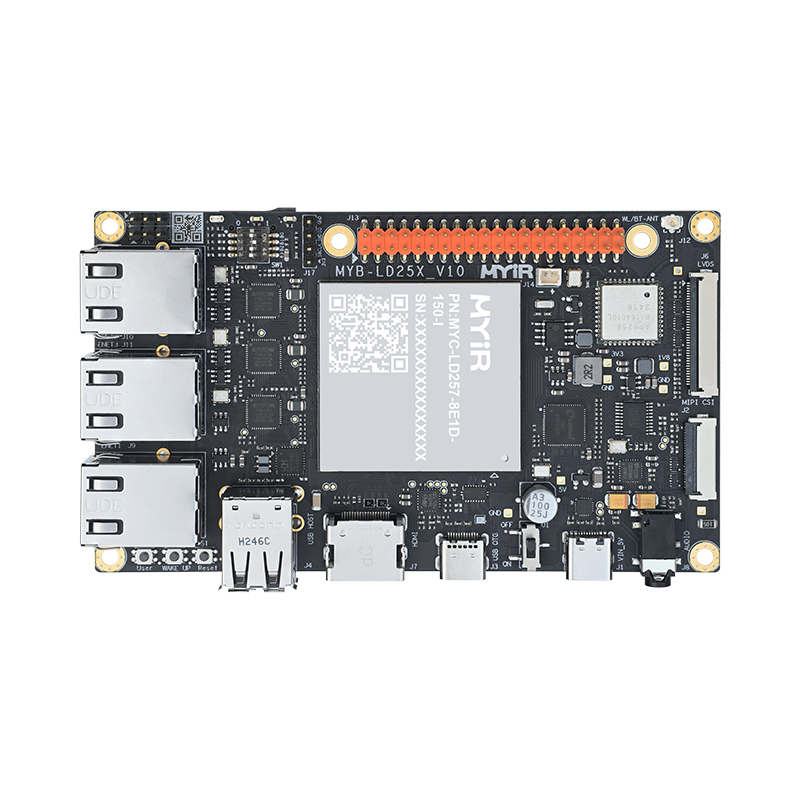

.. _board_myir_myd_ld25x:

米尔科技MYD-LD25X开发板                                                              
###########################
 

板卡介绍
====================

STM32MP257D是ST推出的搭载了双核 Cortex-A35 @1.5 GHz和Cortex-M33@400MHz的微处理器，它集成1.35 TOPS的NPU加速器和3D GPU, 支持H.264/VP8 1920*1080@60FPS视频编解码，
支持丰富的多媒体资源，例如24-bit RGB/MIPI-DSI/Dual-link LVDS/Lite-ISPMIPICSI/DCMI。处理器还支持3路千兆以太网/3路CAN FD/1路1lane PCIE2.0/1路USB3.0&2.0OTG/1路USB2.0 HOST
/3路SDIO3.0/9路UART接口/1路16bit FMC等；适用于高端工业HMI、边缘计算网关、新能源充电桩、储能EMS系统、工业自动化PLC、运动控制器等场景。

米尔电子基于STM32MP257D处理器推出了开发套件MYD-LD25X，套件由核心板MYC-LD25X和底板MYB-LD25X组成，核心板与底板采用LGA贴片焊接方式。更多信息请参考米尔科技官网：
`MYD-LD25X介绍 <https://www.myir.cn/shows/148/78.html>`_

    MYD-LD25X开发板

构建介绍
=======================

1. 构建机器和oebuild工具准备： 参照正常流程准备好构建环境

2. 构建镜像

（1）初始化myd-ld25x配置：

   .. code-block:: console

        cd <path-to-your-workspace>
        oebuild generate -p myd-ld25x-oee -d myd-ld25x-oee

    当前默认配置包含了嵌入式AI、TSN和嵌入式图形的基本配置，具体可以参考 :file: `.oebuild/myd-ld25x-oee.yaml`

（2）构建myd-ld25x镜像

    .. code-block:: console

        cd <path-to-your-workspace>/myd-ld25x-oee
        oebuild bitbake
        # oebuild bitbake执行后将进入构建交互环境
        bitbake openeuler-image

    .. note::
        1. myd-ld25x-oee所需要的软件包中有一部分暂时未在openEuler中托管，构建过程中需要访问github等外部源

3. 烧录镜像

    最终构建好的相关产物位于构建目录中的 :file:`temp/deploy/images/myd-ld25x-oee/` 目录下，包含了myd-ld25x-oee诸多镜像文件，需要从中提取
    烧录相关的目录和镜像，可以参考如下结构，并通过STM32CubeProgrammer工具在Windows环境下通过USB直接烧录到开发板的emmc存储中。

    .. figure:: images/burn_folder.png
        :align: center
        :alt: MYD-LD25X烧录文件结构
        
        烧录相关文件结构

网络配置
=======================

以太网硬件拓扑
------------------------

STM32MP257 内置两个 GMAC 控制器（ETH1、ETH2）和一个千兆以太网交换机
DEIP（TTTech 确定性以太网 IP，支持 802.1 TSN 与低延迟 ACM 直通转发）。
其中 ETH1 既可以作为独立网口，也可以切换为交换机模式；切换后交换机
通过两个外部端口分别接管底板上的 RJ45 网口，形成三网口拓扑：

.. code-block:: text

                        +--------------------------------------------+
                        |              STM32MP257 SoC                |
                        |                                            |
                        |  GMAC2 (eth2@482d0000) -- PHY@5 --> RJ45-2 |  <- 独立网口
                        |                                            |
                        |  GMAC1 (eth1@482c0000) === fixed-link ===+ |
                        |  【二选一：独立模式 或 交换机模式】        | |
                        |                                          v |
                        |  DEIP Switch (ttt-sw@4c000000)             |
                        |   sw0p1 -- 内部端口(GMAC 上行)             |
                        |   sw0p2 -- 外部端口 -- PHY@4 --> RJ45-1     |
                        |   sw0p3 -- 外部端口 -- PHY@6 --> RJ45-3     |
                        |   sw0ep -- 终端端口(配置IP的入口)           |
                        |   + ACM 模块(超低延迟 cut-through)          |
                        +--------------------------------------------+

两种工作模式由启动时加载的设备树决定，镜像同时提供两套 DTB：

==========================================  ================================================
设备树                                      行为
==========================================  ================================================
``myb-stm32mp257x-2GB.dtb`` (默认)          GMAC1、GMAC2 各接一个 RJ45 独立网口（eth0/eth1），
                                            DEIP 交换机关闭，第三个 RJ45 无接口
``myb-stm32mp257x-2GB-ethswitch.dtb``       GMAC1 降级为交换机内部上行口，RJ45-1 与 RJ45-3
                                            变为交换端口，RJ45-2 保持独立网口，三口可同时接入
==========================================  ================================================

默认网络配置（独立模式）
------------------------

镜像默认加载 ``myb-stm32mp257x-2GB.dtb``，提供开箱即用的以太网配置：

1. **接口命名**：机器配置中已固化 ``net.ifnames=0`` 内核启动参数
   （见 ``meta-st-stm32mp/conf/machine/myd-ld25x.conf`` 的
   ``UBOOT_EXTLINUX_KERNEL_ARGS``），以太网接口保持内核名 ``eth0``/``eth1``。
   若未设置该参数，systemd-udev 的 Devicetree-alias 命名策略会将接口
   重命名为 ``end1``/``end2``，导致下述静态网络配置无法匹配。

2. **静态地址**：由 openEuler 层 ``os-base`` 软件包安装的
   ``/etc/systemd/network/10-eth-static.network`` 提供默认配置：

   .. code-block:: ini

        [Match]
        Name=eth*

        [Network]
        Address=192.168.7.2/24
        Gateway=192.168.7.1
        DHCP=ipv4
        LinkLocalAddressing=ipv6

   即：优先 DHCP，DHCP 不可用时落到静态地址 192.168.7.2/24。
   与 PC 网口直连时，将 PC 配置为同网段地址（如 192.168.7.3/24）即可
   ``ssh root@192.168.7.2`` 登录（默认密码 ``openEuler@2021``）。

   .. note::
       openEuler Embedded 的 sshd 仅启用 publickey 与
       keyboard-interactive 认证，使用 sshpass 时需追加
       ``-o PubkeyAuthentication=no -o PreferredAuthentications=keyboard-interactive``。
       此外 Windows 防火墙（公用网络配置文件）默认拦截 ICMP，板卡 ping
       PC 不通但 SSH/ARP 正常属于预期行为，以 TCP 连通性为准。

3. **多网口行为**：``10-eth-static.network`` 按接口名匹配所有 ``eth*``，
   网线在 eth0/eth1 之间切换时配置自动跟随带链路的接口，即插即用。

TSN/交换机模式
------------------------

加载 ``myb-stm32mp257x-2GB-ethswitch.dtb`` 后进入交换机模式，
DEIP 交换机创建如下网络接口：

==============  ============================================  ===========================
接口            角色                                          IP 配置
==============  ============================================  ===========================
``sw0p1``       内部端口（GMAC1 上行，fixed-link）            无需配置
``sw0p2``       外部交换端口，对应 RJ45-1（丝印 ETH1）        无需配置（桥内 slave）
``sw0p3``       外部交换端口，对应 RJ45-3（丝印 ETH3）        无需配置（桥内 slave）
``sw0ep``       终端端口，MPU 与交换机的应用层出入口          配置 IP（默认 192.168.0.10）
``end1/eth1``   GMAC2 独立网口，对应 RJ45-2（丝印 ETH2）      独立配置，与交换机解耦
==============  ============================================  ===========================

- RJ45-1 与 RJ45-3 之间的报文由 DEIP 硬件 L2 转发，不经过 Linux 协议栈；
  MPU 自身收发通过 ``sw0ep`` 终端端口。
- TSN（802.1Q/Qbv/Qbu）调度发生在 DEIP 出方向，sw0p2 与 sw0p3 均可作为
  TSN 流端口；ACM 模块提供超低延迟直通转发。
- 交换机模式需要 DEIP 内核模块栈（``stm32_deip``、edge-lkm、ACM，
  由 meta-st-stm32mp-tsn-swch 层提供）及初始化脚本
  （``switch_init.sh``/``ttt-ip-init.sh``）配合，并需要 OP-TEE 侧
  提供 125 MHz 以太网交换机时钟。

.. note::
    交换机模式下接口名不再匹配 ``10-eth-static.network``（``Name=eth*``），
    需要为 ``sw0ep``（或桥接后的 ``br0``）单独规划 networkd 配置。

.. hint::
    U-Boot 实际加载的设备树以串口启动日志中 ``Loading Device Tree``
    行为准。bootfs 中存在多份 per-DTB 命名的 extlinux 配置，
    修改启动参数时务必确认 U-Boot 实际加载的文件，避免改错文件。
