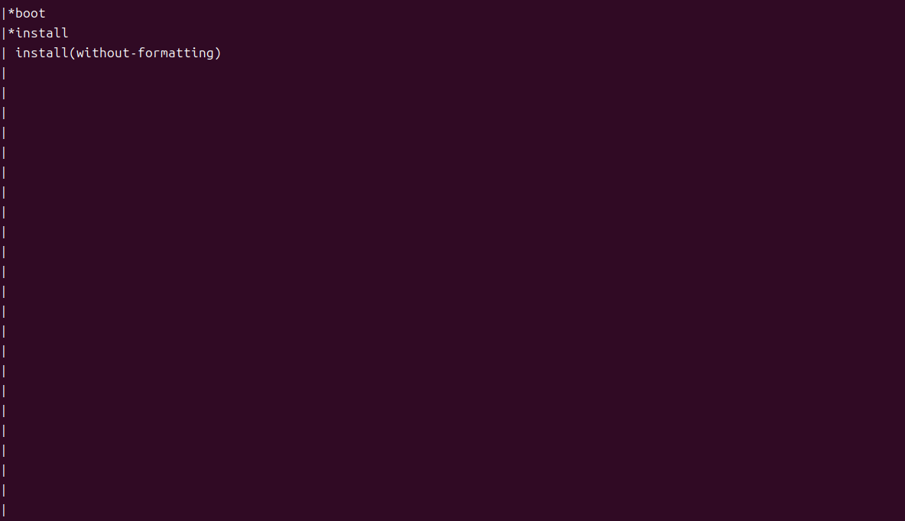
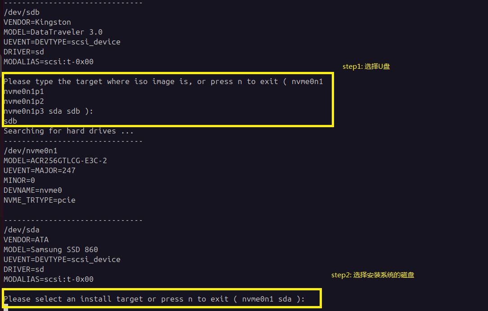
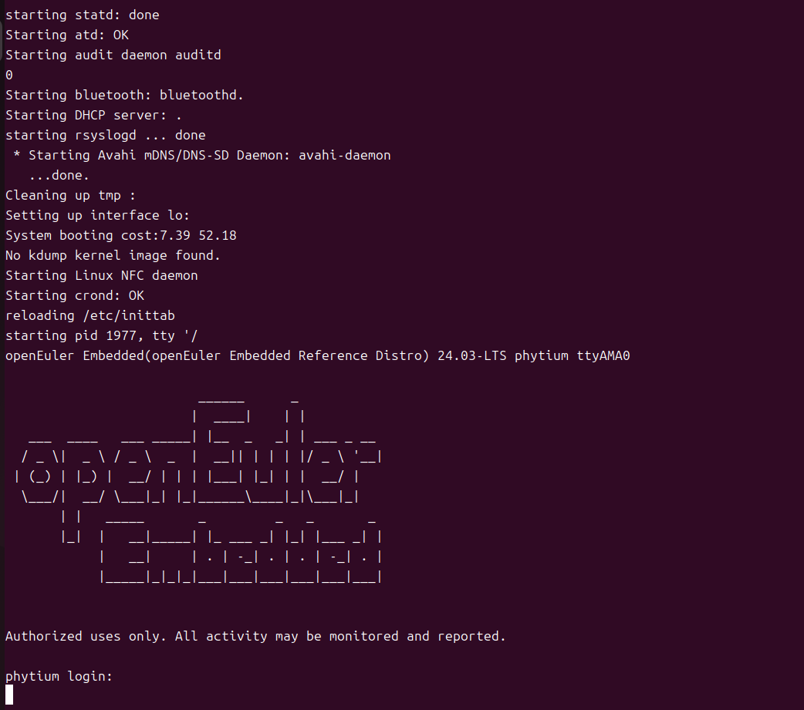

飞腾镜像构建与说明
#######################################

本章主要介绍openEuler Embedded中飞腾系列板卡的镜像构建，使用和特性介绍。

飞腾系列开发板卡支持SATA硬盘/U盘启动(具体根据UEFI提供的设备支持)，构建工程可生成预分区的wic或genimage镜像，对存储介质直接进行烧录即可

镜像构建与使用
=================

1. 构建机器和oebuild工具准备：

（1）准备一个 ubuntu x86 构建主机环境（建议22.04，依赖Python>=3.10，配置建议预留200G存储）

（2）安装oebuild（具体 oebuild 用法可参见 :ref:`oebuild_install`），注意以普通用户安装oebuild，例：

    .. code-block:: console

        sudo apt install python3 python3-pip
        # 如果python3和pip模块已安装，请忽略此python3的安装命令
        pip install oebuild

（3）准备 oebuild 的工具依赖（docker）：

    .. code-block:: console

        sudo apt install docker docker.io -y
        sudo groupadd docker
        sudo usermod -a -G docker $(whoami)
        sudo systemctl-reload && systemctl restart docker
        sudo chmod o+rw /var/run/docker.sock

2. oebuild 构建代码准备：

（1）初始化构建分支代码（请不要以root及sudo权限执行）：

   .. code-block:: console

      oebuild init buildwork 
      # 说明：
      #   * buildwork为存放目录，
      # 假设执行路径位于 /home/user/ ，执行后根据提示进入对应目录

      cd /home/user/buildwork
      oebuild update
      #执行完成后，将在 /home/user/buildwork/src/ 目录下载好主构建源码，并初始化构建虚拟环境。

（2）初始化构建源码及配置：

   .. code-block:: console

        cd /home/user/buildwork
        oebuild generate -p phytium 
        # 以上命令可追加-f参数，通过 oebuild generate -l 查看支持的配置，比如-f rt开启软实时

3. 镜像构建和部署：

（1）构建飞腾镜像：

    .. code-block:: console

        cd /home/user/buildwork/phytium
        oebuild bitbake
        # oebuild bitbake 执行后将进入构建交互环境
        # 注意您此时应该处于进入 oebuild bitbake 环境的工作根目录(如/home/openeuler/phytium)
        bitbake openeuler-image

构建完成后，输出件见 /home/user/buildwork/phytium/output/[时间戳]，备用组件内容如下

    .. code-block:: console

        ├── Image
        ├── openeuler-image-phytium-[时间戳].rootfs.wic
        ├── openeuler-image-phytium-[时间戳].iso
        ├── openeuler-image-phytium-[时间戳].genimage
        └── vmlinux

   .. note::

        openeuler-image-phytium-[时间戳].rootfs.wic 包含BootLoader，kernel以及文件系统（飞腾派不支持）

        openeuler-image-phytium-[时间戳].genimage   包含BootLoader，kernel以及文件系统,精细控制分区偏移,对齐,多镜像拼接 

        openeuler-image-phytium-[时间戳].iso        安装盘（飞腾派不支持）

        vmlinux为未加工的原始内核基础格式文件

若需要交叉编译工具链，可通过如下命令生成，将在output目录下有新时间戳子目录得到输出文件。

    .. code-block:: console

        # 注意您此时应该处于进入 oebuild bitbake 环境的工作根目录（如/home/openeuler/phytium）
        bitbake openeuler-image -c populate_sdk

（2）烧录飞腾镜像到SATA硬盘或U盘：

烧录镜像仅需要将.genimage或rootfs.wic文件烧录到SATA硬盘或U盘中即可，我们将介绍在linux平台下使用dd命令制作镜像方式。

    .. code-block:: console

        # 使用 df -h 查看挂载点

        # u盘去掉挂载。然后可以查看，已经无u盘的挂载:
          umount /dev/sdb1

        # 写入u盘，注意：sdb，没有标号。
          sudo dd if=openeuler-image-phytium-[时间戳].rootfs.wic of=/dev/sdb status=progress 
          或
          sudo dd if=openeuler-image-phytium-[时间戳].genimage of=/dev/sdb status=progress

（3）烧录飞腾派镜像到SD卡：

烧录镜像仅需要将.genimage文件烧录到SD卡中即可，我们将介绍在linux平台下使用dd命令制作镜像方式。

    .. code-block:: console

        # 使用 df -h 查看挂载点

        # u盘去掉挂载。然后可以查看，已经无u盘的挂载:
          umount /dev/sdb1

        # 写入SD卡，注意：sdb，没有标号。
          sudo dd if=openeuler-image-phytium-[时间戳].genimage of=/dev/sdb status=progress

（4）ISO 镜像安装说明:

    使用构建出来的iso镜像制作U盘启动盘

    .. code-block:: console

        # 使用 df -h 查看挂载点

        # u盘去掉挂载。然后可以查看，已经无u盘的挂载:
        umount /dev/sdb1

        # 写入usb，注意：sdb，没有标号。
          sudo dd if=openeuler-image-phytium-[时间戳].iso of=/dev/sdb status=progress
   
    在开发板子上插入U盘，启动后按 F2 进入UEFI，并在 BOOT 选项卡选择为U盘启动。进入grub界面
   

    
选择 install 后，进行系统安装，依次输入U盘和安装盘
   

之后稍作等待，完成系统安装后，会提示： Installation successful. Remove your installation media and press ENTER to reboot. 此时可以拔出U盘，按enter重启。

启动后按 F2 进入UEFI，选择安装系统的磁盘

（5）启动开发板子并连接调试：

**启用飞腾开发板**

默认用户名：root，密码：第一次启动没有默认密码，需重新配置，且密码强度有相应要求，需要数字、字母、特殊字符组合最少8位，例如abcd@2024。

将刷写镜像后的SATA硬盘插入主机，通电启用。

**登录方式**

+ 串口登录：

镜像使能了串口登录功能，通过ttyusb转接器连接板卡对应CPU调试串口，使用串口终端工具连接串口，波特率115200，登录即可。

+ 显示器登录：

部分板卡没有引出CPU调试串口，但往往有附带PCIE显卡并配合efifb提供基本的显示，建议使用显示器登录。

将刷写镜像后的SATA硬盘插入主机，显示器通过VGA/HDMI连接板卡，等待系统启动后即可登录。

