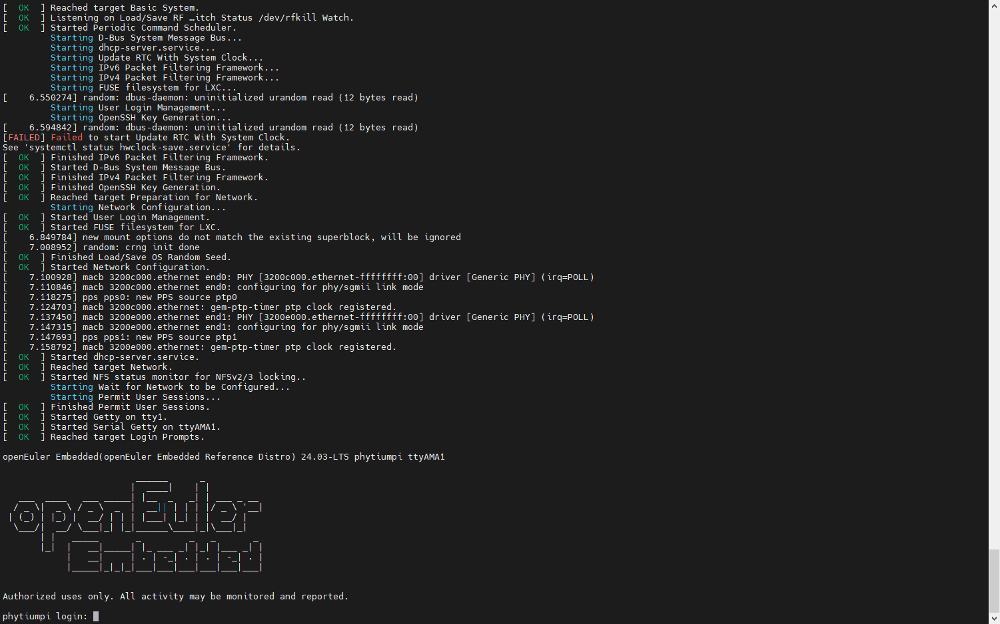
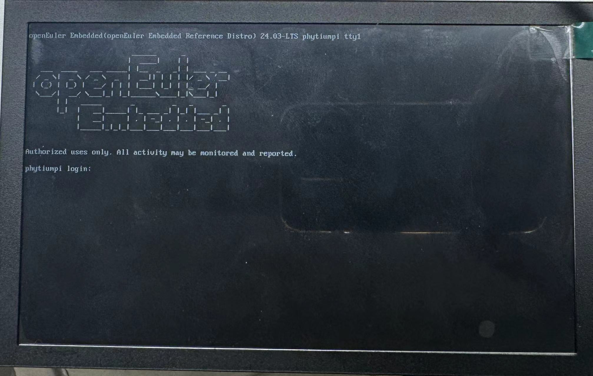

phytiumpi 镜像构建与说明
#######################################

本章主要介绍 openEuler Embedded 中 phytiumpi 系列板卡的镜像构建，使用和特性介绍。

phytiumpi 板卡搭载的 soc 型号为 phytium e2000q，支持SD卡启动，因此我们构建出的镜像烧录到SD卡后即可在飞腾开发板中启动，建议准备一个8G以上的SD卡，并准备一个USBtty串口设备。

镜像构建与使用
=================

1. 构建机器和oebuild工具准备：

（1）准备一个 ubuntu x86 构建主机环境（建议22.04，依赖Python>=3.10，配置建议预留200G存储）

（2）安装 oebuild（具体 oebuild 用法可参见 :ref:`oebuild_install` ），注意以普通用户安装 oebuild ，例：

    .. code-block:: console

        sudo apt install python3 python3-pip
        # 如果python3和pip模块已安装，请忽略此python3的安装命令
        pip install oebuild

（3）准备 oebuild 的工具依赖(docker)：

    .. code-block:: console

        sudo apt install docker docker.io -y
        sudo groupadd docker
        sudo usermod -a -G docker $(whoami)
        sudo systemctl-reload && systemctl restart docker
        sudo chmod o+rw /var/run/docker.sock

2. oebuild 构建代码准备：

（1）初始化构建分支代码(请不要以root及sudo权限执行)：

   .. code-block:: console

      oebuild init buildwork
      # 说明：
      #   * buildwork为存放目录，
      #   * 未使用-b指定分支，默认使用master分支，等同于 oebuild init buildwork -b master
      # 假设执行路径位于 /home/user/ ，执行后根据提示进入对应目录

      cd /home/user/buildwork
      oebuild update
      #执行完成后，将在 /home/user/buildwork/src/ 目录下载好主构建源码，并初始化构建虚拟环境。

（2）初始化 phytiumpi 构建源码及配置：

   .. code-block:: console

        cd /home/user/buildwork
        oebuild generate -p phytiumpi -f systemd
        # 以上命令可追加-f参数，通过 oebuild generate -l 查看支持的配置，比如-f openeuler-rt开启软实时

3. 镜像构建和部署：

（1）构建 phytiumpi 镜像：

    .. code-block:: console

        cd /home/user/buildwork/phytiumpi
        oebuild bitbake
        # oebuild bitbake 执行后将进入构建交互环境
        # 注意您此时应该处于进入 oebuild bitbkae 环境的工作根目录(如/home/openeuler/phytiumpi)
        bitbake openeuler-image

构建完成后，输出件见 /home/user/buildwork/phytiumpi/output/[时间戳]，备用组件内容如下

    .. code-block:: console

        ├── Image
        ├── openeuler-image-phytiumpi-[时间戳].rootfs.ext4
        ├── openeuler-image-phytiumpi-[时间戳].rootfs.genimage
        ├── openeuler-image-phytiumpi-[时间戳].rootfs.tar.gz
        └── vmlinux

   .. note::

        openeuler-image-phytiumpi-[时间戳].rootfs.genimage 已经包含了BootLoader，kernel以及文件系统。

        vmlinux为未加工的原始内核基础格式文件。

若需要交叉编译工具链，可通过如下命令生成，将在output目录下有新时间戳子目录得到输出件。

    .. code-block:: console

        # 注意您此时应该处于进入 oebuild bitbake 环境的工作根目录（如/home/openeuler/phytiumpi）
        bitbake openeuler-image -c populate_sdk

（2）烧录phytiumpi镜像到SD卡：

烧录phytiumpi 镜像仅仅需要将genimage 文件烧录到SD卡中即可，我们将介绍在windows平台下使用Rufus工具烧录方式。

    .. code-block:: console

        # 插入你的USB闪存驱动器到电脑的USB接口。
        # 以管理员身份运行rufus.exe。

        # 在打开的 Rufus 界面中，进行一下配置：
            # 设备：Rufus应该自动识别并选择了你的USB驱动器。如果没有，或者选错了，你可以在这个下拉菜单中手动选择。
            # 引导类型选择：选择"磁盘或镜像文件"。
            # 点击右侧的"选择"按钮（通常显示为一个光盘图标），然后导航到你之前下载的Linux ISO镜像文件的位置，并选择它。

        # 确认所有设置无误后，点击下方的"开始"按钮。
        # 当进度条达到100%并显示"READY"时，表示Linux系统盘已经制作完成。现在，你可以安全地拔出U盘，并在需要安装Linux系统的电脑上使用这个U盘进行启动和安装。

Rufus工具的配置如下图：

    .. image:: phytiumpi-image/phytiumpi_rufus.png

（3）启动 phytiumpi 并连接调试：

**启用 phytiumpi**

默认用户名：root，密码：第一次启动没有默认密码，需重新配置，且密码强度有相应要求，需要数字、字母、特殊字符组合最少8位，例如abcd@2024。

将刷写镜像后的SD卡插入 phytiumpi，通电启用。

**phytiumpi 登录方式**

    + 使用串口登录：

        镜像使能了串口登录功能，按照 phytiumpi 的串口连接方式，如下图，可以启用串口操作。

        示例：使用ttyusb转接器，将 phytiumpi 串口通过USB连接到 Mobaxterm ：

        Mobaxterm 的启动打印如下图：

    + 使用HDMI登录：

        phytiumpi 连接显示器(phytiumpi 视频输出接口为标准 HDMI)、键盘、鼠标后，启动 phytiumpi，可以看到 phytiumpi 启动日志输出到显示器上。待 phytiumpi 启动成功，输入用户名（root）和密码登录。

        HDMI 的启动打印如下图：

