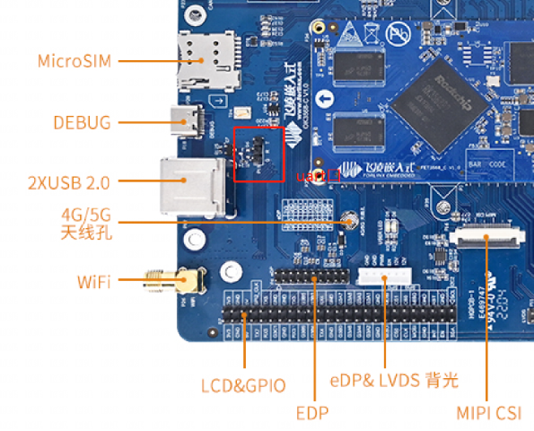
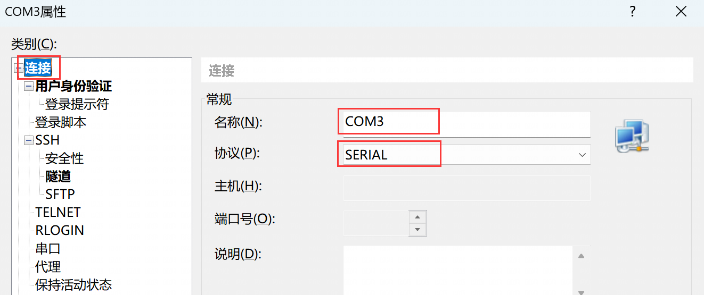

.. _board_rockchip_build:

========================================
Rockchip板卡镜像构建与使用
========================================

本章主要介绍openEuler Embedded中Rockchip系列板卡的构建，使用和特性介绍。

Rockchip镜像构建指导
=====================

- 参照 :ref: `oebuild_install` 完成oebuild安装，并详细了解构建过程

- 定制化设备：

  1. 在使用oebuild 初始化后，复制yocto-meta-openeuler/bsp/meta-openeuler-bsp/conf/ok3568.conf改成自己的设备命名，如ok3568.conf，需要改动的其他参数请参考yocto文档；
  
  2. 把设备树文件添加到yocto-meta-openeuler/bsp/meta-openeuler-bsp/rockchip/recipes-kernel/linux/files/内；

  3. 修改yocto-meta-openeuler/bsp/meta-openeuler-bsp/conf/ok3568.conf中的ROCKCHIP_KERNEL_DTB_NAME，改成自己的设备名；

  4. 如果增加了自己的设备，请复制yocto-meta-openeuler/.oebuild/platform/ok3568.yaml并命名为自己的设备名，如果不能附加功能请关注yocto-meta-openeuler/.oebuild/features/下面的对应功能support:中添加自己的机器。 

- 依次执行以下例子命令完成构建

  .. code-block:: console

    # 生成ok3568配置文件，目前支持的设备有ryd-3568,ok3568,ok3588.ok3399。如果添加了自己的设备请改对应的名字
    oebuild generate -p ok3568 -d ok3568

    # 进入构建交互终端
    oebuild bitbake

    # 构建镜像
    bitbake openeuler-image

    # 构建sdk
    bitbake openeuler-image -c populate_sdk

- 二进制介绍：

  1. boot.img: openEuler Embedded 适用rk3568内核镜像。

  2. rootfs.img: 适用rk3568根文件系统，由xxx.ext4改名生成。

  3. boot.img: openEuler Embedded 适用rk3568内核镜像。

  4. update.img: 整体的烧录镜像，可自行定制，请参考yocto-meta-rockchip/wic/generic-gptdisk.wks.in与yocto-meta-rockchip/conf/machine/include/rockchip-common.inc中的方法。

  5. openeuler-glibc-x86_64-openeuler-image-aarch64-ok3568-toolchain-\*.sh: SDK工具链。

镜像使用方法，以飞凌ok3568为例
================================

1. 烧写前镜像使用

   创建挂载目录

   .. code-block:: console

     mkdir ${WORKDIR}/rootfs

   挂载rootfs

   .. code-block:: console

     mount -t ext4 openeuler-image-ok3568-\*.rootfs.ext4 ${WORKDIR}/rootfs

   挂载完成后，可以查看ok3568根文件系统的文件或者自行添加内容。

2. 镜像烧录仅支持windows:

   将文件DriverAssitant_v5.11.zip解压到任意目录，以管理员权限运行打开DriverInstall.exe 程序，然后点击“驱动安装”进行安装。

   .. figure:: install_driver1.png
     :align: center

   .. figure:: install_driver2.png
     :align: center

   .. figure:: install_driver3.png
     :align: center

内核镜像和文件系统烧写方法
===========================

准备工作：将瑞芯微开发工具RKDevTool_Release.zip解压到全英文路径下，打开瑞芯微开发工具RKDevTool。

增量烧写（调试推介使用）
-------------------------

1. 使用Type-C线连接开发板和主机，按住开发板的Recovery键不要松开，然后按下RESET键系统复位，大约两秒后松开Recovery键，瑞芯微开发工具RKDevTool将提示发现LOADER设备。

   .. figure:: switch_turn_to_off.png
     :align: center

   .. figure:: RKDevTool1.png
     :align: center

2. 点击“设备分区表”按钮，将自动读取分区地址。会有某些分区读不到的提示，点击确定即可。

   .. figure:: device_parted_scan.png
     :align: center

3. 在地址栏右键选择添加项，添加文件系统的地址。

   .. figure:: add_partition.png
     :align: center

   .. figure:: compare_rootfs_address.png
     :align: center

4. 勾选Boot和rootfs，并选择Boot和rootfs的路径。

   .. figure:: choose_partition.png
     :align: center

5. 点击“执行”按钮将自动烧写内核和文件系统，并重新启动。

   .. figure:: start_burning.png
     :align: center

全量烧写
--------------------

1. 如果loader正常，使用Type-C线连接开发板和主机，按住开发板的Recovery键不要松开，然后按下RESET键系统复位，大约两秒后松开Recovery键，瑞芯微开发工具RKDevTool将提示发现LOADER设备。

   .. figure:: switch_turn_to_off.png
     :align: center

   .. figure:: RKDevTool1.png
     :align: center

2. 如果loader损坏，可以按住 BOOT 键然后按复位键进入 maskrom 模式进行烧写，此时系统将提示发现一个 maskrom 设备。

   .. figure:: maskrom.png
     :align: center

.. note::

  - | maskrom模式与loader模式烧录方法一致。

  - maskrom 模式下不要点击“设备分区表”，为无效操作。

3. 点击“升级固件”选项卡，点击“固件”按钮选择完整的升级镜像 update.img。程序将对固件进行解析，因此需要等待一会。

   .. figure:: update_img.png
     :align: center

4. 依次点击擦除Flash，升级按钮即可完成升级。

   .. figure:: update_img_success.png
     :align: center

基于openEuler Embedded 瑞芯微系列开发板使用
==============================================

启用瑞芯微系列开发板
------------------------------

硬件版本要求：飞凌ok3568、ok3399、ok3588,ryd-3568或者经上述方法自己添加后的开发板。

默认用户名：root，密码：第一次启动没有默认密码，需重新配置，且密码强度有相应要求， 需要数字、字母、特殊字符组合最少8位，例如openEuler@2021。

将刷写镜像后的核心板通电启用。

开发板登录方式
--------------------

本地登录
^^^^^^^^^^^

- 使用串口登录：

  镜像使能了串口登录功能，按照开发板的串口连接方式，如下图，可以启用串口操作。

  示例：使用ttyusb转接器，将开发板的串口通过USB连接到putty：

- 使用HDMI登录：

  开发板连接显示器（开发板视频输出接口为HDMI）、键盘、鼠标后，启动开发板，可以看到ok3568启动日志输出到显示器上。待ok3568启动成功，输入用户名（root）和密码登录。

ssh 远程登录
^^^^^^^^^^^^^^^^^

网络配置
""""""""""""""""""""

启动后无线网卡配置
*****************************

1. 使用终端连接工具通过串口连接开发板

.. figure:: console2.png
  :align: center

2. 使用wpa_passphrase工具将wifi密码加密，生成配置

执行命令：

.. code-block:: console

  wpa_passphrase wifi_name password

.. figure:: wpa_passphrase.png
  :align: center

3. 将生成的配置写入配置文件/etc/wpa_supplicant.conf：

执行命令：

.. code-block:: console

  vi /etc/wpa_supplicant.conf

.. figure:: wpa_supplicant.png
  :align: center

启用无线网卡
********************

1. 执行命令：

.. code-block:: console

  ifup mlan0

2. 启用wifi网卡后，会自动生成IP，可直接查看网卡信息。

  执行命令：ifconfig

  .. figure:: ifconfig.png
    :align: center

  使用ssh命令登录:

  .. code-block:: console

    ssh root@x.x.x.x

分区扩容
""""""""""""""""""""

  默认根目录分区空间比较小，在使用之前，需要对分区进行扩容或挂载（在23.03及其之后的版本中，已实现自动扩容，首次烧录镜像启动会自动执行扩容并提示重启）

  执行 fdisk -l 命令查看磁盘分区信息。例子中的ok3568设备回显如下：

.. code-block:: console

  Number  Start (sector)    End (sector)  Size Name
  1           16384           24575 4096K uboot
  2           24576           32767 4096K misc
  3           32768           98303 32.0M boot
  4           98304          163839 32.0M recovery
  5          163840          229375 32.0M backup
  6          229376        12812287 6144M rootfs
  7        12812288        13074431  128M oem
  8        13074432        30777279 8643M userdata

  对应数据分区为 rootfs，与userdata

rockchip系列镜像特性介绍
===================================================

   1. rk3568硬件特性，参考: `Rockchip TRM手册 <https://dl.radxa.com/rock3/docs/hw/datasheet/Rockchip%20Rockchip%20TRM%20Part1%20V1.1-20210301.pdf>`_

   其他硬件请参考瑞芯微官方释放的文档。

   目前已使能串口设备，可以访问uart，其他硬件特性目前支持:无线网卡、GPU、TF卡、以太网卡、USB Host、SPI、HDMI。

   2. 支持百级嵌入式软件包，见软件包功能列表。

   3. 支持部署rt实时内核。
