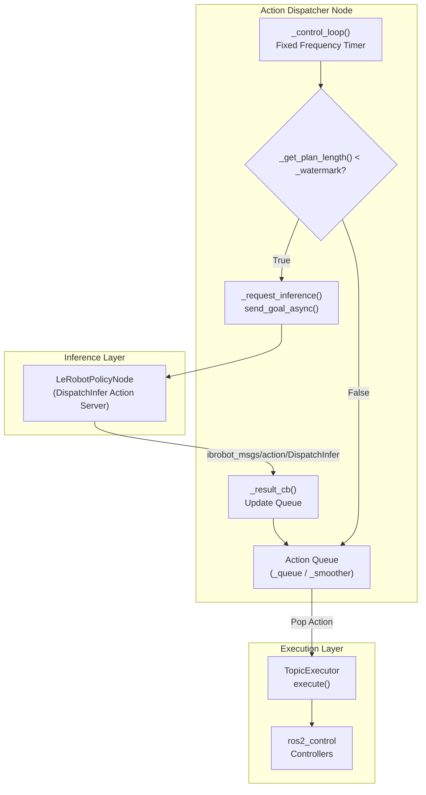
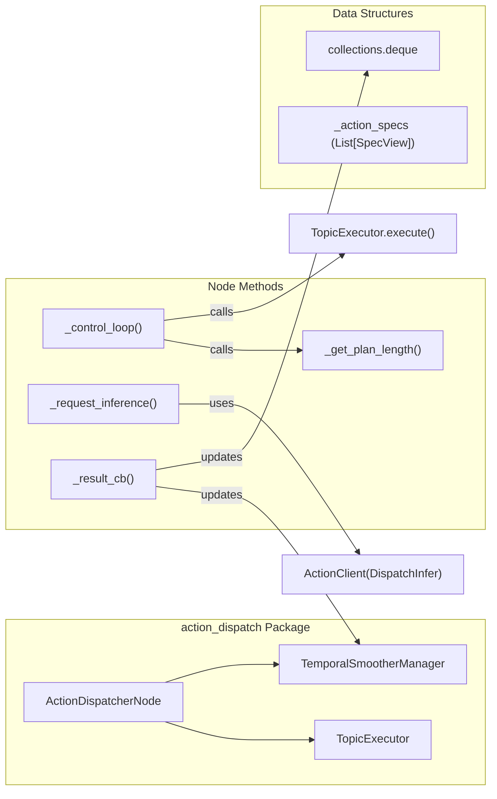

# 动作分发器节点

<details>
<summary>相关源文件</summary>

生成此 wiki 页面时使用了以下文件作为上下文：

- [src/action_dispatch/action_dispatch/__init__.py](https://atomgit.com/openeuler/IB_Robot/blob/master/src/action_dispatch/action_dispatch/__init__.py)
- [src/action_dispatch/action_dispatch/action_dispatcher_node.py](https://atomgit.com/openeuler/IB_Robot/blob/master/src/action_dispatch/action_dispatch/action_dispatcher_node.py)
- [src/action_dispatch/action_dispatch/temporal_smoother.py](https://atomgit.com/openeuler/IB_Robot/blob/master/src/action_dispatch/action_dispatch/temporal_smoother.py)
- [src/action_dispatch/test/test_temporal_smoother.py](https://atomgit.com/openeuler/IB_Robot/blob/master/src/action_dispatch/test/test_temporal_smoother.py)
- [src/inference_service/inference_service/lerobot_policy_node.py](https://atomgit.com/openeuler/IB_Robot/blob/master/src/inference_service/inference_service/lerobot_policy_node.py)
- [src/robot_config/config/robots/so101_single_arm.yaml](https://atomgit.com/openeuler/IB_Robot/blob/master/src/robot_config/config/robots/so101_single_arm.yaml)
- [src/robot_config/robot_config/launch_builders/execution.py](https://atomgit.com/openeuler/IB_Robot/blob/master/src/robot_config/robot_config/launch_builders/execution.py)

</details>


## 目的与范围

`ActionDispatcherNode` 是 IB-Robot 动作分发流水线中的核心执行协调器。它实现基于拉取的架构，维护动作队列，在队列水位过低时触发推理请求，并按固定频率（通常为 20Hz 到 100Hz）通过 `TopicExecutor` 将动作发布到 `ros2_control` [src/action_dispatch/action_dispatch/action_dispatcher_node.py:3-9](https://atomgit.com/openeuler/IB_Robot/blob/master/src/action_dispatch/action_dispatch/action_dispatcher_node.py#L3-L9)。该节点充当机器人的“小脑”，将推理延迟（通常 50 到 200ms）与高频控制需求解耦。

**核心职责：**
- **队列管理**：使用 `collections.deque`（简单模式）或 `TemporalSmootherManager`（平滑模式）缓存动作 chunk [src/action_dispatch/action_dispatch/action_dispatcher_node.py:94-118](https://atomgit.com/openeuler/IB_Robot/blob/master/src/action_dispatch/action_dispatch/action_dispatcher_node.py#L94-L118)。
- **异步推理**：监控队列深度，当队列低于水位线时，通过 `ActionClient` 触发 `DispatchInfer` action [src/action_dispatch/action_dispatch/action_dispatcher_node.py:173-174](https://atomgit.com/openeuler/IB_Robot/blob/master/src/action_dispatch/action_dispatch/action_dispatcher_node.py#L173-L174), [src/action_dispatch/action_dispatch/action_dispatcher_node.py:203-216](https://atomgit.com/openeuler/IB_Robot/blob/master/src/action_dispatch/action_dispatch/action_dispatcher_node.py#L203-L216)。
- **高频控制**：通过 `TopicExecutor` 执行动作，确保向硬件控制器稳定流式发送命令 [src/action_dispatch/action_dispatch/action_dispatcher_node.py:154-156](https://atomgit.com/openeuler/IB_Robot/blob/master/src/action_dispatch/action_dispatch/action_dispatcher_node.py#L154-L156)。
- **时序对齐**：跟踪推理期间已经执行的动作，保证 chunk 拼接无缝 [src/action_dispatch/action_dispatch/action_dispatcher_node.py:108-108](https://atomgit.com/openeuler/IB_Robot/blob/master/src/action_dispatch/action_dispatch/action_dispatcher_node.py#L108-L108), [src/action_dispatch/action_dispatch/action_dispatcher_node.py:259-261](https://atomgit.com/openeuler/IB_Robot/blob/master/src/action_dispatch/action_dispatch/action_dispatcher_node.py#L259-L261)。

**来源：** [src/action_dispatch/action_dispatch/action_dispatcher_node.py:1-52](https://atomgit.com/openeuler/IB_Robot/blob/master/src/action_dispatch/action_dispatch/action_dispatcher_node.py#L1-L52), [src/action_dispatch/action_dispatch/action_dispatcher_node.py:54-159](https://atomgit.com/openeuler/IB_Robot/blob/master/src/action_dispatch/action_dispatch/action_dispatcher_node.py#L54-L159)

---

## 系统架构

### 执行流水线中的位置

下图展示 `ActionDispatcherNode` 如何连接异步推理层和同步执行层。



**来源：** [src/action_dispatch/action_dispatch/action_dispatcher_node.py:146-152](https://atomgit.com/openeuler/IB_Robot/blob/master/src/action_dispatch/action_dispatch/action_dispatcher_node.py#L146-L152), [src/action_dispatch/action_dispatch/action_dispatcher_node.py:165-201](https://atomgit.com/openeuler/IB_Robot/blob/master/src/action_dispatch/action_dispatch/action_dispatcher_node.py#L165-L201), [src/action_dispatch/action_dispatch/action_dispatcher_node.py:203-230](https://atomgit.com/openeuler/IB_Robot/blob/master/src/action_dispatch/action_dispatch/action_dispatcher_node.py#L203-L230)

### 代码实体关联

此图将高层概念映射到代码库中的具体 Python 类和方法。



**来源：** [src/action_dispatch/action_dispatch/action_dispatcher_node.py:43-159](https://atomgit.com/openeuler/IB_Robot/blob/master/src/action_dispatch/action_dispatch/action_dispatcher_node.py#L43-L159), [src/action_dispatch/action_dispatch/topic_executor.py:1-50](https://atomgit.com/openeuler/IB_Robot/blob/master/src/action_dispatch/action_dispatch/topic_executor.py#L1-L50), [src/action_dispatch/action_dispatch/temporal_smoother.py:1-40](https://atomgit.com/openeuler/IB_Robot/blob/master/src/action_dispatch/action_dispatch/temporal_smoother.py#L1-L40)

---

## 控制循环实现

核心逻辑位于 `_control_loop()`，由 ROS 2 timer 按 `control_frequency` 参数定义的频率触发 [src/action_dispatch/action_dispatch/action_dispatcher_node.py:162-163](https://atomgit.com/openeuler/IB_Robot/blob/master/src/action_dispatch/action_dispatch/action_dispatcher_node.py#L162-L163)。

### 控制循环逻辑流程
1. **状态上报**：向 `~/queue_size` 发布当前队列大小，便于监控 [src/action_dispatch/action_dispatch/action_dispatcher_node.py:168-169](https://atomgit.com/openeuler/IB_Robot/blob/master/src/action_dispatch/action_dispatch/action_dispatcher_node.py#L168-L169)。
2. **水位线检查**：如果 `_get_plan_length() < _watermark` 且当前没有推理进行中，则调用 `_request_inference()` [src/action_dispatch/action_dispatch/action_dispatcher_node.py:173-174](https://atomgit.com/openeuler/IB_Robot/blob/master/src/action_dispatch/action_dispatch/action_dispatcher_node.py#L173-L174)。
3. **动作获取**：
   - 如果 `temporal_smoothing_enabled` 为 true，则调用 `_smoother.get_next_action()` [src/action_dispatch/action_dispatch/action_dispatcher_node.py:186-187](https://atomgit.com/openeuler/IB_Robot/blob/master/src/action_dispatch/action_dispatch/action_dispatcher_node.py#L186-L187)。
   - 否则，从 `_queue.popleft()` 弹出 [src/action_dispatch/action_dispatch/action_dispatcher_node.py:192-193](https://atomgit.com/openeuler/IB_Robot/blob/master/src/action_dispatch/action_dispatch/action_dispatcher_node.py#L192-L193)。
4. **执行**：将获取的动作传给 `_executor.execute()`。如果队列为空，则重新执行 `_last_action` 以保持机器人位置 [src/action_dispatch/action_dispatch/action_dispatcher_node.py:197-201](https://atomgit.com/openeuler/IB_Robot/blob/master/src/action_dispatch/action_dispatch/action_dispatcher_node.py#L197-L201)。

**来源：** [src/action_dispatch/action_dispatch/action_dispatcher_node.py:165-201](https://atomgit.com/openeuler/IB_Robot/blob/master/src/action_dispatch/action_dispatch/action_dispatcher_node.py#L165-L201), [src/action_dispatch/action_dispatch/action_dispatcher_node.py:73-75](https://atomgit.com/openeuler/IB_Robot/blob/master/src/action_dispatch/action_dispatch/action_dispatcher_node.py#L73-L75)

---

## 基于水位线的推理触发

该节点使用异步 Action Client 从策略节点（例如 `LeRobotPolicyNode`）请求新的动作 chunk [src/action_dispatch/action_dispatch/action_dispatcher_node.py:159-161](https://atomgit.com/openeuler/IB_Robot/blob/master/src/action_dispatch/action_dispatch/action_dispatcher_node.py#L159-L161), [src/inference_service/inference_service/lerobot_policy_node.py:148-169](https://atomgit.com/openeuler/IB_Robot/blob/master/src/inference_service/inference_service/lerobot_policy_node.py#L148-L169)。

### 触发策略
为避免机器人在等待推理时停止，节点会在队列耗尽前发送请求。
- **Watermark Threshold**：由 `watermark_threshold` 定义 [src/action_dispatch/action_dispatch/action_dispatcher_node.py:80-80](https://atomgit.com/openeuler/IB_Robot/blob/master/src/action_dispatch/action_dispatch/action_dispatcher_node.py#L80-L80)。如果队列长度低于该值，就发送新请求。
- **Temporal Tracking**：发送请求时，节点记录 `_plan_length_at_inference_start`。结果返回后，节点据此计算推理期间已经执行了多少动作 [src/action_dispatch/action_dispatch/action_dispatcher_node.py:215-216](https://atomgit.com/openeuler/IB_Robot/blob/master/src/action_dispatch/action_dispatch/action_dispatcher_node.py#L215-L216)。

```python
# Recording state before inference [src/action_dispatch/action_dispatch/action_dispatcher_node.py:215-216]
self._plan_length_at_inference_start = self._get_plan_length()
self._inference_in_progress = True
```

**来源：** [src/action_dispatch/action_dispatch/action_dispatcher_node.py:203-216](https://atomgit.com/openeuler/IB_Robot/blob/master/src/action_dispatch/action_dispatch/action_dispatcher_node.py#L203-L216), [src/action_dispatch/action_dispatch/action_dispatcher_node.py:259-260](https://atomgit.com/openeuler/IB_Robot/blob/master/src/action_dispatch/action_dispatch/action_dispatcher_node.py#L259-L260)

---

## 队列管理与结果处理

### 推理结果处理
当 `_result_cb()` 收到 `DispatchInfer` 结果时，节点会：
1. 使用 `TensorMsgConverter` 将 `VariantsList` 消息转换回 tensor [src/action_dispatch/action_dispatch/action_dispatcher_node.py:252-254](https://atomgit.com/openeuler/IB_Robot/blob/master/src/action_dispatch/action_dispatch/action_dispatcher_node.py#L252-L254)。
2. 计算 `actions_executed`，即开始时计划长度和当前长度之差，以保持时序对齐 [src/action_dispatch/action_dispatch/action_dispatcher_node.py:259-261](https://atomgit.com/openeuler/IB_Robot/blob/master/src/action_dispatch/action_dispatch/action_dispatcher_node.py#L259-L261)。
3. 更新缓冲区：
   - **简单模式**：清空队列，并用新的 chunk 扩展队列，跳过已经执行的动作 [src/action_dispatch/action_dispatch/action_dispatcher_node.py:274-278](https://atomgit.com/openeuler/IB_Robot/blob/master/src/action_dispatch/action_dispatch/action_dispatcher_node.py#L274-L278)。
   - **平滑模式**：将 chunk 和 `actions_executed` 传给 `TemporalSmootherManager` 做混合 [src/action_dispatch/action_dispatch/action_dispatcher_node.py:269-270](https://atomgit.com/openeuler/IB_Robot/blob/master/src/action_dispatch/action_dispatch/action_dispatcher_node.py#L269-L270)。

```python
# Calculation of alignment [src/action_dispatch/action_dispatch/action_dispatcher_node.py:259-261]
current_plan_length = self._get_plan_length()
actions_executed = max(0, self._plan_length_at_inference_start - current_plan_length)

# Update logic [src/action_dispatch/action_dispatch/action_dispatcher_node.py:268-278]
if self._smoother:
    self._smoother.update(action_chunk_tensor, actions_executed)
else:
    relevant_actions = action_chunk_np[actions_executed:]
    self._queue.clear()
    self._queue.extend(relevant_actions)
```

**来源：** [src/action_dispatch/action_dispatch/action_dispatcher_node.py:232-278](https://atomgit.com/openeuler/IB_Robot/blob/master/src/action_dispatch/action_dispatch/action_dispatcher_node.py#L232-L278), [src/tensormsg/tensormsg/converter.py:1-50](https://atomgit.com/openeuler/IB_Robot/blob/master/src/tensormsg/tensormsg/converter.py#L1-L50)

---

## 参数参考

节点行为通过 ROS 2 参数配置，通常由 `robot_config` launch builders 注入 [src/robot_config/robot_config/launch_builders/execution.py:246-271](https://atomgit.com/openeuler/IB_Robot/blob/master/src/robot_config/robot_config/launch_builders/execution.py#L246-L271)。

| Parameter | Type | Default | Description |
| :--- | :--- | :--- | :--- |
| `queue_size` | int | 100 | 动作缓冲区最大容量 [src/action_dispatch/action_dispatch/action_dispatcher_node.py:59-59](https://atomgit.com/openeuler/IB_Robot/blob/master/src/action_dispatch/action_dispatch/action_dispatcher_node.py#L59-L59)。 |
| `watermark_threshold` | int | 20 | 新推理请求的触发水位 [src/action_dispatch/action_dispatch/action_dispatcher_node.py:60-60](https://atomgit.com/openeuler/IB_Robot/blob/master/src/action_dispatch/action_dispatch/action_dispatcher_node.py#L60-L60)。 |
| `control_frequency` | float | 100.0 | 控制循环频率，单位 Hz [src/action_dispatch/action_dispatch/action_dispatcher_node.py:61-61](https://atomgit.com/openeuler/IB_Robot/blob/master/src/action_dispatch/action_dispatch/action_dispatcher_node.py#L61-L61)。 |
| `inference_action_server` | string | `/act_inference_node/DispatchInfer` | 推理 action server 的 topic [src/action_dispatch/action_dispatch/action_dispatcher_node.py:63-64](https://atomgit.com/openeuler/IB_Robot/blob/master/src/action_dispatch/action_dispatch/action_dispatcher_node.py#L63-L64)。 |
| `robot_config_path` | string | "" | 用于 contract 合成的 YAML 配置路径 [src/action_dispatch/action_dispatch/action_dispatcher_node.py:69-69](https://atomgit.com/openeuler/IB_Robot/blob/master/src/action_dispatch/action_dispatch/action_dispatcher_node.py#L69-L69)。 |
| `temporal_smoothing_enabled` | bool | False | 是否混合重叠动作 chunk [src/action_dispatch/action_dispatch/action_dispatcher_node.py:74-74](https://atomgit.com/openeuler/IB_Robot/blob/master/src/action_dispatch/action_dispatch/action_dispatcher_node.py#L74-L74)。 |
| `temporal_ensemble_coeff` | float | 0.01 | 平滑因子，0.01 是 ACT 论文中的默认值 [src/action_dispatch/action_dispatch/action_dispatcher_node.py:75-75](https://atomgit.com/openeuler/IB_Robot/blob/master/src/action_dispatch/action_dispatch/action_dispatcher_node.py#L75-L75)。 |

**来源：** [src/action_dispatch/action_dispatch/action_dispatcher_node.py:58-91](https://atomgit.com/openeuler/IB_Robot/blob/master/src/action_dispatch/action_dispatch/action_dispatcher_node.py#L58-L91), [src/robot_config/robot_config/launch_builders/execution.py:246-271](https://atomgit.com/openeuler/IB_Robot/blob/master/src/robot_config/robot_config/launch_builders/execution.py#L246-L271)

---

## 运行时服务

节点提供用于状态管理和调试的服务：
- **`~/reset` (std_srvs/Empty)**：清空动作队列、重置 smoother，并清除推理进行中标志 [src/action_dispatch/action_dispatch/action_dispatcher_node.py:280-292](https://atomgit.com/openeuler/IB_Robot/blob/master/src/action_dispatch/action_dispatch/action_dispatcher_node.py#L280-L292)。
- **`~/toggle_smoothing` (std_srvs/Empty)**：运行时在简单队列和时序平滑之间切换 [src/action_dispatch/action_dispatch/action_dispatcher_node.py:294-301](https://atomgit.com/openeuler/IB_Robot/blob/master/src/action_dispatch/action_dispatch/action_dispatcher_node.py#L294-L301)。
- **`~/reset_policy_state` (std_srvs/Trigger)**：代理向推理节点发送 reset 请求，以清除模型 RNN/Transformer 状态 [src/action_dispatch/action_dispatch/action_dispatcher_node.py:162-164](https://atomgit.com/openeuler/IB_Robot/blob/master/src/action_dispatch/action_dispatch/action_dispatcher_node.py#L162-L164), [src/action_dispatch/action_dispatch/action_dispatcher_node.py:311-320](https://atomgit.com/openeuler/IB_Robot/blob/master/src/action_dispatch/action_dispatch/action_dispatcher_node.py#L311-L320)。

**来源：** [src/action_dispatch/action_dispatch/action_dispatcher_node.py:166-167](https://atomgit.com/openeuler/IB_Robot/blob/master/src/action_dispatch/action_dispatch/action_dispatcher_node.py#L166-L167), [src/action_dispatch/action_dispatch/action_dispatcher_node.py:280-320](https://atomgit.com/openeuler/IB_Robot/blob/master/src/action_dispatch/action_dispatch/action_dispatcher_node.py#L280-L320)

