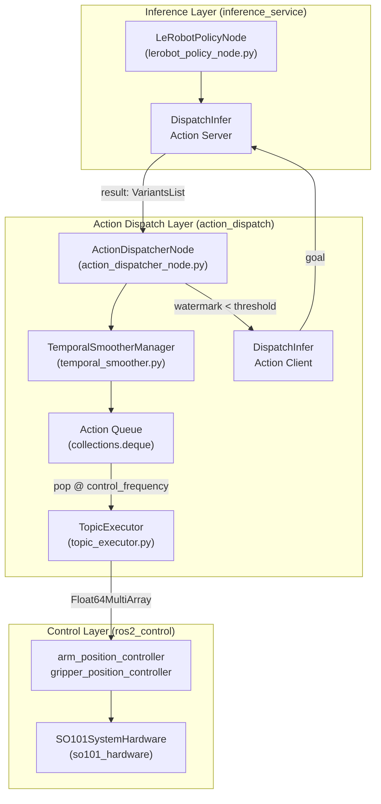
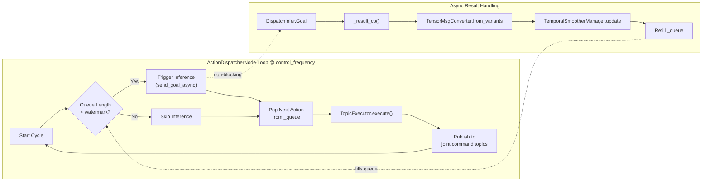

# 动作分发概述

相关源文件

生成此 wiki 页面时使用了以下文件作为上下文：

- [src/action_dispatch/README.md](https://atomgit.com/openeuler/IB_Robot/blob/master/src/action_dispatch/README.md)
- [src/action_dispatch/action_dispatch/action_dispatcher_node.py](https://atomgit.com/openeuler/IB_Robot/blob/master/src/action_dispatch/action_dispatch/action_dispatcher_node.py)
- [src/action_dispatch/package.xml](https://atomgit.com/openeuler/IB_Robot/blob/master/src/action_dispatch/package.xml)
- [src/dataset_tools/dataset_tools/record_cli.py](https://atomgit.com/openeuler/IB_Robot/blob/master/src/dataset_tools/dataset_tools/record_cli.py)
- [src/dataset_tools/package.xml](https://atomgit.com/openeuler/IB_Robot/blob/master/src/dataset_tools/package.xml)
- [src/inference_service/inference_service/lerobot_policy_node.py](https://atomgit.com/openeuler/IB_Robot/blob/master/src/inference_service/inference_service/lerobot_policy_node.py)
- [src/robot_config/config/robots/so101_single_arm.yaml](https://atomgit.com/openeuler/IB_Robot/blob/master/src/robot_config/config/robots/so101_single_arm.yaml)
- [src/robot_config/robot_config/launch_builders/execution.py](https://atomgit.com/openeuler/IB_Robot/blob/master/src/robot_config/robot_config/launch_builders/execution.py)

**Action Dispatch** 包实现了一个基于拉取的动作分发层，位于 AI 推理服务和 `ros2_control` 硬件接口之间。它提供队列管理、基于水位线的推理触发，以及面向 ACT、Diffusion Policy 等 action chunking 模型的跨帧时序平滑。

有关生成动作的推理流水线，请参见 [推理流水线](../inference/overview.md)。有关硬件控制和执行，请参见 [硬件集成](../hardware/overview.md)。

---

## 目的与范围

Action Dispatch 连接**离散模型推理**（延迟可变）和**连续机器人控制**（固定频率）。系统会：

- 维护 FIFO 动作队列，并在队列低于水位线阈值时触发新推理 [src/action_dispatch/action_dispatch/action_dispatcher_node.py:43-82](https://atomgit.com/openeuler/IB_Robot/blob/master/src/action_dispatch/action_dispatch/action_dispatcher_node.py#L43-L82)。
- 实现跨帧时序平滑，保证连续动作 chunk 之间平滑过渡 [src/action_dispatch/action_dispatch/action_dispatcher_node.py:110-121](https://atomgit.com/openeuler/IB_Robot/blob/master/src/action_dispatch/action_dispatch/action_dispatcher_node.py#L110-L121)。
- 通过 `TopicExecutor` 向 `ros2_control` 控制器高频流式发送命令 [src/action_dispatch/action_dispatch/action_dispatcher_node.py:153-156](https://atomgit.com/openeuler/IB_Robot/blob/master/src/action_dispatch/action_dispatch/action_dispatcher_node.py#L153-L156)。
- 支持带显式启动、停止逻辑和底盘速度控制的 **Navigation Mode** [src/action_dispatch/action_dispatch/action_dispatcher_node.py:93-106](https://atomgit.com/openeuler/IB_Robot/blob/master/src/action_dispatch/action_dispatch/action_dispatcher_node.py#L93-L106)。

**来源**: [src/action_dispatch/action_dispatch/action_dispatcher_node.py:3-9](https://atomgit.com/openeuler/IB_Robot/blob/master/src/action_dispatch/action_dispatch/action_dispatcher_node.py#L3-L9), [src/action_dispatch/README.md:3-8](https://atomgit.com/openeuler/IB_Robot/blob/master/src/action_dispatch/README.md#L3-L8)

---

## IB-Robot 架构中的系统位置

**图：系统上下文中的 Action Dispatch**

Action Dispatch 充当机器人的“小脑”，确保动作按硬件控制频率平滑执行。它消费 `DispatchInfer` action 返回的 `VariantsList` 结果，并将其映射到 `robot_config` 中定义的具体硬件控制器 [src/robot_config/config/robots/so101_single_arm.yaml:116-123](https://atomgit.com/openeuler/IB_Robot/blob/master/src/robot_config/config/robots/so101_single_arm.yaml#L116-L123)。

**来源**: [src/action_dispatch/README.md:13-42](https://atomgit.com/openeuler/IB_Robot/blob/master/src/action_dispatch/README.md#L13-L42), [src/action_dispatch/action_dispatch/action_dispatcher_node.py:43-157](https://atomgit.com/openeuler/IB_Robot/blob/master/src/action_dispatch/action_dispatch/action_dispatcher_node.py#L43-L157), [src/robot_config/config/robots/so101_single_arm.yaml:88-124](https://atomgit.com/openeuler/IB_Robot/blob/master/src/robot_config/config/robots/so101_single_arm.yaml#L88-L124)

---

## 基于拉取的队列架构

### 运行原理

Action Dispatch 使用**基于拉取**的设计。分发器维护动作队列，并在剩余动作低于水位线时主动请求新的推理。

**图：基于拉取的控制流**

**关键设计决策**：
1. **水位线触发**：当队列大小低于 `watermark_threshold` 时触发推理 [src/action_dispatch/action_dispatch/action_dispatcher_node.py:80](https://atomgit.com/openeuler/IB_Robot/blob/master/src/action_dispatch/action_dispatch/action_dispatcher_node.py#L80)。
2. **异步 Action Client**：对 `DispatchInfer` action 使用 `send_goal_async()`，避免阻塞高频控制循环 [src/action_dispatch/action_dispatch/action_dispatcher_node.py:159-161](https://atomgit.com/openeuler/IB_Robot/blob/master/src/action_dispatch/action_dispatch/action_dispatcher_node.py#L159-L161)。
3. **动作对齐**：当新的动作 chunk 到达时，分发器计算推理延迟期间已执行的动作数量（`_plan_length_at_inference_start`），并据此对齐新的 chunk [src/action_dispatch/action_dispatch/action_dispatcher_node.py:108-109](https://atomgit.com/openeuler/IB_Robot/blob/master/src/action_dispatch/action_dispatch/action_dispatcher_node.py#L108-L109)。

**来源**: [src/action_dispatch/action_dispatch/action_dispatcher_node.py:54-124](https://atomgit.com/openeuler/IB_Robot/blob/master/src/action_dispatch/action_dispatch/action_dispatcher_node.py#L54-L124), [src/action_dispatch/README.md:84-129](https://atomgit.com/openeuler/IB_Robot/blob/master/src/action_dispatch/README.md#L84-L129)

---

## 子页面

- [动作分发器节点](./action_dispatcher_node.md)：介绍 `ActionDispatcherNode` 实现、控制循环和 `DispatchInfer` action client 逻辑。
- [时序平滑](./temporal_smoothing.md)：深入说明 `TemporalSmoother` 算法、指数加权和跨帧动作 chunk 对齐。
- [Topic 与 Action 执行器](./topic_and_action_executors.md)：介绍 `TopicExecutor`（将 tensor 映射到 `Float64MultiArray`）和基于轨迹的 `ActionExecutor`。

---

## 核心组件

### ActionDispatcherNode
实现基于拉取分发器的主 ROS 2 节点。它协调 `TopicExecutor` 和 `TemporalSmootherManager` [src/action_dispatch/action_dispatch/action_dispatcher_node.py:43-56](https://atomgit.com/openeuler/IB_Robot/blob/master/src/action_dispatch/action_dispatch/action_dispatcher_node.py#L43-L56)。
- **Control Hz**：硬件命令的可配置频率，例如 ACT 为 20Hz，teleop 为 100Hz [src/robot_config/config/robots/so101_single_arm.yaml:123](https://atomgit.com/openeuler/IB_Robot/blob/master/src/robot_config/config/robots/so101_single_arm.yaml#L123)。
- **Watermark**：触发新推理请求的阈值，例如 50 个动作，确保队列在高延迟分布式推理期间不会耗尽 [src/robot_config/config/robots/so101_single_arm.yaml:122](https://atomgit.com/openeuler/IB_Robot/blob/master/src/robot_config/config/robots/so101_single_arm.yaml#L122)。

**来源**: [src/action_dispatch/action_dispatch/action_dispatcher_node.py:54-157](https://atomgit.com/openeuler/IB_Robot/blob/master/src/action_dispatch/action_dispatch/action_dispatcher_node.py#L54-L157), [src/robot_config/config/robots/so101_single_arm.yaml:116-124](https://atomgit.com/openeuler/IB_Robot/blob/master/src/robot_config/config/robots/so101_single_arm.yaml#L116-L124)

### TemporalSmoother
实现跨帧指数加权平滑。它混合连续推理周期中重叠的动作 chunk，防止运动抖动 [src/action_dispatch/action_dispatch/action_dispatcher_node.py:35-37](https://atomgit.com/openeuler/IB_Robot/blob/master/src/action_dispatch/action_dispatch/action_dispatcher_node.py#L35-L37)。
- **Ensemble Coeff**：决定重叠区间中新旧动作的权重分配 [src/action_dispatch/action_dispatch/action_dispatcher_node.py:75](https://atomgit.com/openeuler/IB_Robot/blob/master/src/action_dispatch/action_dispatch/action_dispatcher_node.py#L75)。

**来源**: [src/action_dispatch/README.md:108-115](https://atomgit.com/openeuler/IB_Robot/blob/master/src/action_dispatch/README.md#L108-L115), [src/action_dispatch/action_dispatch/action_dispatcher_node.py:110-121](https://atomgit.com/openeuler/IB_Robot/blob/master/src/action_dispatch/action_dispatch/action_dispatcher_node.py#L110-L121)

### TopicExecutor
使用 contract action specs 将动作 tensor 索引映射到关节名称，并发布到 `ros2_control` 命令 topic [src/action_dispatch/action_dispatch/action_dispatcher_node.py:38](https://atomgit.com/openeuler/IB_Robot/blob/master/src/action_dispatch/action_dispatch/action_dispatcher_node.py#L38)。
- **Contract Loading**：通过 `robot_config.loader` 自动从机器人配置加载关节映射 [src/action_dispatch/action_dispatch/action_dispatcher_node.py:126-135](https://atomgit.com/openeuler/IB_Robot/blob/master/src/action_dispatch/action_dispatch/action_dispatcher_node.py#L126-L135)。

**来源**: [src/action_dispatch/action_dispatch/action_dispatcher_node.py:153-156](https://atomgit.com/openeuler/IB_Robot/blob/master/src/action_dispatch/action_dispatch/action_dispatcher_node.py#L153-L156)

---

## ROS 接口

### 发布的 Topics
- `~/queue_size` (`std_msgs/Int32`)：队列中剩余动作的当前数量。
- `~/smoothing_enabled` (`std_msgs/Bool`)：时序平滑状态。

### Services
- `~/reset`：清空动作队列并重置内部状态。
- `~/toggle_smoothing`：运行时切换时序平滑。

### Actions
- `/act_inference_node/DispatchInfer`：用于从 `LeRobotPolicyNode` 拉取新动作 chunk 的 client 接口 [src/action_dispatch/action_dispatch/action_dispatcher_node.py:62-64](https://atomgit.com/openeuler/IB_Robot/blob/master/src/action_dispatch/action_dispatch/action_dispatcher_node.py#L62-L64), [src/inference_service/inference_service/lerobot_policy_node.py:148-158](https://atomgit.com/openeuler/IB_Robot/blob/master/src/inference_service/inference_service/lerobot_policy_node.py#L148-L158)。

**来源**: [src/action_dispatch/action_dispatch/action_dispatcher_node.py:58-82](https://atomgit.com/openeuler/IB_Robot/blob/master/src/action_dispatch/action_dispatch/action_dispatcher_node.py#L58-L82), [src/inference_service/inference_service/lerobot_policy_node.py:27-34](https://atomgit.com/openeuler/IB_Robot/blob/master/src/inference_service/inference_service/lerobot_policy_node.py#L27-L34)

