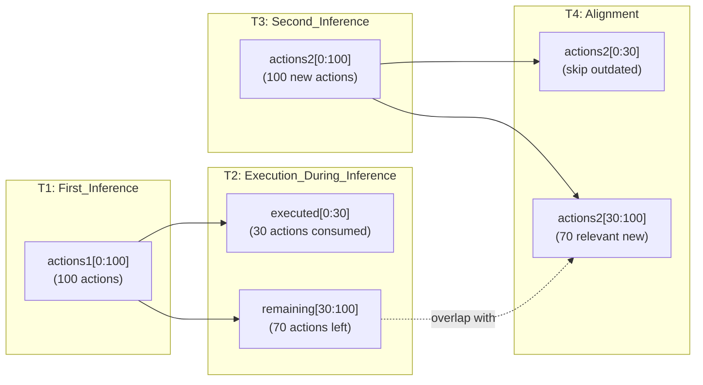
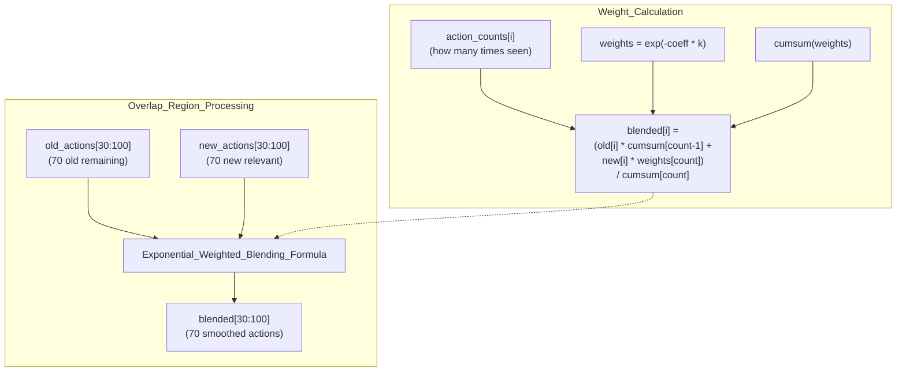
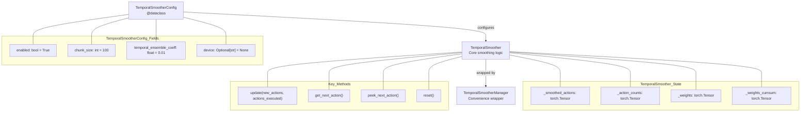
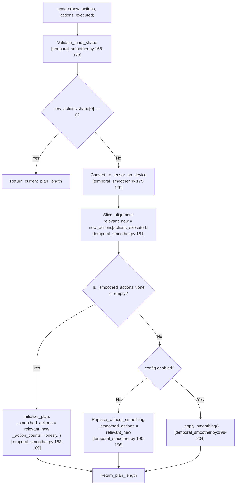
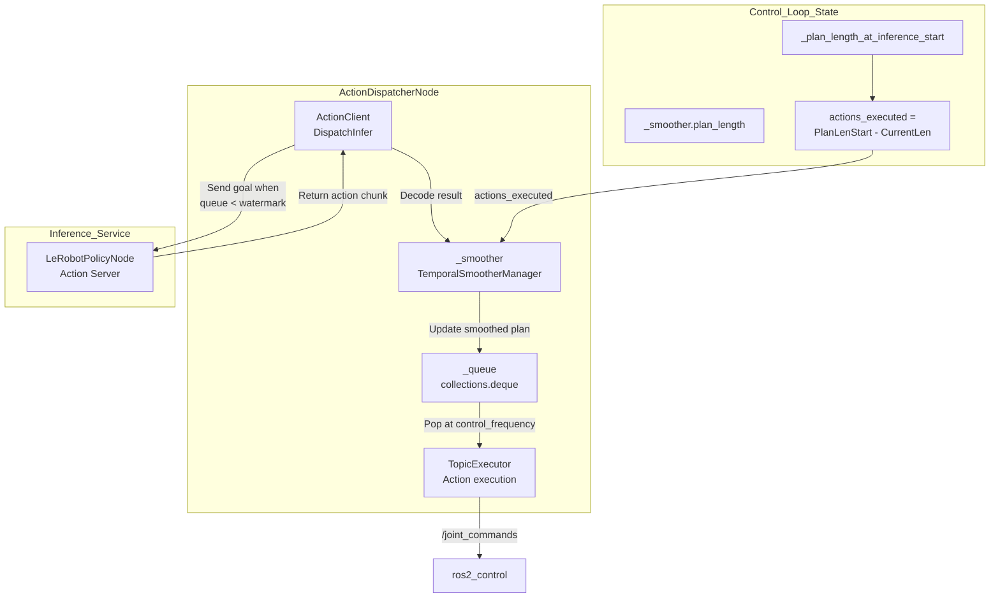

# 时序平滑

<details>
<summary>相关源文件</summary>

生成此 wiki 页面时使用了以下文件作为上下文：

- [src/action_dispatch/action_dispatch/__init__.py](https://atomgit.com/openeuler/IB_Robot/blob/master/src/action_dispatch/action_dispatch/__init__.py)
- [src/action_dispatch/action_dispatch/action_dispatcher_node.py](https://atomgit.com/openeuler/IB_Robot/blob/master/src/action_dispatch/action_dispatch/action_dispatcher_node.py)
- [src/action_dispatch/action_dispatch/temporal_smoother.py](https://atomgit.com/openeuler/IB_Robot/blob/master/src/action_dispatch/action_dispatch/temporal_smoother.py)
- [src/action_dispatch/test/test_temporal_smoother.py](https://atomgit.com/openeuler/IB_Robot/blob/master/src/action_dispatch/test/test_temporal_smoother.py)
- [src/inference_service/inference_service/lerobot_policy_node.py](https://atomgit.com/openeuler/IB_Robot/blob/master/src/inference_service/inference_service/lerobot_policy_node.py)
- [src/robot_config/config/robots/so101_single_arm.yaml](https://atomgit.com/openeuler/IB_Robot/blob/master/src/robot_config/config/robots/so101_single_arm.yaml)
- [src/robot_config/robot_config/launch_builders/execution.py](https://atomgit.com/openeuler/IB_Robot/blob/master/src/robot_config/robot_config/launch_builders/execution.py)

</details>


本文档深入说明 **TemporalSmoother** 算法。该算法对 Action Chunking 策略（例如 ACT、Diffusion Policy）产生的动作 chunk 执行跨帧指数加权混合。时序平滑保证连续推理输出之间平滑过渡，避免动作计划在执行中更新时产生突兀运动断点。

有关整体动作分发系统和队列管理，请参见 [动作分发器节点](./action_dispatcher_node.md)。有关平滑后动作如何通过 topics 或 action servers 执行，请参见 [Topic 与 Action 执行器](./topic_and_action_executors.md)。

**来源：** [src/action_dispatch/action_dispatch/temporal_smoother.py:1-11](https://atomgit.com/openeuler/IB_Robot/blob/master/src/action_dispatch/action_dispatch/temporal_smoother.py#L1-L11), [src/action_dispatch/action_dispatch/action_dispatcher_node.py:1-9](https://atomgit.com/openeuler/IB_Robot/blob/master/src/action_dispatch/action_dispatch/action_dispatcher_node.py#L1-L9)

---

## 问题陈述：动作 Chunk 重叠

Action Chunking 策略每次推理输出 `n` 个动作的序列（通常 `n=100`）。但推理不是瞬时完成的。模型计算下一个动作 chunk 时，机器人会继续执行上一 chunk 中的动作。这会产生时序重叠问题：

```
T1: First inference produces [a1, a2, a3, ..., a100]
    Robot begins executing: a1, a2, a3...
    
T2: Inference starts (queue watermark triggered)
    Robot continues: a4, a5, a6...
    
T3: Inference completes after robot executed 30 actions
    New chunk: [b1, b2, b3, ..., b100]
    Remaining old actions: [a31, a32, ..., a100]
    
Problem: How to transition from old plan to new plan?
```

如果不做平滑，会有两种糟糕选择：
1. **丢弃新 chunk**：继续执行过期预测，模型预测会变得无关。
2. **立即替换**：从 `a30` 跳到 `b31`，造成突兀运动断点。

时序平滑通过**混合重叠区间**解决此问题。它使用指数加权，兼顾连续性和对新预测的响应能力。

**来源：** [src/action_dispatch/action_dispatch/temporal_smoother.py:44-77](https://atomgit.com/openeuler/IB_Robot/blob/master/src/action_dispatch/action_dispatch/temporal_smoother.py#L44-L77), [src/action_dispatch/action_dispatch/action_dispatcher_node.py:44-52](https://atomgit.com/openeuler/IB_Robot/blob/master/src/action_dispatch/action_dispatch/action_dispatcher_node.py#L44-L52)

---

## 算法概览

时序平滑算法分三个阶段运行：

**阶段 1：时序对齐图**



**阶段 2：指数加权混合**



**来源：** [src/action_dispatch/action_dispatch/temporal_smoother.py:145-206](https://atomgit.com/openeuler/IB_Robot/blob/master/src/action_dispatch/action_dispatch/temporal_smoother.py#L145-L206), [src/action_dispatch/action_dispatch/temporal_smoother.py:208-246](https://atomgit.com/openeuler/IB_Robot/blob/master/src/action_dispatch/action_dispatch/temporal_smoother.py#L208-L246)

---

## 核心组件

时序平滑实现由 `src/action_dispatch/action_dispatch/temporal_smoother.py` 中的三个主要类组成：

### 类层级图



**来源：** [src/action_dispatch/action_dispatch/temporal_smoother.py:19-42](https://atomgit.com/openeuler/IB_Robot/blob/master/src/action_dispatch/action_dispatch/temporal_smoother.py#L19-L42), [src/action_dispatch/action_dispatch/temporal_smoother.py:44-110](https://atomgit.com/openeuler/IB_Robot/blob/master/src/action_dispatch/action_dispatch/temporal_smoother.py#L44-L110), [src/action_dispatch/action_dispatch/temporal_smoother.py:259-265](https://atomgit.com/openeuler/IB_Robot/blob/master/src/action_dispatch/action_dispatch/temporal_smoother.py#L259-L265)

### TemporalSmootherConfig

定义于 [src/action_dispatch/action_dispatch/temporal_smoother.py:19-42](https://atomgit.com/openeuler/IB_Robot/blob/master/src/action_dispatch/action_dispatch/temporal_smoother.py#L19-L42) 的配置 dataclass。

| Field | Type | Default | Description |
|-------|------|---------|-------------|
| `enabled` | `bool` | `True` | 启用平滑。如果为 `False`，仅执行对齐并透传。 |
| `chunk_size` | `int` | `100` | 每个 chunk 的最大动作数。用于权重预计算。 |
| `temporal_ensemble_coeff` | `float` | `0.01` | 指数衰减系数。 |
| `device` | `Optional[str]` | `None` | tensor 运算设备（`'cpu'`, `'cuda'`, `'npu:0'`）。为 `None` 时自动检测。 |

**来源：** [src/action_dispatch/action_dispatch/temporal_smoother.py:19-42](https://atomgit.com/openeuler/IB_Robot/blob/master/src/action_dispatch/action_dispatch/temporal_smoother.py#L19-L42)

### TemporalSmoother

核心平滑实现位于 [src/action_dispatch/action_dispatch/temporal_smoother.py:44-257](https://atomgit.com/openeuler/IB_Robot/blob/master/src/action_dispatch/action_dispatch/temporal_smoother.py#L44-L257)。它维护内部状态：

- `_smoothed_actions`：当前平滑后的动作计划，shape 为 `[plan_length, action_dim]` [src/action_dispatch/action_dispatch/temporal_smoother.py:110](https://atomgit.com/openeuler/IB_Robot/blob/master/src/action_dispatch/action_dispatch/temporal_smoother.py#L110)。
- `_action_counts`：每个动作被混合的次数，shape 为 `[plan_length, 1]` [src/action_dispatch/action_dispatch/temporal_smoother.py:111](https://atomgit.com/openeuler/IB_Robot/blob/master/src/action_dispatch/action_dispatch/temporal_smoother.py#L111)。
- `_weights`：预计算指数权重，shape 为 `[chunk_size]` [src/action_dispatch/action_dispatch/temporal_smoother.py:91](https://atomgit.com/openeuler/IB_Robot/blob/master/src/action_dispatch/action_dispatch/temporal_smoother.py#L91)。
- `_weights_cumsum`：权重累积和，shape 为 `[chunk_size]` [src/action_dispatch/action_dispatch/temporal_smoother.py:92](https://atomgit.com/openeuler/IB_Robot/blob/master/src/action_dispatch/action_dispatch/temporal_smoother.py#L92)。

**关键方法：**

| Method | Signature | Purpose |
|--------|-----------|---------|
| `update()` | `update(new_actions, actions_executed_during_inference) -> int` | 核心平滑逻辑。对齐并混合新 chunk。 [src/action_dispatch/action_dispatch/temporal_smoother.py:145-167](https://atomgit.com/openeuler/IB_Robot/blob/master/src/action_dispatch/action_dispatch/temporal_smoother.py#L145-L167) |
| `get_next_action()` | `get_next_action() -> Union[torch.Tensor, np.ndarray]` | 从计划中弹出并返回下一个动作。 [src/action_dispatch/action_dispatch/temporal_smoother.py:125-143](https://atomgit.com/openeuler/IB_Robot/blob/master/src/action_dispatch/action_dispatch/temporal_smoother.py#L125-L143) |
| `peek_next_action()` | `peek_next_action() -> Optional[Union[torch.Tensor, np.ndarray]]` | 返回下一个动作但不移除。 [src/action_dispatch/action_dispatch/temporal_smoother.py:248-257](https://atomgit.com/openeuler/IB_Robot/blob/master/src/action_dispatch/action_dispatch/temporal_smoother.py#L248-L257) |
| `reset()` | `reset()` | 清空内部状态，用于新 episode。 [src/action_dispatch/action_dispatch/temporal_smoother.py:108-111](https://atomgit.com/openeuler/IB_Robot/blob/master/src/action_dispatch/action_dispatch/temporal_smoother.py#L108-L111) |
| `plan_length` | `@property plan_length -> int` | 返回当前计划中的动作数。 [src/action_dispatch/action_dispatch/temporal_smoother.py:113-118](https://atomgit.com/openeuler/IB_Robot/blob/master/src/action_dispatch/action_dispatch/temporal_smoother.py#L113-L118) |

**来源：** [src/action_dispatch/action_dispatch/temporal_smoother.py:44-257](https://atomgit.com/openeuler/IB_Robot/blob/master/src/action_dispatch/action_dispatch/temporal_smoother.py#L44-L257)

### TemporalSmootherManager

便利封装位于 [src/action_dispatch/action_dispatch/temporal_smoother.py:259-322](https://atomgit.com/openeuler/IB_Robot/blob/master/src/action_dispatch/action_dispatch/temporal_smoother.py#L259-L322)，提供运行时切换和统一接口。所有操作都会委托给内部 `TemporalSmoother` 实例。

附加方法：
- `set_enabled(enabled: bool)`：运行时开启或关闭平滑 [src/action_dispatch/action_dispatch/temporal_smoother.py:318-322](https://atomgit.com/openeuler/IB_Robot/blob/master/src/action_dispatch/action_dispatch/temporal_smoother.py#L318-L322)。

**来源：** [src/action_dispatch/action_dispatch/temporal_smoother.py:259-322](https://atomgit.com/openeuler/IB_Robot/blob/master/src/action_dispatch/action_dispatch/temporal_smoother.py#L259-L322)

---

## 平滑公式

指数加权混合公式实现于 [src/action_dispatch/action_dispatch/temporal_smoother.py:208-246](https://atomgit.com/openeuler/IB_Robot/blob/master/src/action_dispatch/action_dispatch/temporal_smoother.py#L208-L246)：

```python
# For each action i in the overlap region:
blended[i] = (old[i] * cumsum[count[i]-1] + new[i] * weights[count[i]]) 
             / cumsum[count[i]]
```

其中：
- `old[i]`：上一平滑计划中的第 i 个动作。
- `new[i]`：新推理结果（对齐后）中的第 i 个动作。
- `count[i]`：动作 i 被混合的次数，从 1 开始。
- `weights[k] = exp(-temporal_ensemble_coeff * k)`。
- `cumsum[k]` 是到索引 k 为止的权重累积和。

### 权重计算

权重在初始化期间预计算，位置为 [src/action_dispatch/action_dispatch/temporal_smoother.py:86-92](https://atomgit.com/openeuler/IB_Robot/blob/master/src/action_dispatch/action_dispatch/temporal_smoother.py#L86-L92)：

```python
coeff = self.config.temporal_ensemble_coeff
chunk_size = self.config.chunk_size

self._weights = torch.exp(-coeff * torch.arange(chunk_size, dtype=torch.float32))
self._weights_cumsum = torch.cumsum(self._weights, dim=0)
```

**来源：** [src/action_dispatch/action_dispatch/temporal_smoother.py:86-92](https://atomgit.com/openeuler/IB_Robot/blob/master/src/action_dispatch/action_dispatch/temporal_smoother.py#L86-L92), [src/action_dispatch/action_dispatch/temporal_smoother.py:208-246](https://atomgit.com/openeuler/IB_Robot/blob/master/src/action_dispatch/action_dispatch/temporal_smoother.py#L208-L246)

---

## 时序对齐过程

`update()` 方法位于 [src/action_dispatch/action_dispatch/temporal_smoother.py:145-206](https://atomgit.com/openeuler/IB_Robot/blob/master/src/action_dispatch/action_dispatch/temporal_smoother.py#L145-L206)，负责处理时序对齐：

### 对齐流程图



**来源：** [src/action_dispatch/action_dispatch/temporal_smoother.py:145-206](https://atomgit.com/openeuler/IB_Robot/blob/master/src/action_dispatch/action_dispatch/temporal_smoother.py#L145-L206)

---

## 与 Action Dispatcher 集成

`TemporalSmoother` 按以下方式集成到 `ActionDispatcherNode`：



动作分发器会：
1. 在 `_plan_length_at_inference_start` 中记录推理开始时的队列长度 [src/action_dispatch/action_dispatch/action_dispatcher_node.py:108](https://atomgit.com/openeuler/IB_Robot/blob/master/src/action_dispatch/action_dispatch/action_dispatcher_node.py#L108)。
2. 结果到达时，将开始时计划长度和当前长度之差计算为 `actions_executed` [src/action_dispatch/action_dispatch/action_dispatcher_node.py:255-257](https://atomgit.com/openeuler/IB_Robot/blob/master/src/action_dispatch/action_dispatch/action_dispatcher_node.py#L255-L257)。
3. 将 `(new_chunk, actions_executed)` 传给 `_smoother.update()` [src/action_dispatch/action_dispatch/action_dispatcher_node.py:260](https://atomgit.com/openeuler/IB_Robot/blob/master/src/action_dispatch/action_dispatch/action_dispatcher_node.py#L260)。
4. 在 `_control_loop` 中弹出平滑后的动作进行执行 [src/action_dispatch/action_dispatch/action_dispatcher_node.py:291](https://atomgit.com/openeuler/IB_Robot/blob/master/src/action_dispatch/action_dispatch/action_dispatcher_node.py#L291)。

**来源：** [src/action_dispatch/action_dispatch/action_dispatcher_node.py:43-300](https://atomgit.com/openeuler/IB_Robot/blob/master/src/action_dispatch/action_dispatch/action_dispatcher_node.py#L43-L300), [src/action_dispatch/action_dispatch/temporal_smoother.py:145-167](https://atomgit.com/openeuler/IB_Robot/blob/master/src/action_dispatch/action_dispatch/temporal_smoother.py#L145-L167)

---

## Launch Files 中的配置参数

时序平滑参数可通过 `ActionDispatcherNode` 中的 ROS 2 parameters 配置：

| Parameter | Type | Default | Description |
|-----------|------|---------|-------------|
| `temporal_smoothing_enabled` | `bool` | `False` | 启用或禁用平滑 [src/action_dispatch/action_dispatch/action_dispatcher_node.py:73](https://atomgit.com/openeuler/IB_Robot/blob/master/src/action_dispatch/action_dispatch/action_dispatcher_node.py#L73)。 |
| `temporal_ensemble_coeff` | `double` | `0.01` | 指数衰减系数 [src/action_dispatch/action_dispatch/action_dispatcher_node.py:74](https://atomgit.com/openeuler/IB_Robot/blob/master/src/action_dispatch/action_dispatch/action_dispatcher_node.py#L74)。 |
| `chunk_size` | `int` | `100` | 每个 chunk 的最大动作数 [src/action_dispatch/action_dispatch/action_dispatcher_node.py:75](https://atomgit.com/openeuler/IB_Robot/blob/master/src/action_dispatch/action_dispatch/action_dispatcher_node.py#L75)。 |
| `smoothing_device` | `string` | `''` | 计算设备，空值表示自动检测 [src/action_dispatch/action_dispatch/action_dispatcher_node.py:76](https://atomgit.com/openeuler/IB_Robot/blob/master/src/action_dispatch/action_dispatch/action_dispatcher_node.py#L76)。 |

**来源：** [src/action_dispatch/action_dispatch/action_dispatcher_node.py:58-84](https://atomgit.com/openeuler/IB_Robot/blob/master/src/action_dispatch/action_dispatch/action_dispatcher_node.py#L58-L84)

---

## 测试

完整测试位于 [src/action_dispatch/test/test_temporal_smoother.py:1-247](https://atomgit.com/openeuler/IB_Robot/blob/master/src/action_dispatch/test/test_temporal_smoother.py#L1-L247)。关键测试场景包括：

| Test Class | Coverage |
|------------|----------|
| `TestTemporalSmootherConfig` | 配置验证、参数默认值 [src/action_dispatch/test/test_temporal_smoother.py:23-48](https://atomgit.com/openeuler/IB_Robot/blob/master/src/action_dispatch/test/test_temporal_smoother.py#L23-L48)。 |
| `TestTemporalSmoother` | 基本 update/get、禁用平滑、跨帧平滑、tensor 输入、reset [src/action_dispatch/test/test_temporal_smoother.py:50-174](https://atomgit.com/openeuler/IB_Robot/blob/master/src/action_dispatch/test/test_temporal_smoother.py#L50-L174)。 |
| `TestTemporalSmootherManager` | manager 接口、运行时切换、peek 操作 [src/action_dispatch/test/test_temporal_smoother.py:176-216](https://atomgit.com/openeuler/IB_Robot/blob/master/src/action_dispatch/test/test_temporal_smoother.py#L176-L216)。 |
| `TestSmoothingFormula` | 权重计算、系数影响、累积和 [src/action_dispatch/test/test_temporal_smoother.py:218-247](https://atomgit.com/openeuler/IB_Robot/blob/master/src/action_dispatch/test/test_temporal_smoother.py#L218-L247)。 |

**来源：** [src/action_dispatch/test/test_temporal_smoother.py:1-247](https://atomgit.com/openeuler/IB_Robot/blob/master/src/action_dispatch/test/test_temporal_smoother.py#L1-L247)

