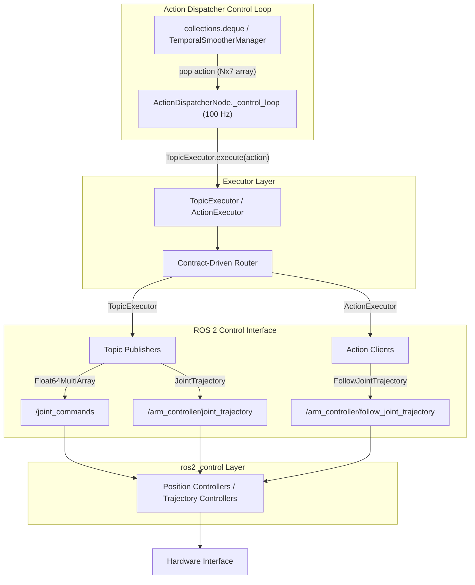
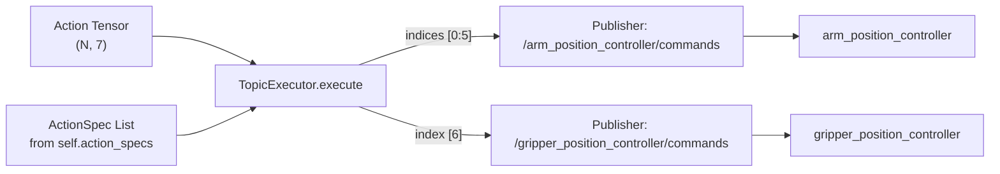
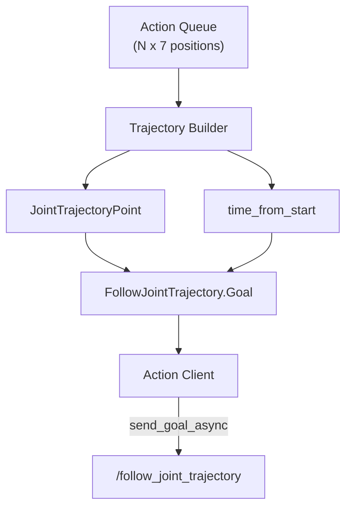

# Topic 与 Action 执行器

<details>
<summary>相关源文件</summary>

生成此 wiki 页面时使用了以下文件作为上下文：

- [scripts/openharmony/build_ibrobot_oh_custom.sh](https://atomgit.com/openeuler/IB_Robot/blob/master/scripts/openharmony/build_ibrobot_oh_custom.sh)
- [src/action_dispatch/action_dispatch/action_dispatcher_node.py](https://atomgit.com/openeuler/IB_Robot/blob/master/src/action_dispatch/action_dispatch/action_dispatcher_node.py)
- [src/action_dispatch/action_dispatch/topic_executor.py](https://atomgit.com/openeuler/IB_Robot/blob/master/src/action_dispatch/action_dispatch/topic_executor.py)
- [src/inference_service/inference_service/core/rknn/__init__.py](https://atomgit.com/openeuler/IB_Robot/blob/master/src/inference_service/inference_service/core/rknn/__init__.py)
- [src/inference_service/inference_service/lerobot_policy_node.py](https://atomgit.com/openeuler/IB_Robot/blob/master/src/inference_service/inference_service/lerobot_policy_node.py)
- [src/inference_service/setup.py](https://atomgit.com/openeuler/IB_Robot/blob/master/src/inference_service/setup.py)
- [src/robot_config/config/robots/so101_single_arm.yaml](https://atomgit.com/openeuler/IB_Robot/blob/master/src/robot_config/config/robots/so101_single_arm.yaml)
- [src/robot_config/robot_config/launch_builders/execution.py](https://atomgit.com/openeuler/IB_Robot/blob/master/src/robot_config/robot_config/launch_builders/execution.py)
- [src/robot_config/robot_config/launch_builders/sim_backend/base_adapter.py](https://atomgit.com/openeuler/IB_Robot/blob/master/src/robot_config/robot_config/launch_builders/sim_backend/base_adapter.py)
- [src/robot_config/robot_config/launch_builders/sim_backend/gazebo_adapter.py](https://atomgit.com/openeuler/IB_Robot/blob/master/src/robot_config/robot_config/launch_builders/sim_backend/gazebo_adapter.py)
- [src/robot_config/robot_config/launch_builders/sim_peripheral_bridge.py](https://atomgit.com/openeuler/IB_Robot/blob/master/src/robot_config/robot_config/launch_builders/sim_peripheral_bridge.py)
- [src/robot_config/robot_config/launch_builders/simulation.py](https://atomgit.com/openeuler/IB_Robot/blob/master/src/robot_config/robot_config/launch_builders/simulation.py)
- [src/robot_config/test/test_sim_backend.py](https://atomgit.com/openeuler/IB_Robot/blob/master/src/robot_config/test/test_sim_backend.py)

</details>


**目的**：本文档说明 `action_dispatch` 包中的执行器层，该层把抽象动作 tensor 转换为具体 ROS 2 控制命令。两类执行器 `TopicExecutor` 和 `ActionExecutor` 提供不同的机器人硬件控制机制，并分别针对特定控制范式优化。

**范围**：本文覆盖执行器架构、实现细节、消息路由，以及与动作分发器控制循环的集成。整体分发架构请参见 [动作分发器节点](./action_dispatcher_node.md)。动作队列管理和平滑请参见 [时序平滑](./temporal_smoothing.md)。

---

## 执行器架构概览

执行器层位于动作分发器控制循环和 ROS 2 控制系统之间，提供一个抽象层，将动作生成与硬件通信协议隔离。

### 执行器职责图



**来源**: [src/action_dispatch/action_dispatch/action_dispatcher_node.py:43-52](https://atomgit.com/openeuler/IB_Robot/blob/master/src/action_dispatch/action_dispatch/action_dispatcher_node.py#L43-L52), [src/action_dispatch/action_dispatch/topic_executor.py:20-25](https://atomgit.com/openeuler/IB_Robot/blob/master/src/action_dispatch/action_dispatch/topic_executor.py#L20-L25)

---

## TopicExecutor：高频位置控制

`TopicExecutor` 通过按高频（通常 100 Hz）向 ROS 2 topics 发布单个动作向量，实现流式位置控制。它是端到端策略模型（ACT、Diffusion Policy）输出动作 chunk 时的默认执行器。

### 设计原则

| Aspect | Implementation |
|--------|----------------|
| **Control Frequency** | 100 Hz，可通过 `control_frequency` 配置 |
| **Message Type** | `std_msgs/Float64MultiArray` 或 `trajectory_msgs/JointTrajectory` |
| **Latency** | 很低，单次 topic publish |
| **Use Case** | 端到端策略推理、遥操作 |
| **Safety** | 队列为空时保持最后一个动作 |

**来源**: [src/action_dispatch/action_dispatch/topic_executor.py:41-46](https://atomgit.com/openeuler/IB_Robot/blob/master/src/action_dispatch/action_dispatch/topic_executor.py#L41-L46), [src/action_dispatch/action_dispatch/action_dispatcher_node.py:58-61](https://atomgit.com/openeuler/IB_Robot/blob/master/src/action_dispatch/action_dispatch/action_dispatcher_node.py#L58-L61)

### 消息路由策略

执行器使用 `Contract` 系统将动作 tensor 维度映射到具体控制器 topics：



**来源**: [src/action_dispatch/action_dispatch/topic_executor.py:61-75](https://atomgit.com/openeuler/IB_Robot/blob/master/src/action_dispatch/action_dispatch/topic_executor.py#L61-L75), [src/action_dispatch/action_dispatch/action_dispatcher_node.py:125-135](https://atomgit.com/openeuler/IB_Robot/blob/master/src/action_dispatch/action_dispatch/action_dispatcher_node.py#L125-L135)

### 初始化和设置

`TopicExecutor` 在动作分发器节点中创建并初始化：

[src/action_dispatch/action_dispatch/action_dispatcher_node.py:153-157](https://atomgit.com/openeuler/IB_Robot/blob/master/src/action_dispatch/action_dispatch/action_dispatcher_node.py#L153-L157)

```python
# 5. Executor (Topic-based)
self._executor = TopicExecutor(self, {"action_specs": self._action_specs})
if not self._executor.initialize():
    raise RuntimeError("Failed to initialize TopicExecutor")
```

执行器从 contract 接收 `action_specs`，这些 specs 定义 topic 名称和消息类型。它使用 Reliable 和 Volatile durability 的默认 QoS 初始化 publishers，确保 `ros2_control` 命令订阅者接受实时动作 topics [src/action_dispatch/action_dispatch/topic_executor.py:31-33](https://atomgit.com/openeuler/IB_Robot/blob/master/src/action_dispatch/action_dispatch/topic_executor.py#L31-L33)。

### 执行流程

每次控制循环迭代时，分发器调用 `self._executor.execute(action)`：

[src/action_dispatch/action_dispatch/topic_executor.py:51-55](https://atomgit.com/openeuler/IB_Robot/blob/master/src/action_dispatch/action_dispatch/topic_executor.py#L51-L55)

```python
def execute(self, action: np.ndarray, metadata: dict[str, Any] | None = None) -> bool:
    """Route action to publishers."""
    metadata = metadata or {}
    request_id = str(metadata.get("request_id", ""))
    # ...
```

执行器按每个 `ActionSpec` 期望的关节数量切分动作数组 [src/action_dispatch/action_dispatch/topic_executor.py:67-75](https://atomgit.com/openeuler/IB_Robot/blob/master/src/action_dispatch/action_dispatch/topic_executor.py#L67-L75)。

---

## ActionExecutor：轨迹控制

`ActionExecutor` 通过向 ROS 2 action servers 发送完整运动计划来实现基于轨迹的控制。当与 MoveIt 集成，或需要轨迹控制器时，会使用该执行器。

### 轨迹构造

不同于发送单个位置的 `TopicExecutor`，`ActionExecutor` 构造完整轨迹消息。当前 `TopicExecutor` 可以发送单点 `JointTrajectory` 消息 [src/action_dispatch/action_dispatch/topic_executor.py:81-86](https://atomgit.com/openeuler/IB_Robot/blob/master/src/action_dispatch/action_dispatch/topic_executor.py#L81-L86)，完整的 `ActionExecutor` 通常会管理 `FollowJointTrajectory` action 生命周期。



**来源**: [src/action_dispatch/action_dispatch/topic_executor.py:81-86](https://atomgit.com/openeuler/IB_Robot/blob/master/src/action_dispatch/action_dispatch/topic_executor.py#L81-L86)

---

## 性能追踪

执行层通过 Python logging 接入 LTTng，用于延迟分析。

| Event | Logger | Purpose |
|-------|--------|---------|
| `action_topic_publish` | `ib_trace.execute` | `TopicExecutor` 发布到 ROS topic 时记录 |
| `action_execute` | `ib_trace.dispatch` | 分发器触发执行步骤时记录 |

[src/action_dispatch/action_dispatch/topic_executor.py:87-94](https://atomgit.com/openeuler/IB_Robot/blob/master/src/action_dispatch/action_dispatch/topic_executor.py#L87-L94)

```python
_trace.info(
    "[action_topic_publish] request_id=%s index=%d topic=%s values=%d queue_size=%d",
    request_id,
    execute_index,
    topic,
    len(data_list),
    queue_size,
)
```

**来源**: [src/action_dispatch/action_dispatch/topic_executor.py:17](https://atomgit.com/openeuler/IB_Robot/blob/master/src/action_dispatch/action_dispatch/topic_executor.py#L17), [src/action_dispatch/action_dispatch/topic_executor.py:87-94](https://atomgit.com/openeuler/IB_Robot/blob/master/src/action_dispatch/action_dispatch/topic_executor.py#L87-L94)

---

## 安全与错误处理

### TopicExecutor 安全机制

1. **保持最后动作**：当动作队列为空时，分发器节点保持最后一个有效动作，避免硬件突然停止 [src/action_dispatch/action_dispatch/action_dispatcher_node.py:94-95](https://atomgit.com/openeuler/IB_Robot/blob/master/src/action_dispatch/action_dispatch/action_dispatcher_node.py#L94-L95)。
2. **QoS Profile**：默认使用 `ReliabilityPolicy.RELIABLE` 和 `DurabilityPolicy.VOLATILE` [src/action_dispatch/action_dispatch/topic_executor.py:31-33](https://atomgit.com/openeuler/IB_Robot/blob/master/src/action_dispatch/action_dispatch/topic_executor.py#L31-L33)，确保 `ros2_control` 命令订阅者接收命令，同时避免排队过期消息。
3. **初始化检查**：如果 contract specs 缺失或无效，`initialize()` 方法返回 `False`，防止节点以未定义状态启动 [src/action_dispatch/action_dispatch/topic_executor.py:34-49](https://atomgit.com/openeuler/IB_Robot/blob/master/src/action_dispatch/action_dispatch/topic_executor.py#L34-L49)。

**来源**: [src/action_dispatch/action_dispatch/topic_executor.py:31-49](https://atomgit.com/openeuler/IB_Robot/blob/master/src/action_dispatch/action_dispatch/topic_executor.py#L31-L49), [src/action_dispatch/action_dispatch/action_dispatcher_node.py:94-95](https://atomgit.com/openeuler/IB_Robot/blob/master/src/action_dispatch/action_dispatch/action_dispatcher_node.py#L94-L95)

---

## 总结

执行器层为机器人控制提供 contract 驱动的抽象：

- **TopicExecutor**：面向端到端策略的高频位置控制优化，延迟低，使用简单的 topic 通信。它根据 `ActionSpec` 关节名称将扁平动作 tensor 映射到多个 topics [src/action_dispatch/action_dispatch/topic_executor.py:61-72](https://atomgit.com/openeuler/IB_Robot/blob/master/src/action_dispatch/action_dispatch/topic_executor.py#L61-L72)。
- **ActionExecutor**：面向基于轨迹的控制，通常与 MoveIt 或长时域规划器配合使用。

**来源**: [src/action_dispatch/action_dispatch/topic_executor.py:1-96](https://atomgit.com/openeuler/IB_Robot/blob/master/src/action_dispatch/action_dispatch/topic_executor.py#L1-L96), [src/action_dispatch/action_dispatch/action_dispatcher_node.py:153-157](https://atomgit.com/openeuler/IB_Robot/blob/master/src/action_dispatch/action_dispatch/action_dispatcher_node.py#L153-L157)

