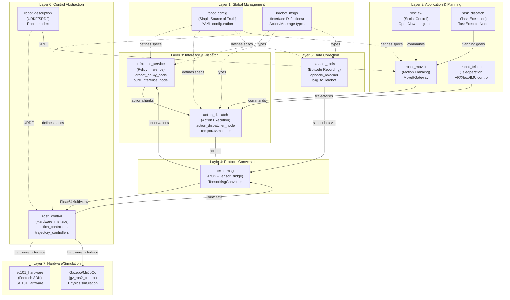
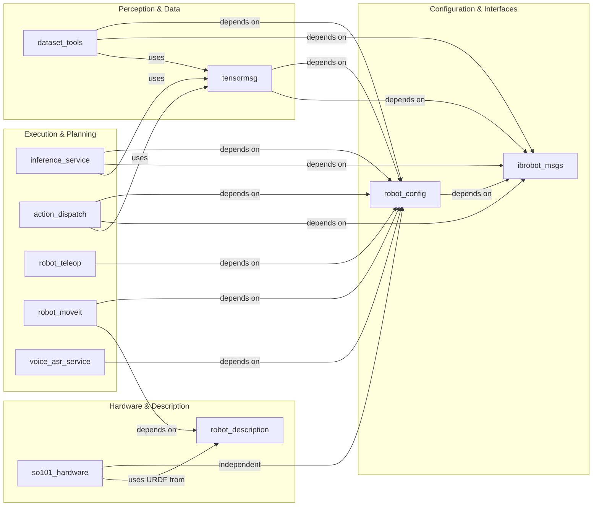
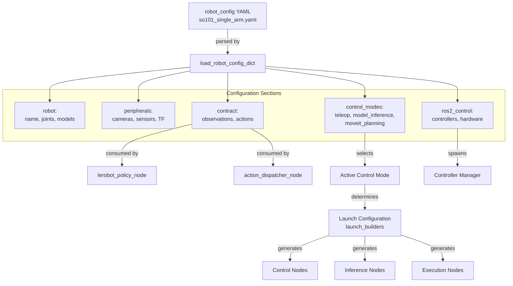
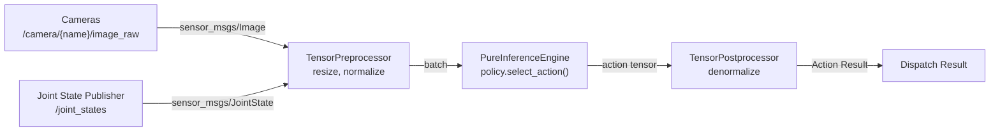
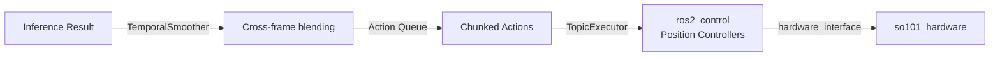

# 系统架构

相关源文件

以下文件被用作生成本 wiki 页面时的上下文：

- [README.en.md](https://atomgit.com/openeuler/IB_Robot/blob/master/README.en.md)
- [README.md](https://atomgit.com/openeuler/IB_Robot/blob/master/README.md)
- [docs/architecture.md](https://atomgit.com/openeuler/IB_Robot/blob/master/docs/architecture.md)
- [docs/ib_robot_social_skill.md](https://atomgit.com/openeuler/IB_Robot/blob/master/docs/ib_robot_social_skill.md)
- [docs/pictures/architecture.png](https://atomgit.com/openeuler/IB_Robot/blob/master/docs/pictures/architecture.png)
- [docs/pictures/openclaw_real.gif](https://atomgit.com/openeuler/IB_Robot/blob/master/docs/pictures/openclaw_real.gif)
- [docs/pictures/openclaw_sim.gif](https://atomgit.com/openeuler/IB_Robot/blob/master/docs/pictures/openclaw_sim.gif)
- [docs/roadmap.md](https://atomgit.com/openeuler/IB_Robot/blob/master/docs/roadmap.md)
- [docs/videos/openclaw_real.mp4](https://atomgit.com/openeuler/IB_Robot/blob/master/docs/videos/openclaw_real.mp4)
- [docs/videos/openclaw_sim.mp4](https://atomgit.com/openeuler/IB_Robot/blob/master/docs/videos/openclaw_sim.mp4)
- [scripts/start_rosclaw.sh](https://atomgit.com/openeuler/IB_Robot/blob/master/scripts/start_rosclaw.sh)
- [src/README.md](https://atomgit.com/openeuler/IB_Robot/blob/master/src/README.md)
- [src/action_dispatch/README.en.md](https://atomgit.com/openeuler/IB_Robot/blob/master/src/action_dispatch/README.en.md)
- [src/inference_service/inference_service/core/coordinator.py](https://atomgit.com/openeuler/IB_Robot/blob/master/src/inference_service/inference_service/core/coordinator.py)
- [src/inference_service/package.xml](https://atomgit.com/openeuler/IB_Robot/blob/master/src/inference_service/package.xml)
- [src/inference_service/tests/test_inference_coordinator.py](https://atomgit.com/openeuler/IB_Robot/blob/master/src/inference_service/tests/test_inference_coordinator.py)
- [src/robot_config/robot_config/__init__.py](https://atomgit.com/openeuler/IB_Robot/blob/master/src/robot_config/robot_config/__init__.py)
- [src/robot_config/test/test_launch_readiness.py](https://atomgit.com/openeuler/IB_Robot/blob/master/src/robot_config/test/test_launch_readiness.py)
- [src/so101_hardware/README.en.md](https://atomgit.com/openeuler/IB_Robot/blob/master/src/so101_hardware/README.en.md)
- [src/so101_hardware/README.md](https://atomgit.com/openeuler/IB_Robot/blob/master/src/so101_hardware/README.md)

本文档全面介绍 IB-Robot 系统架构，说明组件如何按层组织、数据如何在系统中流动，以及各子系统如何协同，支持从数据采集到部署的端到端具身智能开发。

详细配置规格见 **Section 5: Configuration System (robot_config)**。支撑该设计的基础架构原则见 **Section 3: Core Concepts**。各子系统详情见 **Section 7: Inference Pipeline**、**Section 8: Action Dispatch** 和 **Section 9: Data Pipeline**。

---

## 架构概览

IB-Robot 采用分层架构，每一层都为上层提供定义清晰的抽象。系统围绕 **Single Source of Truth** 原则组织，`robot_config` YAML 文件通过 contract-driven synthesis 驱动所有子系统行为。

### 系统分层

**来源：** [README.md:15-59](https://atomgit.com/openeuler/IB_Robot/blob/master/README.md#L15-L59), [README.en.md:40-58](https://atomgit.com/openeuler/IB_Robot/blob/master/README.en.md#L40-L58), [docs/architecture.md:86-177](https://atomgit.com/openeuler/IB_Robot/blob/master/docs/architecture.md#L86-L177)

---

## Package 架构与依赖

系统由职责和依赖清晰的核心 ROS 2 packages 组成。

### 核心 Package 层级

**Package 职责矩阵：**

| Package | 主要职责 | 关键 Classes/Nodes | 依赖 |
|---------|----------------------|-------------------|--------------|
| `robot_config` | 配置管理、launch 编排 | `robot.launch.py`, `launch_builders/*` | `ibrobot_msgs` |
| `ibrobot_msgs` | 接口定义 | `DispatchInfer.action`, `RecordEpisode.action` | None |
| `tensormsg` | ROS↔Tensor 协议转换 | `TensorMsgConverter` | `robot_config`, `ibrobot_msgs` |
| `inference_service` | Policy 推理，monolithic/distributed | `lerobot_policy_node`, `pure_inference_node`, `InferenceCoordinator` | `robot_config`, `tensormsg` |
| `action_dispatch` | 带 temporal smoothing 的动作执行 | `action_dispatcher_node`, `TemporalSmoother`, `TopicExecutor` | `robot_config`, `tensormsg` |
| `dataset_tools` | Episode 录制和数据集转换 | `episode_recorder`, `bag_to_lerobot` | `robot_config`, `tensormsg` |
| `robot_teleop` | 遥操作接口 | `teleop_node` (VR/Xbox/IMU/Leader) | `robot_config` |
| `robot_moveit` | 运动规划集成 | `MoveItGateway`, MoveIt configuration | `robot_config`, `robot_description` |
| `voice_asr_service` | 语音识别和命令输入 | `voice_asr_node` | `robot_config` |
| `so101_hardware` | 硬件驱动 | `SO101SystemHardware` (ros2_control plugin) | None |

**来源：** [README.md:62-102](https://atomgit.com/openeuler/IB_Robot/blob/master/README.md#L62-L102), [README.en.md:64-105](https://atomgit.com/openeuler/IB_Robot/blob/master/README.en.md#L64-L105), [docs/architecture.md:219-266](https://atomgit.com/openeuler/IB_Robot/blob/master/docs/architecture.md#L219-L266), [src/inference_service/package.xml:25-27](https://atomgit.com/openeuler/IB_Robot/blob/master/src/inference_service/package.xml#L25-L27)

---

## 配置驱动架构

整个系统由 `robot_config` YAML 文件驱动，它们是所有系统规格的 Single Source of Truth (SSOT)。

### 配置流

**关键配置组件：**

- **Launch Orchestrator:** `robot.launch.py` 加载配置，并使用 `launch_builders` 生成 nodes [src/robot_config/test/test_launch_readiness.py:26-31](https://atomgit.com/openeuler/IB_Robot/blob/master/src/robot_config/test/test_launch_readiness.py#L26-L31)。
- **Contract System:** `contract` section 定义 ROS topics 如何映射到 observations 和 actions 的 tensors [src/README.md:52-54](https://atomgit.com/openeuler/IB_Robot/blob/master/src/README.md#L52-L54)。
- **Control Modes:** 支持 `teleop`、`model_inference` 和 `moveit_planning`，可通过单一参数切换整体系统行为 [src/README.md:65-66](https://atomgit.com/openeuler/IB_Robot/blob/master/src/README.md#L65-L66)。

**来源：** [src/README.md:7-14](https://atomgit.com/openeuler/IB_Robot/blob/master/src/README.md#L7-L14), [src/robot_config/robot_config/__init__.py:10-15](https://atomgit.com/openeuler/IB_Robot/blob/master/src/robot_config/robot_config/__init__.py#L10-L15), [src/robot_config/test/test_launch_readiness.py:11-24](https://atomgit.com/openeuler/IB_Robot/blob/master/src/robot_config/test/test_launch_readiness.py#L11-L24)

---

## 数据流架构

### Observation Flow (Sensors → Inference)

**关键处理组件：**

- **TensorPreprocessor:** 负责将原始 ROS 2 sensor data 转换为 normalized PyTorch Tensors [src/inference_service/inference_service/core/coordinator.py:27-30](https://atomgit.com/openeuler/IB_Robot/blob/master/src/inference_service/inference_service/core/coordinator.py#L27-L30)。
- **PureInferenceEngine:** 无状态执行引擎，在解析后的 device 上运行实际 ML policy [src/inference_service/inference_service/core/coordinator.py:31-35](https://atomgit.com/openeuler/IB_Robot/blob/master/src/inference_service/inference_service/core/coordinator.py#L31-L35)。
- **TensorPostprocessor:** 将 action tensors 反归一化回物理控制命令 [src/inference_service/inference_service/core/coordinator.py:23-26](https://atomgit.com/openeuler/IB_Robot/blob/master/src/inference_service/inference_service/core/coordinator.py#L23-L26)。

**来源：** [src/inference_service/inference_service/core/coordinator.py:5-12](https://atomgit.com/openeuler/IB_Robot/blob/master/src/inference_service/inference_service/core/coordinator.py#L5-L12), [src/inference_service/inference_service/core/coordinator.py:91-120](https://atomgit.com/openeuler/IB_Robot/blob/master/src/inference_service/inference_service/core/coordinator.py#L91-L120)

### Action Flow (Inference → Hardware)

**关键执行组件：**

- **Temporal Smoothing:** 处理 action chunks 的跨帧混合，确保运动流畅 [src/action_dispatch/README.en.md:7](https://atomgit.com/openeuler/IB_Robot/blob/master/src/action_dispatch/README.en.md#L7)。
- **Action Chunking:** 管理多个预测未来动作的调度 [src/README.md:64](https://atomgit.com/openeuler/IB_Robot/blob/master/src/README.md#L64)。
- **Hardware Abstraction:** `ros2_control` 为仿真和真实硬件提供统一接口 [src/so101_hardware/README.md:21-31](https://atomgit.com/openeuler/IB_Robot/blob/master/src/so101_hardware/README.md#L21-L31)。

**来源：** [src/action_dispatch/README.en.md:13-42](https://atomgit.com/openeuler/IB_Robot/blob/master/src/action_dispatch/README.en.md#L13-L42), [src/action_dispatch/README.en.md:84-110](https://atomgit.com/openeuler/IB_Robot/blob/master/src/action_dispatch/README.en.md#L84-L110), [src/so101_hardware/README.md:71-81](https://atomgit.com/openeuler/IB_Robot/blob/master/src/so101_hardware/README.md#L71-L81)

---

## 推理执行模式

推理流水线支持两种执行架构：**monolithic**，单进程一体化，和 **distributed**，edge-cloud split。

### Monolithic Mode Architecture
在 Monolithic mode 中，sensor data 完全保留在单个进程的 RAM/VRAM 内。Tensors 通过 `InferenceCoordinator` 按引用传递，提供最低延迟 [src/inference_service/inference_service/core/coordinator.py:93-98](https://atomgit.com/openeuler/IB_Robot/blob/master/src/inference_service/inference_service/core/coordinator.py#L93-L98)。

### Distributed Mode Architecture
在 Distributed mode 中，系统将计算拆分到 **Device**，机器人，和 **Edge/Cloud** node，GPU server：
- **Device Node (`lerobot_policy_node`)**：运行在机器人侧，处理本地感知和命令分发 [src/README.md:58-60](https://atomgit.com/openeuler/IB_Robot/blob/master/src/README.md#L58-L60)。
- **Edge/Cloud Node (`pure_inference_node`)**：订阅预处理 tensor batches，执行高性能 GPU inference，并返回结果 [src/README.md:58-60](https://atomgit.com/openeuler/IB_Robot/blob/master/src/README.md#L58-L60)。

**来源：** [README.md:28](https://atomgit.com/openeuler/IB_Robot/blob/master/README.md#L28), [src/inference_service/inference_service/core/coordinator.py:10-12](https://atomgit.com/openeuler/IB_Robot/blob/master/src/inference_service/inference_service/core/coordinator.py#L10-L12), [src/README.md:56-60](https://atomgit.com/openeuler/IB_Robot/blob/master/src/README.md#L56-L60)

---

## 总结：关键架构模式

### 1. Single Source of Truth (SSOT)
`robot_config` package 集中管理 hardware、model 和 contract definitions。这确保训练数据和部署参数始终同步 [src/README.md:9-14](https://atomgit.com/openeuler/IB_Robot/blob/master/src/README.md#L9-L14)。

### 2. Contract-Driven Protocol
`tensormsg` package 处理 `ros_msg` 与 `tensor` 之间的双向转换，并通过 Contract 机制保证数据类型安全和一致性 [README.md:51-52](https://atomgit.com/openeuler/IB_Robot/blob/master/README.md#L51-L52), [docs/architecture.md:205-208](https://atomgit.com/openeuler/IB_Robot/blob/master/docs/architecture.md#L205-L208)。

### 3. Dual-Mode Control
架构同时支持端到端 neural policy control，ACT/Diffusion，和传统 motion planning，MoveIt 2，使机器人可以在高频响应式控制和精确运动学执行之间切换 [README.md:27](https://atomgit.com/openeuler/IB_Robot/blob/master/README.md#L27), [src/README.md:65-66](https://atomgit.com/openeuler/IB_Robot/blob/master/src/README.md#L65-L66)。

### 4. Distributed Synergy
通过同时支持 monolithic 和 distributed execution modes，IB-Robot 可以适配多种硬件约束，从高端工作站到 openEuler 或 OpenHarmony 等低功耗 edge boards [README.md:32-39](https://atomgit.com/openeuler/IB_Robot/blob/master/README.md#L32-L39)。

**来源：** [README.md:15-61](https://atomgit.com/openeuler/IB_Robot/blob/master/README.md#L15-L61), [docs/architecture.md:179-184](https://atomgit.com/openeuler/IB_Robot/blob/master/docs/architecture.md#L179-L184), [src/README.md:3-14](https://atomgit.com/openeuler/IB_Robot/blob/master/src/README.md#L3-L14)

