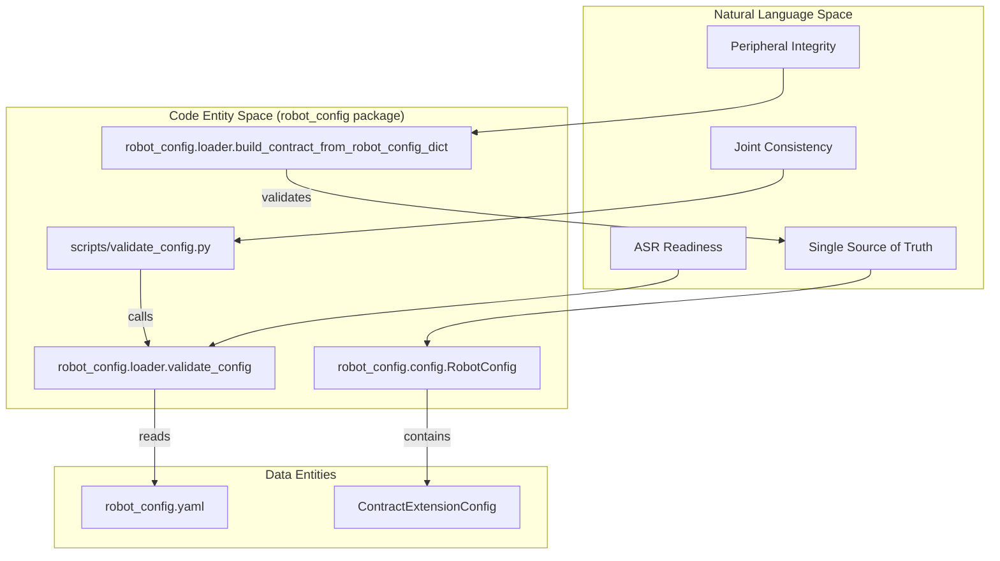
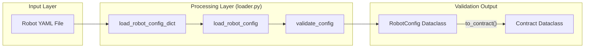

# 配置验证

<details>
<summary>相关源文件</summary>

生成此 wiki 页面时使用了以下文件作为上下文：

- [.agents/skills/README.md](https://atomgit.com/openeuler/IB_Robot/blob/master/.agents/skills/README.md)
- [.agents/skills/ibrobot-lerobot-patch/SKILL.md](https://atomgit.com/openeuler/IB_Robot/blob/master/.agents/skills/ibrobot-lerobot-patch/SKILL.md)
- [.agents/skills/ibrobot-lerobot-patch/scripts/export_lerobot_patch.py](https://atomgit.com/openeuler/IB_Robot/blob/master/.agents/skills/ibrobot-lerobot-patch/scripts/export_lerobot_patch.py)
- [.agents/skills/intro/SKILL.md](https://atomgit.com/openeuler/IB_Robot/blob/master/.agents/skills/intro/SKILL.md)
- [.agents/skills/intro/scripts/intro.py](https://atomgit.com/openeuler/IB_Robot/blob/master/.agents/skills/intro/scripts/intro.py)
- [.vscode/settings.json](https://atomgit.com/openeuler/IB_Robot/blob/master/.vscode/settings.json)
- [scripts/validate_config.py](https://atomgit.com/openeuler/IB_Robot/blob/master/scripts/validate_config.py)
- [src/robot_config/robot_config/config.py](https://atomgit.com/openeuler/IB_Robot/blob/master/src/robot_config/robot_config/config.py)
- [src/robot_config/test/test_config.py](https://atomgit.com/openeuler/IB_Robot/blob/master/src/robot_config/test/test_config.py)
- [src/voice_asr_service/README.md](https://atomgit.com/openeuler/IB_Robot/blob/master/src/voice_asr_service/README.md)
- [src/voice_asr_service/voice_asr_service/asr_inference_module.py](https://atomgit.com/openeuler/IB_Robot/blob/master/src/voice_asr_service/voice_asr_service/asr_inference_module.py)
- [src/voice_asr_service/voice_asr_service/audio_capture_module.py](https://atomgit.com/openeuler/IB_Robot/blob/master/src/voice_asr_service/voice_asr_service/audio_capture_module.py)
- [src/voice_asr_service/voice_asr_service/defaults.py](https://atomgit.com/openeuler/IB_Robot/blob/master/src/voice_asr_service/voice_asr_service/defaults.py)
- [src/voice_asr_service/voice_asr_service/model_manager.py](https://atomgit.com/openeuler/IB_Robot/blob/master/src/voice_asr_service/voice_asr_service/model_manager.py)
- [src/voice_asr_service/voice_asr_service/vad_module.py](https://atomgit.com/openeuler/IB_Robot/blob/master/src/voice_asr_service/voice_asr_service/vad_module.py)
- [src/voice_asr_service/voice_asr_service/voice_asr_node.py](https://atomgit.com/openeuler/IB_Robot/blob/master/src/voice_asr_service/voice_asr_service/voice_asr_node.py)

</details>


本文记录 IB-Robot 系统中的配置验证机制，重点介绍 `validate_config.py` 脚本，以及嵌入 `robot_config` 包内的架构验证逻辑。这些工具确保关节定义、外设引用和模型配置在 robot_config YAML（单一事实源）、`ros2_control` 硬件配置和运行时契约之间保持同步。

---

## 概述

IB-Robot 配置系统遵循 DRY（Don't Repeat Yourself）原则，以 `robot_config` YAML 作为权威来源。不过，多个领域之间仍必须保持一致：

1.  **关节一致性**：确保 YAML 配置中的关节列表匹配 `ros2_control` 插件的硬件需求。
2.  **架构有效性**：确保观测引用有效外设（例如相机），并在省略外设时提供 topic 等必填字段。
3.  **ASR 配置**：验证 Voice ASR 设置，包括模型路径和设备索引，避免初始化阶段出现运行时失败。

**来源：** [src/robot_config/robot_config/config.py:134-150](https://atomgit.com/openeuler/IB_Robot/blob/master/src/robot_config/robot_config/config.py#L134-L150)，[src/robot_config/robot_config/loader.py:20-26](https://atomgit.com/openeuler/IB_Robot/blob/master/src/robot_config/robot_config/loader.py#L20-L26)

---

## 验证架构

系统采用多层验证方式：用于 schema 约束的 typed dataclasses、loader 中的专用验证函数，以及用于自动检查的 CLI 脚本。

### 配置验证流程

下图将配置需求的 “Natural Language Space” 与验证实现的 “Code Entity Space” 连接起来。



**来源：** [src/robot_config/robot_config/loader.py:20-26](https://atomgit.com/openeuler/IB_Robot/blob/master/src/robot_config/robot_config/loader.py#L20-L26)，[src/robot_config/robot_config/config.py:134-150](https://atomgit.com/openeuler/IB_Robot/blob/master/src/robot_config/robot_config/config.py#L134-L150)，[src/robot_config/test/test_config.py:20-25](https://atomgit.com/openeuler/IB_Robot/blob/master/src/robot_config/test/test_config.py#L20-L25)

---

## 契约完整性检查

系统在从 YAML 配置合成 `Contract` 时执行严格检查。该逻辑主要由 `build_contract_from_robot_config_dict` 和 `RobotConfig.to_contract()` 方法处理。

### 验证逻辑

验证器会执行以下检查：
1.  **外设解析**：如果观测引用了 `peripheral`，系统会尝试在 `peripherals` 列表中解析它。若引用相机但未找到，会记录 warning，并保留空图像元数据 [src/robot_config/robot_config/config.py:191-199](https://atomgit.com/openeuler/IB_Robot/blob/master/src/robot_config/robot_config/config.py#L191-L199)，[src/robot_config/test/test_config.py:139-161](https://atomgit.com/openeuler/IB_Robot/blob/master/src/robot_config/test/test_config.py#L139-L161)。
2.  **Topic 要求**：对于未关联外设的观测，必须显式指定 ROS `topic`，否则抛出 `ValueError` [src/robot_config/test/test_config.py:183-201](https://atomgit.com/openeuler/IB_Robot/blob/master/src/robot_config/test/test_config.py#L183-L201)。
3.  **图像元数据默认值**：如果使用相机外设，但契约中未提供具体 resize 尺寸，系统会自动回退到相机原生宽高 [src/robot_config/robot_config/config.py:195-196](https://atomgit.com/openeuler/IB_Robot/blob/master/src/robot_config/robot_config/config.py#L195-L196)，[src/robot_config/test/test_config.py:108-137](https://atomgit.com/openeuler/IB_Robot/blob/master/src/robot_config/test/test_config.py#L108-L137)。
4.  **安全行为**：动作安全行为会被验证为 `zeros` 或 `hold`，无效时默认使用 `zeros` [src/robot_config/robot_config/config.py:215-217](https://atomgit.com/openeuler/IB_Robot/blob/master/src/robot_config/robot_config/config.py#L215-L217)。

**来源：** [src/robot_config/robot_config/config.py:163-225](https://atomgit.com/openeuler/IB_Robot/blob/master/src/robot_config/robot_config/config.py#L163-L225)，[src/robot_config/test/test_config.py:87-106](https://atomgit.com/openeuler/IB_Robot/blob/master/src/robot_config/test/test_config.py#L87-L106)

---

## Voice ASR 验证

Voice ASR 系统涉及外部模型文件和硬件设备（麦克风），因此会执行专门验证，保证节点可成功初始化。

### ASR 验证标准
*   **模型路径解析**：`model_manager.py` 中的 `resolve_model_assets` 工具确保模型路径可相对工作空间正确解析。它检查 streaming 模型所需的 `encoder*.onnx`，或 offline 模型所需的 `model*.onnx` 等模式是否存在 [src/voice_asr_service/voice_asr_service/model_manager.py:35-40](https://atomgit.com/openeuler/IB_Robot/blob/master/src/voice_asr_service/voice_asr_service/model_manager.py#L35-L40)，[src/voice_asr_service/voice_asr_service/model_manager.py:180-209](https://atomgit.com/openeuler/IB_Robot/blob/master/src/voice_asr_service/voice_asr_service/model_manager.py#L180-L209)。
*   **初始化失败策略**：`VoiceASRConfig` 中的 `exit_on_init_failure` 标志决定 ASR 引擎启动失败时节点应退出，还是停留在错误状态 [src/robot_config/robot_config/config.py:130](https://atomgit.com/openeuler/IB_Robot/blob/master/src/robot_config/robot_config/config.py#L130)，[src/voice_asr_service/voice_asr_service/voice_asr_node.py:157](https://atomgit.com/openeuler/IB_Robot/blob/master/src/voice_asr_service/voice_asr_service/voice_asr_node.py#L157)。
*   **设备索引**：`AudioCaptureModule` 验证音频采集后端的 `device_index`。若指定设备不可用，节点会通过状态心跳和状态机转换报告 `IDLE` 或 `ERROR` 状态 [src/robot_config/robot_config/config.py:128](https://atomgit.com/openeuler/IB_Robot/blob/master/src/robot_config/robot_config/config.py#L128)，[src/voice_asr_service/voice_asr_service/voice_asr_node.py:61-70](https://atomgit.com/openeuler/IB_Robot/blob/master/src/voice_asr_service/voice_asr_service/voice_asr_node.py#L61-L70)，[src/voice_asr_service/voice_asr_service/voice_asr_node.py:120-126](https://atomgit.com/openeuler/IB_Robot/blob/master/src/voice_asr_service/voice_asr_service/voice_asr_node.py#L120-L126)。
*   **模型兼容性**：`VoiceASRNode` 强制实时麦克风识别使用支持 streaming 的模型（Zipformer/Transducer），offline 文件识别则可以使用 Paraformer 模型 [src/voice_asr_service/voice_asr_service/voice_asr_node.py:103-118](https://atomgit.com/openeuler/IB_Robot/blob/master/src/voice_asr_service/voice_asr_service/voice_asr_node.py#L103-L118)，[src/voice_asr_service/voice_asr_service/model_manager.py:81-88](https://atomgit.com/openeuler/IB_Robot/blob/master/src/voice_asr_service/voice_asr_service/model_manager.py#L81-L88)。

**来源：** [src/robot_config/robot_config/config.py:109-131](https://atomgit.com/openeuler/IB_Robot/blob/master/src/robot_config/robot_config/config.py#L109-L131)，[src/voice_asr_service/voice_asr_service/voice_asr_node.py:92-101](https://atomgit.com/openeuler/IB_Robot/blob/master/src/voice_asr_service/voice_asr_service/voice_asr_node.py#L92-L101)，[src/voice_asr_service/voice_asr_service/model_manager.py:42-61](https://atomgit.com/openeuler/IB_Robot/blob/master/src/voice_asr_service/voice_asr_service/model_manager.py#L42-L61)

---

## 自动化测试与 CI

`test_config.py` 测试套件是一个持续验证层，用于确保任何 YAML schema 变更都不会破坏配置加载器。

### 关键测试用例

| 测试函数 | 验证目标 |
| :--- | :--- |
| `test_load_single_arm_config` | 验证 SO-101 配置的完整解析，包括硬件插件、相机和 Voice ASR 默认值 [src/robot_config/test/test_config.py:35-69](https://atomgit.com/openeuler/IB_Robot/blob/master/src/robot_config/test/test_config.py#L35-L69)。 |
| `test_dict_contract_builder_matches_typed_contract_shape` | 确保基于字典的 loader 生成的契约结构与 typed dataclass loader 一致 [src/robot_config/test/test_config.py:87-106](https://atomgit.com/openeuler/IB_Robot/blob/master/src/robot_config/test/test_config.py#L87-L106)。 |
| `test_dict_contract_builder_requires_topic_without_peripheral` | 强制非外设观测必须定义 topic [src/robot_config/test/test_config.py:183-201](https://atomgit.com/openeuler/IB_Robot/blob/master/src/robot_config/test/test_config.py#L183-L201)。 |

### 配置加载流程



**来源：** [src/robot_config/robot_config/loader.py:20-26](https://atomgit.com/openeuler/IB_Robot/blob/master/src/robot_config/robot_config/loader.py#L20-L26)，[src/robot_config/test/test_config.py:93-97](https://atomgit.com/openeuler/IB_Robot/blob/master/src/robot_config/test/test_config.py#L93-L97)

---

## CLI 验证工具

`validate_config.py` 脚本为开发者提供命令行接口，可在部署前验证 YAML 文件。

### 执行
脚本会对配置执行 dry-run 加载，并报告 schema 不匹配或缺少文件引用等问题。它已集成到工作空间中，可通过 `colcon build` 安装，并可作为标准 ROS 2 节点或独立脚本运行。

```bash
# Example usage
ros2 run robot_config validate_config.py src/robot_config/config/robots/so101_single_arm.yaml
```

**来源：** [src/robot_config/test/test_config.py:25](https://atomgit.com/openeuler/IB_Robot/blob/master/src/robot_config/test/test_config.py#L25)，[scripts/validate_config.py:1-65](https://atomgit.com/openeuler/IB_Robot/blob/master/scripts/validate_config.py#L1-L65)

