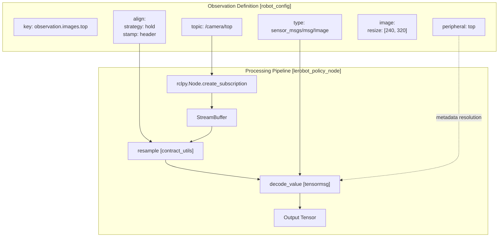
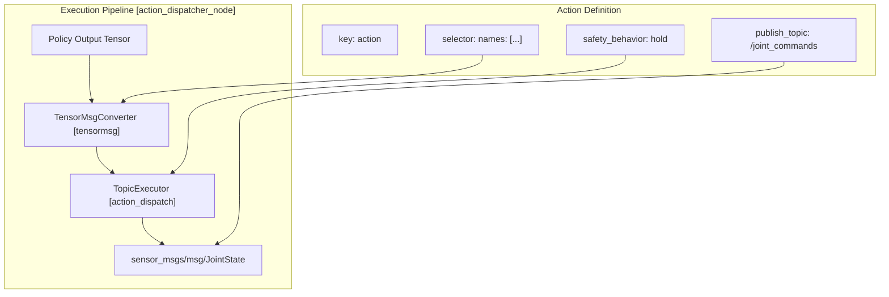
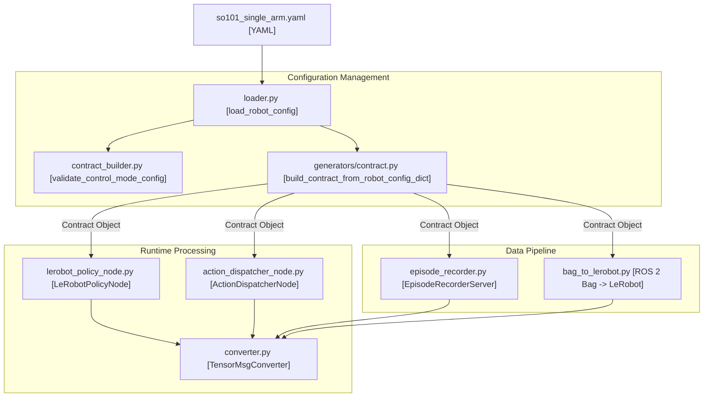

# 契约定义

<details>
<summary>相关源文件</summary>

以下文件被用作生成本 wiki 页面时的上下文：

- [src/action_dispatch/action_dispatch/action_dispatcher_node.py](https://atomgit.com/openeuler/IB_Robot/blob/master/src/action_dispatch/action_dispatch/action_dispatcher_node.py)
- [src/dataset_tools/dataset_tools/bag_to_lerobot.py](https://atomgit.com/openeuler/IB_Robot/blob/master/src/dataset_tools/dataset_tools/bag_to_lerobot.py)
- [src/dataset_tools/dataset_tools/episode_recorder.py](https://atomgit.com/openeuler/IB_Robot/blob/master/src/dataset_tools/dataset_tools/episode_recorder.py)
- [src/inference_service/inference_service/lerobot_policy_node.py](https://atomgit.com/openeuler/IB_Robot/blob/master/src/inference_service/inference_service/lerobot_policy_node.py)
- [src/robot_config/config/robots/so101_single_arm.yaml](https://atomgit.com/openeuler/IB_Robot/blob/master/src/robot_config/config/robots/so101_single_arm.yaml)
- [src/robot_config/robot_config/contract_builder.py](https://atomgit.com/openeuler/IB_Robot/blob/master/src/robot_config/robot_config/contract_builder.py)
- [src/robot_config/robot_config/contract_utils.py](https://atomgit.com/openeuler/IB_Robot/blob/master/src/robot_config/robot_config/contract_utils.py)
- [src/robot_config/robot_config/generators/__init__.py](https://atomgit.com/openeuler/IB_Robot/blob/master/src/robot_config/robot_config/generators/__init__.py)
- [src/robot_config/robot_config/generators/contract.py](https://atomgit.com/openeuler/IB_Robot/blob/master/src/robot_config/robot_config/generators/contract.py)
- [src/robot_config/robot_config/launch_builders/execution.py](https://atomgit.com/openeuler/IB_Robot/blob/master/src/robot_config/robot_config/launch_builders/execution.py)
- [src/robot_config/robot_config/launch_builders/recording.py](https://atomgit.com/openeuler/IB_Robot/blob/master/src/robot_config/robot_config/launch_builders/recording.py)

</details>


本页记录 `robot_config` YAML 文件中的 **Contract** section。该 section 是定义 ROS topics 如何映射到 ML model inputs，observations，和 outputs，actions，的 Single Source of Truth。Contract 确保数据采集、数据集转换和推理部署之间保持一致。

更广泛的 `robot_config` YAML 结构见 [机器人配置文件](./robot_configuration_files.md)。Contract 引用的 camera 和 sensor peripheral definitions 见 [外设配置](./peripheral_configuration.md)。

---

## 概览

Contract 是声明式规格，定义：

1. **Observations**：哪些 ROS topics 向 ML model 提供输入，例如 camera images、joint states。
2. **Actions**：哪些 ROS topics 接收 ML model 输出，例如 joint position commands。
3. **Recording Parameters**：数据采集的 sample rate 和 episode duration。
4. **Alignment Strategies**：如何对多模态 sensor data 做时间同步。
5. **QoS Policies**：用于可靠数据传输的 ROS 2 Quality-of-Service settings。

Contract 被三个关键系统组件消费：
- `episode_recorder`：数据采集期间为所有 observation topics 创建 subscriptions [src/dataset_tools/dataset_tools/episode_recorder.py:21-25](https://atomgit.com/openeuler/IB_Robot/blob/master/src/dataset_tools/dataset_tools/episode_recorder.py#L21-L25)。
- `bag_to_lerobot`：使用 contract specs 将 ROS 2 bag messages 解码为 LeRobot dataset format [src/dataset_tools/dataset_tools/bag_to_lerobot.py:12-18](https://atomgit.com/openeuler/IB_Robot/blob/master/src/dataset_tools/dataset_tools/bag_to_lerobot.py#L12-L18)。
- `lerobot_policy_node`：根据 model 的 `config.json` requirements 和 system contract，动态过滤并订阅 observations [src/inference_service/inference_service/lerobot_policy_node.py:160-169](https://atomgit.com/openeuler/IB_Robot/blob/master/src/inference_service/inference_service/lerobot_policy_node.py#L160-L169)。

来源：[src/dataset_tools/dataset_tools/episode_recorder.py:8-17](https://atomgit.com/openeuler/IB_Robot/blob/master/src/dataset_tools/dataset_tools/episode_recorder.py#L8-L17), [src/dataset_tools/dataset_tools/bag_to_lerobot.py:94-113](https://atomgit.com/openeuler/IB_Robot/blob/master/src/dataset_tools/dataset_tools/bag_to_lerobot.py#L94-L113), [src/inference_service/inference_service/lerobot_policy_node.py:148-169](https://atomgit.com/openeuler/IB_Robot/blob/master/src/inference_service/inference_service/lerobot_policy_node.py#L148-L169)

---

## Contract 结构

contract section 位于 `robot_config` YAML 文件内部。它定义 policy execution 的运行边界。

```yaml
robot:
  contract:
    rate_hz: 20                    # Recording/inference frequency
    max_duration_s: 30.0           # Maximum episode duration
    
    observations:
      - key: observation.images.top
        topic: /camera/top
        type: sensor_msgs/msg/Image
        peripheral: top
        align:
          strategy: hold
          stamp: header
    
    actions:
      - key: action
        publish_topic: /joint_commands
        type: sensor_msgs/msg/JointState
        safety_behavior: hold
```

### 核心参数

`Contract` dataclass 封装顶层配置 [src/robot_config/robot_config/contract_utils.py:83-96](https://atomgit.com/openeuler/IB_Robot/blob/master/src/robot_config/robot_config/contract_utils.py#L83-L96)。

| 字段 | 类型 | 说明 |
|-------|------|-------------|
| `rate_hz` | float | Policy 的目标控制/采样频率 [src/robot_config/robot_config/contract_utils.py:88](https://atomgit.com/openeuler/IB_Robot/blob/master/src/robot_config/robot_config/contract_utils.py#L88)。 |
| `max_duration_s` | float | Episode recording 的 timeout [src/robot_config/robot_config/contract_utils.py:89](https://atomgit.com/openeuler/IB_Robot/blob/master/src/robot_config/robot_config/contract_utils.py#L89)。 |
| `timestamp_source` | string | 对 “receive” 或 “header” timestamps 的全局偏好 [src/robot_config/robot_config/contract_utils.py:95](https://atomgit.com/openeuler/IB_Robot/blob/master/src/robot_config/robot_config/contract_utils.py#L95)。 |

来源：[src/robot_config/robot_config/contract_utils.py:83-96](https://atomgit.com/openeuler/IB_Robot/blob/master/src/robot_config/robot_config/contract_utils.py#L83-L96), [src/robot_config/robot_config/generators/contract.py:108-120](https://atomgit.com/openeuler/IB_Robot/blob/master/src/robot_config/robot_config/generators/contract.py#L108-L120)

---

## Observations Specification

Observations 描述输入流。系统使用 `SpecView` 提供这些 streams 的归一化 runtime view [src/robot_config/robot_config/contract_utils.py:112-130](https://atomgit.com/openeuler/IB_Robot/blob/master/src/robot_config/robot_config/contract_utils.py#L112-L130)。

Title: Observation Data Flow


来源：[src/robot_config/robot_config/contract_utils.py:43-57](https://atomgit.com/openeuler/IB_Robot/blob/master/src/robot_config/robot_config/contract_utils.py#L43-L57), [src/robot_config/robot_config/contract_utils.py:156-190](https://atomgit.com/openeuler/IB_Robot/blob/master/src/robot_config/robot_config/contract_utils.py#L156-L190), [src/inference_service/inference_service/lerobot_policy_node.py:117-123](https://atomgit.com/openeuler/IB_Robot/blob/master/src/inference_service/inference_service/lerobot_policy_node.py#L117-L123)

### Peripheral References

`peripheral` field 允许 observations 从 YAML 的 `peripherals` section 继承 hardware specs，width、height、fps [src/robot_config/robot_config/generators/contract.py:123-135](https://atomgit.com/openeuler/IB_Robot/blob/master/src/robot_config/robot_config/generators/contract.py#L123-L135)。`_resolve_peripheral_references` 函数会根据被引用 camera 的能力自动填充 `image.resize` 和 `image.encoding` [src/robot_config/robot_config/generators/contract.py:151-170](https://atomgit.com/openeuler/IB_Robot/blob/master/src/robot_config/robot_config/generators/contract.py#L151-L170)。

### Alignment Strategies

`AlignSpec` 定义 resampling 期间如何同步 multi-modal data [src/robot_config/robot_config/contract_utils.py:29-40](https://atomgit.com/openeuler/IB_Robot/blob/master/src/robot_config/robot_config/contract_utils.py#L29-L40)：

| Strategy | 行为 |
|----------|----------|
| `hold` | 默认，使用 target timestamp 前收到的最新 message [src/robot_config/robot_config/contract_utils.py:37](https://atomgit.com/openeuler/IB_Robot/blob/master/src/robot_config/robot_config/contract_utils.py#L37)。 |
| `asof` | 如果在 `tol_ms` tolerance 内，则使用 target timestamp 对应的 message [src/robot_config/robot_config/contract_utils.py:38](https://atomgit.com/openeuler/IB_Robot/blob/master/src/robot_config/robot_config/contract_utils.py#L38)。 |
| `drop` | 如果 exact timestamp 没有可用 message，则不提供值。 |

来源：[src/robot_config/robot_config/contract_utils.py:29-40](https://atomgit.com/openeuler/IB_Robot/blob/master/src/robot_config/robot_config/contract_utils.py#L29-L40), [src/robot_config/robot_config/contract_utils.py:99-106](https://atomgit.com/openeuler/IB_Robot/blob/master/src/robot_config/robot_config/contract_utils.py#L99-L106)

---

## Actions Specification

Actions 定义从 model output tensors 到 ROS commands 的映射。

Title: Action Dispatch Flow


来源：[src/robot_config/robot_config/contract_utils.py:59-70](https://atomgit.com/openeuler/IB_Robot/blob/master/src/robot_config/robot_config/contract_utils.py#L59-L70), [src/action_dispatch/action_dispatch/action_dispatcher_node.py:153-156](https://atomgit.com/openeuler/IB_Robot/blob/master/src/action_dispatch/action_dispatch/action_dispatcher_node.py#L153-L156), [src/action_dispatch/action_dispatch/action_dispatcher_node.py:125-135](https://atomgit.com/openeuler/IB_Robot/blob/master/src/action_dispatch/action_dispatch/action_dispatcher_node.py#L125-L135)

### Action Fields Reference

| 字段 | 类型 | 说明 |
|-------|------|-------------|
| `selector.names` | list | 与 tensor dimensions 对应的 joint names 列表 [src/robot_config/robot_config/contract_utils.py:65](https://atomgit.com/openeuler/IB_Robot/blob/master/src/robot_config/robot_config/contract_utils.py#L65)。 |
| `from_tensor.clamp` | list | 发布前裁剪 tensor 的可选 [min, max] values [src/robot_config/robot_config/contract_utils.py:194-196](https://atomgit.com/openeuler/IB_Robot/blob/master/src/robot_config/robot_config/contract_utils.py#L194-L196)。 |
| `safety_behavior` | string | 当 action queue 为空时的行为：`zeros` 或 `hold`，保留上一个有效 command [src/robot_config/robot_config/contract_utils.py:69](https://atomgit.com/openeuler/IB_Robot/blob/master/src/robot_config/robot_config/contract_utils.py#L69)。 |

来源：[src/robot_config/robot_config/contract_utils.py:59-70](https://atomgit.com/openeuler/IB_Robot/blob/master/src/robot_config/robot_config/contract_utils.py#L59-L70), [src/robot_config/robot_config/contract_utils.py:191-211](https://atomgit.com/openeuler/IB_Robot/blob/master/src/robot_config/robot_config/contract_utils.py#L191-L211)

---

## Contract 验证

为防止 runtime failures，系统会在 node initialization 期间验证 contract。`validate_control_mode_config` 函数执行多项检查 [src/robot_config/robot_config/contract_builder.py:12-24](https://atomgit.com/openeuler/IB_Robot/blob/master/src/robot_config/robot_config/contract_builder.py#L12-L24)：

1. **Model/Contract Alignment**：确保 control mode 引用的 model 在 contract 中有已定义 observations [src/robot_config/robot_config/contract_builder.py:49-57](https://atomgit.com/openeuler/IB_Robot/blob/master/src/robot_config/robot_config/contract_builder.py#L49-L57)。
2. **Peripheral Check**：验证 contract 中使用的任何 `peripheral` name 都实际存在于 `peripherals` list 中 [src/robot_config/robot_config/contract_builder.py:59-71](https://atomgit.com/openeuler/IB_Robot/blob/master/src/robot_config/robot_config/contract_builder.py#L59-L71)。
3. **Controller Mapping**：如果 control mode 使用的 ROS2 controller 未在 hardware section 中定义，则给出 warning [src/robot_config/robot_config/contract_builder.py:82-92](https://atomgit.com/openeuler/IB_Robot/blob/master/src/robot_config/robot_config/contract_builder.py#L82-L92)。

来源：[src/robot_config/robot_config/contract_builder.py:12-106](https://atomgit.com/openeuler/IB_Robot/blob/master/src/robot_config/robot_config/contract_builder.py#L12-L106), [src/robot_config/robot_config/generators/contract.py:173-185](https://atomgit.com/openeuler/IB_Robot/blob/master/src/robot_config/robot_config/generators/contract.py#L173-L185)

---

## 数据流总结

下图关联系统配置与负责处理 contract 的代码实体。

Title: Contract Entity Mapping


来源：[src/robot_config/robot_config/loader.py:1-15](https://atomgit.com/openeuler/IB_Robot/blob/master/src/robot_config/robot_config/loader.py#L1-L15), [src/robot_config/robot_config/generators/contract.py:197-198](https://atomgit.com/openeuler/IB_Robot/blob/master/src/robot_config/robot_config/generators/contract.py#L197-L198), [src/inference_service/inference_service/lerobot_policy_node.py:148-158](https://atomgit.com/openeuler/IB_Robot/blob/master/src/inference_service/inference_service/lerobot_policy_node.py#L148-L158), [src/action_dispatch/action_dispatch/action_dispatcher_node.py:125-135](https://atomgit.com/openeuler/IB_Robot/blob/master/src/action_dispatch/action_dispatch/action_dispatcher_node.py#L125-L135)

