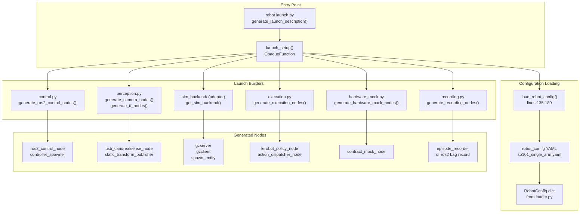
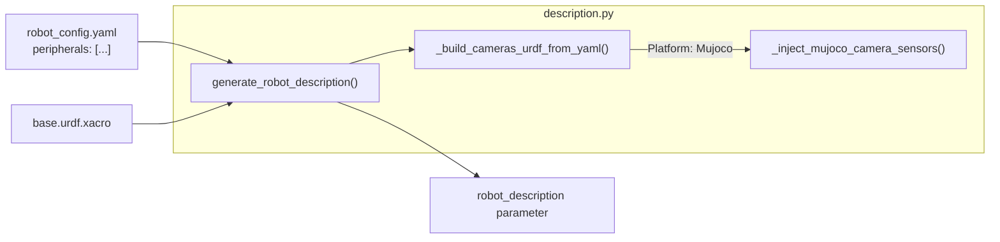

# 启动系统

相关源文件

生成此 wiki 页面时使用了以下文件作为上下文：

- [src/hardware_mock/README.md](https://atomgit.com/openeuler/IB_Robot/blob/master/src/hardware_mock/README.md)
- [src/hardware_mock/hardware_mock/contract_mock_node.py](https://atomgit.com/openeuler/IB_Robot/blob/master/src/hardware_mock/hardware_mock/contract_mock_node.py)
- [src/hardware_mock/hardware_mock/contract_plan.py](https://atomgit.com/openeuler/IB_Robot/blob/master/src/hardware_mock/hardware_mock/contract_plan.py)
- [src/hardware_mock/hardware_mock/image_sources.py](https://atomgit.com/openeuler/IB_Robot/blob/master/src/hardware_mock/hardware_mock/image_sources.py)
- [src/hardware_mock/hardware_mock/joint_model.py](https://atomgit.com/openeuler/IB_Robot/blob/master/src/hardware_mock/hardware_mock/joint_model.py)
- [src/hardware_mock/hardware_mock/type_registry.py](https://atomgit.com/openeuler/IB_Robot/blob/master/src/hardware_mock/hardware_mock/type_registry.py)
- [src/robot_config/config/robots/so101_single_arm_rgbd.yaml](https://atomgit.com/openeuler/IB_Robot/blob/master/src/robot_config/config/robots/so101_single_arm_rgbd.yaml)
- [src/robot_config/launch/robot.launch.py](https://atomgit.com/openeuler/IB_Robot/blob/master/src/robot_config/launch/robot.launch.py)
- [src/robot_config/robot_config/launch_builders/__init__.py](https://atomgit.com/openeuler/IB_Robot/blob/master/src/robot_config/robot_config/launch_builders/__init__.py)
- [src/robot_config/robot_config/launch_builders/control.py](https://atomgit.com/openeuler/IB_Robot/blob/master/src/robot_config/robot_config/launch_builders/control.py)
- [src/robot_config/robot_config/launch_builders/description.py](https://atomgit.com/openeuler/IB_Robot/blob/master/src/robot_config/robot_config/launch_builders/description.py)
- [src/robot_config/robot_config/launch_builders/hardware_mock.py](https://atomgit.com/openeuler/IB_Robot/blob/master/src/robot_config/robot_config/launch_builders/hardware_mock.py)
- [src/robot_config/robot_config/launch_builders/perception.py](https://atomgit.com/openeuler/IB_Robot/blob/master/src/robot_config/robot_config/launch_builders/perception.py)
- [src/robot_config/robot_config/launch_builders/sim_backend/camera_presets.py](https://atomgit.com/openeuler/IB_Robot/blob/master/src/robot_config/robot_config/launch_builders/sim_backend/camera_presets.py)
- [src/robot_config/robot_config/launch_builders/sim_backend/mujoco_adapter.py](https://atomgit.com/openeuler/IB_Robot/blob/master/src/robot_config/robot_config/launch_builders/sim_backend/mujoco_adapter.py)
- [src/robot_description/urdf/lerobot/so101/so101_gazebo.xacro](https://atomgit.com/openeuler/IB_Robot/blob/master/src/robot_description/urdf/lerobot/so101/so101_gazebo.xacro)

启动系统是一个编排层，会根据配置动态生成并启动机器人运行所需的所有 ROS2 节点。它加载 `robot_config` YAML 文件，并调用专用 builder 模块为感知、控制、执行和其他子系统创建节点。系统支持多种控制模式，并根据运行时参数有条件地生成节点。

关于 robot_config YAML 结构本身，请参见 [Robot Configuration Files](./robot_configuration_files.md)。关于契约定义详情，请参见 [Contract Definition](./contract_definition.md)。关于外设配置，请参见 [Peripheral Configuration](./peripheral_configuration.md)。

---

## 架构概述

启动系统采用 **builder pattern**，由中心编排器（[src/robot_config/launch/robot.launch.py:132-135](https://atomgit.com/openeuler/IB_Robot/blob/master/src/robot_config/launch/robot.launch.py#L132-L135)）加载配置，并将节点生成委托给专用 builder 模块。每个 builder 负责一个特定子系统（例如相机、控制器、推理），并返回一组 launch actions。

### 启动系统组件

来源：[src/robot_config/launch/robot.launch.py:101-126](https://atomgit.com/openeuler/IB_Robot/blob/master/src/robot_config/launch/robot.launch.py#L101-L126)，[src/robot_config/robot_config/launch_builders/control.py:66-79](https://atomgit.com/openeuler/IB_Robot/blob/master/src/robot_config/robot_config/launch_builders/control.py#L66-L79)，[src/robot_config/robot_config/launch_builders/perception.py:19-28](https://atomgit.com/openeuler/IB_Robot/blob/master/src/robot_config/robot_config/launch_builders/perception.py#L19-L28)，[src/robot_config/robot_config/launch_builders/hardware_mock.py:95-101](https://atomgit.com/openeuler/IB_Robot/blob/master/src/robot_config/robot_config/launch_builders/hardware_mock.py#L95-L101)

---

## 主启动文件：robot.launch.py

主启动文件 `robot.launch.py` 位于 [src/robot_config/launch/robot.launch.py](https://atomgit.com/openeuler/IB_Robot/blob/master/src/robot_config/launch/robot.launch.py)，是启动整个机器人系统的单一入口。

### 启动参数

| 参数 | 默认值 | 说明 |
|----------|---------|-------------|
| `robot_config` | `test_cam` | 机器人配置名称（从 `config/robots/<name>.yaml` 加载） |
| `config_path` | `''` | 可选的完整配置文件路径（覆盖 `robot_config`） |
| `use_sim` | `false` | 启用仿真模式（Gazebo/MuJoCo） |
| `use_mock` | `false` | 启用契约驱动的硬件 mock 模式 |
| `auto_start_controllers` | `true` | 自动生成控制器 |
| `control_mode` | `''` | 覆盖 YAML 中的控制模式（`teleop`、`model_inference`、`moveit_planning`） |
| `with_inference` | `''` | 启用推理流水线（为空时自动检测） |
| `execution_mode` | `''` | 覆盖执行模式（'monolithic' 或 'distributed'） |
| `record` | `false` | 启用 rosbag 录制 |
| `record_mode` | `continuous` | 录制模式：`continuous` 或 `episodic` |
| `record_visualizer`| `none` | 可选 Rerun 可视化器（`none` 或 `rerun`） |

来源：[src/robot_config/launch/robot.launch.py:69-85](https://atomgit.com/openeuler/IB_Robot/blob/master/src/robot_config/launch/robot.launch.py#L69-L85)

### 启动流程

启动流程使用 `OpaqueFunction`，以便进行动态参数解析，并根据已加载的 YAML 内容有条件地生成节点 [src/robot_config/launch/robot.launch.py:94](https://atomgit.com/openeuler/IB_Robot/blob/master/src/robot_config/launch/robot.launch.py#L94)。

1. **配置加载**：系统使用 `load_robot_config` 定位并解析 YAML，将其转换为 Python 字典 [src/robot_config/launch/robot.launch.py:135-180](https://atomgit.com/openeuler/IB_Robot/blob/master/src/robot_config/launch/robot.launch.py#L135-L180)。
2. **路径解析**：系统解析配置中的包路径（例如 `$(find robot_description)`）和环境变量，再传给 builders [src/robot_config/robot_config/launch_builders/control.py:163](https://atomgit.com/openeuler/IB_Robot/blob/master/src/robot_config/robot_config/launch_builders/control.py#L163)。
3. **Builder 执行**：依次调用 `launch_builders` 子包中的 builder 函数，组装 `LaunchDescription` [src/robot_config/launch/robot.launch.py:102-125](https://atomgit.com/openeuler/IB_Robot/blob/master/src/robot_config/launch/robot.launch.py#L102-L125)。

来源：[src/robot_config/launch/robot.launch.py:135-180](https://atomgit.com/openeuler/IB_Robot/blob/master/src/robot_config/launch/robot.launch.py#L135-L180)，[src/robot_config/robot_config/launch_builders/control.py:163](https://atomgit.com/openeuler/IB_Robot/blob/master/src/robot_config/robot_config/launch_builders/control.py#L163)

---

## Launch Builders

Launch builders 是为特定子系统生成节点的模块化函数。每个 builder 位于 `src/robot_config/robot_config/launch_builders/`。

### Control Builder (control.py)

生成 `ros2_control` 节点和控制器 spawner。它还会通过 description 层触发 URDF 生成。

**关键函数：**
- `generate_ros2_control_nodes()`：创建控制基础设施的主入口 [src/robot_config/robot_config/launch_builders/control.py:66-79](https://atomgit.com/openeuler/IB_Robot/blob/master/src/robot_config/robot_config/launch_builders/control.py#L66-L79)。
- `generate_controller_spawners()`：创建 `controller_manager` spawner 节点。它使用 `--activate-as-group` 确保控制器原子激活 [src/robot_config/robot_config/launch_builders/control.py:26-63](https://atomgit.com/openeuler/IB_Robot/blob/master/src/robot_config/robot_config/launch_builders/control.py#L26-L63)。

**逻辑：**
1. **验证**：调用 `validate_joint_config`，确保 YAML 中的关节定义匹配 `ros2_control` 插件的硬件预期 [src/robot_config/robot_config/launch_builders/control.py:117](https://atomgit.com/openeuler/IB_Robot/blob/master/src/robot_config/robot_config/launch_builders/control.py#L117)。
2. **URDF 构建**：调用 `generate_robot_description`，处理 xacro 并注入相机 link [src/robot_config/robot_config/launch_builders/control.py:120-124](https://atomgit.com/openeuler/IB_Robot/blob/master/src/robot_config/robot_config/launch_builders/control.py#L120-L124)。
3. **控制器选择**：根据当前 `control_mode` 选择控制器，例如 teleop 使用 `arm_position_controller`，MoveIt 使用 `arm_trajectory_controller` [src/robot_config/robot_config/launch_builders/control.py:146-161](https://atomgit.com/openeuler/IB_Robot/blob/master/src/robot_config/robot_config/launch_builders/control.py#L146-L161)。

来源：[src/robot_config/robot_config/launch_builders/control.py:26-161](https://atomgit.com/openeuler/IB_Robot/blob/master/src/robot_config/robot_config/launch_builders/control.py#L26-L161)，[src/robot_config/robot_config/launch_builders/description.py:164-180](https://atomgit.com/openeuler/IB_Robot/blob/master/src/robot_config/robot_config/launch_builders/description.py#L164-L180)

### Perception Builder (perception.py)

生成实体相机驱动节点和静态 TF publisher。

**关键函数：**
- `generate_camera_nodes()`：为 `usb_cam`、`camera_ros` 或 `realsense2_camera` 创建驱动节点 [src/robot_config/robot_config/launch_builders/perception.py:19-28](https://atomgit.com/openeuler/IB_Robot/blob/master/src/robot_config/robot_config/launch_builders/perception.py#L19-L28)。
- `generate_lidar_nodes()`：为 `ldlidar` 等 LiDAR 硬件生成节点 [src/robot_config/robot_config/launch_builders/perception.py:184-186](https://atomgit.com/openeuler/IB_Robot/blob/master/src/robot_config/robot_config/launch_builders/perception.py#L184-L186)。

**相机驱动支持：**
| Driver | ROS2 Package | 实现细节 |
|--------|--------------|------------------------|
| `opencv` | `usb_cam` | 通过 V4L2 支持标准 USB 相机 [src/robot_config/robot_config/launch_builders/perception.py:52-107](https://atomgit.com/openeuler/IB_Robot/blob/master/src/robot_config/robot_config/launch_builders/perception.py#L52-L107)。 |
| `realsense` | `realsense2_camera` | 支持 RGB、Depth 和 Pointcloud 数据流 [src/robot_config/robot_config/launch_builders/perception.py:134-179](https://atomgit.com/openeuler/IB_Robot/blob/master/src/robot_config/robot_config/launch_builders/perception.py#L134-L179)。 |
| `camera_ros` | `camera_ros` | 用于高性能采集的专用驱动 [src/robot_config/robot_config/launch_builders/perception.py:109-132](https://atomgit.com/openeuler/IB_Robot/blob/master/src/robot_config/robot_config/launch_builders/perception.py#L109-L132)。 |

来源：[src/robot_config/robot_config/launch_builders/perception.py:19-181](https://atomgit.com/openeuler/IB_Robot/blob/master/src/robot_config/robot_config/launch_builders/perception.py#L19-L181)

### Hardware Mock Builder (hardware_mock.py)

Hardware Mock 系统允许在没有真实硬件或 Gazebo 等重型仿真器的情况下运行完整推理流水线。

**关键函数：**
- `validate_mock_mode()`：强制 `use_mock` 和 `use_sim` 互斥，并检查支持的控制模式 [src/robot_config/robot_config/launch_builders/hardware_mock.py:47-81](https://atomgit.com/openeuler/IB_Robot/blob/master/src/robot_config/robot_config/launch_builders/hardware_mock.py#L47-L81)。
- `generate_hardware_mock_nodes()`：生成实现契约驱动循环的 `contract_mock` 节点 [src/robot_config/robot_config/launch_builders/hardware_mock.py:95-117](https://atomgit.com/openeuler/IB_Robot/blob/master/src/robot_config/robot_config/launch_builders/hardware_mock.py#L95-L117)。

**逻辑：**
1. **跳过子系统**：当 `use_mock` 激活时，会跳过 `control` 和 `perception` 等实体子系统 [src/robot_config/robot_config/launch_builders/hardware_mock.py:32-39](https://atomgit.com/openeuler/IB_Robot/blob/master/src/robot_config/robot_config/launch_builders/hardware_mock.py#L32-L39)。
2. **契约反射**：`contract_mock` 节点读取 YAML，以确定需要发布哪些话题（观测）和订阅哪些话题（动作）[src/hardware_mock/hardware_mock/contract_mock_node.py:8-14](https://atomgit.com/openeuler/IB_Robot/blob/master/src/hardware_mock/hardware_mock/contract_mock_node.py#L8-L14)。

来源：[src/robot_config/robot_config/launch_builders/hardware_mock.py:1-117](https://atomgit.com/openeuler/IB_Robot/blob/master/src/robot_config/robot_config/launch_builders/hardware_mock.py#L1-L117)，[src/hardware_mock/hardware_mock/contract_mock_node.py:1-15](https://atomgit.com/openeuler/IB_Robot/blob/master/src/hardware_mock/hardware_mock/contract_mock_node.py#L1-L15)

---

## Description 层与 URDF 注入

`description.py` 模块负责将 YAML 外设定义转换为实体 URDF 实体。这样配置中定义的相机 frame 会自动出现在机器人的 TF 树中。

### URDF 注入流程

**关键特性：**
- **动态 Link 创建**：为 `peripherals` 列表中定义的每个相机自动生成 `<link>` 和 `<joint>` 标签 [src/robot_config/robot_config/launch_builders/description.py:22-110](https://atomgit.com/openeuler/IB_Robot/blob/master/src/robot_config/robot_config/launch_builders/description.py#L22-L110)。
- **预设支持**：可以为默认变换使用平台特定的相机预设，例如 Gazebo 与 MuJoCo [src/robot_config/robot_config/launch_builders/description.py:57-61](https://atomgit.com/openeuler/IB_Robot/blob/master/src/robot_config/robot_config/launch_builders/description.py#L57-L61)。
- **仿真专用处理**：根据当前仿真后端注入 Gazebo `<sensor>` 标签或 MuJoCo `<ros2_control><sensor>` 块 [src/robot_config/robot_config/launch_builders/description.py:93-109](https://atomgit.com/openeuler/IB_Robot/blob/master/src/robot_config/robot_config/launch_builders/description.py#L93-L109)，[src/robot_config/robot_config/launch_builders/description.py:113-161](https://atomgit.com/openeuler/IB_Robot/blob/master/src/robot_config/robot_config/launch_builders/description.py#L113-L161)。

来源：[src/robot_config/robot_config/launch_builders/description.py:1-161](https://atomgit.com/openeuler/IB_Robot/blob/master/src/robot_config/robot_config/launch_builders/description.py#L1-L161)

---

## 仿真后端集成

系统通过专用 adapter 支持多个仿真后端（Gazebo、MuJoCo）。

1. **MuJoCo Adapter**：使用 `MujocoSystemInterface` 硬件插件编排 `ros2_control_node`。它处理 MuJoCo 场景的动态 XML 生成，包括 YAML 驱动的相机 [src/robot_config/robot_config/launch_builders/sim_backend/mujoco_adapter.py:35-114](https://atomgit.com/openeuler/IB_Robot/blob/master/src/robot_config/robot_config/launch_builders/sim_backend/mujoco_adapter.py#L35-L114)。
2. **控制器生成**：在仿真中，控制器 spawner 作为 `deferred_sim_spawners` 返回，以便在仿真实体创建服务（例如 `ros_gz_sim create`）退出后触发 [src/robot_config/robot_config/launch_builders/control.py:75-79](https://atomgit.com/openeuler/IB_Robot/blob/master/src/robot_config/robot_config/launch_builders/control.py#L75-L79)。
3. **相机约定**：Adapter 在 URDF/XML 生成阶段处理坐标系差异，例如 MuJoCo 相机朝向 -Z，而 Gazebo 使用 +Z [src/robot_config/robot_config/launch_builders/sim_backend/mujoco_adapter.py:161-165](https://atomgit.com/openeuler/IB_Robot/blob/master/src/robot_config/robot_config/launch_builders/sim_backend/mujoco_adapter.py#L161-L165)。

来源：[src/robot_config/robot_config/launch_builders/control.py:75-79](https://atomgit.com/openeuler/IB_Robot/blob/master/src/robot_config/robot_config/launch_builders/control.py#L75-L79)，[src/robot_config/robot_config/launch_builders/sim_backend/mujoco_adapter.py:32-165](https://atomgit.com/openeuler/IB_Robot/blob/master/src/robot_config/robot_config/launch_builders/sim_backend/mujoco_adapter.py#L32-L165)

