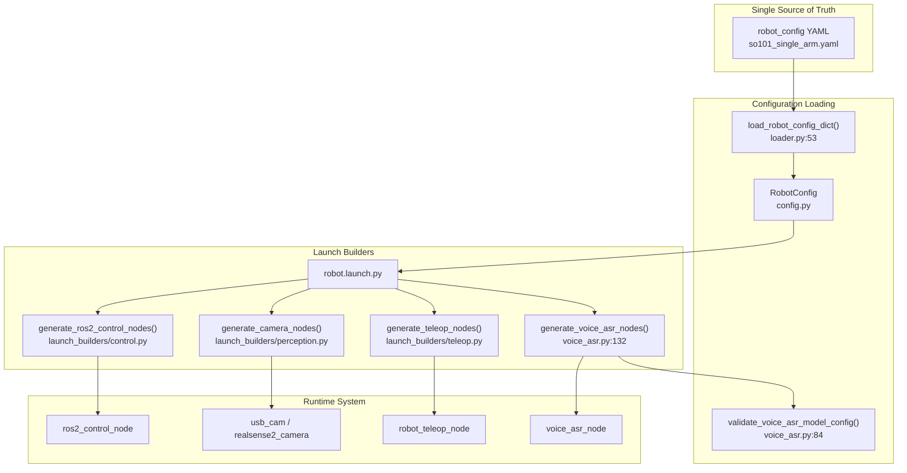
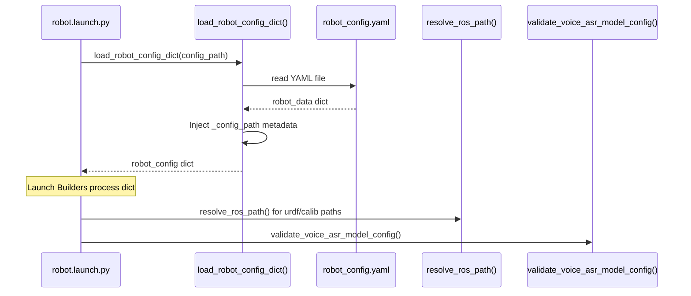

# 配置系统概述

<details>
<summary>相关源文件</summary>

以下文件被用作生成本 wiki 页面时的上下文：

- [src/robot_config/README.en.md](https://atomgit.com/openeuler/IB_Robot/blob/master/src/robot_config/README.en.md)
- [src/robot_config/README.md](https://atomgit.com/openeuler/IB_Robot/blob/master/src/robot_config/README.md)
- [src/robot_config/package.xml](https://atomgit.com/openeuler/IB_Robot/blob/master/src/robot_config/package.xml)
- [src/robot_config/robot_config/launch_builders/voice_asr.py](https://atomgit.com/openeuler/IB_Robot/blob/master/src/robot_config/robot_config/launch_builders/voice_asr.py)
- [src/robot_config/robot_config/loader.py](https://atomgit.com/openeuler/IB_Robot/blob/master/src/robot_config/robot_config/loader.py)
- [src/robot_config/robot_config/utils.py](https://atomgit.com/openeuler/IB_Robot/blob/master/src/robot_config/robot_config/utils.py)
- [src/robot_config/robot_config/wait_for_clock.py](https://atomgit.com/openeuler/IB_Robot/blob/master/src/robot_config/robot_config/wait_for_clock.py)
- [src/robot_config/robot_config/wait_for_controllers.py](https://atomgit.com/openeuler/IB_Robot/blob/master/src/robot_config/robot_config/wait_for_controllers.py)
- [src/robot_config/setup.cfg](https://atomgit.com/openeuler/IB_Robot/blob/master/src/robot_config/setup.cfg)
- [src/robot_config/setup.py](https://atomgit.com/openeuler/IB_Robot/blob/master/src/robot_config/setup.py)
- [src/robot_config/test/test_joint_conversion.py](https://atomgit.com/openeuler/IB_Robot/blob/master/src/robot_config/test/test_joint_conversion.py)
- [src/voice_asr_service/package.xml](https://atomgit.com/openeuler/IB_Robot/blob/master/src/voice_asr_service/package.xml)
- [src/voice_asr_service/voice_asr_service/__init__.py](https://atomgit.com/openeuler/IB_Robot/blob/master/src/voice_asr_service/voice_asr_service/__init__.py)

</details>


`robot_config` package 提供统一配置系统，作为机器人 hardware、peripherals、control modes 和 ML policy I/O contracts 的 **Single Source of Truth**。它将 `ros2_control` parameters、camera drivers、teleoperation settings 和 inference contracts 整合到单个 YAML 文件中，消除配置重复 [src/robot_config/README.md:5-13](https://atomgit.com/openeuler/IB_Robot/blob/master/src/robot_config/README.md#L5-L13)。

**相关页面：** 特定 contract fields，observations、actions、QoS，详见[契约定义](./contract_definition.md)。Peripheral driver configuration 见[Peripheral Configuration](./peripheral_configuration.md)。Launch file generation 见[Launch System](./launch_system.md)。Validation scripts 见[Configuration Validation](./configuration_validation.md)。

---

## 目的与范围

配置系统解决以下问题：
- **Configuration Drift**：过去，joint definitions、camera parameters 和 ML contracts 分散在多个文件中。
- **Redundancy**：同一 camera resolution 或 joint name 会在 URDF、`ros2_control` configs 和 ML contracts 中重复定义。
- **Mode Switching**：不同控制范式，teleop、model inference、MoveIt planning，需要不同 launch files。
- **Training-Deployment Alignment**：录制数据与推理 observations 不匹配会导致失败。

`robot_config` package 通过以下方式解决这些问题：
1. **Centralizing Configuration**：一个 YAML 文件，例如 `so101_single_arm.yaml`，定义所有 hardware 和 software parameters [src/robot_config/README.md:17-41](https://atomgit.com/openeuler/IB_Robot/blob/master/src/robot_config/README.md#L17-L41)。
2. **Synthesizing Downstream Configs**：从 YAML 自动生成 `ros2_control`、camera drivers 和 contracts [src/robot_config/README.md:27-39](https://atomgit.com/openeuler/IB_Robot/blob/master/src/robot_config/README.md#L27-L39)。
3. **Enforcing Consistency**：共享引用，例如 contracts 中的 `peripheral: top`，确保 camera metadata 正确传播 [src/robot_config/robot_config/loader.py:135-152](https://atomgit.com/openeuler/IB_Robot/blob/master/src/robot_config/robot_config/loader.py#L135-L152)。
4. **Supporting Multi-Mode Control**：单一配置支持 teleop、model inference 和 MoveIt modes [src/robot_config/README.md:100-218](https://atomgit.com/openeuler/IB_Robot/blob/master/src/robot_config/README.md#L100-L218)。

---

## 系统架构



**来源：** [src/robot_config/robot_config/loader.py:53-63](https://atomgit.com/openeuler/IB_Robot/blob/master/src/robot_config/robot_config/loader.py#L53-L63), [src/robot_config/robot_config/launch_builders/voice_asr.py:84-130](https://atomgit.com/openeuler/IB_Robot/blob/master/src/robot_config/robot_config/launch_builders/voice_asr.py#L84-L130), [src/robot_config/README.md:27-39](https://atomgit.com/openeuler/IB_Robot/blob/master/src/robot_config/README.md#L27-L39)

---

## 配置文件结构

### 顶层 Sections

```yaml
robot:
  name: so101_single_arm             # Robot identifier
  type: so101                         # Robot hardware type
  robot_type: so_101                  # LeRobot dataset metadata
  
  ros2_control:                       # Hardware plugin and URDF paths
    hardware_plugin: so101_hardware/SO101SystemHardware
    port: /dev/ttyACM0
  
  peripherals:                        # Cameras and sensors list
    - { type: camera, name: top, driver: opencv, ... }
    
  contract:                           # ML I/O Contract
    observations:
      - key: observation.images.top
        peripheral: top               # Reference to peripheral above
        
  control_modes:                      # teleop | model_inference | moveit_planning
    teleop: { controllers: [...] }
    
  voice_asr:                          # Voice recognition settings
    enabled: false
```

每个 section 都在子页面 5.1-5.5 中详细说明。

**来源：** [src/robot_config/README.md:43-98](https://atomgit.com/openeuler/IB_Robot/blob/master/src/robot_config/README.md#L43-L98), [src/robot_config/robot_config/loader.py:26-50](https://atomgit.com/openeuler/IB_Robot/blob/master/src/robot_config/robot_config/loader.py#L26-L50)

---

## 配置加载流水线



**关键函数：**

| Function | 文件 | 目的 |
|----------|------|---------|
| `load_robot_config_dict()` | [src/robot_config/robot_config/loader.py:53-63](https://atomgit.com/openeuler/IB_Robot/blob/master/src/robot_config/robot_config/loader.py#L53-L63) | 解析 YAML，并将 `robot` section 解析为 dictionary。 |
| `resolve_ros_path()` | [src/robot_config/robot_config/utils.py:25-67](https://atomgit.com/openeuler/IB_Robot/blob/master/src/robot_config/robot_config/utils.py#L25-L67) | 解析 `$(find pkg)` 和 `$(env VAR)` 等 ROS-style path substitutions。 |
| `parse_bool()` | [src/robot_config/robot_config/utils.py:70-116](https://atomgit.com/openeuler/IB_Robot/blob/master/src/robot_config/robot_config/utils.py#L70-L116) | 从 YAML strings/integers 稳定解析 boolean values。 |
| `validate_joint_config()` | [src/robot_config/robot_config/utils.py:119-215](https://atomgit.com/openeuler/IB_Robot/blob/master/src/robot_config/robot_config/utils.py#L119-L215) | 确保 robot YAML 和 controller configs 之间的 joint definitions 一致。 |

**来源：** [src/robot_config/robot_config/loader.py:53-63](https://atomgit.com/openeuler/IB_Robot/blob/master/src/robot_config/robot_config/loader.py#L53-L63), [src/robot_config/robot_config/utils.py:25-215](https://atomgit.com/openeuler/IB_Robot/blob/master/src/robot_config/robot_config/utils.py#L25-L215)

---

## 控制模式架构

配置系统支持多种控制模式。`robot.launch.py` 脚本使用这些定义来 spawn 正确的 `ros2_control` controllers 和 inference nodes。

| Control Mode | Controllers | Inference | 使用场景 |
|--------------|-------------|-----------|----------|
| `teleop` | `arm_position_controller`, `gripper_position_controller` | Disabled | 人工遥操作 [src/robot_config/README.md:106-129](https://atomgit.com/openeuler/IB_Robot/blob/master/src/robot_config/README.md#L106-L129) |
| `model_inference` | `arm_position_controller`, `gripper_position_controller` | Enabled | 端到端 policy 执行 [src/robot_config/README.md:171-202](https://atomgit.com/openeuler/IB_Robot/blob/master/src/robot_config/README.md#L171-L202) |
| `moveit_planning` | `arm_trajectory_controller`, `gripper_trajectory_controller` | Disabled | 基于规划的任务 [src/robot_config/README.md:255-277](https://atomgit.com/openeuler/IB_Robot/blob/master/src/robot_config/README.md#L255-L277) |

### 模式选择

系统默认使用 YAML 中的 `default_control_mode`，除非 runtime 通过 `control_mode` launch argument 覆盖 [src/robot_config/README.md:220-236](https://atomgit.com/openeuler/IB_Robot/blob/master/src/robot_config/README.md#L220-L236)。

**来源：** [src/robot_config/README.md:100-236](https://atomgit.com/openeuler/IB_Robot/blob/master/src/robot_config/README.md#L100-L236)

---

## Launch System 集成

### Launch Builder Pattern

`robot.launch.py` 文件通过专用 builders 编排 node generation，这些 builders 将 YAML configuration 转换为 ROS 2 `Node` actions。

**Builder 职责：**

| Builder | 文件 | 生成内容 |
|---------|------|-----------|
| `voice_asr.py` | [src/robot_config/robot_config/launch_builders/voice_asr.py](https://atomgit.com/openeuler/IB_Robot/blob/master/src/robot_config/robot_config/launch_builders/voice_asr.py) | 带已验证 model 和 token paths 的 `voice_asr_node` [src/robot_config/robot_config/launch_builders/voice_asr.py:132-185](https://atomgit.com/openeuler/IB_Robot/blob/master/src/robot_config/robot_config/launch_builders/voice_asr.py#L132-L185)。 |
| `tracing.py` | [src/robot_config/README.md:219-228](https://atomgit.com/openeuler/IB_Robot/blob/master/src/robot_config/README.md#L219-L228) | 用于 performance profiling 的 LTTng tracing sessions。 |
| `wait_for_controllers` | [src/robot_config/robot_config/wait_for_controllers.py](https://atomgit.com/openeuler/IB_Robot/blob/master/src/robot_config/robot_config/wait_for_controllers.py) | 阻塞启动，直到 hardware controllers active [src/robot_config/robot_config/wait_for_controllers.py:27-80](https://atomgit.com/openeuler/IB_Robot/blob/master/src/robot_config/robot_config/wait_for_controllers.py#L27-L80)。 |

**来源：** [src/robot_config/robot_config/launch_builders/voice_asr.py:132-185](https://atomgit.com/openeuler/IB_Robot/blob/master/src/robot_config/robot_config/launch_builders/voice_asr.py#L132-L185), [src/robot_config/robot_config/wait_for_controllers.py:27-80](https://atomgit.com/openeuler/IB_Robot/blob/master/src/robot_config/robot_config/wait_for_controllers.py#L27-L80)

---

## 验证系统

配置系统包含多个 validation layers，用于确保 joint consistency 和架构正确性：

1.  **Joint Consistency**：`validate_joint_config` 检查 robot YAML 中定义的 joints 是否匹配 `ros2_control` controller configuration files 中的 `joints` list [src/robot_config/robot_config/utils.py:119-215](https://atomgit.com/openeuler/IB_Robot/blob/master/src/robot_config/robot_config/utils.py#L119-L215)。
2.  **Voice Model Validation**：`validate_voice_asr_model_config` 确保 ONNX files 存在，并确保 real-time modes 使用 streaming models [src/robot_config/robot_config/launch_builders/voice_asr.py:84-129](https://atomgit.com/openeuler/IB_Robot/blob/master/src/robot_config/robot_config/launch_builders/voice_asr.py#L84-L129)。
3.  **Path Resolution**：`resolve_ros_path` 确保所有 file references，URDFs、calibration、models，在不同环境中都能正确解析 [src/robot_config/robot_config/utils.py:25-67](https://atomgit.com/openeuler/IB_Robot/blob/master/src/robot_config/robot_config/utils.py#L25-L67)。

**来源：** [src/robot_config/robot_config/utils.py:119-215](https://atomgit.com/openeuler/IB_Robot/blob/master/src/robot_config/robot_config/utils.py#L119-L215), [src/robot_config/robot_config/launch_builders/voice_asr.py:84-129](https://atomgit.com/openeuler/IB_Robot/blob/master/src/robot_config/robot_config/launch_builders/voice_asr.py#L84-L129)

---

## 下一步

配置系统各方面的详细信息见：

- **[机器人配置文件](./robot_configuration_files.md)**：YAML structure、model library、joints、`ros2_control`。
- **[契约定义](./contract_definition.md)**：Observation/action specs、QoS、alignment strategies。
- **[Peripheral Configuration](./peripheral_configuration.md)**：Camera drivers、transforms、calibration。
- **[Launch System](./launch_system.md)**：Launch builders、dynamic node generation。
- **[Configuration Validation](./configuration_validation.md)**：`validate_config.py` 用法和 joint consistency checks。

