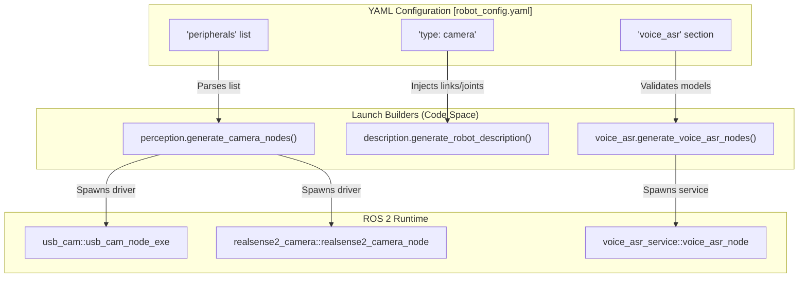
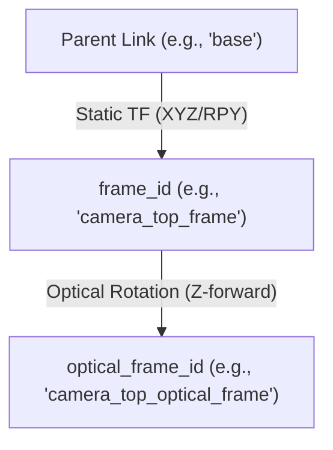

# 外设配置

相关源文件

生成此 wiki 页面时使用了以下文件作为上下文：

- [src/action_dispatch/action_dispatch/action_dispatcher_node.py](https://atomgit.com/openeuler/IB_Robot/blob/master/src/action_dispatch/action_dispatch/action_dispatcher_node.py)
- [src/inference_service/inference_service/lerobot_policy_node.py](https://atomgit.com/openeuler/IB_Robot/blob/master/src/inference_service/inference_service/lerobot_policy_node.py)
- [src/robot_config/config/robots/so101_single_arm.yaml](https://atomgit.com/openeuler/IB_Robot/blob/master/src/robot_config/config/robots/so101_single_arm.yaml)
- [src/robot_config/config/robots/so101_single_arm_rgbd.yaml](https://atomgit.com/openeuler/IB_Robot/blob/master/src/robot_config/config/robots/so101_single_arm_rgbd.yaml)
- [src/robot_config/launch/robot.launch.py](https://atomgit.com/openeuler/IB_Robot/blob/master/src/robot_config/launch/robot.launch.py)
- [src/robot_config/robot_config/launch_builders/control.py](https://atomgit.com/openeuler/IB_Robot/blob/master/src/robot_config/robot_config/launch_builders/control.py)
- [src/robot_config/robot_config/launch_builders/description.py](https://atomgit.com/openeuler/IB_Robot/blob/master/src/robot_config/robot_config/launch_builders/description.py)
- [src/robot_config/robot_config/launch_builders/execution.py](https://atomgit.com/openeuler/IB_Robot/blob/master/src/robot_config/robot_config/launch_builders/execution.py)
- [src/robot_config/robot_config/launch_builders/perception.py](https://atomgit.com/openeuler/IB_Robot/blob/master/src/robot_config/robot_config/launch_builders/perception.py)
- [src/robot_config/robot_config/launch_builders/sim_backend/camera_presets.py](https://atomgit.com/openeuler/IB_Robot/blob/master/src/robot_config/robot_config/launch_builders/sim_backend/camera_presets.py)
- [src/robot_config/robot_config/launch_builders/sim_backend/mujoco_adapter.py](https://atomgit.com/openeuler/IB_Robot/blob/master/src/robot_config/robot_config/launch_builders/sim_backend/mujoco_adapter.py)
- [src/robot_description/urdf/lerobot/so101/so101_gazebo.xacro](https://atomgit.com/openeuler/IB_Robot/blob/master/src/robot_description/urdf/lerobot/so101/so101_gazebo.xacro)

## 目的与范围

`robot_config` 中的外设配置系统为在 IB-Robot 生态中定义、配置和集成硬件传感器（相机、LiDAR、麦克风）提供统一接口。系统将这些定义集中在机器人 YAML 配置中，保证真实硬件执行、Gazebo/MuJoCo 仿真和机器学习数据流水线之间保持一致。

主要职责包括：
1.  **硬件配置**：根据 YAML 中的参数动态生成 ROS 2 驱动节点（例如 `usb_cam`、`realsense2_camera`）[src/robot_config/robot_config/launch_builders/perception.py:19-181](https://atomgit.com/openeuler/IB_Robot/blob/master/src/robot_config/robot_config/launch_builders/perception.py#L19-L181)。
2.  **URDF 注入**：启动时将传感器 link、joint 和 Gazebo 专用 XML 宏注入机器人 URDF [src/robot_config/robot_config/launch_builders/description.py:22-110](https://atomgit.com/openeuler/IB_Robot/blob/master/src/robot_config/robot_config/launch_builders/description.py#L22-L110)。
3.  **仿真桥接**：自动配置 MuJoCo 或 Gazebo 的内部传感器插件，保持一致的话题 API [src/robot_config/robot_config/launch_builders/description.py:113-161](https://atomgit.com/openeuler/IB_Robot/blob/master/src/robot_config/robot_config/launch_builders/description.py#L113-L161)。
4.  **ISP 标定**：向相机驱动应用软件级 ISP 覆盖项（brightness、contrast 等），保证不同实体设备之间的视觉一致性 [src/robot_config/robot_config/launch_builders/perception.py:86-92](https://atomgit.com/openeuler/IB_Robot/blob/master/src/robot_config/robot_config/launch_builders/perception.py#L86-L92)。

**来源**：[src/robot_config/robot_config/launch_builders/perception.py:1-8](https://atomgit.com/openeuler/IB_Robot/blob/master/src/robot_config/robot_config/launch_builders/perception.py#L1-L8)，[src/robot_config/robot_config/launch_builders/description.py:1-9](https://atomgit.com/openeuler/IB_Robot/blob/master/src/robot_config/robot_config/launch_builders/description.py#L1-L9)，[src/robot_config/robot_config/launch_builders/control.py:119-124](https://atomgit.com/openeuler/IB_Robot/blob/master/src/robot_config/robot_config/launch_builders/control.py#L119-L124)

---

## 外设定义与数据流

外设以列表形式定义在 `robot.peripherals` 键下。该配置是感知栈的单一事实源。

### 自然语言到代码实体映射：外设初始化

**图示**：YAML 配置片段与实例化 ROS 2 节点的具体 launch builder 函数之间的映射。

**来源**：[src/robot_config/robot_config/launch_builders/perception.py:19-50](https://atomgit.com/openeuler/IB_Robot/blob/master/src/robot_config/robot_config/launch_builders/perception.py#L19-L50)，[src/robot_config/robot_config/launch_builders/description.py:164-180](https://atomgit.com/openeuler/IB_Robot/blob/master/src/robot_config/robot_config/launch_builders/description.py#L164-L180)，[src/robot_config/launch/robot.launch.py:110-125](https://atomgit.com/openeuler/IB_Robot/blob/master/src/robot_config/launch/robot.launch.py#L110-L125)

---

## 相机配置

系统通过 `peripherals` 列表中的统一 schema 支持多种相机驱动。

### 支持的驱动与参数
`generate_camera_nodes` 函数遍历外设，并根据 `driver` 字段分支处理：

*   **opencv (usb_cam)**：使用 `usb_cam` 包支持标准 V4L2 设备。它支持透传 `brightness`、`contrast`、`exposure` 和 `white_balance` 等 ISP 调节项 [src/robot_config/robot_config/launch_builders/perception.py:52-84](https://atomgit.com/openeuler/IB_Robot/blob/master/src/robot_config/robot_config/launch_builders/perception.py#L52-L84)。
*   **realsense**：支持 Intel RealSense D400 系列。通过 `streams` 列表处理复杂的数据流配置，包括 `align_depth` 和 `pointcloud` 生成 [src/robot_config/robot_config/launch_builders/perception.py:134-179](https://atomgit.com/openeuler/IB_Robot/blob/master/src/robot_config/robot_config/launch_builders/perception.py#L134-L179)。
*   **camera_ros**：面向特定 V4L2 实现的轻量替代方案，常用于嵌入式平台 [src/robot_config/robot_config/launch_builders/perception.py:109-132](https://atomgit.com/openeuler/IB_Robot/blob/master/src/robot_config/robot_config/launch_builders/perception.py#L109-L132)。

### 通用 Schema 表

| YAML 字段 | 代码实体映射 | 说明 |
| :--- | :--- | :--- |
| `name` | `Node(name=f"{name}_camera")` | 相机实例的唯一标识。 |
| `driver` | `perception.py` logic branch | 选择要执行的 ROS 2 驱动包。 |
| `width`/`height` | `image_width`/`image_height` | 采集帧的分辨率 [src/robot_config/robot_config/launch_builders/perception.py:61-62](https://atomgit.com/openeuler/IB_Robot/blob/master/src/robot_config/robot_config/launch_builders/perception.py#L61-L62)。 |
| `fps` | `framerate` | 目标采集频率 [src/robot_config/robot_config/launch_builders/perception.py:60](https://atomgit.com/openeuler/IB_Robot/blob/master/src/robot_config/robot_config/launch_builders/perception.py#L60)。 |
| `frame_id` | `camera_frame_id` | 挂接到相机硬件上的 TF frame [src/robot_config/robot_config/launch_builders/perception.py:65](https://atomgit.com/openeuler/IB_Robot/blob/master/src/robot_config/robot_config/launch_builders/perception.py#L65)。 |
| `index` | `video_device` | 设备索引，例如 0 表示 `/dev/video0` [src/robot_config/robot_config/launch_builders/perception.py:54-55](https://atomgit.com/openeuler/IB_Robot/blob/master/src/robot_config/robot_config/launch_builders/perception.py#L54-L55)。 |

**来源**：[src/robot_config/robot_config/launch_builders/perception.py:52-181](https://atomgit.com/openeuler/IB_Robot/blob/master/src/robot_config/robot_config/launch_builders/perception.py#L52-L181)，[src/robot_config/config/robots/so101_single_arm.yaml:189-199](https://atomgit.com/openeuler/IB_Robot/blob/master/src/robot_config/config/robots/so101_single_arm.yaml#L189-L199)

---

## 空间配置与变换

相机位姿通过外设条目中的 `transform` 块定义。这些数据由 `description.py` 用于生成静态 TF 和 URDF link。

### Frame 层级

**图示**：相机外设的 TF 层级。`optical_frame_id` 对基于 CV 的观测很关键，因为它遵循视觉算法使用的 Z-forward 约定 [src/robot_config/robot_config/launch_builders/description.py:143-154](https://atomgit.com/openeuler/IB_Robot/blob/master/src/robot_config/robot_config/launch_builders/description.py#L143-L154)。

### 默认变换预设
为简化标准布局的配置，将 `use_default_transform: true` 会触发 `camera_presets.py` 中的查找。这样 `so101` 等机器人可以使用预验证的相机位置（例如 "wrist" 或 "top"），无需在 YAML 中手动输入坐标 [src/robot_config/robot_config/launch_builders/description.py:57-62](https://atomgit.com/openeuler/IB_Robot/blob/master/src/robot_config/robot_config/launch_builders/description.py#L57-L62)。

**来源**：[src/robot_config/robot_config/launch_builders/description.py:81-92](https://atomgit.com/openeuler/IB_Robot/blob/master/src/robot_config/robot_config/launch_builders/description.py#L81-L92)，[src/robot_config/robot_config/launch_builders/sim_backend/camera_presets.py:20-65](https://atomgit.com/openeuler/IB_Robot/blob/master/src/robot_config/robot_config/launch_builders/sim_backend/camera_presets.py#L20-L65)

---

## 仿真集成

### Gazebo
系统会在 URDF 中生成 `gazebo` 传感器块。`_build_cameras_urdf_from_yaml` 函数将 YAML 中的 FOV 和分辨率转换为 Gazebo XML，保证仿真传感器匹配真实硬件规格。它会根据 YAML `fovy` 和宽高比计算 `horizontal_fov` [src/robot_config/robot_config/launch_builders/description.py:75-78](https://atomgit.com/openeuler/IB_Robot/blob/master/src/robot_config/robot_config/launch_builders/description.py#L75-L78)。

### MuJoCo
对于 MuJoCo 仿真，`_inject_mujoco_camera_sensors` 会动态修改 URDF 的 `ros2_control` 块以加入 `<sensor>` 参数。这让 `mujoco_ros2_control` 插件可以直接把图像数据发布到机器人外设配置中定义的话题，确保仿真与真实硬件话题一致 [src/robot_config/robot_config/launch_builders/description.py:113-161](https://atomgit.com/openeuler/IB_Robot/blob/master/src/robot_config/robot_config/launch_builders/description.py#L113-L161)。

**来源**：[src/robot_config/robot_config/launch_builders/description.py:22-42](https://atomgit.com/openeuler/IB_Robot/blob/master/src/robot_config/robot_config/launch_builders/description.py#L22-L42)，[src/robot_config/robot_config/launch_builders/sim_backend/mujoco_adapter.py:87-88](https://atomgit.com/openeuler/IB_Robot/blob/master/src/robot_config/robot_config/launch_builders/sim_backend/mujoco_adapter.py#L87-L88)，[src/robot_config/robot_config/launch_builders/sim_backend/mujoco_adapter.py:153-165](https://atomgit.com/openeuler/IB_Robot/blob/master/src/robot_config/robot_config/launch_builders/sim_backend/mujoco_adapter.py#L153-L165)

