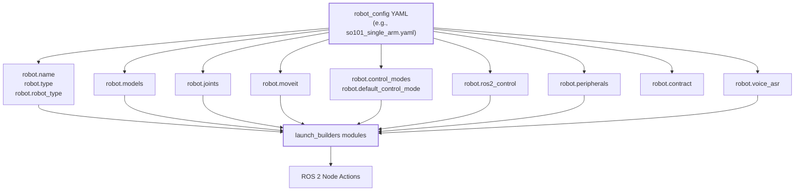
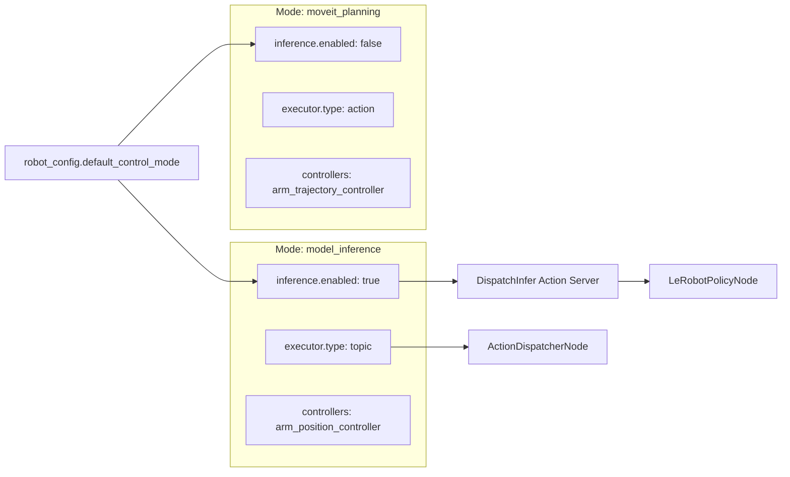
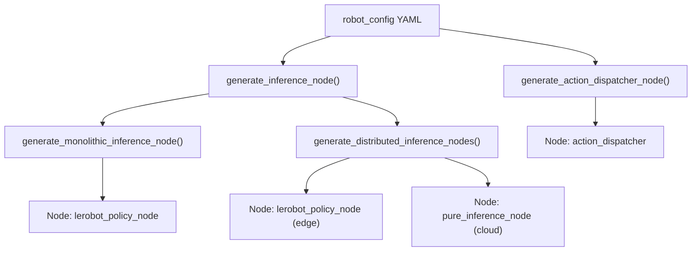

# 机器人配置文件

<details>
<summary>相关源文件</summary>

以下文件被用作生成本 wiki 页面时的上下文：

- [src/action_dispatch/action_dispatch/action_dispatcher_node.py](https://atomgit.com/openeuler/IB_Robot/blob/master/src/action_dispatch/action_dispatch/action_dispatcher_node.py)
- [src/inference_service/inference_service/lerobot_policy_node.py](https://atomgit.com/openeuler/IB_Robot/blob/master/src/inference_service/inference_service/lerobot_policy_node.py)
- [src/robot_config/config/robots/so101_dual_arm.yaml](https://atomgit.com/openeuler/IB_Robot/blob/master/src/robot_config/config/robots/so101_dual_arm.yaml)
- [src/robot_config/config/robots/so101_single_arm.yaml](https://atomgit.com/openeuler/IB_Robot/blob/master/src/robot_config/config/robots/so101_single_arm.yaml)
- [src/robot_config/robot_config/launch_builders/execution.py](https://atomgit.com/openeuler/IB_Robot/blob/master/src/robot_config/robot_config/launch_builders/execution.py)

</details>


本页记录 `robot_config` package 中 robot YAML configuration files 的结构和内容。这些文件是机器人 hardware specifications、control modes、joint definitions 和 model deployments 的 **Single Source of Truth**。Contract definitions，observations 和 actions，见 [Contract Definition](./contract_definition.md)。Peripheral/camera configuration 详情见 [Peripheral Configuration](./peripheral_configuration.md)。

Robot configuration files 位于 `src/robot_config/config/robots/`，遵循标准化 YAML schema，并由 launch system 和 validation tools 加载。

---

## 文件结构概览

Robot configuration files 按层级 sections 组织，每个 section 控制机器人系统的某个特定方面。下图展示顶层结构以及 configuration loader 如何处理它。

**图：Robot Configuration File Hierarchy**



**来源：** [src/robot_config/config/robots/so101_single_arm.yaml:5-189](https://atomgit.com/openeuler/IB_Robot/blob/master/src/robot_config/config/robots/so101_single_arm.yaml#L5-L189), [src/robot_config/robot_config/launch_builders/execution.py:123-165](https://atomgit.com/openeuler/IB_Robot/blob/master/src/robot_config/robot_config/launch_builders/execution.py#L123-L165)

---

## Robot Specification Section

顶层 `robot` section 定义基础 robot metadata，供系统用于标识、仿真配置和数据集标签。

**结构：**

```yaml
robot:
  name: so101_single_arm          # Unique identifier for this configuration
  type: so101                     # Hardware type identifier
  robot_type: so_101              # LeRobot dataset metadata tag
  gazebo_world_name: demo         # World file for simulation
  gazebo_gui:
    qt_platform: xcb
    libgl_always_software: true   # Software rendering for stability
```

**字段说明：**

| 字段 | 类型 | 目的 | 示例 |
|-------|------|---------|---------|
| `name` | string | 唯一配置标识符 | `so101_single_arm` |
| `type` | string | 硬件族标识符 | `so101` |
| `robot_type` | string | Dataset metadata tag，LeRobot v3 兼容 | `so_101` |
| `gazebo_world_name` | string | Gazebo simulation 的目标 world | `demo` |
| `gazebo_gui` | map | 仿真的 UI 和渲染设置 | `libgl_always_software: true` |

**来源：** [src/robot_config/config/robots/so101_single_arm.yaml:5-18](https://atomgit.com/openeuler/IB_Robot/blob/master/src/robot_config/config/robots/so101_single_arm.yaml#L5-L18)

---

## Models Library

`models` section 定义已训练 policy checkpoints 的 registry。该 section 将符号化 model names 映射到 filesystem paths 和 policy types，稍后由 `inference_service` package 解析。

**结构：**

```yaml
robot:
  models:
    so101_act_rknn:
      path: ./models/502000/pretrained_model
      policy_type: act
      device: rknn
      lerobot_norm_mode: range_m100_100
```

**字段说明：**

| 字段 | 类型 | 目的 |
|-------|------|---------|
| `path` | string | Model checkpoint directory 的路径 |
| `policy_type` | string | Policy architecture，`act`、`diffusion`、`pi0` |
| `device` | string | Hardware backend，`cpu`、`cuda`、`rknn`、`npu` |
| `lerobot_norm_mode` | string | Normalization mode，决定 rad ↔ LeRobot unit conversion |

**来源：** [src/robot_config/config/robots/so101_single_arm.yaml:23-38](https://atomgit.com/openeuler/IB_Robot/blob/master/src/robot_config/config/robots/so101_single_arm.yaml#L23-L38), [src/robot_config/robot_config/launch_builders/execution.py:38-61](https://atomgit.com/openeuler/IB_Robot/blob/master/src/robot_config/robot_config/launch_builders/execution.py#L38-L61)

---

## Joint Definitions (Single Source of Truth)

`joints` section 建立 joint naming 和 grouping 的 **Single Source of Truth**。这确保 `ros2_control` hardware interfaces、MoveIt planning groups 和 inference contract 保持一致。

**结构：**

```yaml
robot:
  joints:
    arm: ["1", "2", "3", "4", "5"]
    gripper: ["6"]
    all: ["1", "2", "3", "4", "5", "6"]
```

系统使用这些 definitions 验证 hardware interfaces 和 controllers 是否引用已存在 joints。在 dual-arm configurations 中，这些 definitions 会扩展为包含 `left_arm` 和 `right_arm` groups。

**来源：** [src/robot_config/config/robots/so101_single_arm.yaml:43-52](https://atomgit.com/openeuler/IB_Robot/blob/master/src/robot_config/config/robots/so101_single_arm.yaml#L43-L52), [src/robot_config/config/robots/so101_dual_arm.yaml:20-32](https://atomgit.com/openeuler/IB_Robot/blob/master/src/robot_config/config/robots/so101_dual_arm.yaml#L20-L32)

---

## Control Modes Configuration

Control modes 定义运行范式。配置会指定要加载哪些 controllers、executor type，以及 inference 是否 active。

**图：Control Mode Selection and Execution**



**来源：** [src/robot_config/config/robots/so101_single_arm.yaml:69-137](https://atomgit.com/openeuler/IB_Robot/blob/master/src/robot_config/config/robots/so101_single_arm.yaml#L69-L137), [src/inference_service/inference_service/lerobot_policy_node.py:148-182](https://atomgit.com/openeuler/IB_Robot/blob/master/src/inference_service/inference_service/lerobot_policy_node.py#L148-L182), [src/action_dispatch/action_dispatch/action_dispatcher_node.py:43-103](https://atomgit.com/openeuler/IB_Robot/blob/master/src/action_dispatch/action_dispatch/action_dispatcher_node.py#L43-L103)

### 模式参数

| Section | Parameter | 目的 |
|---------|-----------|---------|
| `inference` | `enabled` | 如果为 true，启动 policy inference nodes |
| `inference` | `model` | 引用 `robot.models` 中的 model name |
| `inference` | `execution_mode` | `monolithic`，本地，或 `distributed`，edge-cloud |
| `executor` | `type` | 高频控制使用 `topic`，trajectory following 使用 `action` |
| `executor` | `control_frequency` | Action dispatcher 的目标 loop rate，例如 20.0 Hz |
| `executor` | `watermark_threshold` | 触发新 inference requests 的 queue depth |

**来源：** [src/robot_config/config/robots/so101_single_arm.yaml:88-124](https://atomgit.com/openeuler/IB_Robot/blob/master/src/robot_config/config/robots/so101_single_arm.yaml#L88-L124), [src/robot_config/robot_config/launch_builders/execution.py:148-165](https://atomgit.com/openeuler/IB_Robot/blob/master/src/robot_config/robot_config/launch_builders/execution.py#L148-L165)

---

## ros2_control Configuration

该 section 配置硬件抽象层。它包括 hardware plugin selection、communication port，以及 calibration file path。

**结构：**

```yaml
robot:
  ros2_control:
    hardware_plugin: so101_hardware/SO101SystemHardware
    port: /dev/ttyACM0
    calib_file: $(env HOME)/.calibrate/so101_follower_calibrate.json
    joint_names: ["1", "2", "3", "4", "5", "6"]
    reset_positions:
      "1": 0.0
      "2": -1.5854
    urdf_path: $(find robot_description)/urdf/lerobot/so101/so101.urdf.xacro
    controllers_config: $(find so101_hardware)/config/so101_controllers.yaml
```

`ros2_control` parameters 会被解析，用于启动 `controller_manager` 和具体 hardware plugins，例如 `SO101SystemHardware`。

**来源：** [src/robot_config/config/robots/so101_single_arm.yaml:163-187](https://atomgit.com/openeuler/IB_Robot/blob/master/src/robot_config/config/robots/so101_single_arm.yaml#L163-L187), [src/robot_config/config/robots/so101_dual_arm.yaml:11-17](https://atomgit.com/openeuler/IB_Robot/blob/master/src/robot_config/config/robots/so101_dual_arm.yaml#L11-L17)

---

## MoveIt 与 Kinematics

`moveit` section 提供将 robot configuration 与 MoveIt2 planning pipelines 连接所需的 metadata。

**结构：**

```yaml
robot:
  moveit:
    arm_group_name: arm
    base_link: base
    ee_link: gripper
    shoulder_link: shoulder
```

这些值用于动态配置 `MoveItGateway` 和相关 MoveIt launch files。

**来源：** [src/robot_config/config/robots/so101_single_arm.yaml:57-61](https://atomgit.com/openeuler/IB_Robot/blob/master/src/robot_config/config/robots/so101_single_arm.yaml#L57-L61), [src/robot_config/config/robots/so101_dual_arm.yaml:35-39](https://atomgit.com/openeuler/IB_Robot/blob/master/src/robot_config/config/robots/so101_dual_arm.yaml#L35-L39)

---

## Voice ASR Configuration

语音识别能力直接集成到 robot configuration 中，可支持语音触发命令。

**结构：**

```yaml
robot:
  voice_asr:
    enabled: false
    active_mode: continuous
    language: zh
    model_path: "models/voice_asr/sherpa-onnx-..."
    vad_sensitivity: 0.6
    output_topic: /voice_command
```

**来源：** [src/robot_config/config/robots/so101_single_arm.yaml:140-160](https://atomgit.com/openeuler/IB_Robot/blob/master/src/robot_config/config/robots/so101_single_arm.yaml#L140-L160)

---

## 配置处理流程

`robot_config` launch builders 将 YAML specification 转换为 ROS 2 Node actions。

**图：Launch Builder Data Flow**



**来源：** [src/robot_config/robot_config/launch_builders/execution.py:123-165](https://atomgit.com/openeuler/IB_Robot/blob/master/src/robot_config/robot_config/launch_builders/execution.py#L123-L165), [src/inference_service/inference_service/lerobot_policy_node.py:3-34](https://atomgit.com/openeuler/IB_Robot/blob/master/src/inference_service/inference_service/lerobot_policy_node.py#L3-L34)

