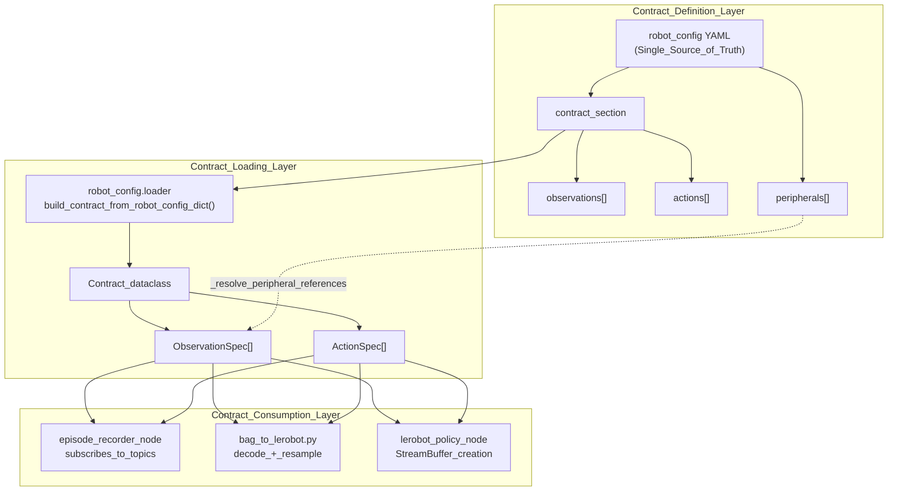
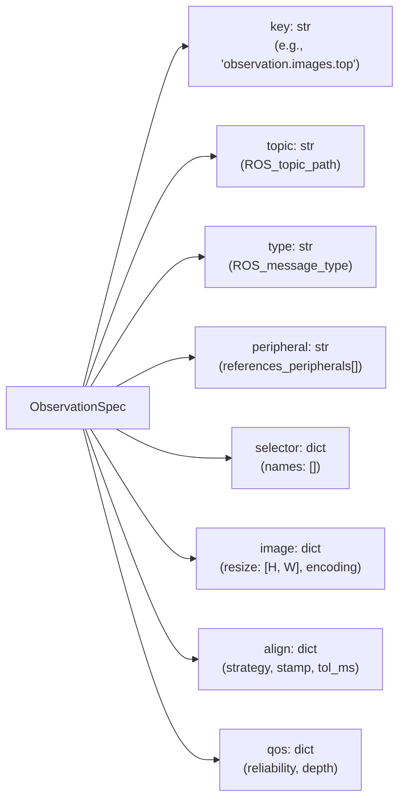
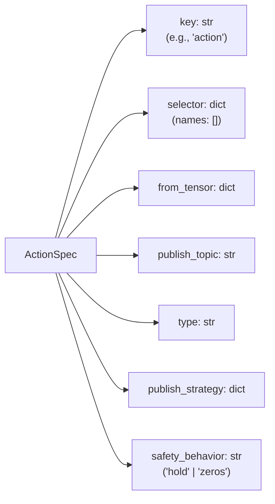

# 契约系统

<details>
<summary>相关源文件</summary>

以下文件被用作生成本 wiki 页面时的上下文：

- [src/dataset_tools/dataset_tools/bag_to_lerobot.py](https://atomgit.com/openeuler/IB_Robot/blob/master/src/dataset_tools/dataset_tools/bag_to_lerobot.py)
- [src/dataset_tools/dataset_tools/episode_recorder.py](https://atomgit.com/openeuler/IB_Robot/blob/master/src/dataset_tools/dataset_tools/episode_recorder.py)
- [src/robot_config/README.en.md](https://atomgit.com/openeuler/IB_Robot/blob/master/src/robot_config/README.en.md)
- [src/robot_config/README.md](https://atomgit.com/openeuler/IB_Robot/blob/master/src/robot_config/README.md)
- [src/robot_config/robot_config/contract_builder.py](https://atomgit.com/openeuler/IB_Robot/blob/master/src/robot_config/robot_config/contract_builder.py)
- [src/robot_config/robot_config/contract_utils.py](https://atomgit.com/openeuler/IB_Robot/blob/master/src/robot_config/robot_config/contract_utils.py)
- [src/robot_config/robot_config/generators/__init__.py](https://atomgit.com/openeuler/IB_Robot/blob/master/src/robot_config/robot_config/generators/__init__.py)
- [src/robot_config/robot_config/generators/contract.py](https://atomgit.com/openeuler/IB_Robot/blob/master/src/robot_config/robot_config/generators/contract.py)
- [src/robot_config/robot_config/launch_builders/recording.py](https://atomgit.com/openeuler/IB_Robot/blob/master/src/robot_config/robot_config/launch_builders/recording.py)
- [src/robot_config/robot_config/utils.py](https://atomgit.com/openeuler/IB_Robot/blob/master/src/robot_config/robot_config/utils.py)
- [src/robot_config/test/test_joint_conversion.py](https://atomgit.com/openeuler/IB_Robot/blob/master/src/robot_config/test/test_joint_conversion.py)

</details>


## 目的与范围

Contract System 是 IB-Robot 的架构抽象，用于定义系统的 **observations**，传感器输入，和 **actions**，机器人输出，以及它们从 ROS 到 tensor 的映射。它作为 Single Source of Truth，保证从数据采集、训练到部署的整条流水线中数据格式一致。

本页覆盖：
- Contract 定义结构和 YAML 语法
- Observation 和 action specifications
- Peripheral 集成与 metadata 传播
- 对齐策略和 QoS settings

机器人配置如何使用 contracts，见 [机器人配置文件](../configuration/robot_configuration_files.md)。实际 ROS-to-tensor 转换实现，见 [协议转换](../protocol.md)。

**来源**：[src/robot_config/robot_config/contract_builder.py:12-24](https://atomgit.com/openeuler/IB_Robot/blob/master/src/robot_config/robot_config/contract_builder.py#L12-L24), [src/robot_config/robot_config/generators/contract.py:24-52](https://atomgit.com/openeuler/IB_Robot/blob/master/src/robot_config/robot_config/generators/contract.py#L24-L52), [src/dataset_tools/dataset_tools/episode_recorder.py:10-12](https://atomgit.com/openeuler/IB_Robot/blob/master/src/dataset_tools/dataset_tools/episode_recorder.py#L10-L12)

---

## Contract 架构概览

Contract 抽象位于 IB-Robot 数据一致性保证的核心。通过在 YAML 中一次定义 observation-action 接口，所有下游消费者，recorder、dataset converter、inference nodes，都会自动使用相同处理逻辑。



**图**：Contract system architecture，展示 definition、loading 和 consumption layers。

**来源**：[src/robot_config/robot_config/generators/contract.py:123-170](https://atomgit.com/openeuler/IB_Robot/blob/master/src/robot_config/robot_config/generators/contract.py#L123-L170), [src/robot_config/robot_config/generators/contract.py:197-210](https://atomgit.com/openeuler/IB_Robot/blob/master/src/robot_config/robot_config/generators/contract.py#L197-L210), [src/dataset_tools/dataset_tools/bag_to_lerobot.py:94-117](https://atomgit.com/openeuler/IB_Robot/blob/master/src/dataset_tools/dataset_tools/bag_to_lerobot.py#L94-L117), [src/dataset_tools/dataset_tools/episode_recorder.py:128-143](https://atomgit.com/openeuler/IB_Robot/blob/master/src/dataset_tools/dataset_tools/episode_recorder.py#L128-L143)

---

## Contract 结构

Contract 定义在 robot configuration YAML 的 `robot.contract` section 中。系统使用 `Contract` dataclass 在运行时管理这些定义。

| 字段 | 类型 | 必需 | 说明 |
|-------|------|----------|-------------|
| `rate_hz` | float | Yes | 录制/推理频率，单位 Hz，别名为 `fps` |
| `max_duration_s` | float | Yes | 最大 episode 时长，单位秒，默认 30.0 |
| `observations` | list | Yes | `ObservationSpec` objects 列表 |
| `actions` | list | Yes | `ActionSpec` objects 列表 |
| `timestamp_source`| string | No | `receive`，默认，或 `header` |

**Contract 结构示例**：

```yaml
contract:
  rate_hz: 20
  max_duration_s: 90.0
  timestamp_source: receive
  
  observations:
    - key: observation.images.top
      topic: /camera/top/image_raw
      type: sensor_msgs/msg/Image
      peripheral: top
    - key: observation.state
      topic: /joint_states
      type: sensor_msgs/msg/JointState
  
  actions:
    - key: action
      publish:
        topic: /arm_position_controller/commands
        type: std_msgs/msg/Float64MultiArray
```

**来源**：[src/robot_config/robot_config/generators/contract.py:106-120](https://atomgit.com/openeuler/IB_Robot/blob/master/src/robot_config/robot_config/generators/contract.py#L106-L120), [src/robot_config/robot_config/contract_builder.py:49-57](https://atomgit.com/openeuler/IB_Robot/blob/master/src/robot_config/robot_config/contract_builder.py#L49-L57), [src/robot_config/robot_config/contract_utils.py:83-97](https://atomgit.com/openeuler/IB_Robot/blob/master/src/robot_config/robot_config/contract_utils.py#L83-L97)

---

## Observation Specifications

每个 observation 定义一个 ROS topic 如何转换为 tensor。`ObservationSpec` class 封装这些规则。

### Observation Schema



**图**：Observation specification schema，展示内部 `ObservationSpec` attributes。

**来源**：[src/robot_config/robot_config/generators/contract.py:61-74](https://atomgit.com/openeuler/IB_Robot/blob/master/src/robot_config/robot_config/generators/contract.py#L61-L74), [src/robot_config/robot_config/contract_builder.py:59-71](https://atomgit.com/openeuler/IB_Robot/blob/master/src/robot_config/robot_config/contract_builder.py#L59-L71), [src/robot_config/robot_config/contract_utils.py:43-55](https://atomgit.com/openeuler/IB_Robot/blob/master/src/robot_config/robot_config/contract_utils.py#L43-L55)

### Image Observations 与 Peripheral Metadata

Image observations 可以引用 peripherals，以继承硬件专属 metadata，例如 native resolution 和 pixel formats。

```yaml
observations:
  - key: observation.images.top
    topic: /camera/top/image_raw
    type: sensor_msgs/msg/Image
    peripheral: top  # References peripherals[name='top']
    image:
      resize: [480, 640]  # [height, width]
```

当引用 peripheral 时，`_resolve_peripheral_references` 函数会根据该 peripheral 的 `height`、`width` 和 `pixel_format` 自动填充缺失的 `image.resize` 与 `image.encoding` 字段。

**来源**：[src/robot_config/robot_config/generators/contract.py:151-170](https://atomgit.com/openeuler/IB_Robot/blob/master/src/robot_config/robot_config/generators/contract.py#L151-L170), [src/robot_config/robot_config/contract_builder.py:60-71](https://atomgit.com/openeuler/IB_Robot/blob/master/src/robot_config/robot_config/contract_builder.py#L60-L71)

---

## Action Specifications

Actions 定义模型输出 tensors 如何通过 `ActionSpec` 映射到 ROS topics。

### Action Schema



**图**：Action specification schema，将 `ActionSpec` attributes 映射到 YAML fields。

**来源**：[src/robot_config/robot_config/generators/contract.py:76-90](https://atomgit.com/openeuler/IB_Robot/blob/master/src/robot_config/robot_config/generators/contract.py#L76-L90), [src/robot_config/robot_config/contract_builder.py:73-81](https://atomgit.com/openeuler/IB_Robot/blob/master/src/robot_config/robot_config/contract_builder.py#L73-L81), [src/robot_config/robot_config/contract_utils.py:59-69](https://atomgit.com/openeuler/IB_Robot/blob/master/src/robot_config/robot_config/contract_utils.py#L59-L69)

### Action 分发

系统支持将单个 action tensor 拆分到多个 ROS topics。当不同 joint groups，例如 arm 与 gripper，由不同 ROS controllers 处理时，这很常见。

```yaml
actions:
  - key: action
    selector:
      names: ["action.0", "action.1", "action.2", "action.3", "action.4"]
    publish:
      topic: /arm_position_controller/commands
      type: std_msgs/msg/Float64MultiArray
  - key: action
    selector:
      names: ["action.5"]
    publish:
      topic: /gripper_position_controller/commands
      type: std_msgs/msg/Float64MultiArray
```

`tensormsg` converter 使用这些 selectors 在发布到对应 topics 前切分输入 tensor。

**来源**：[src/robot_config/robot_config/generators/contract.py:76-90](https://atomgit.com/openeuler/IB_Robot/blob/master/src/robot_config/robot_config/generators/contract.py#L76-L90), [src/dataset_tools/dataset_tools/bag_to_lerobot.py:101-105](https://atomgit.com/openeuler/IB_Robot/blob/master/src/dataset_tools/dataset_tools/bag_to_lerobot.py#L101-L105)

---

## 数据流：从 Bag 到 LeRobot

`bag_to_lerobot` tool 展示 Contract system 的实际作用，它将录制的 ROS bags 转换为可训练数据集。

| 步骤 | Function/Class | 说明 |
|------|----------------|-------------|
| 1. Load Contract | `load_contract` | 从 `robot_config.yaml` 加载 Single Source of Truth。 |
| 2. Scan Bag | `_Stream` | 为每个 contract topic 累积原始 ROS messages。 |
| 3. Decode | `decode_value` | 使用 `tensormsg` 将 ROS messages 转换为 contract-native forms，例如 HWC arrays。 |
| 4. Resample | `resample` | 使用选定 timestamps 将所有 streams 对齐到 contract 的 `rate_hz`。 |
| 5. Export | `LeRobotDataset` | 将最终对齐数据写入 Parquet 和 MP4/PNG 文件。 |

**来源**：[src/dataset_tools/dataset_tools/bag_to_lerobot.py:12-18](https://atomgit.com/openeuler/IB_Robot/blob/master/src/dataset_tools/dataset_tools/bag_to_lerobot.py#L12-L18), [src/dataset_tools/dataset_tools/bag_to_lerobot.py:121-142](https://atomgit.com/openeuler/IB_Robot/blob/master/src/dataset_tools/dataset_tools/bag_to_lerobot.py#L121-L142), [src/dataset_tools/dataset_tools/bag_to_lerobot.py:94-113](https://atomgit.com/openeuler/IB_Robot/blob/master/src/dataset_tools/dataset_tools/bag_to_lerobot.py#L94-L113)

---

## 验证与安全

Contract System 包含启动前验证，用于在系统启动前捕获架构错误。

- **`validate_control_mode_config`**：检查引用的 models 是否存在，以及每个 observation 的 peripheral 是否在 `peripherals` section 中定义。[src/robot_config/robot_config/contract_builder.py:12-71](https://atomgit.com/openeuler/IB_Robot/blob/master/src/robot_config/robot_config/contract_builder.py#L12-L71)
- **Safety Behaviors**：Actions 支持 `safety_behavior`，即 `hold` 或 `zeros`。如果 inference service 超时或失败，系统会回退到该行为以保护硬件。[src/robot_config/robot_config/generators/contract.py:78-81](https://atomgit.com/openeuler/IB_Robot/blob/master/src/robot_config/robot_config/generators/contract.py#L78-L81)
- **Fingerprinting**：`contract_fingerprint` 生成 contract configuration 的 hash。它被存储在 bag metadata 中，确保 dataset converter 使用录制时完全相同的 contract。[src/dataset_tools/dataset_tools/episode_recorder.py:97-98](https://atomgit.com/openeuler/IB_Robot/blob/master/src/dataset_tools/dataset_tools/episode_recorder.py#L97-L98), [src/dataset_tools/dataset_tools/bag_to_lerobot.py:182-194](https://atomgit.com/openeuler/IB_Robot/blob/master/src/dataset_tools/dataset_tools/bag_to_lerobot.py#L182-L194)

**来源**：[src/robot_config/robot_config/contract_builder.py:12-107](https://atomgit.com/openeuler/IB_Robot/blob/master/src/robot_config/robot_config/contract_builder.py#L12-L107), [src/robot_config/robot_config/generators/contract.py:76-90](https://atomgit.com/openeuler/IB_Robot/blob/master/src/robot_config/robot_config/generators/contract.py#L76-L90), [src/dataset_tools/dataset_tools/episode_recorder.py:139-143](https://atomgit.com/openeuler/IB_Robot/blob/master/src/dataset_tools/dataset_tools/episode_recorder.py#L139-L143)

