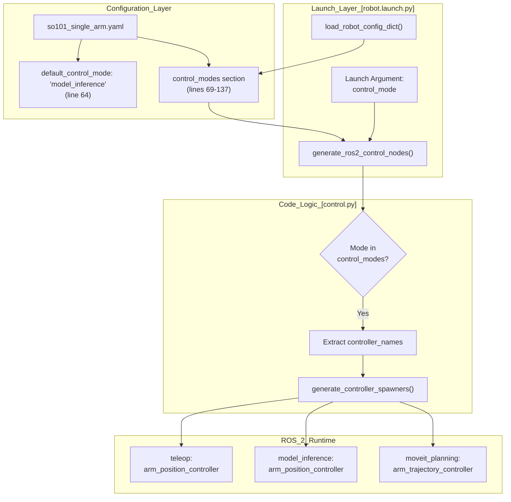
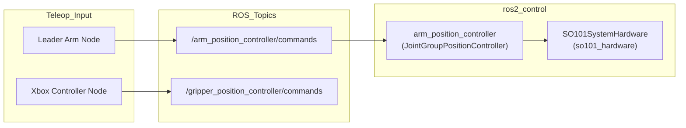
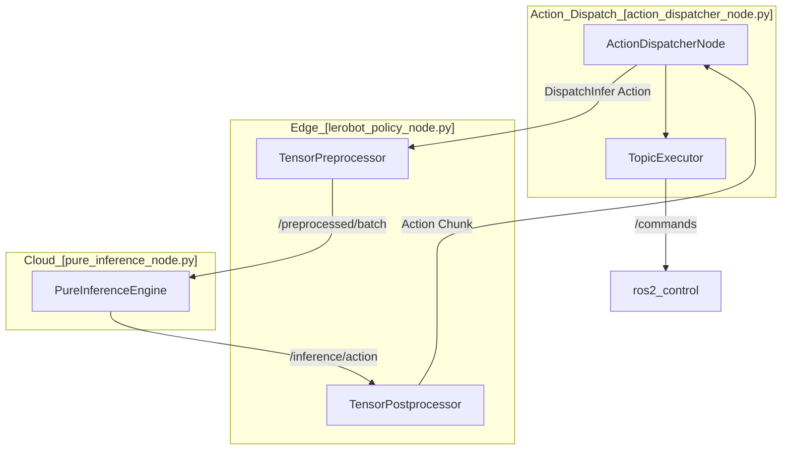

# 控制模式架构

<details>
<summary>相关源文件</summary>

以下文件被用作生成本 wiki 页面时的上下文：

- [src/action_dispatch/action_dispatch/action_dispatcher_node.py](https://atomgit.com/openeuler/IB_Robot/blob/master/src/action_dispatch/action_dispatch/action_dispatcher_node.py)
- [src/inference_service/inference_service/lerobot_policy_node.py](https://atomgit.com/openeuler/IB_Robot/blob/master/src/inference_service/inference_service/lerobot_policy_node.py)
- [src/robot_config/config/robots/so101_single_arm.yaml](https://atomgit.com/openeuler/IB_Robot/blob/master/src/robot_config/config/robots/so101_single_arm.yaml)
- [src/robot_config/config/robots/so101_single_arm_rgbd.yaml](https://atomgit.com/openeuler/IB_Robot/blob/master/src/robot_config/config/robots/so101_single_arm_rgbd.yaml)
- [src/robot_config/launch/robot.launch.py](https://atomgit.com/openeuler/IB_Robot/blob/master/src/robot_config/launch/robot.launch.py)
- [src/robot_config/robot_config/launch_builders/control.py](https://atomgit.com/openeuler/IB_Robot/blob/master/src/robot_config/robot_config/launch_builders/control.py)
- [src/robot_config/robot_config/launch_builders/description.py](https://atomgit.com/openeuler/IB_Robot/blob/master/src/robot_config/robot_config/launch_builders/description.py)
- [src/robot_config/robot_config/launch_builders/execution.py](https://atomgit.com/openeuler/IB_Robot/blob/master/src/robot_config/robot_config/launch_builders/execution.py)
- [src/robot_config/robot_config/launch_builders/perception.py](https://atomgit.com/openeuler/IB_Robot/blob/master/src/robot_config/robot_config/launch_builders/perception.py)
- [src/robot_config/robot_config/launch_builders/sim_backend/camera_presets.py](https://atomgit.com/openeuler/IB_Robot/blob/master/src/robot_config/robot_config/launch_builders/sim_backend/camera_presets.py)
- [src/robot_config/robot_config/launch_builders/sim_backend/mujoco_adapter.py](https://atomgit.com/openeuler/IB_Robot/blob/master/src/robot_config/robot_config/launch_builders/sim_backend/mujoco_adapter.py)
- [src/robot_description/urdf/lerobot/so101/so101_gazebo.xacro](https://atomgit.com/openeuler/IB_Robot/blob/master/src/robot_description/urdf/lerobot/so101/so101_gazebo.xacro)

</details>


## 目的与范围

本文档描述 IB-Robot 的控制模式架构。该架构允许单个机器人配置支持三种不同运行范式：teleoperation、AI model inference 和 motion planning。每种模式使用不同 controllers 和执行策略，但都汇聚到 `ros2_control` 提供的同一硬件抽象层。

该架构由 `robot_config` package 驱动，`robot_config` 是 mode definitions、controller sets 和 execution parameters 的 single source of truth。

**来源**：[src/robot_config/launch/robot.launch.py:1-11](https://atomgit.com/openeuler/IB_Robot/blob/master/src/robot_config/launch/robot.launch.py#L1-L11), [src/robot_config/config/robots/so101_single_arm.yaml:69-137](https://atomgit.com/openeuler/IB_Robot/blob/master/src/robot_config/config/robots/so101_single_arm.yaml#L69-L137)

---

## 概览

IB-Robot 实现三种控制模式，以适配不同使用场景和 AI model architectures：

| Mode | 主要使用场景 | 控制频率 | Controller Type | 执行接口 |
|------|-----------------|-------------------|-----------------|---------------------|
| `teleop` | 人工示范采集 | 50.0 Hz | Position controllers | Direct topic streaming |
| `model_inference` | 端到端模仿学习，ACT、Diffusion Policy | 20.0 Hz | Position controllers | Action dispatch with temporal smoothing |
| `moveit_planning` | 目标条件策略，VoxPoser、VLM | Variable | Trajectory controllers | Action server (FollowJointTrajectory) |

控制模式在 launch time 确定，并驱动整个系统栈，从要 spawn 的 controllers 到要实例化的 nodes。

**来源**：[src/robot_config/config/robots/so101_single_arm.yaml:71-137](https://atomgit.com/openeuler/IB_Robot/blob/master/src/robot_config/config/robots/so101_single_arm.yaml#L71-L137), [src/robot_config/launch/robot.launch.py:74-81](https://atomgit.com/openeuler/IB_Robot/blob/master/src/robot_config/launch/robot.launch.py#L74-L81)

---

## 控制模式选择架构

控制模式选择由 `robot.launch.py` 处理。它解析 mode name，然后使用 `generate_ros2_control_nodes` 识别所需 controllers。

Title: Mode Resolution and Controller Selection


控制模式选择遵循以下优先级：
1. **Command line override**，通过 `control_mode:=<mode>` launch argument [src/robot_config/launch/robot.launch.py:74](https://atomgit.com/openeuler/IB_Robot/blob/master/src/robot_config/launch/robot.launch.py#L74)。
2. **Default mode**，由 YAML `default_control_mode` field 指定 [src/robot_config/config/robots/so101_single_arm.yaml:64](https://atomgit.com/openeuler/IB_Robot/blob/master/src/robot_config/config/robots/so101_single_arm.yaml#L64)。
3. **Validation**：`generate_ros2_control_nodes` 函数会根据 `control_modes` dictionary 验证 mode [src/robot_config/robot_config/launch_builders/control.py:135-157](https://atomgit.com/openeuler/IB_Robot/blob/master/src/robot_config/robot_config/launch_builders/control.py#L135-L157)。

**来源**：[src/robot_config/config/robots/so101_single_arm.yaml:64-70](https://atomgit.com/openeuler/IB_Robot/blob/master/src/robot_config/config/robots/so101_single_arm.yaml#L64-L70), [src/robot_config/launch/robot.launch.py:74-81](https://atomgit.com/openeuler/IB_Robot/blob/master/src/robot_config/launch/robot.launch.py#L74-L81), [src/robot_config/robot_config/launch_builders/control.py:135-157](https://atomgit.com/openeuler/IB_Robot/blob/master/src/robot_config/robot_config/launch_builders/control.py#L135-L157)

---

## Teleoperation 模式

### 目的
Teleoperation 模式用于数据采集中的直接人工控制。它将 input devices，leader arms、gamepads 或 VR，高频透传到 robot hardware。

### 配置
```yaml
teleop:
  controllers:
    - joint_state_broadcaster
    - arm_position_controller
    - gripper_position_controller
  inference:
    enabled: false
  executor:
    type: topic
    mode: teleop
    control_frequency: 50.0
```

### 数据流
`generate_teleop_nodes` 函数创建 teleoperation 基础设施。在该模式下，`action_dispatcher` 会被绕过，或以低延迟 “teleop” 模式使用，将 input device topics 直接映射到 controller command topics。

Title: Teleop Data Flow (Code Entities)


**来源**：[src/robot_config/config/robots/so101_single_arm.yaml:71-85](https://atomgit.com/openeuler/IB_Robot/blob/master/src/robot_config/config/robots/so101_single_arm.yaml#L71-L85), [src/robot_config/launch/robot.launch.py:120](https://atomgit.com/openeuler/IB_Robot/blob/master/src/robot_config/launch/robot.launch.py#L120)

---

## Model Inference 模式

### 目的
该模式支持端到端 learned policies，例如 ACT。它使用 `inference_service` 生成 action chunks，并使用 `action_dispatcher` 平滑和执行这些 chunks。

### 配置
```yaml
model_inference:
  controllers:
    - joint_state_broadcaster
    - arm_position_controller
    - gripper_position_controller
  inference:
    enabled: true
    model: so101_act_rknn
    action_server: /inference/dispatch
  executor:
    type: topic
    mode: model_inference
    watermark_threshold: 50
    control_frequency: 20.0
```

### Monolithic vs. Distributed Execution
推理流水线支持两种执行模式：
- **Monolithic**：`LeRobotPolicyNode` 在单一进程中处理 preprocessing、GPU inference 和 postprocessing [src/inference_service/inference_service/lerobot_policy_node.py:7-12](https://atomgit.com/openeuler/IB_Robot/blob/master/src/inference_service/inference_service/lerobot_policy_node.py#L7-L12)。
- **Distributed**：`LeRobotPolicyNode` 作为 edge proxy，通过 `/preprocessed/batch` 和 `/inference/action` topics 将 GPU inference 卸载给 `pure_inference_node` [src/inference_service/inference_service/lerobot_policy_node.py:13-25](https://atomgit.com/openeuler/IB_Robot/blob/master/src/inference_service/inference_service/lerobot_policy_node.py#L13-L25)。

Title: Inference Mode Execution Flow


**来源**：[src/inference_service/inference_service/lerobot_policy_node.py:7-33](https://atomgit.com/openeuler/IB_Robot/blob/master/src/inference_service/inference_service/lerobot_policy_node.py#L7-L33), [src/action_dispatch/action_dispatch/action_dispatcher_node.py:43-52](https://atomgit.com/openeuler/IB_Robot/blob/master/src/action_dispatch/action_dispatch/action_dispatcher_node.py#L43-L52), [src/robot_config/robot_config/launch_builders/execution.py:157-165](https://atomgit.com/openeuler/IB_Robot/blob/master/src/robot_config/robot_config/launch_builders/execution.py#L157-L165)

---

## MoveIt Planning 模式

### 目的
MoveIt planning 模式支持带避障的高层运动规划。它面向 target-pose commands，而不是高频 joint streams。

### 配置
```yaml
moveit_planning:
  controllers:
    - joint_state_broadcaster
    - arm_trajectory_controller
    - gripper_trajectory_controller
  inference:
    enabled: false
  executor:
    type: action
    mode: moveit_planning
```

### 数据流
- **Trajectory Controllers**：使用 `arm_trajectory_controller` 和 `gripper_trajectory_controller` 执行规划路径 [src/robot_config/config/robots/so101_single_arm.yaml:130-131](https://atomgit.com/openeuler/IB_Robot/blob/master/src/robot_config/config/robots/so101_single_arm.yaml#L130-L131)。
- **Action Executor**：dispatcher 或 high-level task node 使用 `ActionExecutor` 对接 trajectory controllers 提供的 `FollowJointTrajectory` action server [src/robot_config/config/robots/so101_single_arm.yaml:135](https://atomgit.com/openeuler/IB_Robot/blob/master/src/robot_config/config/robots/so101_single_arm.yaml#L135)。

**来源**：[src/robot_config/config/robots/so101_single_arm.yaml:125-137](https://atomgit.com/openeuler/IB_Robot/blob/master/src/robot_config/config/robots/so101_single_arm.yaml#L125-L137)

---

## 统一硬件汇聚

三种模式全部汇聚到 `ros2_control` hardware interface。

1. **Hardware Plugin**：`so101_hardware/SO101SystemHardware` plugin 通过 `ros2_control` configuration 加载 [src/robot_config/config/robots/so101_single_arm.yaml:164](https://atomgit.com/openeuler/IB_Robot/blob/master/src/robot_config/config/robots/so101_single_arm.yaml#L164)。
2. **Controller Manager**：`robot.launch.py` 根据 `use_sim` flag 启动真实 `ros2_control_node` 或 Gazebo `gz_ros2_control` plugin [src/robot_config/launch/robot.launch.py:12-14](https://atomgit.com/openeuler/IB_Robot/blob/master/src/robot_config/launch/robot.launch.py#L12-L14)。
3. **Common Interface**：无论模式如何，hardware 都期望 `JointState` feedback 和 position/trajectory commands。`controllers_config` 文件定义这些 controllers 如何映射到底层 hardware joints [src/robot_config/config/robots/so101_single_arm.yaml:179](https://atomgit.com/openeuler/IB_Robot/blob/master/src/robot_config/config/robots/so101_single_arm.yaml#L179)。

**来源**：[src/robot_config/launch/robot.launch.py:1-20](https://atomgit.com/openeuler/IB_Robot/blob/master/src/robot_config/launch/robot.launch.py#L1-L20), [src/robot_config/config/robots/so101_single_arm.yaml:163-187](https://atomgit.com/openeuler/IB_Robot/blob/master/src/robot_config/config/robots/so101_single_arm.yaml#L163-L187), [src/robot_config/robot_config/launch_builders/control.py:165-180](https://atomgit.com/openeuler/IB_Robot/blob/master/src/robot_config/robot_config/launch_builders/control.py#L165-L180)

