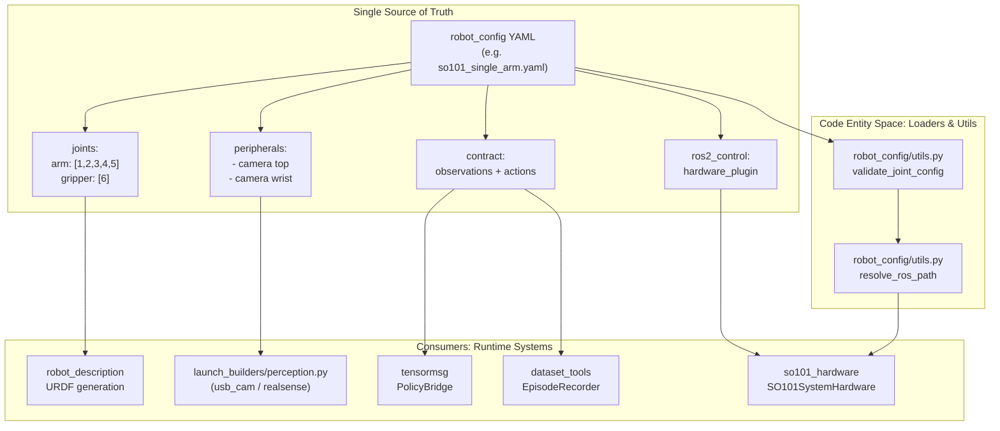
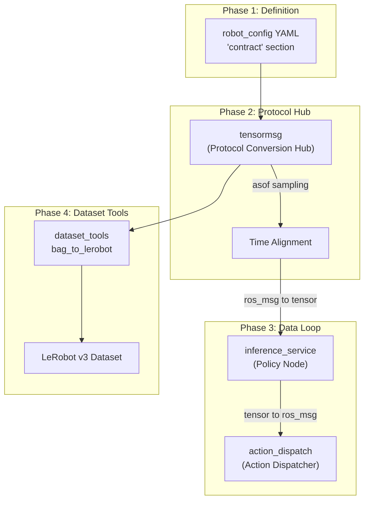
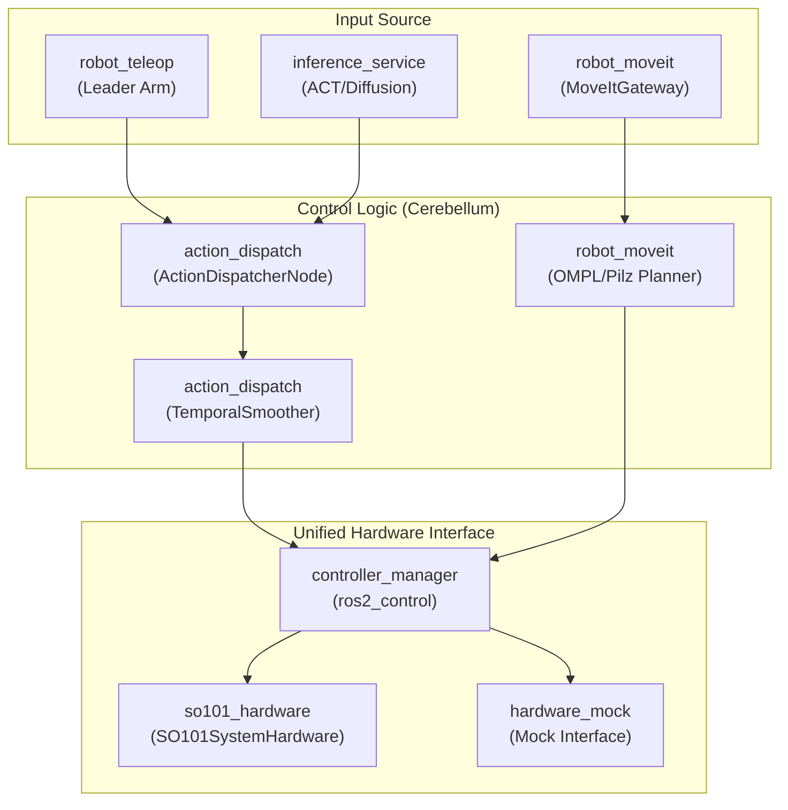

# 核心概念概述

相关源文件

以下文件被用作生成本 wiki 页面时的上下文：

- [README.en.md](https://atomgit.com/openeuler/IB_Robot/blob/master/README.en.md)
- [README.md](https://atomgit.com/openeuler/IB_Robot/blob/master/README.md)
- [docs/pictures/openclaw_real.gif](https://atomgit.com/openeuler/IB_Robot/blob/master/docs/pictures/openclaw_real.gif)
- [docs/pictures/openclaw_sim.gif](https://atomgit.com/openeuler/IB_Robot/blob/master/docs/pictures/openclaw_sim.gif)
- [src/README.md](https://atomgit.com/openeuler/IB_Robot/blob/master/src/README.md)
- [src/action_dispatch/README.en.md](https://atomgit.com/openeuler/IB_Robot/blob/master/src/action_dispatch/README.en.md)
- [src/robot_config/README.en.md](https://atomgit.com/openeuler/IB_Robot/blob/master/src/robot_config/README.en.md)
- [src/robot_config/README.md](https://atomgit.com/openeuler/IB_Robot/blob/master/src/robot_config/README.md)
- [src/robot_config/robot_config/utils.py](https://atomgit.com/openeuler/IB_Robot/blob/master/src/robot_config/robot_config/utils.py)
- [src/robot_config/test/test_joint_conversion.py](https://atomgit.com/openeuler/IB_Robot/blob/master/src/robot_config/test/test_joint_conversion.py)
- [src/so101_hardware/README.en.md](https://atomgit.com/openeuler/IB_Robot/blob/master/src/so101_hardware/README.en.md)
- [src/so101_hardware/README.md](https://atomgit.com/openeuler/IB_Robot/blob/master/src/so101_hardware/README.md)

## 目的与范围

本文档解释支撑 IB-Robot 系统的三项基础架构原则：**Single Source of Truth**、**Contract-Driven Design** 和 **Control Mode Architecture**。这些原则消除配置冗余，确保训练与部署一致，并支持在不同机器人控制范式之间平滑切换。

每项原则的详细实现见：
- [单一事实源模式](./single_source_of_truth_pattern.md)：深入说明 `robot_config` YAML 结构。
- [契约系统](./contract_system.md)：完整的 Contract 抽象文档。
- [控制模式架构](./control_mode_architecture.md)：详细控制模式切换机制。

系统级架构概览见[系统架构](../architecture.md)。

---

## 三大架构支柱

IB-Robot 通过三项核心设计原则解决机器学习生态，LeRobot，与机器人中间件，ROS 2，之间的基础集成挑战：

| 原则 | 解决的问题 | 关键收益 |
|-----------|---------------|-------------|
| **Single Source of Truth** | 录制、训练和推理中的配置重复 | 消除不一致，只改一次，到处生效 |
| **Contract-Driven Design** | 训练部署偏移，模型在训练和服务阶段看到不同数据格式 | 保证数据生命周期中处理流水线一致 |
| **Control Mode Architecture** | 硬编码控制逻辑，难以在遥操作、AI 和规划之间切换 | 统一硬件接口，通过单一参数切换模式 |

这些原则共同构成一个系统：硬件配置在 `robot_config` YAML 中**只定义一次**，数据处理 contracts 会自动**合成**，多个控制模式最终**汇聚**到同一硬件抽象层。

**来源**：[README.md:21-29](https://atomgit.com/openeuler/IB_Robot/blob/master/README.md#L21-L29), [README.en.md:21-29](https://atomgit.com/openeuler/IB_Robot/blob/master/README.en.md#L21-L29)

---

## 原则 1：Single Source of Truth (robot_config YAML)

### 概览

`robot_config` YAML 文件是所有机器人规格的**唯一权威来源**。IB-Robot 不再为 `ros2_control`、cameras、ML contracts 和 joint definitions 维护分散配置，而是在一处定义全部内容，并自动传播到所有子系统。

### 配置结构

机器人配置整合了四个传统上相互独立的系统：

1.  **Joint Definitions**：由 `ros2_control`、MoveIt 和 contracts 使用。
2.  **Hardware Interface**：`ros2_control` hardware plugins，例如 `so101_hardware/SO101SystemHardware`，和 controllers 的配置。
3.  **Peripherals**：camera 和 sensor 定义，包括 drivers，例如 `usb_cam`、`realsense2_camera`，以及 transforms。
4.  **ML Contract**：AI models 的 observations 和 actions 定义，通过名称引用 peripherals。

**来源**：[src/robot_config/README.md:15-25](https://atomgit.com/openeuler/IB_Robot/blob/master/src/robot_config/README.md#L15-L25), [src/robot_config/README.md:41-98](https://atomgit.com/openeuler/IB_Robot/blob/master/src/robot_config/README.md#L41-L98)

### 图：配置传播流程

**来源**：[src/robot_config/README.md:27-39](https://atomgit.com/openeuler/IB_Robot/blob/master/src/robot_config/README.md#L27-L39), [src/robot_config/robot_config/utils.py:119-133](https://atomgit.com/openeuler/IB_Robot/blob/master/src/robot_config/robot_config/utils.py#L119-L133)

### 关键代码实体

| 实体 | 文件 | 目的 |
|--------|------|---------|
| `robot.launch.py` | [src/robot_config/README.md:145-150](https://atomgit.com/openeuler/IB_Robot/blob/master/src/robot_config/README.md#L145-L150) | 协调感知、推理和分发的主入口 |
| `validate_joint_config` | [src/robot_config/robot_config/utils.py:119-123](https://atomgit.com/openeuler/IB_Robot/blob/master/src/robot_config/robot_config/utils.py#L119-L123) | 确保 YAML 和 controllers 中的 joint definitions 一致 |
| `resolve_ros_path` | [src/robot_config/robot_config/utils.py:25-36](https://atomgit.com/openeuler/IB_Robot/blob/master/src/robot_config/robot_config/utils.py#L25-L36) | 解析配置文件中的 `$(find pkg)` 和 `$(env VAR)` |

---

## 原则 2：Contract-Driven Design

### 概览

**Contract** 是一种机器可读规格，定义 ROS messages 如何映射到 ML tensors。Contracts 确保示范录制、数据集转换和实时推理使用**同一处理流水线**，消除常见的“训练可用，部署失败”问题。

### Contract 数据模型

Contract 抽象定义：
- **Observations**：模型输入，包含带 resize specs 的 images、joint states。
- **Actions**：模型输出，包含带 normalization modes 的 target joint positions。
- **Normalization**：通过 `lerobot_norm_mode` 在物理单位，radians/degrees，与模型单位之间映射。

**来源**：[src/robot_config/README.md:79-86](https://atomgit.com/openeuler/IB_Robot/blob/master/src/robot_config/README.md#L79-L86), [src/robot_config/README.md:208-212](https://atomgit.com/openeuler/IB_Robot/blob/master/src/robot_config/README.md#L208-L212)

### 图：Contract 生命周期与协议转换

**来源**：[README.md:51-54](https://atomgit.com/openeuler/IB_Robot/blob/master/README.md#L51-L54), [src/README.md:68-72](https://atomgit.com/openeuler/IB_Robot/blob/master/src/README.md#L68-L72)

### 共享处理流水线

`inference_service` 包通过三个解耦组件实现 contract 执行：

| 组件 | 文件 | 目的 |
|----------|------|---------|
| `TensorPreprocessor` | [src/inference_service/README.md:10](https://atomgit.com/openeuler/IB_Robot/blob/master/src/inference_service/README.md#L10) | Raw ROS data → Normalized PyTorch Tensors |
| `PureInferenceEngine` | [src/inference_service/README.md:11](https://atomgit.com/openeuler/IB_Robot/blob/master/src/inference_service/README.md#L11) | Stateless execution engine (CUDA/Ascend) |
| `TensorPostprocessor` | [src/inference_service/README.md:12](https://atomgit.com/openeuler/IB_Robot/blob/master/src/inference_service/README.md#L12) | Action Tensors → Physical control commands |

---

## 原则 3：Control Mode Architecture

### 概览

IB-Robot 支持**三种控制模式**，代表三类本质不同的机器人控制范式：

1.  **`teleop`**：人工遥操作，Leader arm、Xbox、VR。具备零延迟透传，< 5ms。
2.  **`model_inference`**：高频 AI 控制，ACT、Diffusion Policy。使用 **Action Chunking** 和 temporal smoothing。
3.  **`moveit_planning`**：带轨迹执行的运动规划，MoveIt 2。支持避障和 IK 求解。

三种模式都**汇聚到同一硬件抽象层**，`ros2_control`，因此可通过 `control_mode` launch parameter 平滑切换。

**来源**：[src/robot_config/README.md:94-102](https://atomgit.com/openeuler/IB_Robot/blob/master/src/robot_config/README.md#L94-L102), [src/robot_config/README.md:255-264](https://atomgit.com/openeuler/IB_Robot/blob/master/src/robot_config/README.md#L255-L264)

### 图：控制模式汇聚

**来源**：[src/action_dispatch/README.en.md:13-42](https://atomgit.com/openeuler/IB_Robot/blob/master/src/action_dispatch/README.en.md#L13-L42), [src/README.md:20-44](https://atomgit.com/openeuler/IB_Robot/blob/master/src/README.md#L20-L44)

### 模式切换与 Controller 映射

launch system 会自动将控制模式映射到特定 `ros2_control` controllers：
- `teleop`：启动 `arm_position_controller` 和 `gripper_position_controller` [src/robot_config/README.md:124-127](https://atomgit.com/openeuler/IB_Robot/blob/master/src/robot_config/README.md#L124-L127)。
- `model_inference`：使用 `action_dispatch` 以高频推送到相同 position controllers [src/robot_config/README.md:189-192](https://atomgit.com/openeuler/IB_Robot/blob/master/src/robot_config/README.md#L189-L192)。
- `moveit_planning`：切换到 `arm_trajectory_controller` 以执行轨迹 [src/robot_config/README.md:273-277](https://atomgit.com/openeuler/IB_Robot/blob/master/src/robot_config/README.md#L273-L277)。

**来源**：[src/robot_config/README.md:204-209](https://atomgit.com/openeuler/IB_Robot/blob/master/src/robot_config/README.md#L204-L209), [src/action_dispatch/README.en.md:64-69](https://atomgit.com/openeuler/IB_Robot/blob/master/src/action_dispatch/README.en.md#L64-L69)

