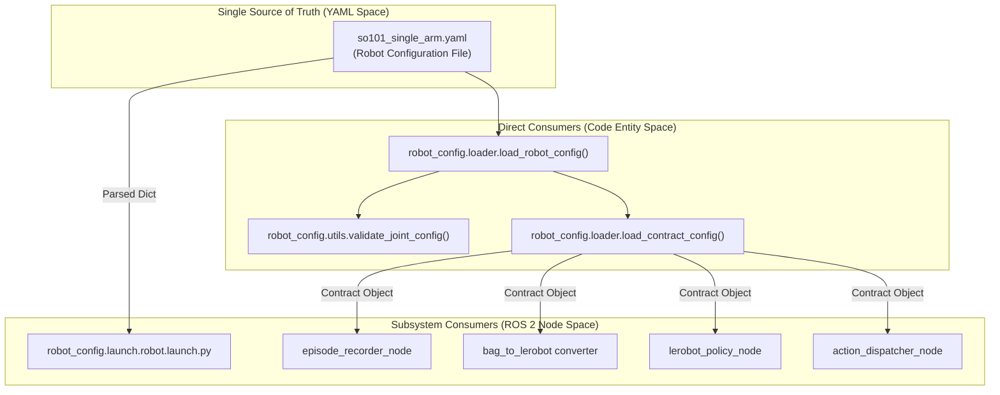
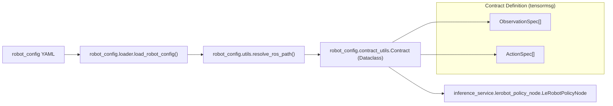

# 单一事实源模式

相关源文件

以下文件被用作生成本 wiki 页面时的上下文：

- [src/action_dispatch/action_dispatch/action_dispatcher_node.py](https://atomgit.com/openeuler/IB_Robot/blob/master/src/action_dispatch/action_dispatch/action_dispatcher_node.py)
- [src/inference_service/inference_service/lerobot_policy_node.py](https://atomgit.com/openeuler/IB_Robot/blob/master/src/inference_service/inference_service/lerobot_policy_node.py)
- [src/robot_config/README.en.md](https://atomgit.com/openeuler/IB_Robot/blob/master/src/robot_config/README.en.md)
- [src/robot_config/README.md](https://atomgit.com/openeuler/IB_Robot/blob/master/src/robot_config/README.md)
- [src/robot_config/config/robots/so101_single_arm.yaml](https://atomgit.com/openeuler/IB_Robot/blob/master/src/robot_config/config/robots/so101_single_arm.yaml)
- [src/robot_config/robot_config/launch_builders/execution.py](https://atomgit.com/openeuler/IB_Robot/blob/master/src/robot_config/robot_config/launch_builders/execution.py)
- [src/robot_config/robot_config/utils.py](https://atomgit.com/openeuler/IB_Robot/blob/master/src/robot_config/robot_config/utils.py)
- [src/robot_config/test/test_joint_conversion.py](https://atomgit.com/openeuler/IB_Robot/blob/master/src/robot_config/test/test_joint_conversion.py)

**目的**：本页说明 IB-Robot 如何将 `robot_config` YAML 文件作为所有硬件配置、observation/action 映射和系统行为的 Single Source of Truth。该模式消除配置冗余，并确保数据采集、训练和推理之间保持一致。

**范围**：覆盖 `robot_config` package 作为中央配置权威的角色、YAML-to-Code 映射，以及不同子系统如何消费同一配置。Contract 技术 schema 见 [Contract System](./contract_system.md)。控制模式切换机制见 [Control Mode Architecture](./control_mode_architecture.md)。

---

## 核心原则

**Single Source of Truth** 模式确保所有系统配置都来自单一 `robot_config` YAML 文件，例如 `so101_single_arm.yaml`。没有其他配置文件重复这些信息。所有子系统，录制、数据集转换、推理和动作分发，都读取同一来源，确保它们以相同方式处理数据。

**关键不变量**：如果两个 nodes 处理同一 observation，例如 camera image，它们必须使用相同参数，resolution、encoding、QoS settings。`robot_config` YAML 通过成为这些参数唯一的定义位置来强制这一点 [src/robot_config/README.md:13-17](https://atomgit.com/openeuler/IB_Robot/blob/master/src/robot_config/README.md#L13-L17)。

### 系统到代码映射：Single Source of Truth

下图展示“Natural Language”中的配置文件概念如何映射到“Code Space”中的具体 Python classes 和 ROS 2 entities。

Title: Configuration Data Flow

**来源**：[src/robot_config/robot_config/loader.py:130-139](https://atomgit.com/openeuler/IB_Robot/blob/master/src/robot_config/robot_config/loader.py#L130-L139), [src/robot_config/robot_config/utils.py:119-133](https://atomgit.com/openeuler/IB_Robot/blob/master/src/robot_config/robot_config/utils.py#L119-L133), [src/robot_config/config/robots/so101_single_arm.yaml:41-43](https://atomgit.com/openeuler/IB_Robot/blob/master/src/robot_config/config/robots/so101_single_arm.yaml#L41-L43)

---

## robot_config YAML 结构

`robot_config` YAML 文件包含多个顶层 sections，每个 section 都有特定用途：

| Section | 目的 | 消费方 |
|---------|---------|-------------|
| `robot.name` | 机器人标识符 | 所有 nodes，logging、namespacing [src/robot_config/config/robots/so101_single_arm.yaml:6](https://atomgit.com/openeuler/IB_Robot/blob/master/src/robot_config/config/robots/so101_single_arm.yaml#L6) |
| `robot.robot_type` | LeRobot dataset metadata | `bag_to_lerobot` [src/robot_config/config/robots/so101_single_arm.yaml:8](https://atomgit.com/openeuler/IB_Robot/blob/master/src/robot_config/config/robots/so101_single_arm.yaml#L8) |
| `robot.joints` | 统一 joint definitions | `validate_joint_config`, `action_dispatcher_node` [src/robot_config/config/robots/so101_single_arm.yaml:43-52](https://atomgit.com/openeuler/IB_Robot/blob/master/src/robot_config/config/robots/so101_single_arm.yaml#L43-L52) |
| `robot.models` | Policy checkpoint library | `lerobot_policy_node` [src/robot_config/config/robots/so101_single_arm.yaml:23-39](https://atomgit.com/openeuler/IB_Robot/blob/master/src/robot_config/config/robots/so101_single_arm.yaml#L23-L39) |
| `robot.peripherals` | 硬件设备，cameras | `generate_camera_nodes`, `generate_tf_nodes` [src/robot_config/config/robots/so101_single_arm.yaml:189-212](https://atomgit.com/openeuler/IB_Robot/blob/master/src/robot_config/config/robots/so101_single_arm.yaml#L189-L212) |
| `robot.control_modes` | 模式专属 controller sets | `generate_inference_node`, `ActionDispatcherNode` [src/robot_config/config/robots/so101_single_arm.yaml:69-136](https://atomgit.com/openeuler/IB_Robot/blob/master/src/robot_config/config/robots/so101_single_arm.yaml#L69-L136) |
| `robot.ros2_control` | 硬件抽象配置 | `so101_hardware/SO101SystemHardware` [src/robot_config/config/robots/so101_single_arm.yaml:163-187](https://atomgit.com/openeuler/IB_Robot/blob/master/src/robot_config/config/robots/so101_single_arm.yaml#L163-L187) |

**来源**：[src/robot_config/config/robots/so101_single_arm.yaml:5-212](https://atomgit.com/openeuler/IB_Robot/blob/master/src/robot_config/config/robots/so101_single_arm.yaml#L5-L212), [src/robot_config/README.md:17-39](https://atomgit.com/openeuler/IB_Robot/blob/master/src/robot_config/README.md#L17-L39)

---

## 配置转换流程

配置被加载和处理，用于建立运行时 `Contract`，定义 ROS messages 如何映射到 tensors。

Title: Runtime Configuration Binding

**关键实现**：`ActionDispatcherNode` [src/action_dispatch/action_dispatch/action_dispatcher_node.py:126-135](https://atomgit.com/openeuler/IB_Robot/blob/master/src/action_dispatch/action_dispatch/action_dispatcher_node.py#L126-L135) 和 `LeRobotPolicyNode` [src/inference_service/inference_service/lerobot_policy_node.py:193-205](https://atomgit.com/openeuler/IB_Robot/blob/master/src/inference_service/inference_service/lerobot_policy_node.py#L193-L205) 都加载同一 robot config，确保它们的 action/observation indices 完全匹配。

**来源**：[src/action_dispatch/action_dispatch/action_dispatcher_node.py:126-140](https://atomgit.com/openeuler/IB_Robot/blob/master/src/action_dispatch/action_dispatch/action_dispatcher_node.py#L126-L140), [src/inference_service/inference_service/lerobot_policy_node.py:169-205](https://atomgit.com/openeuler/IB_Robot/blob/master/src/inference_service/inference_service/lerobot_policy_node.py#L169-L205), [src/robot_config/robot_config/utils.py:25-44](https://atomgit.com/openeuler/IB_Robot/blob/master/src/robot_config/robot_config/utils.py#L25-L44)

---

## 通过 Launch Builders 共享处理

为防止逻辑漂移，所有子系统都使用 `robot_config/launch_builders` 中的共享 “launch builders”，这些 builders 解释 YAML config 并生成 ROS 2 nodes。

| Function | 目的 | 文件 |
|----------|---------|------|
| `generate_inference_node()` | 合成 contract 并创建 inference service node | [src/robot_config/robot_config/launch_builders/execution.py:123-165](https://atomgit.com/openeuler/IB_Robot/blob/master/src/robot_config/robot_config/launch_builders/execution.py#L123-L165) |
| `_generate_attention_viz_node()` | 创建可选 attention visualization sidecar | [src/robot_config/robot_config/launch_builders/execution.py:72-121](https://atomgit.com/openeuler/IB_Robot/blob/master/src/robot_config/robot_config/launch_builders/execution.py#L72-L121) |
| `_resolve_inference_binding()` | 验证 model paths 和 RKNN 兼容性 | [src/robot_config/robot_config/launch_builders/execution.py:38-61](https://atomgit.com/openeuler/IB_Robot/blob/master/src/robot_config/robot_config/launch_builders/execution.py#L38-L61) |

**示例**：`generate_inference_node` 从 YAML 的 `control_modes` section 读取 `execution_mode`，monolithic vs distributed [src/robot_config/robot_config/launch_builders/execution.py:155-165](https://atomgit.com/openeuler/IB_Robot/blob/master/src/robot_config/robot_config/launch_builders/execution.py#L155-L165)。随后它将 `robot.models` 中定义的具体 model 绑定到 `lerobot_policy_node` parameters [src/robot_config/robot_config/launch_builders/execution.py:198-205](https://atomgit.com/openeuler/IB_Robot/blob/master/src/robot_config/robot_config/launch_builders/execution.py#L198-L205)。

**来源**：[src/robot_config/robot_config/launch_builders/execution.py:1-205](https://atomgit.com/openeuler/IB_Robot/blob/master/src/robot_config/robot_config/launch_builders/execution.py#L1-L205), [src/robot_config/config/robots/so101_single_arm.yaml:98-112](https://atomgit.com/openeuler/IB_Robot/blob/master/src/robot_config/config/robots/so101_single_arm.yaml#L98-L112)

---

## 一致性保证

### 1. 训练部署对齐
通过将 `tensormsg` 作为通用协议，ROS messages 在 `bag_to_lerobot` conversion tool，训练，和实时 `inference_service`，部署，中使用完全相同逻辑解码为 tensors。两者都依赖从 central contract 派生的 `SpecView` [src/inference_service/inference_service/lerobot_policy_node.py:193-195](https://atomgit.com/openeuler/IB_Robot/blob/master/src/inference_service/inference_service/lerobot_policy_node.py#L193-L195)。

### 2. Joint 配置一致性
`validate_joint_config` utility [src/robot_config/robot_config/utils.py:119-133](https://atomgit.com/openeuler/IB_Robot/blob/master/src/robot_config/robot_config/utils.py#L119-L133) 将 robot YAML 的 `joints` section [src/robot_config/config/robots/so101_single_arm.yaml:43-52](https://atomgit.com/openeuler/IB_Robot/blob/master/src/robot_config/config/robots/so101_single_arm.yaml#L43-L52) 与外部 `ros2_control` controller configuration 交叉引用。它验证 `arm_position_controller`、`gripper_position_controller` 和 `joint_state_broadcaster` 都使用匹配的 joint sets [src/robot_config/robot_config/utils.py:175-206](https://atomgit.com/openeuler/IB_Robot/blob/master/src/robot_config/robot_config/utils.py#L175-L206)。

### 3. Normalization Mode 同步
`models` section 中的 `lerobot_norm_mode` parameter [src/robot_config/config/robots/so101_single_arm.yaml:32](https://atomgit.com/openeuler/IB_Robot/blob/master/src/robot_config/config/robots/so101_single_arm.yaml#L32) 定义 joint angles，radians，如何转换为 model units。该值直接传给 inference node [src/inference_service/inference_service/lerobot_policy_node.py:174-178](https://atomgit.com/openeuler/IB_Robot/blob/master/src/inference_service/inference_service/lerobot_policy_node.py#L174-L178)，并被 action dispatcher 中的 `TopicExecutor` 使用，确保机器人按 policy 的训练分布正确运动。

### 4. 控制模式汇聚
不同控制模式，teleop、inference、planning，都定义在同一 YAML 文件中 [src/robot_config/config/robots/so101_single_arm.yaml:69-137](https://atomgit.com/openeuler/IB_Robot/blob/master/src/robot_config/config/robots/so101_single_arm.yaml#L69-L137)。这确保无论使用哪种模式，它们都指向同一 `ros2_control` hardware interface [src/robot_config/README.md:27-39](https://atomgit.com/openeuler/IB_Robot/blob/master/src/robot_config/README.md#L27-L39)。

**来源**：[src/robot_config/robot_config/utils.py:119-206](https://atomgit.com/openeuler/IB_Robot/blob/master/src/robot_config/robot_config/utils.py#L119-L206), [src/inference_service/inference_service/lerobot_policy_node.py:169-185](https://atomgit.com/openeuler/IB_Robot/blob/master/src/inference_service/inference_service/lerobot_policy_node.py#L169-L185), [src/action_dispatch/action_dispatch/action_dispatcher_node.py:126-154](https://atomgit.com/openeuler/IB_Robot/blob/master/src/action_dispatch/action_dispatch/action_dispatcher_node.py#L126-L154), [src/robot_config/config/robots/so101_single_arm.yaml:23-137](https://atomgit.com/openeuler/IB_Robot/blob/master/src/robot_config/config/robots/so101_single_arm.yaml#L23-L137)

