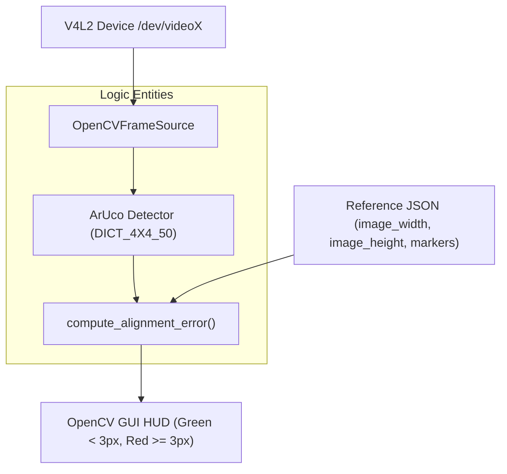
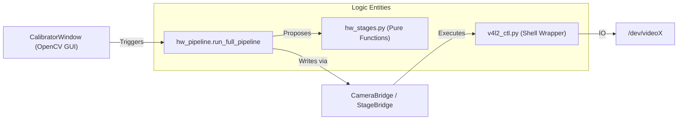

# 相机工具

相关源文件

生成此 wiki 页面时使用了以下文件作为上下文：

- [scripts/camera_topic_viewer.py](https://atomgit.com/openeuler/IB_Robot/blob/master/scripts/camera_topic_viewer.py)
- [src/dataset_tools/README.md](https://atomgit.com/openeuler/IB_Robot/blob/master/src/dataset_tools/README.md)
- [src/dataset_tools/dataset_tools/camera_alignment.py](https://atomgit.com/openeuler/IB_Robot/blob/master/src/dataset_tools/dataset_tools/camera_alignment.py)
- [src/dataset_tools/dataset_tools/camera_isp/__init__.py](https://atomgit.com/openeuler/IB_Robot/blob/master/src/dataset_tools/dataset_tools/camera_isp/__init__.py)
- [src/dataset_tools/dataset_tools/camera_isp/build_lut.py](https://atomgit.com/openeuler/IB_Robot/blob/master/src/dataset_tools/dataset_tools/camera_isp/build_lut.py)
- [src/dataset_tools/dataset_tools/camera_isp/camera_isp_offline_tables.json](https://atomgit.com/openeuler/IB_Robot/blob/master/src/dataset_tools/dataset_tools/camera_isp/camera_isp_offline_tables.json)
- [src/dataset_tools/dataset_tools/camera_isp/color_search.py](https://atomgit.com/openeuler/IB_Robot/blob/master/src/dataset_tools/dataset_tools/camera_isp/color_search.py)
- [src/dataset_tools/dataset_tools/camera_isp/color_space.py](https://atomgit.com/openeuler/IB_Robot/blob/master/src/dataset_tools/dataset_tools/camera_isp/color_space.py)
- [src/dataset_tools/dataset_tools/camera_isp/colorchecker24.py](https://atomgit.com/openeuler/IB_Robot/blob/master/src/dataset_tools/dataset_tools/camera_isp/colorchecker24.py)
- [src/dataset_tools/dataset_tools/camera_isp/exposure_units.py](https://atomgit.com/openeuler/IB_Robot/blob/master/src/dataset_tools/dataset_tools/camera_isp/exposure_units.py)
- [src/dataset_tools/dataset_tools/camera_isp/hw_pipeline.py](https://atomgit.com/openeuler/IB_Robot/blob/master/src/dataset_tools/dataset_tools/camera_isp/hw_pipeline.py)
- [src/dataset_tools/dataset_tools/camera_isp/hw_stages.py](https://atomgit.com/openeuler/IB_Robot/blob/master/src/dataset_tools/dataset_tools/camera_isp/hw_stages.py)
- [src/dataset_tools/dataset_tools/camera_isp/pedestal.py](https://atomgit.com/openeuler/IB_Robot/blob/master/src/dataset_tools/dataset_tools/camera_isp/pedestal.py)
- [src/dataset_tools/dataset_tools/camera_isp/solver.py](https://atomgit.com/openeuler/IB_Robot/blob/master/src/dataset_tools/dataset_tools/camera_isp/solver.py)
- [src/dataset_tools/dataset_tools/camera_isp/v4l2_ctl.py](https://atomgit.com/openeuler/IB_Robot/blob/master/src/dataset_tools/dataset_tools/camera_isp/v4l2_ctl.py)
- [src/dataset_tools/dataset_tools/camera_isp_calibrator.py](https://atomgit.com/openeuler/IB_Robot/blob/master/src/dataset_tools/dataset_tools/camera_isp_calibrator.py)
- [src/dataset_tools/dataset_tools/opencv_utils.py](https://atomgit.com/openeuler/IB_Robot/blob/master/src/dataset_tools/dataset_tools/opencv_utils.py)
- [src/dataset_tools/docs/tools/camera_alignment.md](https://atomgit.com/openeuler/IB_Robot/blob/master/src/dataset_tools/docs/tools/camera_alignment.md)
- [src/dataset_tools/test/test_camera_alignment.py](https://atomgit.com/openeuler/IB_Robot/blob/master/src/dataset_tools/test/test_camera_alignment.py)
- [src/dataset_tools/test/test_camera_isp_calibrator.py](https://atomgit.com/openeuler/IB_Robot/blob/master/src/dataset_tools/test/test_camera_isp_calibrator.py)

`dataset_tools` 包提供一组工具，用于保证不同机器人本体和数据采集会话之间的传感器一致性。这些工具聚焦两个主要方向：使用 ArUco 标记进行几何对齐，以及通过硬件图像信号处理器（ISP）流水线进行光度对齐。

## 1. 相机对齐工具（`camera_alignment`）

`camera_alignment` 工具用于将相机的物理视角恢复到“golden”参考位置。它使用 ArUco markers（具体为 `DICT_4X4_50` family）计算像素级位移误差 [src/dataset_tools/docs/tools/camera_alignment.md:1-3](https://atomgit.com/openeuler/IB_Robot/blob/master/src/dataset_tools/docs/tools/camera_alignment.md#L1-L3)。

### 实现与数据流
该工具直接从 V4L2 设备或 OpenCV 索引读取 [src/dataset_tools/dataset_tools/camera_alignment.py:102-104](https://atomgit.com/openeuler/IB_Robot/blob/master/src/dataset_tools/dataset_tools/camera_alignment.py#L102-L104)。它计算检测到的 markers 角点与已保存 reference payload 之间的平均欧氏距离 [src/dataset_tools/dataset_tools/camera_alignment.py:51-76](https://atomgit.com/openeuler/IB_Robot/blob/master/src/dataset_tools/dataset_tools/camera_alignment.py#L51-L76)。

**对齐数据流**

*来源: [src/dataset_tools/dataset_tools/camera_alignment.py:51-76](https://atomgit.com/openeuler/IB_Robot/blob/master/src/dataset_tools/dataset_tools/camera_alignment.py#L51-L76), [src/dataset_tools/docs/tools/camera_alignment.md:94-100](https://atomgit.com/openeuler/IB_Robot/blob/master/src/dataset_tools/docs/tools/camera_alignment.md#L94-L100)*

### 关键函数
- `compute_alignment_error`：遍历 `reference_data` 和 `detected_markers`，计算角点位移的平均 L2 norm [src/dataset_tools/dataset_tools/camera_alignment.py:51-76](https://atomgit.com/openeuler/IB_Robot/blob/master/src/dataset_tools/dataset_tools/camera_alignment.py#L51-L76)。
- `serialize_reference_payload`：将当前 marker 位置和帧尺寸捕获为 JSON 格式，供后续会话使用 [src/dataset_tools/dataset_tools/camera_alignment.py:203-214](https://atomgit.com/openeuler/IB_Robot/blob/master/src/dataset_tools/dataset_tools/camera_alignment.py#L203-L214)。

## 2. Camera ISP Calibrator（`camera_isp_calibrator`）

`camera_isp_calibrator` 是一个高级工具，用于将实时相机画面的视觉特性（曝光、色彩平衡、对比度）匹配到参考图像。它主要面向 UVC 兼容相机的硬件 ISP registers [src/dataset_tools/dataset_tools/camera_isp_calibrator.py:1-25](https://atomgit.com/openeuler/IB_Robot/blob/master/src/dataset_tools/dataset_tools/camera_isp_calibrator.py#L1-L25)。

### 硬件 ISP 流水线
标定遵循 `hw_pipeline.py` 中定义的 4 阶段顺序状态机 [src/dataset_tools/dataset_tools/camera_isp/hw_pipeline.py:1-15](https://atomgit.com/openeuler/IB_Robot/blob/master/src/dataset_tools/dataset_tools/camera_isp/hw_pipeline.py#L1-L15)：

| Stage | Logic Entity | Purpose |
| :--- | :--- | :--- |
| **Stage 1** | `propose_exposure` | 使用过曝保护将 `Y_mean` 推向 128（50% code value）[src/dataset_tools/dataset_tools/camera_isp/hw_stages.py:153-161](https://atomgit.com/openeuler/IB_Robot/blob/master/src/dataset_tools/dataset_tools/camera_isp/hw_stages.py#L153-L161)。 |
| **Stage 2** | `evaluate_gain_step_b` | 必要时提高 gain，但验证 SNR ≥ 20 dB。如果触及噪声底，则回退到 brightness offset [src/dataset_tools/dataset_tools/camera_isp/hw_stages.py:63-70](https://atomgit.com/openeuler/IB_Robot/blob/master/src/dataset_tools/dataset_tools/camera_isp/hw_stages.py#L63-L70)。 |
| **Stage 3** | `propose_sat_con` | 根据参考统计量缩放 saturation 和 contrast，并裁剪到驱动默认值的 ±30% [src/dataset_tools/dataset_tools/camera_isp/hw_stages.py:71-72](https://atomgit.com/openeuler/IB_Robot/blob/master/src/dataset_tools/dataset_tools/camera_isp/hw_stages.py#L71-L72)。 |
| **Stage 4** | `solve_kelvin_only` | 使用 McCamy 公式和 Planckian locus 投影，将 chromaticity 映射到 Kelvin [src/dataset_tools/dataset_tools/camera_isp/solver.py:6-33](https://atomgit.com/openeuler/IB_Robot/blob/master/src/dataset_tools/dataset_tools/camera_isp/solver.py#L6-L33)。 |

### 系统架构（ISP 标定）
该工具通过 bridge pattern 连接高层 GUI 交互和低层 V4L2 控制。

**ISP 控制架构**

*来源: [src/dataset_tools/dataset_tools/camera_isp/hw_pipeline.py:7-23](https://atomgit.com/openeuler/IB_Robot/blob/master/src/dataset_tools/dataset_tools/camera_isp/hw_pipeline.py#L7-L23), [src/dataset_tools/dataset_tools/camera_isp/v4l2_ctl.py:1-17](https://atomgit.com/openeuler/IB_Robot/blob/master/src/dataset_tools/dataset_tools/camera_isp/v4l2_ctl.py#L1-L17)*

### V4L2 控制集成
`v4l2_ctl.py` 模块处理 Linux UVC 驱动的复杂性，并为重命名 controls 提供回退，例如 `white_balance_automatic` vs `white_balance_temperature_auto` [src/dataset_tools/dataset_tools/camera_isp/v4l2_ctl.py:1-17](https://atomgit.com/openeuler/IB_Robot/blob/master/src/dataset_tools/dataset_tools/camera_isp/v4l2_ctl.py#L1-L17)。它确保 solver 尝试写入参数前，手动模式已经启用 [src/dataset_tools/dataset_tools/camera_isp/v4l2_ctl.py:141-159](https://atomgit.com/openeuler/IB_Robot/blob/master/src/dataset_tools/dataset_tools/camera_isp/v4l2_ctl.py#L141-L159)。

### 统一颜色搜索（KCS）
对于高级颜色匹配，该工具实现了 “Unified K/C/Sat Search”（`color_search.py`）。它在 Kelvin、Contrast 和 Saturation 上执行坐标下降，以最小化代价函数（ΔE2000）[src/dataset_tools/dataset_tools/camera_isp/color_search.py:1-38](https://atomgit.com/openeuler/IB_Robot/blob/master/src/dataset_tools/dataset_tools/camera_isp/color_search.py#L1-L38)。

- **24-card mode**：根据 ColorChecker24 patch truths 最小化误差 [src/dataset_tools/dataset_tools/camera_isp/color_search.py:12-15](https://atomgit.com/openeuler/IB_Robot/blob/master/src/dataset_tools/dataset_tools/camera_isp/color_search.py#L12-L15)。
- **ROI mode**：匹配实时图像和参考图像中用户定义区域的平均 Lab 值 [src/dataset_tools/dataset_tools/camera_isp/color_search.py:16-17](https://atomgit.com/openeuler/IB_Robot/blob/master/src/dataset_tools/dataset_tools/camera_isp/color_search.py#L16-L17)。

### 配置与持久化
标定结果会作为 JSON overrides 保存到 `~/.ros/ibrobot/camera_isp_overrides/{camera}.json` [src/dataset_tools/dataset_tools/camera_isp_calibrator.py:118-121](https://atomgit.com/openeuler/IB_Robot/blob/master/src/dataset_tools/dataset_tools/camera_isp_calibrator.py#L118-L121)。这些 overrides 会被 `robot_config` 中的 `perception.py` launcher 自动检测并应用，保证一致性，同时不修改中心 YAML 单一事实源 [src/dataset_tools/README.md:191-193](https://atomgit.com/openeuler/IB_Robot/blob/master/src/dataset_tools/README.md#L191-L193)。

来源：
- [src/dataset_tools/dataset_tools/camera_alignment.py:1-214](https://atomgit.com/openeuler/IB_Robot/blob/master/src/dataset_tools/dataset_tools/camera_alignment.py#L1-L214)
- [src/dataset_tools/dataset_tools/camera_isp_calibrator.py:1-121](https://atomgit.com/openeuler/IB_Robot/blob/master/src/dataset_tools/dataset_tools/camera_isp_calibrator.py#L1-L121)
- [src/dataset_tools/dataset_tools/camera_isp/hw_pipeline.py:1-150](https://atomgit.com/openeuler/IB_Robot/blob/master/src/dataset_tools/dataset_tools/camera_isp/hw_pipeline.py#L1-L150)
- [src/dataset_tools/dataset_tools/camera_isp/hw_stages.py:1-183](https://atomgit.com/openeuler/IB_Robot/blob/master/src/dataset_tools/dataset_tools/camera_isp/hw_stages.py#L1-L183)
- [src/dataset_tools/dataset_tools/camera_isp/v4l2_ctl.py:1-159](https://atomgit.com/openeuler/IB_Robot/blob/master/src/dataset_tools/dataset_tools/camera_isp/v4l2_ctl.py#L1-L159)
- [src/dataset_tools/dataset_tools/camera_isp/color_search.py:1-130](https://atomgit.com/openeuler/IB_Robot/blob/master/src/dataset_tools/dataset_tools/camera_isp/color_search.py#L1-L130)
- [src/dataset_tools/README.md:162-250](https://atomgit.com/openeuler/IB_Robot/blob/master/src/dataset_tools/README.md#L162-L250)

