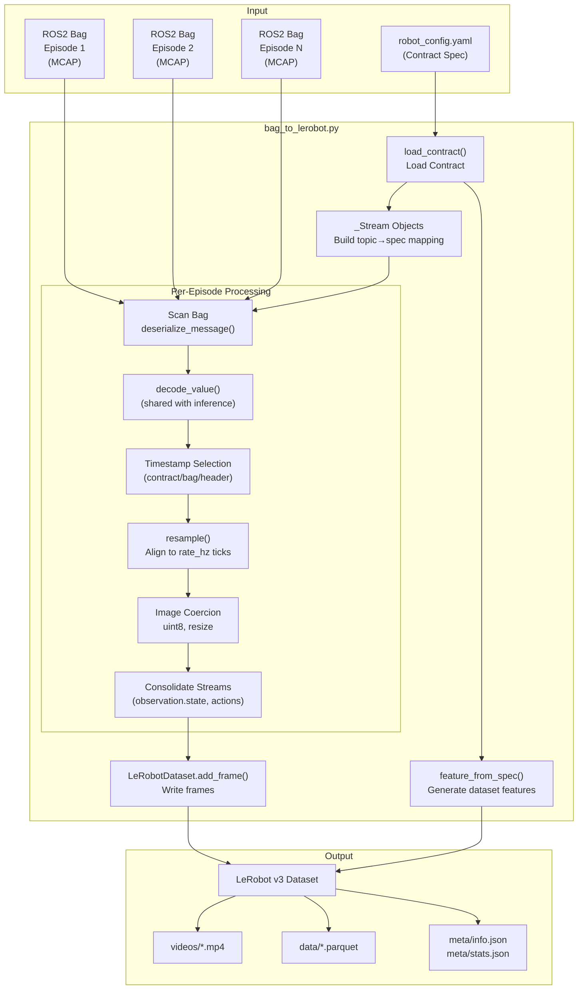
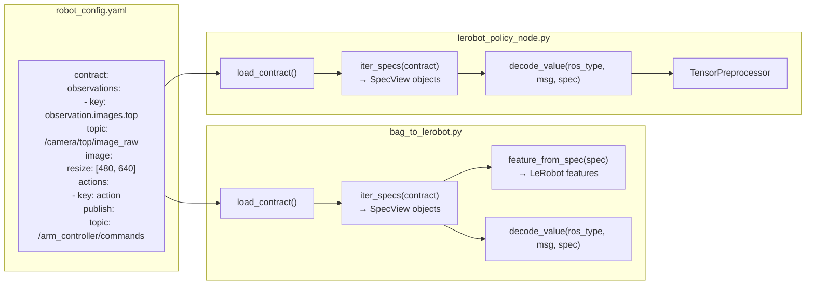

# 数据集转换

<details>
<summary>相关源文件</summary>

生成此 wiki 页面时使用了以下文件作为上下文：

- [src/dataset_tools/README.md](https://atomgit.com/openeuler/IB_Robot/blob/master/src/dataset_tools/README.md)
- [src/dataset_tools/dataset_tools/bag_to_lerobot.py](https://atomgit.com/openeuler/IB_Robot/blob/master/src/dataset_tools/dataset_tools/bag_to_lerobot.py)
- [src/dataset_tools/dataset_tools/camera_alignment.py](https://atomgit.com/openeuler/IB_Robot/blob/master/src/dataset_tools/dataset_tools/camera_alignment.py)
- [src/dataset_tools/dataset_tools/episode_recorder.py](https://atomgit.com/openeuler/IB_Robot/blob/master/src/dataset_tools/dataset_tools/episode_recorder.py)
- [src/dataset_tools/dataset_tools/opencv_utils.py](https://atomgit.com/openeuler/IB_Robot/blob/master/src/dataset_tools/dataset_tools/opencv_utils.py)
- [src/dataset_tools/docs/tools/camera_alignment.md](https://atomgit.com/openeuler/IB_Robot/blob/master/src/dataset_tools/docs/tools/camera_alignment.md)
- [src/dataset_tools/test/test_camera_alignment.py](https://atomgit.com/openeuler/IB_Robot/blob/master/src/dataset_tools/test/test_camera_alignment.py)
- [src/dataset_tools/test/test_camera_isp_calibrator.py](https://atomgit.com/openeuler/IB_Robot/blob/master/src/dataset_tools/test/test_camera_isp_calibrator.py)
- [src/robot_config/robot_config/contract_builder.py](https://atomgit.com/openeuler/IB_Robot/blob/master/src/robot_config/robot_config/contract_builder.py)
- [src/robot_config/robot_config/contract_utils.py](https://atomgit.com/openeuler/IB_Robot/blob/master/src/robot_config/robot_config/contract_utils.py)
- [src/robot_config/robot_config/generators/__init__.py](https://atomgit.com/openeuler/IB_Robot/blob/master/src/robot_config/robot_config/generators/__init__.py)
- [src/robot_config/robot_config/generators/contract.py](https://atomgit.com/openeuler/IB_Robot/blob/master/src/robot_config/robot_config/generators/contract.py)
- [src/robot_config/robot_config/launch_builders/recording.py](https://atomgit.com/openeuler/IB_Robot/blob/master/src/robot_config/robot_config/launch_builders/recording.py)

</details>


本文档说明 `bag_to_lerobot` 转换工具。该工具将 ROS2 bag files（录制 episodes）转换为 LeRobot v3 dataset format，用于训练机器学习策略。它使用与实时推理相同的 contract-driven 处理工具，保证训练和部署对齐。

有关录制 episodes，请参见 [Episode 录制](./episode_recording.md)。有关与 LeRobot 库的训练集成，请参见 [训练集成](./training_integration.md)。

---

## 目的与范围

`bag_to_lerobot` 工具将一个或多个 ROS 2 bags 转换为 LeRobot v3 dataset，并提供以下保证：

- **Training-Serving Consistency**：使用与 `lerobot_policy_node` 相同的 `decode_value()` 函数和重采样逻辑，消除 training-serving skew [src/dataset_tools/dataset_tools/bag_to_lerobot.py:8-10](https://atomgit.com/openeuler/IB_Robot/blob/master/src/dataset_tools/dataset_tools/bag_to_lerobot.py#L8-L10)。
- **单一事实源**：直接从 `robot_config.yaml` 加载 contract specs，确保 observations 和 actions 与机器人配置一致 [src/dataset_tools/dataset_tools/bag_to_lerobot.py:14-15](https://atomgit.com/openeuler/IB_Robot/blob/master/src/dataset_tools/dataset_tools/bag_to_lerobot.py#L14-L15)。
- **Feature Alignment**：通过 `feature_from_spec()` 生成与模型输入要求完全匹配的 dataset features [src/dataset_tools/dataset_tools/bag_to_lerobot.py:71-73](https://atomgit.com/openeuler/IB_Robot/blob/master/src/dataset_tools/dataset_tools/bag_to_lerobot.py#L71-L73)。

该工具作为独立 Python 脚本运行，使用 `rosbag2_py` 提取数据，并使用 `lerobot` 库创建数据集 [src/dataset_tools/dataset_tools/bag_to_lerobot.py:86-91](https://atomgit.com/openeuler/IB_Robot/blob/master/src/dataset_tools/dataset_tools/bag_to_lerobot.py#L86-L91)。

**来源**: [src/dataset_tools/dataset_tools/bag_to_lerobot.py:1-73](https://atomgit.com/openeuler/IB_Robot/blob/master/src/dataset_tools/dataset_tools/bag_to_lerobot.py#L1-L73), [src/dataset_tools/README.md:104-111](https://atomgit.com/openeuler/IB_Robot/blob/master/src/dataset_tools/README.md#L104-L111)

---

## 转换流水线概览

该工具遵循结构化流水线，以保证数据完整性并与机器人 contract 对齐。

Title: bag_to_lerobot Processing Pipeline


**来源**: [src/dataset_tools/dataset_tools/bag_to_lerobot.py:12-19](https://atomgit.com/openeuler/IB_Robot/blob/master/src/dataset_tools/dataset_tools/bag_to_lerobot.py#L12-L19), [src/dataset_tools/dataset_tools/bag_to_lerobot.py:454-648](https://atomgit.com/openeuler/IB_Robot/blob/master/src/dataset_tools/dataset_tools/bag_to_lerobot.py#L454-L648), [src/dataset_tools/README.md:138-153](https://atomgit.com/openeuler/IB_Robot/blob/master/src/dataset_tools/README.md#L138-L153)

---

## Contract 作为单一事实源

转换过程直接从 `robot_config.yaml` 加载 contract，确保训练数据创建和部署之间处理一致。

Title: Unified Contract Logic across Training and Inference


该工具使用 `robot_config.contract_utils` 中的 `load_contract` 解析 YAML，并使用 `iter_specs` 遍历所有定义的 observation 和 action entries [src/dataset_tools/dataset_tools/bag_to_lerobot.py:94-99](https://atomgit.com/openeuler/IB_Robot/blob/master/src/dataset_tools/dataset_tools/bag_to_lerobot.py#L94-L99)。

**来源**: [src/dataset_tools/dataset_tools/bag_to_lerobot.py:94-105](https://atomgit.com/openeuler/IB_Robot/blob/master/src/dataset_tools/dataset_tools/bag_to_lerobot.py#L94-L105), [src/robot_config/robot_config/contract_builder.py:49-57](https://atomgit.com/openeuler/IB_Robot/blob/master/src/robot_config/robot_config/contract_builder.py#L49-L57), [src/dataset_tools/README.md:14-29](https://atomgit.com/openeuler/IB_Robot/blob/master/src/dataset_tools/README.md#L14-L29)

---

## Stream Planning 与 Topic Dispatch

扫描 bags 前，工具初始化 `_Stream` objects，用于保存每个 contract entry 的解码值和时间戳 [src/dataset_tools/dataset_tools/bag_to_lerobot.py:121-141](https://atomgit.com/openeuler/IB_Robot/blob/master/src/dataset_tools/dataset_tools/bag_to_lerobot.py#L121-L141)。

**关键逻辑**：
- **Topic Resolution**：工具将 bag topics 与每个 contract spec 中的 `topic` 字段匹配 [src/dataset_tools/dataset_tools/bag_to_lerobot.py:12-19](https://atomgit.com/openeuler/IB_Robot/blob/master/src/dataset_tools/dataset_tools/bag_to_lerobot.py#L12-L19)。
- **Data Accumulation**：读取 bag 时，消息被解码并追加到对应 `_Stream` 的 `val` 列表 [src/dataset_tools/dataset_tools/bag_to_lerobot.py:121-141](https://atomgit.com/openeuler/IB_Robot/blob/master/src/dataset_tools/dataset_tools/bag_to_lerobot.py#L121-L141)。
- **Joint Normalization**：工具使用 `build_joint_conversion_table` 在解码阶段处理校准和单位转换，例如 degree 到 radian [src/dataset_tools/dataset_tools/bag_to_lerobot.py:106-113](https://atomgit.com/openeuler/IB_Robot/blob/master/src/dataset_tools/dataset_tools/bag_to_lerobot.py#L106-L113)。

**来源**: [src/dataset_tools/dataset_tools/bag_to_lerobot.py:121-141](https://atomgit.com/openeuler/IB_Robot/blob/master/src/dataset_tools/dataset_tools/bag_to_lerobot.py#L121-L141), [src/dataset_tools/dataset_tools/bag_to_lerobot.py:106-113](https://atomgit.com/openeuler/IB_Robot/blob/master/src/dataset_tools/dataset_tools/bag_to_lerobot.py#L106-L113)

---

## 消息解码与时间戳选择

每条消息都通过共享的 `decode_value()` 函数解码。该函数支持 `sensor_msgs/Image`、`sensor_msgs/JointState` 和 `geometry_msgs/Twist` 等 ROS types [src/dataset_tools/dataset_tools/bag_to_lerobot.py:100-101](https://atomgit.com/openeuler/IB_Robot/blob/master/src/dataset_tools/dataset_tools/bag_to_lerobot.py#L100-L101)。

**Timestamp Selection Modes** [src/dataset_tools/dataset_tools/bag_to_lerobot.py:49-54](https://atomgit.com/openeuler/IB_Robot/blob/master/src/dataset_tools/dataset_tools/bag_to_lerobot.py#L49-L54)：

| Mode | Behavior |
|------|----------|
| `contract` | 使用每个 spec 的 `stamp_src` 字段，默认 receive time，可覆盖为 header [src/robot_config/robot_config/contract_utils.py:34-35](https://atomgit.com/openeuler/IB_Robot/blob/master/src/robot_config/robot_config/contract_utils.py#L34-L35) |
| `bag` | 使用 bag receive time（录制时间）[src/dataset_tools/dataset_tools/bag_to_lerobot.py:52-52](https://atomgit.com/openeuler/IB_Robot/blob/master/src/dataset_tools/dataset_tools/bag_to_lerobot.py#L52-L52) |
| `header` | 优先使用 `msg.header.stamp`，bag time 作为 fallback [src/dataset_tools/dataset_tools/bag_to_lerobot.py:53-53](https://atomgit.com/openeuler/IB_Robot/blob/master/src/dataset_tools/dataset_tools/bag_to_lerobot.py#L53-L53) |

**来源**: [src/dataset_tools/dataset_tools/bag_to_lerobot.py:49-54](https://atomgit.com/openeuler/IB_Robot/blob/master/src/dataset_tools/dataset_tools/bag_to_lerobot.py#L49-L54), [src/dataset_tools/dataset_tools/bag_to_lerobot.py:103-105](https://atomgit.com/openeuler/IB_Robot/blob/master/src/dataset_tools/dataset_tools/bag_to_lerobot.py#L103-L105), [src/robot_config/robot_config/contract_utils.py:29-40](https://atomgit.com/openeuler/IB_Robot/blob/master/src/robot_config/robot_config/contract_utils.py#L29-L40)

---

## 重采样到 Contract Rate

扫描后，工具使用 `resample()` utility 将所有 streams 重采样到 contract 的 `rate_hz` 所定义的均匀 ticks [src/dataset_tools/dataset_tools/bag_to_lerobot.py:102-102](https://atomgit.com/openeuler/IB_Robot/blob/master/src/dataset_tools/dataset_tools/bag_to_lerobot.py#L102-L102)。

**重采样细节**：
- **Temporal Alignment**：所有 observations 和 actions 基于 episode 持续时间对齐到公共时钟 [src/dataset_tools/dataset_tools/bag_to_lerobot.py:12-19](https://atomgit.com/openeuler/IB_Robot/blob/master/src/dataset_tools/dataset_tools/bag_to_lerobot.py#L12-L19)。
- **Zero Padding**：如果某个 stream 开始较晚或结束较早，使用 `zero_pad` 保持 tensor shapes 一致 [src/dataset_tools/dataset_tools/bag_to_lerobot.py:104-105](https://atomgit.com/openeuler/IB_Robot/blob/master/src/dataset_tools/dataset_tools/bag_to_lerobot.py#L104-L105)。

**来源**: [src/dataset_tools/dataset_tools/bag_to_lerobot.py:102-105](https://atomgit.com/openeuler/IB_Robot/blob/master/src/dataset_tools/dataset_tools/bag_to_lerobot.py#L102-L105), [src/dataset_tools/dataset_tools/bag_to_lerobot.py:12-19](https://atomgit.com/openeuler/IB_Robot/blob/master/src/dataset_tools/dataset_tools/bag_to_lerobot.py#L12-L19)

---

## LeRobot v3 Dataset 输出

转换器使用 `lerobot` 库中的 `LeRobotDataset` 创建 LeRobot v3 dataset [src/dataset_tools/dataset_tools/bag_to_lerobot.py:91-91](https://atomgit.com/openeuler/IB_Robot/blob/master/src/dataset_tools/dataset_tools/bag_to_lerobot.py#L91-L91)。

### 输出目录结构
```text
output_dataset/
├── videos/
│   ├── observation.images.top/
│   │   └── chunk-000/file-000.mp4
│   └── ...
├── data/
│   └── chunk-000/file-000.parquet
└── meta/
    ├── info.json
    ├── tasks.parquet
    ├── stats.json
    └── episodes/
```

### 元数据与指纹
工具管理 dataset metadata，用于跟踪转换设置：
- **Fingerprints**：使用 `contract_fingerprint` 确保数据集匹配机器人配置 [src/dataset_tools/dataset_tools/bag_to_lerobot.py:97-97](https://atomgit.com/openeuler/IB_Robot/blob/master/src/dataset_tools/dataset_tools/bag_to_lerobot.py#L97-L97)。
- **Metadata Resolution**：`_dataset_metadata_for_bag` 和 `_lerobot_metadata_entry` 解析 normalization modes、joint orders 等转换参数 [src/dataset_tools/dataset_tools/bag_to_lerobot.py:155-193](https://atomgit.com/openeuler/IB_Robot/blob/master/src/dataset_tools/dataset_tools/bag_to_lerobot.py#L155-L193)。

**来源**: [src/dataset_tools/dataset_tools/bag_to_lerobot.py:60-66](https://atomgit.com/openeuler/IB_Robot/blob/master/src/dataset_tools/dataset_tools/bag_to_lerobot.py#L60-L66), [src/dataset_tools/dataset_tools/bag_to_lerobot.py:155-193](https://atomgit.com/openeuler/IB_Robot/blob/master/src/dataset_tools/dataset_tools/bag_to_lerobot.py#L155-L193), [src/dataset_tools/README.md:138-153](https://atomgit.com/openeuler/IB_Robot/blob/master/src/dataset_tools/README.md#L138-L153)

---

## 图像规整与视频编码

图像会被处理为完全匹配训练要求：
- **Shared Helpers**：使用与实时推理相同的图像 resize 和 normalization 逻辑 [src/dataset_tools/dataset_tools/bag_to_lerobot.py:69-70](https://atomgit.com/openeuler/IB_Robot/blob/master/src/dataset_tools/dataset_tools/bag_to_lerobot.py#L69-L70)。
- **Video Storage**：默认情况下，图像 streams 会使用 H.264 编码为 MP4 视频 [src/dataset_tools/dataset_tools/bag_to_lerobot.py:62-63](https://atomgit.com/openeuler/IB_Robot/blob/master/src/dataset_tools/dataset_tools/bag_to_lerobot.py#L62-L63)。
- **PNG Fallback**：如果提供 `--no-videos`，工具改为保存单独 PNG 文件 [src/dataset_tools/dataset_tools/bag_to_lerobot.py:55-56](https://atomgit.com/openeuler/IB_Robot/blob/master/src/dataset_tools/dataset_tools/bag_to_lerobot.py#L55-L56)。

**来源**: [src/dataset_tools/dataset_tools/bag_to_lerobot.py:55-73](https://atomgit.com/openeuler/IB_Robot/blob/master/src/dataset_tools/dataset_tools/bag_to_lerobot.py#L55-L73), [src/dataset_tools/README.md:133-133](https://atomgit.com/openeuler/IB_Robot/blob/master/src/dataset_tools/README.md#L133-L133)

---

## 命令行接口

该工具通常通过 `bag_to_lerobot` entry point 调用。

### 基本用法
```bash
ros2 run dataset_tools bag_to_lerobot \
    --bags-dir ~/rosbag/episodes/so101_single_arm \
    --robot-config src/robot_config/config/robots/so101_single_arm.yaml \
    --out /path/to/output_dataset
```

### 关键选项 [src/dataset_tools/dataset_tools/bag_to_lerobot.py:43-57](https://atomgit.com/openeuler/IB_Robot/blob/master/src/dataset_tools/dataset_tools/bag_to_lerobot.py#L43-L57)

| Flag | Description | Default |
|------|-------------|---------|
| `--bags-dir` | dataset 根目录或 episodes 目录，自动发现多个 episode bag | 必需 |
| `--robot-config` | 单一事实源配置 YAML 的路径 | 必需 |
| `--out` | 输出数据集目录 | 必需 |
| `--repo-id` | 数据集 repo_id | `rosbag_v30` |
| `--timestamp` | 重采样策略：`contract`（默认）、`bag` 或 `header` | `contract` |
| `--no-videos` | 禁用 MP4 编码，改为存储 PNG | `false` |
| `--image-threads`| 图像写入线程数 | `4` |
| `--chunk-size` | 每个 chunk 的帧数 | `1000` |

**来源**: [src/dataset_tools/dataset_tools/bag_to_lerobot.py:27-57](https://atomgit.com/openeuler/IB_Robot/blob/master/src/dataset_tools/dataset_tools/bag_to_lerobot.py#L27-L57), [src/dataset_tools/README.md:118-137](https://atomgit.com/openeuler/IB_Robot/blob/master/src/dataset_tools/README.md#L118-L137)

