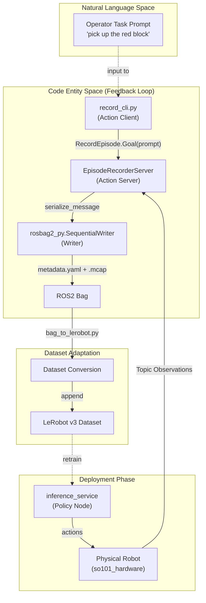
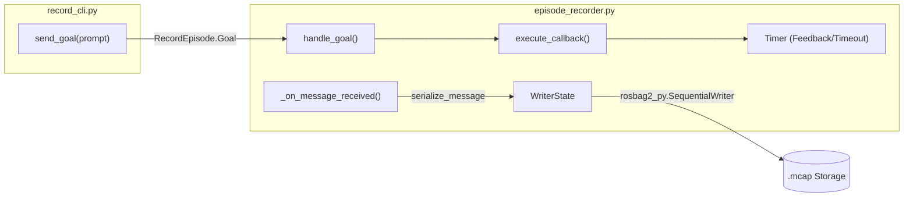

# 部署反馈闭环

<details>
<summary>相关源文件</summary>

生成此 wiki 页面时使用了以下文件作为上下文：

- [src/dataset_tools/dataset_tools/bag_to_lerobot.py](https://atomgit.com/openeuler/IB_Robot/blob/master/src/dataset_tools/dataset_tools/bag_to_lerobot.py)
- [src/dataset_tools/dataset_tools/episode_recorder.py](https://atomgit.com/openeuler/IB_Robot/blob/master/src/dataset_tools/dataset_tools/episode_recorder.py)
- [src/dataset_tools/dataset_tools/rerun_viewer.py](https://atomgit.com/openeuler/IB_Robot/blob/master/src/dataset_tools/dataset_tools/rerun_viewer.py)
- [src/dataset_tools/test/test_rerun_viewer.py](https://atomgit.com/openeuler/IB_Robot/blob/master/src/dataset_tools/test/test_rerun_viewer.py)
- [src/robot_config/robot_config/contract_builder.py](https://atomgit.com/openeuler/IB_Robot/blob/master/src/robot_config/robot_config/contract_builder.py)
- [src/robot_config/robot_config/contract_utils.py](https://atomgit.com/openeuler/IB_Robot/blob/master/src/robot_config/robot_config/contract_utils.py)
- [src/robot_config/robot_config/generators/__init__.py](https://atomgit.com/openeuler/IB_Robot/blob/master/src/robot_config/robot_config/generators/__init__.py)
- [src/robot_config/robot_config/generators/contract.py](https://atomgit.com/openeuler/IB_Robot/blob/master/src/robot_config/robot_config/generators/contract.py)
- [src/robot_config/robot_config/launch_builders/recording.py](https://atomgit.com/openeuler/IB_Robot/blob/master/src/robot_config/robot_config/launch_builders/recording.py)
- [src/robot_config/test/test_recording_launch_builder.py](https://atomgit.com/openeuler/IB_Robot/blob/master/src/robot_config/test/test_recording_launch_builder.py)

</details>


本文档说明 IB-Robot 中的部署反馈闭环机制。该机制通过记录已部署机器人产生的在线评估数据，并将其回流到训练流水线，支持持续改进和领域适配。

---

## 概览

部署反馈闭环补齐了数据生命周期的最后一环，让已部署机器人可以记录真实执行数据，用于后续训练迭代。它支持：

- **领域适配**：让模型适应初始训练中未覆盖的新环境或新任务。
- **失败分析**：结合 operator prompts 记录失败案例，用于针对性再训练。
- **持续学习**：通过聚合部署 episodes，逐步提升模型表现。

反馈闭环复用现有数据流水线，并使用初始数据采集同一套 contract-aware 处理工具（`episode_recorder`、`bag_to_lerobot`），以减少 training/serving skew [src/dataset_tools/dataset_tools/bag_to_lerobot.py:8-11](https://atomgit.com/openeuler/IB_Robot/blob/master/src/dataset_tools/dataset_tools/bag_to_lerobot.py#L8-L11)。

**来源**: [src/dataset_tools/dataset_tools/bag_to_lerobot.py:1-20](https://atomgit.com/openeuler/IB_Robot/blob/master/src/dataset_tools/dataset_tools/bag_to_lerobot.py#L1-L20), [src/robot_config/robot_config/launch_builders/recording.py:1-9](https://atomgit.com/openeuler/IB_Robot/blob/master/src/robot_config/robot_config/launch_builders/recording.py#L1-L9)

---

## 反馈闭环架构

下图展示部署反馈如何接入整体数据生命周期，并将自然语言 prompts 连接到被记录的代码实体。

### 数据生命周期图


**关键工作流**：
1. 机器人运行已部署策略，例如 ACT 或 Diffusion model [src/dataset_tools/dataset_tools/bag_to_lerobot.py:8-10](https://atomgit.com/openeuler/IB_Robot/blob/master/src/dataset_tools/dataset_tools/bag_to_lerobot.py#L8-L10)。
2. 操作员通过 `record_cli` 触发录制，并为当前 episode 提供语义 prompt [src/dataset_tools/dataset_tools/episode_recorder.py:53-55](https://atomgit.com/openeuler/IB_Robot/blob/master/src/dataset_tools/dataset_tools/episode_recorder.py#L53-L55)。
3. `EpisodeRecorderServer` 基于 `robot_config.yaml` 中的 `contract` section 捕获 ROS2 消息 [src/dataset_tools/dataset_tools/episode_recorder.py:138-143](https://atomgit.com/openeuler/IB_Robot/blob/master/src/dataset_tools/dataset_tools/episode_recorder.py#L138-L143)。
4. 录制得到的 bag 通过 `bag_to_lerobot.py` 转换为 LeRobot v3 格式。该脚本使用共享 `decode_value` 逻辑和 contract specs，确保训练和推理对齐 [src/dataset_tools/dataset_tools/bag_to_lerobot.py:14-19](https://atomgit.com/openeuler/IB_Robot/blob/master/src/dataset_tools/dataset_tools/bag_to_lerobot.py#L14-L19)。

**来源**: [src/dataset_tools/dataset_tools/episode_recorder.py:8-32](https://atomgit.com/openeuler/IB_Robot/blob/master/src/dataset_tools/dataset_tools/episode_recorder.py#L8-L32), [src/dataset_tools/dataset_tools/bag_to_lerobot.py:8-19](https://atomgit.com/openeuler/IB_Robot/blob/master/src/dataset_tools/dataset_tools/bag_to_lerobot.py#L8-L19), [src/robot_config/robot_config/launch_builders/recording.py:138-143](https://atomgit.com/openeuler/IB_Robot/blob/master/src/robot_config/robot_config/launch_builders/recording.py#L138-L143)

---

## 录制模式

系统支持由 `robot_config` launch 系统生成的两种录制模式 [src/robot_config/robot_config/launch_builders/recording.py:38-42](https://atomgit.com/openeuler/IB_Robot/blob/master/src/robot_config/robot_config/launch_builders/recording.py#L38-L42)：

| Mode | Implementation | Use Case |
|------|----------------|----------|
| **Continuous** | `ros2 bag record` process | 无语义触发的完整会话日志，保存到 `~/rosbag/` [src/robot_config/robot_config/launch_builders/recording.py:79-96](https://atomgit.com/openeuler/IB_Robot/blob/master/src/robot_config/robot_config/launch_builders/recording.py#L79-L96)。 |
| **Episodic** | `EpisodeRecorderServer` | 选择性捕获特定任务，通过 `RecordEpisode` Action 触发 [src/robot_config/robot_config/launch_builders/recording.py:120-130](https://atomgit.com/openeuler/IB_Robot/blob/master/src/robot_config/robot_config/launch_builders/recording.py#L120-L130)。 |

### 启动录制
通过 `record:=true` launch 参数启用录制。除非显式指定，否则模式默认为 `continuous` [src/robot_config/robot_config/launch_builders/recording.py:65-72](https://atomgit.com/openeuler/IB_Robot/blob/master/src/robot_config/robot_config/launch_builders/recording.py#L65-L72)。

```bash
# Episodic recording for feedback
ros2 launch robot_config robot.launch.py record:=true record_mode:=episodic

# Continuous recording
ros2 launch robot_config robot.launch.py record:=true record_mode:=continuous
```

**来源**: [src/robot_config/robot_config/launch_builders/recording.py:38-76](https://atomgit.com/openeuler/IB_Robot/blob/master/src/robot_config/robot_config/launch_builders/recording.py#L38-L76), [src/robot_config/robot_config/launch_builders/recording.py:79-117](https://atomgit.com/openeuler/IB_Robot/blob/master/src/robot_config/robot_config/launch_builders/recording.py#L79-L117), [src/robot_config/robot_config/launch_builders/recording.py:120-144](https://atomgit.com/openeuler/IB_Robot/blob/master/src/robot_config/robot_config/launch_builders/recording.py#L120-L144)

---

## Episode Recorder 实现

### Action Server 接口
`EpisodeRecorderServer` 使用 `RecordEpisode` action 接口管理录制生命周期 [src/dataset_tools/dataset_tools/episode_recorder.py:14-17](https://atomgit.com/openeuler/IB_Robot/blob/master/src/dataset_tools/dataset_tools/episode_recorder.py#L14-L17)。它使用 `rosbag2_py.SequentialWriter` 将序列化后的 CDR bytes 写入磁盘 [src/dataset_tools/dataset_tools/episode_recorder.py:173-188](https://atomgit.com/openeuler/IB_Robot/blob/master/src/dataset_tools/dataset_tools/episode_recorder.py#L173-L188)。



### 关键组件
- **单一事实源**：基于机器人配置的 `contract` section 创建订阅，确保只记录相关 topics [src/dataset_tools/dataset_tools/episode_recorder.py:21-22](https://atomgit.com/openeuler/IB_Robot/blob/master/src/dataset_tools/dataset_tools/episode_recorder.py#L21-L22)。
- **Caching**：recorder 使用内部缓存（默认 100MB）平滑写入突发，通过 `max_cache_size` 配置 [src/dataset_tools/dataset_tools/episode_recorder.py:107-107](https://atomgit.com/openeuler/IB_Robot/blob/master/src/dataset_tools/dataset_tools/episode_recorder.py#L107-L107)。
- **元数据管理**：episode 完成后，server 尝试用 operator prompt 和 `lerobot_conversion_fingerprint` 修补 `metadata.yaml`，供下游处理使用 [src/dataset_tools/dataset_tools/episode_recorder.py:29-31](https://atomgit.com/openeuler/IB_Robot/blob/master/src/dataset_tools/dataset_tools/episode_recorder.py#L29-L31)。

**来源**: [src/dataset_tools/dataset_tools/episode_recorder.py:8-32](https://atomgit.com/openeuler/IB_Robot/blob/master/src/dataset_tools/dataset_tools/episode_recorder.py#L8-L32), [src/dataset_tools/dataset_tools/episode_recorder.py:173-190](https://atomgit.com/openeuler/IB_Robot/blob/master/src/dataset_tools/dataset_tools/episode_recorder.py#L173-L190), [src/robot_config/robot_config/launch_builders/recording.py:138-151](https://atomgit.com/openeuler/IB_Robot/blob/master/src/robot_config/robot_config/launch_builders/recording.py#L138-L151)

---

## 数据转换与重采样

处理反馈数据时，需要将原始 bags 转换为适合训练的格式。`bag_to_lerobot.py` 脚本严格遵循机器人 contract 完成这一过程 [src/dataset_tools/dataset_tools/bag_to_lerobot.py:14-15](https://atomgit.com/openeuler/IB_Robot/blob/master/src/dataset_tools/dataset_tools/bag_to_lerobot.py#L14-L15)。

### 转换流水线
1. **加载 Contract**：使用 `robot_config.contract_utils` 中的 `load_contract` 作为单一事实源 [src/dataset_tools/dataset_tools/bag_to_lerobot.py:24-25](https://atomgit.com/openeuler/IB_Robot/blob/master/src/dataset_tools/dataset_tools/bag_to_lerobot.py#L24-L25)。
2. **扫描并解码**：扫描 bag，并使用共享 `tensormsg` converters 解码 contract topics [src/dataset_tools/dataset_tools/bag_to_lerobot.py:15-16](https://atomgit.com/openeuler/IB_Robot/blob/master/src/dataset_tools/dataset_tools/bag_to_lerobot.py#L15-L16)。
3. **重采样**：使用 `resample` 逻辑，将多个数据流（相机、关节）对齐到 contract 的 `rate_hz` [src/dataset_tools/dataset_tools/bag_to_lerobot.py:17-18](https://atomgit.com/openeuler/IB_Robot/blob/master/src/dataset_tools/dataset_tools/bag_to_lerobot.py#L17-L18)。
4. **归一化**：根据 `robot_config` 应用关节转换表和夹爪归一化 [src/dataset_tools/dataset_tools/bag_to_lerobot.py:106-113](https://atomgit.com/openeuler/IB_Robot/blob/master/src/dataset_tools/dataset_tools/bag_to_lerobot.py#L106-L113)。

### CLI 用法示例
```bash
python3 bag_to_lerobot.py \
    --bag /path/to/bag_dir \
    --robot-config /path/to/robot_config.yaml \
    --out /path/to/lerobot_dataset_root
```

**来源**: [src/dataset_tools/dataset_tools/bag_to_lerobot.py:6-19](https://atomgit.com/openeuler/IB_Robot/blob/master/src/dataset_tools/dataset_tools/bag_to_lerobot.py#L6-L19), [src/dataset_tools/dataset_tools/bag_to_lerobot.py:27-41](https://atomgit.com/openeuler/IB_Robot/blob/master/src/dataset_tools/dataset_tools/bag_to_lerobot.py#L27-L41), [src/dataset_tools/dataset_tools/bag_to_lerobot.py:94-114](https://atomgit.com/openeuler/IB_Robot/blob/master/src/dataset_tools/dataset_tools/bag_to_lerobot.py#L94-L114)

---

## 验证与错误处理

为保证反馈闭环完整性，系统实现了多层验证：

- **架构验证**：`validate_control_mode_config` 在启动系统前检查模型、观测和外设引用是否存在 [src/robot_config/robot_config/contract_builder.py:12-24](https://atomgit.com/openeuler/IB_Robot/blob/master/src/robot_config/robot_config/contract_builder.py#L12-L24)。
- **外设一致性**：`validate_contract_peripheral_consistency` 确保 contract 引用的相机或传感器确实定义在机器人硬件外设中 [src/robot_config/robot_config/generators/contract.py:173-185](https://atomgit.com/openeuler/IB_Robot/blob/master/src/robot_config/robot_config/generators/contract.py#L173-L185)。
- **Writer 可靠性**：`EpisodeRecorderServer` 将 writer 失败视为当前 episode 的致命错误，记录 traceback 并干净结束 action，避免产生部分或损坏数据 [src/dataset_tools/dataset_tools/episode_recorder.py:63-65](https://atomgit.com/openeuler/IB_Robot/blob/master/src/dataset_tools/dataset_tools/episode_recorder.py#L63-L65)。

**来源**: [src/robot_config/robot_config/contract_builder.py:12-24](https://atomgit.com/openeuler/IB_Robot/blob/master/src/robot_config/robot_config/contract_builder.py#L12-L24), [src/robot_config/robot_config/generators/contract.py:173-195](https://atomgit.com/openeuler/IB_Robot/blob/master/src/robot_config/robot_config/generators/contract.py#L173-L195), [src/dataset_tools/dataset_tools/episode_recorder.py:63-68](https://atomgit.com/openeuler/IB_Robot/blob/master/src/dataset_tools/dataset_tools/episode_recorder.py#L63-L68)

