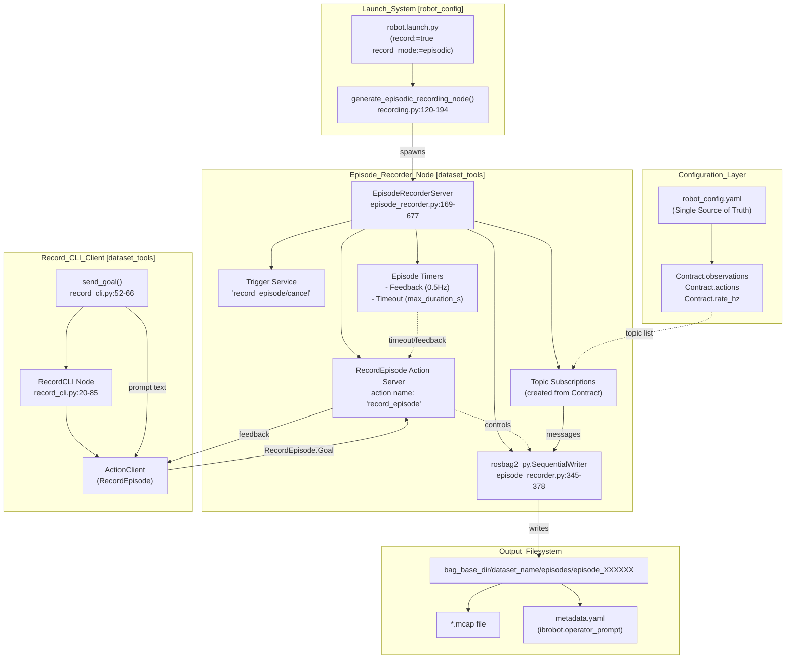
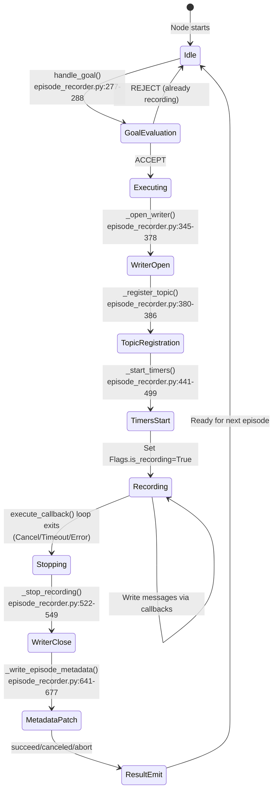

# Episode 录制

相关源文件

生成此 wiki 页面时使用了以下文件作为上下文：

- [src/action_dispatch/README.md](https://atomgit.com/openeuler/IB_Robot/blob/master/src/action_dispatch/README.md)
- [src/action_dispatch/package.xml](https://atomgit.com/openeuler/IB_Robot/blob/master/src/action_dispatch/package.xml)
- [src/dataset_tools/dataset_tools/bag_to_lerobot.py](https://atomgit.com/openeuler/IB_Robot/blob/master/src/dataset_tools/dataset_tools/bag_to_lerobot.py)
- [src/dataset_tools/dataset_tools/episode_recorder.py](https://atomgit.com/openeuler/IB_Robot/blob/master/src/dataset_tools/dataset_tools/episode_recorder.py)
- [src/dataset_tools/dataset_tools/record_cli.py](https://atomgit.com/openeuler/IB_Robot/blob/master/src/dataset_tools/dataset_tools/record_cli.py)
- [src/dataset_tools/package.xml](https://atomgit.com/openeuler/IB_Robot/blob/master/src/dataset_tools/package.xml)
- [src/dataset_tools/test/test_bag_to_lerobot.py](https://atomgit.com/openeuler/IB_Robot/blob/master/src/dataset_tools/test/test_bag_to_lerobot.py)
- [src/dataset_tools/test/test_episode_recorder.py](https://atomgit.com/openeuler/IB_Robot/blob/master/src/dataset_tools/test/test_episode_recorder.py)
- [src/robot_config/robot_config/contract_builder.py](https://atomgit.com/openeuler/IB_Robot/blob/master/src/robot_config/robot_config/contract_builder.py)
- [src/robot_config/robot_config/contract_utils.py](https://atomgit.com/openeuler/IB_Robot/blob/master/src/robot_config/robot_config/contract_utils.py)
- [src/robot_config/robot_config/generators/__init__.py](https://atomgit.com/openeuler/IB_Robot/blob/master/src/robot_config/robot_config/generators/__init__.py)
- [src/robot_config/robot_config/generators/contract.py](https://atomgit.com/openeuler/IB_Robot/blob/master/src/robot_config/robot_config/generators/contract.py)
- [src/robot_config/robot_config/launch_builders/recording.py](https://atomgit.com/openeuler/IB_Robot/blob/master/src/robot_config/robot_config/launch_builders/recording.py)

## 目的与范围

Episode Recording 为 IB-Robot 框架提供**按触发执行的 episodic 数据采集系统**。用户可以按需录制单次示教（episodes），每个 episode 会保存为独立 ROS 2 bag 文件，并包含语义元数据（任务 prompts）。本文档说明 `episode_recorder` Action Server 和 `record_cli` 交互式客户端。

**相关页面：**
- 产生待录制示教的遥操作接口，请参见 [遥操作与数据采集](./teleoperation_and_data_collection.md)。
- 将录制 bags 转换为 LeRobot datasets，请参见 [数据集转换](./dataset_conversion_bag_to_lerobot.md)。
- continuous（all-in-one）录制模式请参见 [src/robot_config/robot_config/launch_builders/recording.py:79-117](https://atomgit.com/openeuler/IB_Robot/blob/master/src/robot_config/robot_config/launch_builders/recording.py#L79-L117) 中的 launch 配置。

---

## 录制模式

IB-Robot 支持两种录制范式，通过 `record_mode` launch 参数选择：

| Mode | Trigger | Output | Use Case |
|------|---------|--------|----------|
| **Continuous** | Launch time | 包含全部数据的单个 bag 文件 | 长时数据采集、调试 |
| **Episodic** | Action Server goal | 每个 episode 一个 bag，并包含 prompt 元数据 | 用于训练的语义任务数据集 |

本文重点介绍 **episodic recording**。

**来源：** [src/robot_config/robot_config/launch_builders/recording.py:6-9](https://atomgit.com/openeuler/IB_Robot/blob/master/src/robot_config/robot_config/launch_builders/recording.py#L6-L9), [src/robot_config/robot_config/launch_builders/recording.py:73-76](https://atomgit.com/openeuler/IB_Robot/blob/master/src/robot_config/robot_config/launch_builders/recording.py#L73-L76)

---

## 架构概览

### 录制系统组件图
此图将逻辑录制功能关联到代码库中的具体实现实体。

**分析：** 录制系统遵循 ROS 2 Action Server 模式。`EpisodeRecorderServer` 节点暴露 `record_episode` Action Server，`record_cli` 客户端可触发它。收到 goal 后，server 打开 `rosbag2_py.SequentialWriter`，注册 Contract 中的所有 topics，并将收到的消息直接流式写入磁盘。两个 timers 提供周期性反馈并强制执行最大时长。episode 完成时（由于 timeout、cancel 或 error），server 关闭 writer，并用 operator prompt 修补 `metadata.yaml`。

**来源：** [src/dataset_tools/dataset_tools/episode_recorder.py:1-68](https://atomgit.com/openeuler/IB_Robot/blob/master/src/dataset_tools/dataset_tools/episode_recorder.py#L1-L68), [src/dataset_tools/dataset_tools/record_cli.py:1-18](https://atomgit.com/openeuler/IB_Robot/blob/master/src/dataset_tools/dataset_tools/record_cli.py#L1-L18), [src/robot_config/robot_config/launch_builders/recording.py:120-144](https://atomgit.com/openeuler/IB_Robot/blob/master/src/robot_config/robot_config/launch_builders/recording.py#L120-L144)

---

## Episode Recorder Server

### Contract-Driven Subscription

`EpisodeRecorderServer` 从 `robot_config.yaml` 加载 topic 配置，并将其作为**单一事实源**。这保证录制和推理使用相同 topic 映射。

```mermaid
graph LR
    subgraph "Initialization_Sequence"
        INIT["EpisodeRecorderServer.__init__()<br/>episode_recorder.py:169-273"]
        LOAD["load_robot_config_dict()<br/>loader.py"]
        CONTRACT["build_contract_from_robot_config_dict()<br/>contract.py:197-248"]
        
        UNION["Merge observations + tasks + actions<br/>episode_recorder.py:230-236"]
        
        SUBS["_make_sub()<br/>episode_recorder.py:388-439"]
        
        INIT --> LOAD
        LOAD --> CONTRACT
        CONTRACT --> UNION
        UNION --> SUBS
    end
    
    subgraph "Subscription_Logic"
        CB["_make_sub.cb()<br/>episode_recorder.py:401-436"]
        CHECK["Flags.is_recording?"]
        SERIALIZE["serialize_message(msg)"]
        WRITE["writer.write(topic, data, ts_ns)<br/>episode_recorder.py:425"]
        
        SUBS --> CB
        CB --> CHECK
        CHECK -->|Yes| SERIALIZE
        SERIALIZE --> WRITE
    end
```

**关键实现细节：**

1. **Topic List Construction** [src/dataset_tools/dataset_tools/episode_recorder.py:230-236](https://atomgit.com/openeuler/IB_Robot/blob/master/src/dataset_tools/dataset_tools/episode_recorder.py#L230-L236)：server 将 Contract 中的 `observations`、`tasks` 和 `actions` 合并为统一的 `_topics` 列表，元素为 `(topic, type, qos)` tuples。
2. **Persistent Subscriptions** [src/dataset_tools/dataset_tools/episode_recorder.py:238-242](https://atomgit.com/openeuler/IB_Robot/blob/master/src/dataset_tools/dataset_tools/episode_recorder.py#L238-L242)：订阅在节点启动时创建一次，并跨 episodes 持续存在，避免 DDS 重新协商开销。
3. **Conditional Write** [src/dataset_tools/dataset_tools/episode_recorder.py:401-436](https://atomgit.com/openeuler/IB_Robot/blob/master/src/dataset_tools/dataset_tools/episode_recorder.py#L401-L436)：订阅回调在写入前检查 `Flags.is_recording` 标志。这让订阅可在 episodes 之间保持活跃，而不会产生无效数据。
4. **Timestamp Policy** [src/dataset_tools/dataset_tools/episode_recorder.py:419-425](https://atomgit.com/openeuler/IB_Robot/blob/master/src/dataset_tools/dataset_tools/episode_recorder.py#L419-L425)：使用到达时间（`get_clock().now().nanoseconds`）作为写入时间戳，保证确定性排序。

**来源：** [src/dataset_tools/dataset_tools/episode_recorder.py:169-273](https://atomgit.com/openeuler/IB_Robot/blob/master/src/dataset_tools/dataset_tools/episode_recorder.py#L169-L273), [src/dataset_tools/dataset_tools/episode_recorder.py:230-242](https://atomgit.com/openeuler/IB_Robot/blob/master/src/dataset_tools/dataset_tools/episode_recorder.py#L230-L242), [src/dataset_tools/dataset_tools/episode_recorder.py:388-439](https://atomgit.com/openeuler/IB_Robot/blob/master/src/dataset_tools/dataset_tools/episode_recorder.py#L388-L439)

---

### Action Server 生命周期

**Goal Callback** [src/dataset_tools/dataset_tools/episode_recorder.py:277-288](https://atomgit.com/openeuler/IB_Robot/blob/master/src/dataset_tools/dataset_tools/episode_recorder.py#L277-L288)：如果 `Flags.is_recording` 为 `True`，拒绝新 goal，防止并发 episodes。

**Execute Callback** [src/dataset_tools/dataset_tools/episode_recorder.py:551-637](https://atomgit.com/openeuler/IB_Robot/blob/master/src/dataset_tools/dataset_tools/episode_recorder.py#L551-L637)：主编排循环：
1. **Setup Phase** [src/dataset_tools/dataset_tools/episode_recorder.py:564-604](https://atomgit.com/openeuler/IB_Robot/blob/master/src/dataset_tools/dataset_tools/episode_recorder.py#L564-L604)：使用 `_unique_bag_dir()` [src/dataset_tools/dataset_tools/episode_recorder.py:501-520](https://atomgit.com/openeuler/IB_Robot/blob/master/src/dataset_tools/dataset_tools/episode_recorder.py#L501-L520) 生成唯一目录，打开 MCAP writer，并注册 topics。
2. **Recording Phase** [src/dataset_tools/dataset_tools/episode_recorder.py:606-616](https://atomgit.com/openeuler/IB_Robot/blob/master/src/dataset_tools/dataset_tools/episode_recorder.py#L606-L616)：阻塞等待 event，同时检查 `goal_handle.is_cancel_requested`。
3. **Finalization Phase** [src/dataset_tools/dataset_tools/episode_recorder.py:619-636](https://atomgit.com/openeuler/IB_Robot/blob/master/src/dataset_tools/dataset_tools/episode_recorder.py#L619-L636)：调用 `_stop_recording()` 关闭 writer、销毁 timers，并修补 metadata。

**来源：** [src/dataset_tools/dataset_tools/episode_recorder.py:277-288](https://atomgit.com/openeuler/IB_Robot/blob/master/src/dataset_tools/dataset_tools/episode_recorder.py#L277-L288), [src/dataset_tools/dataset_tools/episode_recorder.py:551-637](https://atomgit.com/openeuler/IB_Robot/blob/master/src/dataset_tools/dataset_tools/episode_recorder.py#L551-L637), [src/dataset_tools/dataset_tools/episode_recorder.py:501-520](https://atomgit.com/openeuler/IB_Robot/blob/master/src/dataset_tools/dataset_tools/episode_recorder.py#L501-L520)

---

### 元数据嵌入

server 将 operator prompt 嵌入 bag 的 `metadata.yaml` 文件，供下游数据集转换使用。

**实现** [src/dataset_tools/dataset_tools/episode_recorder.py:641-677](https://atomgit.com/openeuler/IB_Robot/blob/master/src/dataset_tools/dataset_tools/episode_recorder.py#L641-L677)：
`_write_episode_metadata` 函数将用户 prompt 修补到 MCAP metadata 中。它包含 retry loop [src/dataset_tools/dataset_tools/episode_recorder.py:651-677](https://atomgit.com/openeuler/IB_Robot/blob/master/src/dataset_tools/dataset_tools/episode_recorder.py#L651-L677)，用于处理 `rosbag2` writer 可能带来的文件系统锁延迟。

**Metadata Structure:**
prompt 作为 `ibrobot.operator_prompt` 存储在 `custom_data` key 下 [src/dataset_tools/dataset_tools/episode_recorder.py:666](https://atomgit.com/openeuler/IB_Robot/blob/master/src/dataset_tools/dataset_tools/episode_recorder.py#L666)。

**来源：** [src/dataset_tools/dataset_tools/episode_recorder.py:641-677](https://atomgit.com/openeuler/IB_Robot/blob/master/src/dataset_tools/dataset_tools/episode_recorder.py#L641-L677), [src/dataset_tools/dataset_tools/episode_recorder.py:104-105](https://atomgit.com/openeuler/IB_Robot/blob/master/src/dataset_tools/dataset_tools/episode_recorder.py#L104-L105)

---

## Record CLI Client

`record_cli` 可执行文件提供触发录制的交互式接口。

**Interactive Loop** [src/dataset_tools/dataset_tools/record_cli.py:118-127](https://atomgit.com/openeuler/IB_Robot/blob/master/src/dataset_tools/dataset_tools/record_cli.py#L118-L127)：
1. 可选地在新 episode 前重置 `action_dispatcher` 或 policy state [src/dataset_tools/dataset_tools/record_cli.py:118-127](https://atomgit.com/openeuler/IB_Robot/blob/master/src/dataset_tools/dataset_tools/record_cli.py#L118-L127)。
2. 提示用户输入任务描述（prompt）。
3. 向 `record_episode` Action Server 发送 goal [src/dataset_tools/dataset_tools/record_cli.py:62-65](https://atomgit.com/openeuler/IB_Robot/blob/master/src/dataset_tools/dataset_tools/record_cli.py#L62-L65)。
4. 监听 Enter 或 signal，并通过 `record_episode/cancel` service 取消录制 [src/dataset_tools/dataset_tools/record_cli.py:99-107](https://atomgit.com/openeuler/IB_Robot/blob/master/src/dataset_tools/dataset_tools/record_cli.py#L99-L107)。

**来源：** [src/dataset_tools/dataset_tools/record_cli.py:20-85](https://atomgit.com/openeuler/IB_Robot/blob/master/src/dataset_tools/dataset_tools/record_cli.py#L20-L85), [src/dataset_tools/dataset_tools/record_cli.py:118-127](https://atomgit.com/openeuler/IB_Robot/blob/master/src/dataset_tools/dataset_tools/record_cli.py#L118-L127)

---

## Launch 集成

录制系统通过 `generate_recording_nodes` 与机器人 launch 系统集成。

**Launch Arguments:**
- `record:=true`：启用录制节点。
- `record_mode:=episodic`：选择 `episode_recorder` Action Server 模式 [src/robot_config/robot_config/launch_builders/recording.py:73-74](https://atomgit.com/openeuler/IB_Robot/blob/master/src/robot_config/robot_config/launch_builders/recording.py#L73-L74)。

**Behavior:**
在 episodic 模式下，builder 从 `robot_config.yaml` 的 `recording` section 中提取 `bag_base_dir`、`dataset_name` 和 `max_cache_size` 等参数 [src/robot_config/robot_config/launch_builders/recording.py:154-175](https://atomgit.com/openeuler/IB_Robot/blob/master/src/robot_config/robot_config/launch_builders/recording.py#L154-L175)。随后从 `dataset_tools` 包启动 `episode_recorder` 节点 [src/robot_config/robot_config/launch_builders/recording.py:180-194](https://atomgit.com/openeuler/IB_Robot/blob/master/src/robot_config/robot_config/launch_builders/recording.py#L180-L194)。

**来源：** [src/robot_config/robot_config/launch_builders/recording.py:38-76](https://atomgit.com/openeuler/IB_Robot/blob/master/src/robot_config/robot_config/launch_builders/recording.py#L38-L76), [src/robot_config/robot_config/launch_builders/recording.py:120-194](https://atomgit.com/openeuler/IB_Robot/blob/master/src/robot_config/robot_config/launch_builders/recording.py#L120-L194)

---

## 对比：Episodic vs Continuous

| Aspect | Episodic Mode | Continuous Mode |
|--------|---------------|-----------------|
| **Trigger** | `RecordEpisode` Action Goal | Launch time（automatic） |
| **Interface** | `record_cli`（interactive） | `ros2 bag record`（passive） |
| **Output** | `episode_XXXXXX/`（directory） | `robot_timestamp.mcap`（file） |
| **Metadata** | 每个 episode 的 operator prompt | None |
| **Use Case** | ML Training Datasets | System Debugging |
| **Implementation** | `EpisodeRecorderServer` | `ExecuteProcess`（standard ROS 2） |

**来源：** [src/robot_config/robot_config/launch_builders/recording.py:7-9](https://atomgit.com/openeuler/IB_Robot/blob/master/src/robot_config/robot_config/launch_builders/recording.py#L7-L9), [src/robot_config/robot_config/launch_builders/recording.py:79-117](https://atomgit.com/openeuler/IB_Robot/blob/master/src/robot_config/robot_config/launch_builders/recording.py#L79-L117), [src/robot_config/robot_config/launch_builders/recording.py:120-144](https://atomgit.com/openeuler/IB_Robot/blob/master/src/robot_config/robot_config/launch_builders/recording.py#L120-L144)

