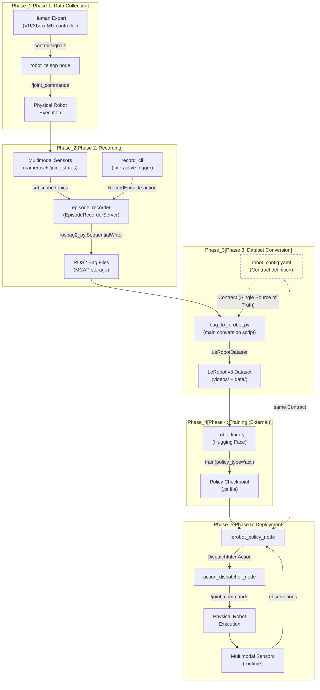
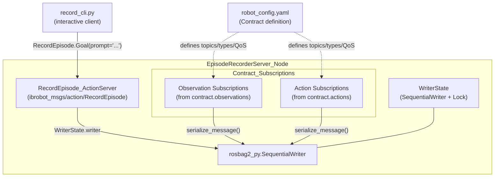

# 数据流水线概述

相关源文件

生成此 wiki 页面时使用了以下文件作为上下文：

- [src/dataset_tools/README.md](https://atomgit.com/openeuler/IB_Robot/blob/master/src/dataset_tools/README.md)
- [src/dataset_tools/dataset_tools/bag_to_lerobot.py](https://atomgit.com/openeuler/IB_Robot/blob/master/src/dataset_tools/dataset_tools/bag_to_lerobot.py)
- [src/dataset_tools/dataset_tools/camera_alignment.py](https://atomgit.com/openeuler/IB_Robot/blob/master/src/dataset_tools/dataset_tools/camera_alignment.py)
- [src/dataset_tools/dataset_tools/episode_recorder.py](https://atomgit.com/openeuler/IB_Robot/blob/master/src/dataset_tools/dataset_tools/episode_recorder.py)
- [src/dataset_tools/dataset_tools/opencv_utils.py](https://atomgit.com/openeuler/IB_Robot/blob/master/src/dataset_tools/dataset_tools/opencv_utils.py)
- [src/dataset_tools/docs/tools/camera_alignment.md](https://atomgit.com/openeuler/IB_Robot/blob/master/src/dataset_tools/docs/tools/camera_alignment.md)
- [src/dataset_tools/test/test_camera_alignment.py](https://atomgit.com/openeuler/IB_Robot/blob/master/src/dataset_tools/test/test_camera_alignment.py)
- [src/dataset_tools/test/test_camera_isp_calibrator.py](https://atomgit.com/openeuler/IB_Robot/blob/master/src/dataset_tools/test/test_camera_isp_calibrator.py)
- [src/robot_config/robot_config/contract_builder.py](https://atomgit.com/openeuler/IB_Robot/blob/master/src/robot_config/robot_config/contract_builder.py)
- [src/robot_config/robot_config/contract_utils.py](https://atomgit.com/openeuler/IB_Robot/blob/master/src/robot_config/robot_config/contract_utils.py)
- [src/robot_config/robot_config/generators/__init__.py](https://atomgit.com/openeuler/IB_Robot/blob/master/src/robot_config/robot_config/generators/__init__.py)
- [src/robot_config/robot_config/generators/contract.py](https://atomgit.com/openeuler/IB_Robot/blob/master/src/robot_config/robot_config/generators/contract.py)
- [src/robot_config/robot_config/launch_builders/recording.py](https://atomgit.com/openeuler/IB_Robot/blob/master/src/robot_config/robot_config/launch_builders/recording.py)

## 目的与范围

本文档描述 IB-Robot 中完整的数据流水线，覆盖从人工示教到数据集创建、模型训练，再部署回机器人的端到端流程。该流水线实现了**契约驱动架构**，保证训练数据和部署观测保持一致，消除 training-serving skew。

流水线内各子系统请参见：
- 遥操作接口与数据采集工作流：[遥操作与数据采集](./teleoperation_and_data_collection.md)
- Episode 录制实现细节：[Episode 录制](./episode_recording.md)
- 数据集转换工具（`bag_to_lerobot`）：[数据集转换（bag_to_lerobot）](./dataset_conversion_bag_to_lerobot.md)
- 外部训练集成：[训练集成](./training_integration.md)
- 在线评估与反馈闭环：[部署反馈闭环](./deployment_feedback_loop.md)
- 相机标定与对齐工具：[相机工具（对齐与 ISP 标定）](./camera_tools.md)

**来源**: [src/dataset_tools/dataset_tools/bag_to_lerobot.py:3-19](https://atomgit.com/openeuler/IB_Robot/blob/master/src/dataset_tools/dataset_tools/bag_to_lerobot.py#L3-L19), [src/robot_config/robot_config/launch_builders/recording.py:1-9](https://atomgit.com/openeuler/IB_Robot/blob/master/src/robot_config/robot_config/launch_builders/recording.py#L1-L9)

---

## 系统概览

IB-Robot 数据流水线通过系统化流程，将人类专家示教转换为可部署的 AI 策略。关键创新是把 **robot_config YAML 作为单一事实源**，其中的 Contract 定义会贯穿所有流水线阶段，确保训练数据和部署观测经过完全相同的处理。

流水线包含六个主要阶段：

| Phase | Purpose | Key Components | Output |
|-------|---------|----------------|--------|
| **Collection** | 捕获专家示教 | `robot_teleop`, teleoperation devices | 人类控制信号 |
| **Recording** | 保存多模态传感器数据 | `episode_recorder`, `record_cli` | ROS2 bag files（MCAP 格式） |
| **Conversion** | 转换为训练格式 | `bag_to_lerobot` | LeRobot v3 dataset（parquet + video） |
| **Training** | 从示教中学习策略 | 外部 `lerobot` 库 | Policy checkpoint（.pt 文件） |
| **Deployment** | 执行学习到的策略 | `lerobot_policy_node`, `action_dispatcher_node` | 机器人动作 |
| **Evaluation** | 记录部署表现 | `episode_recorder` | 用于迭代的新 episodes |

**来源**: [src/dataset_tools/dataset_tools/bag_to_lerobot.py:6-73](https://atomgit.com/openeuler/IB_Robot/blob/master/src/dataset_tools/dataset_tools/bag_to_lerobot.py#L6-L73), [src/robot_config/robot_config/launch_builders/recording.py:6-9](https://atomgit.com/openeuler/IB_Robot/blob/master/src/robot_config/robot_config/launch_builders/recording.py#L6-L9), [src/dataset_tools/README.md:12-30](https://atomgit.com/openeuler/IB_Robot/blob/master/src/dataset_tools/README.md#L12-L30)

---

## 端到端流水线架构

### 数据流图

**来源**: [src/dataset_tools/dataset_tools/episode_recorder.py:10-32](https://atomgit.com/openeuler/IB_Robot/blob/master/src/dataset_tools/dataset_tools/episode_recorder.py#L10-L32), [src/dataset_tools/dataset_tools/bag_to_lerobot.py:12-18](https://atomgit.com/openeuler/IB_Robot/blob/master/src/dataset_tools/dataset_tools/bag_to_lerobot.py#L12-L18), [src/robot_config/robot_config/launch_builders/recording.py:38-76](https://atomgit.com/openeuler/IB_Robot/blob/master/src/robot_config/robot_config/launch_builders/recording.py#L38-L76)

---

## Phase 1：数据采集

人类专家通过遥操作接口控制机器人。系统支持多种输入设备。遥操作期间，机器人实时执行动作，同时传感器数据流入 ROS2 topics。

采集前，相机一致性通过以下工具保证：
- `camera_alignment`：基于 ArUco 的工具，用于将当前相机位姿与参考图像匹配 [src/dataset_tools/README.md:162-181](https://atomgit.com/openeuler/IB_Robot/blob/master/src/dataset_tools/README.md#L162-L181)。
- `camera_isp_calibrator`：用于匹配相机间曝光、白平衡和色彩参数的工具 [src/dataset_tools/README.md:189-204](https://atomgit.com/openeuler/IB_Robot/blob/master/src/dataset_tools/README.md#L189-L204)。

详情请参见 [遥操作与数据采集](./teleoperation_and_data_collection.md) 和 [相机工具（对齐与 ISP 标定）](./camera_tools.md)。

**来源**: [src/dataset_tools/README.md:162-204](https://atomgit.com/openeuler/IB_Robot/blob/master/src/dataset_tools/README.md#L162-L204), [src/robot_config/robot_config/launch_builders/recording.py:40-72](https://atomgit.com/openeuler/IB_Robot/blob/master/src/robot_config/robot_config/launch_builders/recording.py#L40-L72)

---

## Phase 2：Episode 录制

### 录制模式

系统在 `robot_config.launch_builders.recording` 中实现了两种录制模式：

1.  **Continuous Mode**：使用标准 `ros2 bag record` 从 launch 到 shutdown 将所有 topics 捕获到单个 MCAP 文件 [src/robot_config/robot_config/launch_builders/recording.py:79-117](https://atomgit.com/openeuler/IB_Robot/blob/master/src/robot_config/robot_config/launch_builders/recording.py#L79-L117)。
2.  **Episodic Mode**：使用 `EpisodeRecorderServer` Action Server 录制带语义元数据（operator prompts）的单次示教 [src/robot_config/robot_config/launch_builders/recording.py:120-143](https://atomgit.com/openeuler/IB_Robot/blob/master/src/robot_config/robot_config/launch_builders/recording.py#L120-L143)。

### Episode Recorder 内部架构

**关键特性**：
- **单一事实源**：订阅在节点启动时基于 `robot_config.yaml` 的 `contract` section 创建 [src/dataset_tools/dataset_tools/episode_recorder.py:21-25](https://atomgit.com/openeuler/IB_Robot/blob/master/src/dataset_tools/dataset_tools/episode_recorder.py#L21-L25)。
- **直接流式写入 Bag**：消息收到后立即通过 `rosbag2_py.SequentialWriter` 写入，并使用内部缓存平滑写入突发 [src/dataset_tools/dataset_tools/episode_recorder.py:8-12](https://atomgit.com/openeuler/IB_Robot/blob/master/src/dataset_tools/dataset_tools/episode_recorder.py#L8-L12)。
- **元数据嵌入**：operator prompt 和 dataset 级元数据存储在 bag 的 `metadata.yaml` 中 [src/dataset_tools/dataset_tools/episode_recorder.py:29-32](https://atomgit.com/openeuler/IB_Robot/blob/master/src/dataset_tools/dataset_tools/episode_recorder.py#L29-L32)。

详情请参见 [Episode 录制](./episode_recording.md)。

**来源**: [src/dataset_tools/dataset_tools/episode_recorder.py:1-68](https://atomgit.com/openeuler/IB_Robot/blob/master/src/dataset_tools/dataset_tools/episode_recorder.py#L1-L68), [src/robot_config/robot_config/launch_builders/recording.py:120-143](https://atomgit.com/openeuler/IB_Robot/blob/master/src/robot_config/robot_config/launch_builders/recording.py#L120-L143), [src/dataset_tools/README.md:9-10](https://atomgit.com/openeuler/IB_Robot/blob/master/src/dataset_tools/README.md#L9-L10)

---

## Phase 3：数据集转换

### bag_to_lerobot 工具

`bag_to_lerobot.py` 脚本将 ROS 2 bags 转换为 LeRobot v3 格式。它使用与实时推理流水线**完全相同的 contract-aware 处理工具**，避免 training-serving skew [src/dataset_tools/dataset_tools/bag_to_lerobot.py:8-10](https://atomgit.com/openeuler/IB_Robot/blob/master/src/dataset_tools/dataset_tools/bag_to_lerobot.py#L8-L10)。

**转换工作流**：
1.  **加载 Contract**：从 `robot_config.yaml` 读取 `contract` section [src/dataset_tools/dataset_tools/bag_to_lerobot.py:14-15](https://atomgit.com/openeuler/IB_Robot/blob/master/src/dataset_tools/dataset_tools/bag_to_lerobot.py#L14-L15)。
2.  **解码**：扫描 bag，并使用共享的 `tensormsg` converters 解码消息 [src/dataset_tools/dataset_tools/bag_to_lerobot.py:115-117](https://atomgit.com/openeuler/IB_Robot/blob/master/src/dataset_tools/dataset_tools/bag_to_lerobot.py#L115-L117)。
3.  **重采样**：将所有数据流对齐到 `contract.rate_hz` 定义的频率 [src/dataset_tools/dataset_tools/bag_to_lerobot.py:17-18](https://atomgit.com/openeuler/IB_Robot/blob/master/src/dataset_tools/dataset_tools/bag_to_lerobot.py#L17-L18)。
4.  **写入**：将数据导出为 Parquet 文件，将图像导出为 H.264/MP4 视频 [src/dataset_tools/dataset_tools/bag_to_lerobot.py:60-66](https://atomgit.com/openeuler/IB_Robot/blob/master/src/dataset_tools/dataset_tools/bag_to_lerobot.py#L60-L66)。

详情请参见 [数据集转换（bag_to_lerobot）](./dataset_conversion_bag_to_lerobot.md)。

**来源**: [src/dataset_tools/dataset_tools/bag_to_lerobot.py:1-73](https://atomgit.com/openeuler/IB_Robot/blob/master/src/dataset_tools/dataset_tools/bag_to_lerobot.py#L1-L73), [src/robot_config/robot_config/contract_utils.py:94-105](https://atomgit.com/openeuler/IB_Robot/blob/master/src/robot_config/robot_config/contract_utils.py#L94-L105)

---

## Phase 4：训练集成

IB-Robot 与外部 `lerobot` 库集成，用于策略训练。转换后的数据集包含 LeRobot 训练脚本所需的 `meta/info.json`、`meta/stats.json` 和 `meta/tasks.parquet` 文件。

**集成点**：
- **Contract Fingerprint**：`bag_to_lerobot` 使用 `contract_fingerprint` 确保模型基于正确的硬件配置训练 [src/dataset_tools/dataset_tools/bag_to_lerobot.py:94-98](https://atomgit.com/openeuler/IB_Robot/blob/master/src/dataset_tools/dataset_tools/bag_to_lerobot.py#L94-L98)。
- **Normalization**：支持 `lerobot_norm_mode`（例如 `min_max`）和 `robot_config` 中定义的关节转换表 [src/dataset_tools/dataset_tools/bag_to_lerobot.py:106-113](https://atomgit.com/openeuler/IB_Robot/blob/master/src/dataset_tools/dataset_tools/bag_to_lerobot.py#L106-L113)。

详情请参见 [训练集成](./training_integration.md)。

**来源**: [src/dataset_tools/dataset_tools/bag_to_lerobot.py:60-66](https://atomgit.com/openeuler/IB_Robot/blob/master/src/dataset_tools/dataset_tools/bag_to_lerobot.py#L60-L66), [src/dataset_tools/dataset_tools/episode_recorder.py:97-99](https://atomgit.com/openeuler/IB_Robot/blob/master/src/dataset_tools/dataset_tools/episode_recorder.py#L97-L99)

---

## Phase 5：部署反馈闭环

流水线支持持续改进闭环，在线评估数据可被记录并用于领域适配或微调。

1.  **Deploy**：使用 `lerobot_policy_node` 以 `model_inference` 模式运行机器人。
2.  **Evaluate**：使用 `record_cli` 在模型执行期间触发 episodic recording。处于 `model_inference` 模式时，recorder 会在每个 episode 前调用 `/action_dispatcher/reset` 清空动作队列 [src/dataset_tools/README.md:96-102](https://atomgit.com/openeuler/IB_Robot/blob/master/src/dataset_tools/README.md#L96-L102)。
3.  **Refine**：将新的 “evaluation bags” 转换为 LeRobot 格式，并追加到训练集中。

详情请参见 [部署反馈闭环](./deployment_feedback_loop.md)。

**来源**: [src/robot_config/robot_config/launch_builders/recording.py:65-72](https://atomgit.com/openeuler/IB_Robot/blob/master/src/robot_config/robot_config/launch_builders/recording.py#L65-L72), [src/dataset_tools/README.md:96-102](https://atomgit.com/openeuler/IB_Robot/blob/master/src/dataset_tools/README.md#L96-L102)

