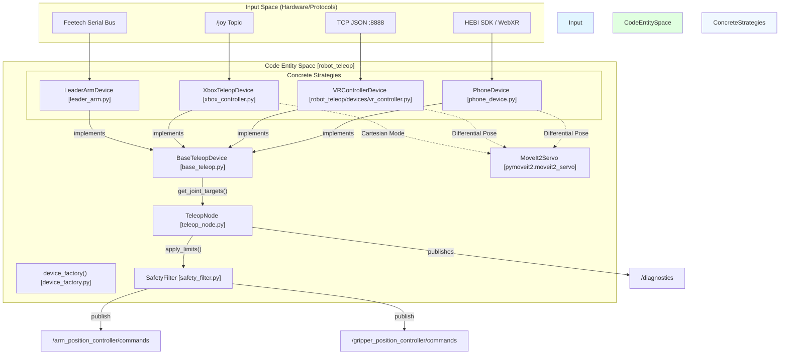
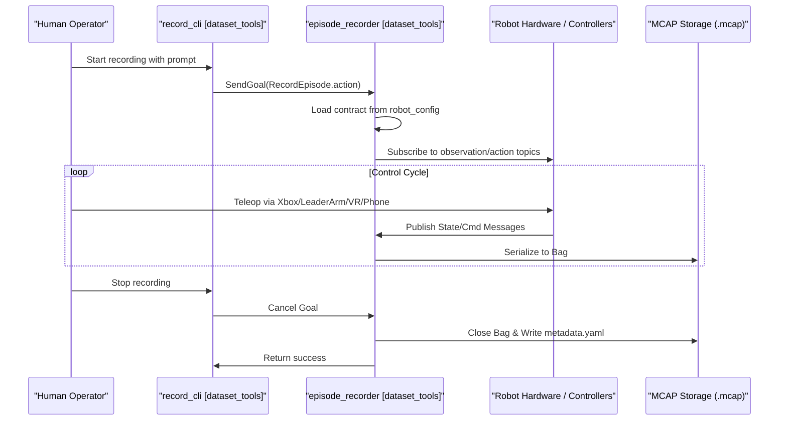

# 遥操作与数据采集

<details>
<summary>相关源文件</summary>

生成此 wiki 页面时使用了以下文件作为上下文：

- [src/robot_config/config/xbox_mapping.yaml](https://atomgit.com/openeuler/IB_Robot/blob/master/src/robot_config/config/xbox_mapping.yaml)
- [src/robot_config/robot_config/launch_builders/teleop.py](https://atomgit.com/openeuler/IB_Robot/blob/master/src/robot_config/robot_config/launch_builders/teleop.py)
- [src/robot_moveit/config/so101_servo.yaml](https://atomgit.com/openeuler/IB_Robot/blob/master/src/robot_moveit/config/so101_servo.yaml)
- [src/robot_teleop/README.en.md](https://atomgit.com/openeuler/IB_Robot/blob/master/src/robot_teleop/README.en.md)
- [src/robot_teleop/README.md](https://atomgit.com/openeuler/IB_Robot/blob/master/src/robot_teleop/README.md)
- [src/robot_teleop/robot_teleop/base_teleop.py](https://atomgit.com/openeuler/IB_Robot/blob/master/src/robot_teleop/robot_teleop/base_teleop.py)
- [src/robot_teleop/robot_teleop/device_factory.py](https://atomgit.com/openeuler/IB_Robot/blob/master/src/robot_teleop/robot_teleop/device_factory.py)
- [src/robot_teleop/robot_teleop/devices/leader_arm.py](https://atomgit.com/openeuler/IB_Robot/blob/master/src/robot_teleop/robot_teleop/devices/leader_arm.py)
- [src/robot_teleop/robot_teleop/devices/xbox_controller.py](https://atomgit.com/openeuler/IB_Robot/blob/master/src/robot_teleop/robot_teleop/devices/xbox_controller.py)
- [src/robot_teleop/robot_teleop/phone/config_phone.py](https://atomgit.com/openeuler/IB_Robot/blob/master/src/robot_teleop/robot_teleop/phone/config_phone.py)
- [src/robot_teleop/robot_teleop/phone/phone_device.py](https://atomgit.com/openeuler/IB_Robot/blob/master/src/robot_teleop/robot_teleop/phone/phone_device.py)
- [src/robot_teleop/robot_teleop/teleop_node.py](https://atomgit.com/openeuler/IB_Robot/blob/master/src/robot_teleop/robot_teleop/teleop_node.py)
- [src/so101_hardware/src/so101_system_hardware.cpp](https://atomgit.com/openeuler/IB_Robot/blob/master/src/so101_hardware/src/so101_system_hardware.cpp)

</details>


## 目的与范围

本文档说明 IB-Robot 中的遥操作接口和数据采集流水线，覆盖从人工示教到录制 ROS2 bags 的工作流。它解释专家操作员如何通过多种输入设备（Leader Arm、Xbox、VR、Phone）控制机器人，以及这些示教如何通过 contract-driven 录制系统捕获为训练数据。

**来源：** [src/robot_teleop/README.md:1-14](https://atomgit.com/openeuler/IB_Robot/blob/master/src/robot_teleop/README.md#L1-L14), [src/robot_teleop/README.en.md:1-16](https://atomgit.com/openeuler/IB_Robot/blob/master/src/robot_teleop/README.en.md#L1-L16)

---

## 遥操作架构

IB-Robot 通过 `robot_teleop` 包提供统一的人机遥操作子系统。该系统具备基于 **Strategy Pattern** 的设备抽象层，使单个 `TeleopNode` 可以接入不同硬件，同时保持低延迟控制（端到端 < 5ms）。

### 遥操作系统流程

下图把逻辑输入设备与 ROS 2 生态中处理它们的具体代码实体连接起来。


**图：遥操作系统架构**
该图展示多种输入设备如何通过 `robot_teleop` 包流向机器人控制器。它突出 `BaseTeleopDevice` 抽象，以及 `TeleopNode` 和 `SafetyFilter` 的作用。笛卡尔控制设备（Xbox、VR、Phone）可直接接入 `MoveIt2Servo`。

**来源：** [src/robot_teleop/README.md:19-64](https://atomgit.com/openeuler/IB_Robot/blob/master/src/robot_teleop/README.md#L19-L64), [src/robot_teleop/robot_teleop/teleop_node.py:137-181](https://atomgit.com/openeuler/IB_Robot/blob/master/src/robot_teleop/robot_teleop/teleop_node.py#L137-L181), [src/robot_teleop/robot_teleop/device_factory.py:16-20](https://atomgit.com/openeuler/IB_Robot/blob/master/src/robot_teleop/robot_teleop/device_factory.py#L16-L20), [src/robot_teleop/README.en.md:20-54](https://atomgit.com/openeuler/IB_Robot/blob/master/src/robot_teleop/README.en.md#L20-L54)

### 支持的输入设备

| Device Type | Strategy Class | Interface | Control Mode |
|-------------|----------------|-----------|--------------|
| **Leader Arm** | `LeaderArmDevice` | Serial (Feetech) | 直接关节映射 |
| **Xbox Controller** | `XboxTeleopDevice` | `/joy` Topic | 增量关节 / 笛卡尔（MoveIt Servo） |
| **VR Controller** | `VRControllerDevice` | TCP JSON | 笛卡尔（MoveIt Servo） |
| **Smartphone** | `PhoneDevice` | HEBI/WebXR | 6-DoF 位姿（MoveIt Servo） |

**来源：** [src/robot_teleop/README.md:21-64](https://atomgit.com/openeuler/IB_Robot/blob/master/src/robot_teleop/README.md#L21-L64), [src/robot_teleop/robot_teleop/device_factory.py:16-20](https://atomgit.com/openeuler/IB_Robot/blob/master/src/robot_teleop/robot_teleop/device_factory.py#L16-L20)

---

## 设备实现

`robot_teleop` 包实现 factory pattern，根据 `robot_config` YAML 动态创建设备实例。`device_factory` 函数 [src/robot_teleop/robot_teleop/device_factory.py:23-49](https://atomgit.com/openeuler/IB_Robot/blob/master/src/robot_teleop/robot_teleop/device_factory.py#L23-L49) 使用 `DEVICE_MAP` [src/robot_teleop/robot_teleop/device_factory.py:16-20](https://atomgit.com/openeuler/IB_Robot/blob/master/src/robot_teleop/robot_teleop/device_factory.py#L16-L20) 实例化正确的 `BaseTeleopDevice` 子类。

### TeleopNode

`TeleopNode` [src/robot_teleop/robot_teleop/teleop_node.py:23-46](https://atomgit.com/openeuler/IB_Robot/blob/master/src/robot_teleop/robot_teleop/teleop_node.py#L23-L46) 是中心控制节点，默认频率为 50 Hz [src/robot_teleop/robot_teleop/teleop_node.py:60](https://atomgit.com/openeuler/IB_Robot/blob/master/src/robot_teleop/robot_teleop/teleop_node.py#L60)。
它的 `control_loop_callback` [src/robot_teleop/robot_teleop/teleop_node.py:137-181](https://atomgit.com/openeuler/IB_Robot/blob/master/src/robot_teleop/robot_teleop/teleop_node.py#L137-L181) 执行以下步骤：
1. 检查 emergency stop。
2. 调用 `self.device.get_joint_targets()` 从当前遥操作设备读取命令。
3. 使用 `self.safety_filter.apply_limits()` 应用安全过滤。
4. 向 `/arm_position_controller/commands` 和 `/gripper_position_controller/commands` 发布命令。
5. 向 `/diagnostics` 发布诊断信息。

**来源：** [src/robot_teleop/robot_teleop/teleop_node.py:23-46](https://atomgit.com/openeuler/IB_Robot/blob/master/src/robot_teleop/robot_teleop/teleop_node.py#L23-L46), [src/robot_teleop/robot_teleop/teleop_node.py:60](https://atomgit.com/openeuler/IB_Robot/blob/master/src/robot_teleop/robot_teleop/teleop_node.py#L60), [src/robot_teleop/robot_teleop/teleop_node.py:137-181](https://atomgit.com/openeuler/IB_Robot/blob/master/src/robot_teleop/robot_teleop/teleop_node.py#L137-L181)

### SafetyFilter

`SafetyFilter` [src/robot_teleop/README.md:191-202](https://atomgit.com/openeuler/IB_Robot/blob/master/src/robot_teleop/README.md#L191-L202) 通过 `numpy.clip` 将命令关节位置裁剪到安全范围，从而强制执行关节限位。它提供限频告警，避免在持续超限时刷屏。

**来源：** [src/robot_teleop/README.md:191-202](https://atomgit.com/openeuler/IB_Robot/blob/master/src/robot_teleop/README.md#L191-L202), [src/robot_teleop/README.en.md:230-246](https://atomgit.com/openeuler/IB_Robot/blob/master/src/robot_teleop/README.en.md#L230-L246)

### Leader Arm（SO-101）

`LeaderArmDevice` [src/robot_teleop/robot_teleop/devices/leader_arm.py:18-25](https://atomgit.com/openeuler/IB_Robot/blob/master/src/robot_teleop/robot_teleop/devices/leader_arm.py#L18-L25) 从物理 SO-101 leader arm 读取关节位置。
- **Hardware Interface**：使用 `lerobot.motors.feetech.FeetechMotorsBus` 通过串口与电机通信 [src/robot_teleop/robot_teleop/devices/leader_arm.py:55-67](https://atomgit.com/openeuler/IB_Robot/blob/master/src/robot_teleop/robot_teleop/devices/leader_arm.py#L55-L67)。
- **Calibration**：校准 offsets 从 JSON 文件加载，例如 `~/.calibrate/so101_leader_calibrate.json` [src/robot_config/robot_config/launch_builders/teleop.py:99-105](https://atomgit.com/openeuler/IB_Robot/blob/master/src/robot_config/robot_config/launch_builders/teleop.py#L99-L105)，并直接写入电机固件 [src/robot_teleop/robot_teleop/devices/leader_arm.py:73-79](https://atomgit.com/openeuler/IB_Robot/blob/master/src/robot_teleop/robot_teleop/devices/leader_arm.py#L73-L79)。这保证电机在物理 home 位置时输出 `2048`（4096 steps per revolution 的一半）。
- **Position Conversion**：原始 encoder 值使用公式 `position_rad = (raw - 2048.0) * self.rad_per_step` 转换为弧度 [src/robot_teleop/robot_teleop/devices/leader_arm.py:109-110](https://atomgit.com/openeuler/IB_Robot/blob/master/src/robot_teleop/robot_teleop/devices/leader_arm.py#L109-L110)，与 `so101_system_hardware.cpp` 中逻辑一致 [src/so101_hardware/src/so101_system_hardware.cpp:191-192](https://atomgit.com/openeuler/IB_Robot/blob/master/src/so101_hardware/src/so101_system_hardware.cpp#L191-L192)。
- **Joint Mapping**：配置中的 `joint_mapping` 参数允许将 leader arm 关节名映射到 follower arm 关节名 [src/robot_teleop/robot_teleop/devices/leader_arm.py:33](https://atomgit.com/openeuler/IB_Robot/blob/master/src/robot_teleop/robot_teleop/devices/leader_arm.py#L33)。

**来源：** [src/robot_teleop/robot_teleop/devices/leader_arm.py:18-116](https://atomgit.com/openeuler/IB_Robot/blob/master/src/robot_teleop/robot_teleop/devices/leader_arm.py#L18-L116), [src/robot_config/robot_config/launch_builders/teleop.py:99-105](https://atomgit.com/openeuler/IB_Robot/blob/master/src/robot_config/robot_config/launch_builders/teleop.py#L99-L105), [src/so101_hardware/src/so101_system_hardware.cpp:191-192](https://atomgit.com/openeuler/IB_Robot/blob/master/src/so101_hardware/src/so101_system_hardware.cpp#L191-L192)

### Xbox Controller

`XboxTeleopDevice` [src/robot_teleop/robot_teleop/devices/xbox_controller.py:23-73](https://atomgit.com/openeuler/IB_Robot/blob/master/src/robot_teleop/robot_teleop/devices/xbox_controller.py#L23-L73) 支持两种控制模式：
- **Joint Mode**：摇杆输入被积分为增量关节位置命令。`_last_commanded_positions` 属性是命令的事实源 [src/robot_teleop/robot_teleop/devices/xbox_controller.py:54](https://atomgit.com/openeuler/IB_Robot/blob/master/src/robot_teleop/robot_teleop/devices/xbox_controller.py#L54)。
- **Cartesian Mode**：长按 `LB` 按钮激活 [src/robot_config/config/xbox_mapping.yaml:8](https://atomgit.com/openeuler/IB_Robot/blob/master/src/robot_config/config/xbox_mapping.yaml#L8)，该模式使用 `MoveIt2Servo` 基于摇杆偏转发送 `TwistStamped` 命令 [src/robot_teleop/robot_teleop/devices/xbox_controller.py:159-165](https://atomgit.com/openeuler/IB_Robot/blob/master/src/robot_teleop/robot_teleop/devices/xbox_controller.py#L159-L165)。
- **Safety Features**：实现 “Reverse Adsorption Algorithm”（Direction-Snap），用于在切换控制方向或命令位置显著偏离机器人实际状态时防止突然跳变 [src/robot_teleop/robot_teleop/devices/xbox_controller.py:263-267](https://atomgit.com/openeuler/IB_Robot/blob/master/src/robot_teleop/robot_teleop/devices/xbox_controller.py#L263-L267)。
- **Mapping**：按钮和轴映射从 `xbox_mapping.yaml` 加载 [src/robot_config/config/xbox_mapping.yaml:1-30](https://atomgit.com/openeuler/IB_Robot/blob/master/src/robot_config/config/xbox_mapping.yaml#L1-L30)。

**来源：** [src/robot_teleop/README.md:239-271](https://atomgit.com/openeuler/IB_Robot/blob/master/src/robot_teleop/README.md#L239-L271), [src/robot_teleop/robot_teleop/devices/xbox_controller.py:23-173](https://atomgit.com/openeuler/IB_Robot/blob/master/src/robot_teleop/robot_teleop/devices/xbox_controller.py#L23-L173), [src/robot_config/config/xbox_mapping.yaml:1-30](https://atomgit.com/openeuler/IB_Robot/blob/master/src/robot_config/config/xbox_mapping.yaml#L1-L30)

### VR Controller

`VRControllerDevice` 面向使用 VR 头显和手柄位姿的笛卡尔控制。它配置为驱动 `MoveIt2Servo`，实现实时末端控制。`robot_teleop` README 表明它会使用 TCP JSON 通信 [src/robot_teleop/README.md:25](https://atomgit.com/openeuler/IB_Robot/blob/master/src/robot_teleop/README.md#L25)。

**来源：** [src/robot_teleop/README.md:25](https://atomgit.com/openeuler/IB_Robot/blob/master/src/robot_teleop/README.md#L25), [src/robot_teleop/README.en.md:26](https://atomgit.com/openeuler/IB_Robot/blob/master/src/robot_teleop/README.en.md#L26)

### Smartphone（iOS/Android）

`PhoneDevice` [src/robot_teleop/robot_teleop/phone/phone_device.py:32-206](https://atomgit.com/openeuler/IB_Robot/blob/master/src/robot_teleop/robot_teleop/phone/phone_device.py#L32-L206) 通过将手机朝向和位置映射到机器人末端，实现 6-DoF 遥操作。
- **Backends**：支持通过 HEBI Python SDK（`IOSPhone` class）接入 iOS [src/robot_teleop/robot_teleop/phone/phone_device.py:59-206](https://atomgit.com/openeuler/IB_Robot/blob/master/src/robot_teleop/robot_teleop/phone/phone_device.py#L59-L206)，并通过 WebXR 接入 Android。
- **Calibration**：关键步骤是保持手机在参考朝向并触发捕获，例如 iOS 上通过 HEBI Mobile I/O app 的 `B1` 按钮 [src/robot_teleop/robot_teleop/phone/phone_device.py:114-127](https://atomgit.com/openeuler/IB_Robot/blob/master/src/robot_teleop/robot_teleop/phone/phone_device.py#L114-L127)。这会建立 `_calib_pos` 和 `_calib_rot_inv` [src/robot_teleop/robot_teleop/phone/phone_device.py:37-38](https://atomgit.com/openeuler/IB_Robot/blob/master/src/robot_teleop/robot_teleop/phone/phone_device.py#L37-L38)。
- **Cartesian Drive**：`get_action()` 方法返回 `phone.pos` 和 `phone.rot` [src/robot_teleop/robot_teleop/phone/phone_device.py:201-202](https://atomgit.com/openeuler/IB_Robot/blob/master/src/robot_teleop/robot_teleop/phone/phone_device.py#L201-L202)。与 `MoveIt2Servo` 配合时，`PhoneDevice` 的 `get_joint_targets()` 只返回夹爪目标。`TeleopNode` 检测到缺少 arm joint keys 后会跳过向 arm controller 发布，避免与 `MoveIt2Servo` 冲突 [src/robot_teleop/robot_teleop/teleop_node.py:168-171](https://atomgit.com/openeuler/IB_Robot/blob/master/src/robot_teleop/robot_teleop/teleop_node.py#L168-L171)。
- **Configuration**：`PhoneConfig` [src/robot_teleop/robot_teleop/phone/config_phone.py:20-44](https://atomgit.com/openeuler/IB_Robot/blob/master/src/robot_teleop/robot_teleop/phone/config_phone.py#L20-L44) 定义 `camera_offset`、`linear_scale` 和 `end_effector_bounds` 等参数。

**来源：** [src/robot_teleop/robot_teleop/phone/phone_device.py:32-206](https://atomgit.com/openeuler/IB_Robot/blob/master/src/robot_teleop/robot_teleop/phone/phone_device.py#L32-L206), [src/robot_teleop/robot_teleop/phone/config_phone.py:20-44](https://atomgit.com/openeuler/IB_Robot/blob/master/src/robot_teleop/robot_teleop/phone/config_phone.py#L20-L44), [src/robot_teleop/robot_teleop/teleop_node.py:168-171](https://atomgit.com/openeuler/IB_Robot/blob/master/src/robot_teleop/robot_teleop/teleop_node.py#L168-L171)

---

## 数据采集架构

数据采集系统将专家示教捕获为 ROS2 bags（MCAP 格式）。它严格采用 **Contract-Driven** 方式，确保录制数据完全匹配训练需求。

### 数据采集工作流

该图将高层录制流程映射到代码库中使用的具体 ROS nodes 和存储格式。


**图：数据采集工作流**
该 sequence diagram 展示遥操作示教录制的步骤，从操作员通过 `record_cli` 发起录制，到 `episode_recorder` 将数据保存为 MCAP 文件。

**来源：** [src/dataset_tools/README.md:33-62](https://atomgit.com/openeuler/IB_Robot/blob/master/src/dataset_tools/README.md#L33-L62), [src/dataset_tools/README.md:123-143](https://atomgit.com/openeuler/IB_Robot/blob/master/src/dataset_tools/README.md#L123-L143)

---

## Contract-Driven Recording

`robot_config` 包定义了数据采集的**单一事实源**。recorder 会根据 `contract` 定义动态订阅 topics。

### Contract 配置示例
[src/robot_config/config/robots/so101_single_arm.yaml:220-250](https://atomgit.com/openeuler/IB_Robot/blob/master/src/robot_config/config/robots/so101_single_arm.yaml#L220-L250)（结构）：
- **Observations**：定义 cameras（front、top、wrist）和 `/joint_states` 等传感器 topics。
- **Actions**：定义 `/arm_position_controller/commands` 等命令 topics。
- **Metadata**：`episode_recorder` 将完整配置嵌入 ROS2 bag 的 `metadata.yaml` 中的 `custom_data`，保证可复现性。

**来源：** [src/dataset_tools/README.md:148-198](https://atomgit.com/openeuler/IB_Robot/blob/master/src/dataset_tools/README.md#L148-L198), [src/dataset_tools/README.md:98-113](https://atomgit.com/openeuler/IB_Robot/blob/master/src/dataset_tools/README.md#L98-L113)

---

## 使用 record_cli 交互式录制

`record_cli` 工具为 episodic data collection 提供终端接口。

1. **Launch**：启动带录制功能的机器人栈：
   ```bash
   ros2 launch robot_config robot.launch.py robot_config:=so101_single_arm control_mode:=teleop record:=true
   ```
2. **Execute CLI**：
   ```bash
   ros2 run dataset_tools record_cli
   ```
3. **Capture**：CLI 会提示输入任务描述，例如 “pick up the red block”。提交后，它触发 `episode_recorder` Action Server。server 创建带时间戳的目录，并开始录制所有 contract-defined topics。

**来源：** [src/dataset_tools/README.md:36-62](https://atomgit.com/openeuler/IB_Robot/blob/master/src/dataset_tools/README.md#L36-L62)

---

## 关键组件总结

| Component | File Path | Role |
|-----------|-----------|------|
| `TeleopNode` | [src/robot_teleop/robot_teleop/teleop_node.py](https://atomgit.com/openeuler/IB_Robot/blob/master/src/robot_teleop/robot_teleop/teleop_node.py) | 主 50Hz 控制循环，协调设备读取和命令发布。 |
| `BaseTeleopDevice` | [src/robot_teleop/robot_teleop/base_teleop.py](https://atomgit.com/openeuler/IB_Robot/blob/master/src/robot_teleop/robot_teleop/base_teleop.py) | 定义 `connect()`、`disconnect()` 和 `get_joint_targets()` 的抽象接口。 |
| `DeviceFactory` | [src/robot_teleop/robot_teleop/device_factory.py](https://atomgit.com/openeuler/IB_Robot/blob/master/src/robot_teleop/robot_teleop/device_factory.py) | 根据 `robot_config` 中的 `type` 字段实例化具体设备类。 |
| `SafetyFilter` | [src/robot_teleop/robot_teleop/safety_filter.py](https://atomgit.com/openeuler/IB_Robot/blob/master/src/robot_teleop/robot_teleop/safety_filter.py) | 使用 `numpy.clip` 强制执行关节限位，并为违规提供限频日志。 |
| `MoveIt2Servo` | [src/robot_moveit/config/so101_servo.yaml](https://atomgit.com/openeuler/IB_Robot/blob/master/src/robot_moveit/config/so101_servo.yaml) | Xbox、VR 和 Phone 设备使用的笛卡尔控制后端配置。 |

**来源：** [src/robot_teleop/README.en.md:180-250](https://atomgit.com/openeuler/IB_Robot/blob/master/src/robot_teleop/README.en.md#L180-L250), [src/robot_teleop/robot_teleop/teleop_node.py:24-50](https://atomgit.com/openeuler/IB_Robot/blob/master/src/robot_teleop/robot_teleop/teleop_node.py#L24-L50), [src/robot_teleop/robot_teleop/base_teleop.py:14-36](https://atomgit.com/openeuler/IB_Robot/blob/master/src/robot_teleop/robot_teleop/base_teleop.py#L14-L36)

