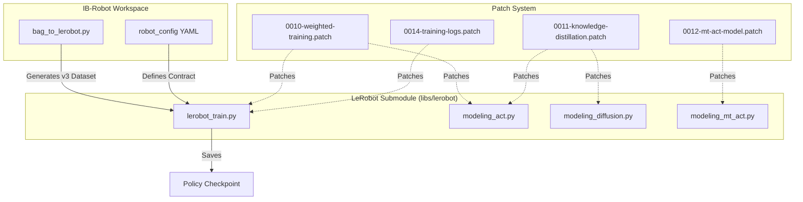
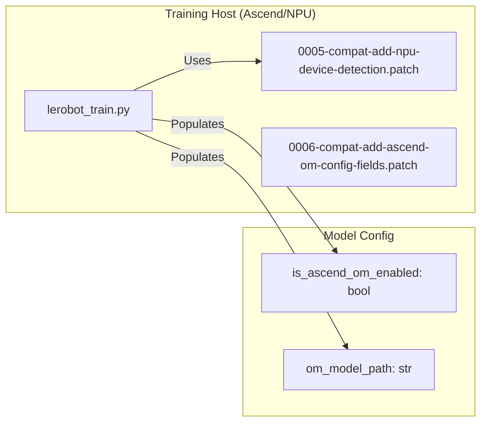

# 训练集成

相关源文件

生成此 wiki 页面时使用了以下文件作为上下文：

- [.gitignore](https://atomgit.com/openeuler/IB_Robot/blob/master/.gitignore)
- [docs/RKNN_NPU_inference_on_BQ3588HM.md](https://atomgit.com/openeuler/IB_Robot/blob/master/docs/RKNN_NPU_inference_on_BQ3588HM.md)
- [scripts/setup/tests/test_lerobot_filter.sh](https://atomgit.com/openeuler/IB_Robot/blob/master/scripts/setup/tests/test_lerobot_filter.sh)
- [third_party/patches/lerobot/v0.5.1/0009-adaptive-weight-prerequisites.patch](https://atomgit.com/openeuler/IB_Robot/blob/master/third_party/patches/lerobot/v0.5.1/0009-adaptive-weight-prerequisites.patch)
- [third_party/patches/lerobot/v0.5.1/0010-weighted-training.patch](https://atomgit.com/openeuler/IB_Robot/blob/master/third_party/patches/lerobot/v0.5.1/0010-weighted-training.patch)
- [third_party/patches/lerobot/v0.5.1/0011-knowledge-distillation.patch](https://atomgit.com/openeuler/IB_Robot/blob/master/third_party/patches/lerobot/v0.5.1/0011-knowledge-distillation.patch)
- [third_party/patches/lerobot/v0.5.1/0012-mt-act-model.patch](https://atomgit.com/openeuler/IB_Robot/blob/master/third_party/patches/lerobot/v0.5.1/0012-mt-act-model.patch)
- [third_party/patches/lerobot/v0.5.1/0014-training-logs.patch](https://atomgit.com/openeuler/IB_Robot/blob/master/third_party/patches/lerobot/v0.5.1/0014-training-logs.patch)
- [third_party/patches/lerobot/v0.5.1/manifest.yaml](https://atomgit.com/openeuler/IB_Robot/blob/master/third_party/patches/lerobot/v0.5.1/manifest.yaml)
- [third_party/patches/lerobot/v0.5.1/series.master-parity-candidates.txt](https://atomgit.com/openeuler/IB_Robot/blob/master/third_party/patches/lerobot/v0.5.1/series.master-parity-candidates.txt)
- [third_party/patches/lerobot/v0.5.1/series.txt](https://atomgit.com/openeuler/IB_Robot/blob/master/third_party/patches/lerobot/v0.5.1/series.txt)

## 目的与范围

本文档说明 IB-Robot 如何集成外部 **LeRobot training library**，用于训练 ACT、Diffusion Policy 和 VLA 等具身智能策略。内容覆盖通过 patch-based 配置系统设置 lerobot 库、数据集兼容性，以及 weighted training、knowledge distillation 等专用训练能力。

有关通过遥操作采集示教数据，请参见 [遥操作与数据采集](./teleoperation_and_data_collection.md)。有关将 ROS2 bags 转换为 LeRobot dataset format，请参见 [数据集转换（bag_to_lerobot）](./dataset_conversion_bag_to_lerobot.md)。

---

## 训练架构概览

IB-Robot 将模型训练委托给外部 LeRobot 库，该库以子模块形式维护在 `libs/lerobot` 中。为了兼容多种平台（Ubuntu、openEuler、OpenHarmony）和硬件（NVIDIA GPUs、Ascend NPUs），IB-Robot 使用定义在 `third_party/patches/lerobot/` 中的 **patch-based integration system** [third_party/patches/lerobot/v0.5.1/manifest.yaml:1-13](https://atomgit.com/openeuler/IB_Robot/blob/master/third_party/patches/lerobot/v0.5.1/manifest.yaml#L1-L13)。

### 训练生命周期与代码实体

**来源**: [third_party/patches/lerobot/v0.5.1/manifest.yaml:125-144](https://atomgit.com/openeuler/IB_Robot/blob/master/third_party/patches/lerobot/v0.5.1/manifest.yaml#L125-L144), [third_party/patches/lerobot/v0.5.1/0010-weighted-training.patch:1-15](https://atomgit.com/openeuler/IB_Robot/blob/master/third_party/patches/lerobot/v0.5.1/0010-weighted-training.patch#L1-L15), [third_party/patches/lerobot/v0.5.1/0011-knowledge-distillation.patch:1-15](https://atomgit.com/openeuler/IB_Robot/blob/master/third_party/patches/lerobot/v0.5.1/0011-knowledge-distillation.patch#L1-L15), [third_party/patches/lerobot/v0.5.1/0012-mt-act-model.patch:1-18](https://atomgit.com/openeuler/IB_Robot/blob/master/third_party/patches/lerobot/v0.5.1/0012-mt-act-model.patch#L1-L18), [third_party/patches/lerobot/v0.5.1/0014-training-logs.patch:1-10](https://atomgit.com/openeuler/IB_Robot/blob/master/third_party/patches/lerobot/v0.5.1/0014-training-logs.patch#L1-L10)

---

## LeRobot 库集成

### 基于 Patch 的兼容性
系统使用 manifest-driven patch applier，根据主机环境和训练需求修改 `libs/lerobot` 子模块 [third_party/patches/lerobot/v0.5.1/manifest.yaml:3-9](https://atomgit.com/openeuler/IB_Robot/blob/master/third_party/patches/lerobot/v0.5.1/manifest.yaml#L3-L9)。

- **Profile Gating**：仅当 active profile（例如 `training`、`ascend`、`distillation`）匹配 patch 的 `applies_to.profiles` 列表时，才应用 patch [third_party/patches/lerobot/v0.5.1/manifest.yaml:28-45](https://atomgit.com/openeuler/IB_Robot/blob/master/third_party/patches/lerobot/v0.5.1/manifest.yaml#L28-L45)。
- **Python Compatibility**：patch `0001` 到 `0003` 将库降级到支持 Ubuntu 22.04 和 openEuler 目标上的 Python 3.10 [third_party/patches/lerobot/v0.5.1/manifest.yaml:76-95](https://atomgit.com/openeuler/IB_Robot/blob/master/third_party/patches/lerobot/v0.5.1/manifest.yaml#L76-L95)。
- **NPU Support**：patch `0005` 为上游 device utilities 添加 Huawei Ascend NPU 设备检测 [third_party/patches/lerobot/v0.5.1/manifest.yaml:105-109](https://atomgit.com/openeuler/IB_Robot/blob/master/third_party/patches/lerobot/v0.5.1/manifest.yaml#L105-L109)。

### 训练专用 Patches
为启用高级训练能力，以下 patches 会应用到 `training` profile：
- **Weighted Training (`0010`)**：向 `TrainPipelineConfig` 引入 `custom_weights`、`ada_weight`（自适应损失加权）和 `weight_clipping` [third_party/patches/lerobot/v0.5.1/0010-weighted-training.patch:17-37](https://atomgit.com/openeuler/IB_Robot/blob/master/third_party/patches/lerobot/v0.5.1/0010-weighted-training.patch#L17-L37)。
- **Knowledge Distillation (`0011`)**：为 ACT 和 Diffusion models 添加 teacher-student distillation 支持 [third_party/patches/lerobot/v0.5.1/0011-knowledge-distillation.patch:1-15](https://atomgit.com/openeuler/IB_Robot/blob/master/third_party/patches/lerobot/v0.5.1/0011-knowledge-distillation.patch#L1-L15)。
- **Multi-Task ACT (`0012`)**：将 `mt_act` policy family 恢复为独立模型 patch [third_party/patches/lerobot/v0.5.1/0012-mt-act-model.patch:1-18](https://atomgit.com/openeuler/IB_Robot/blob/master/third_party/patches/lerobot/v0.5.1/0012-mt-act-model.patch#L1-L18)。
- **Training Logs (`0014`)**：为支持 KD 的训练运行添加 TensorBoard training 和 evaluation scalar logs [third_party/patches/lerobot/v0.5.1/0014-training-logs.patch:1-10](https://atomgit.com/openeuler/IB_Robot/blob/master/third_party/patches/lerobot/v0.5.1/0014-training-logs.patch#L1-L10)。

**来源**: [third_party/patches/lerobot/v0.5.1/manifest.yaml:28-45](https://atomgit.com/openeuler/IB_Robot/blob/master/third_party/patches/lerobot/v0.5.1/manifest.yaml#L28-L45), [third_party/patches/lerobot/v0.5.1/0010-weighted-training.patch:16-37](https://atomgit.com/openeuler/IB_Robot/blob/master/third_party/patches/lerobot/v0.5.1/0010-weighted-training.patch#L16-L37), [third_party/patches/lerobot/v0.5.1/0011-knowledge-distillation.patch:1-15](https://atomgit.com/openeuler/IB_Robot/blob/master/third_party/patches/lerobot/v0.5.1/0011-knowledge-distillation.patch#L1-L15), [third_party/patches/lerobot/v0.5.1/0012-mt-act-model.patch:1-18](https://atomgit.com/openeuler/IB_Robot/blob/master/third_party/patches/lerobot/v0.5.1/0012-mt-act-model.patch#L1-L18), [third_party/patches/lerobot/v0.5.1/0014-training-logs.patch:1-10](https://atomgit.com/openeuler/IB_Robot/blob/master/third_party/patches/lerobot/v0.5.1/0014-training-logs.patch#L1-L10)

---

## 高级训练特性

### 1. Weighted Training
通过 `0010-weighted-training.patch` 修改后，训练脚本 `lerobot_train.py` 支持：
- **Adaptive Weighting**：使用 `WeightSampler` 动态更新 loss weights [third_party/patches/lerobot/v0.5.1/0010-weighted-training.patch:141-147](https://atomgit.com/openeuler/IB_Robot/blob/master/third_party/patches/lerobot/v0.5.1/0010-weighted-training.patch#L141-L147)。
- **Weight Gradient Clipping**：通过 `clipping_min` 和 `clipping_max` 边界防止 policy weights 梯度爆炸 [third_party/patches/lerobot/v0.5.1/0010-weighted-training.patch:32-34](https://atomgit.com/openeuler/IB_Robot/blob/master/third_party/patches/lerobot/v0.5.1/0010-weighted-training.patch#L32-L34)。
- **Quantization Aware Training (QAT)**：添加 `QuantConstraint`，支持面向 Hisilicon 硬件的量化敏感训练 [third_party/patches/lerobot/v0.5.1/0010-weighted-training.patch:116-122](https://atomgit.com/openeuler/IB_Robot/blob/master/third_party/patches/lerobot/v0.5.1/0010-weighted-training.patch#L116-L122)。
- **Custom Sample Weights**：如果启用 `custom_weights`，从数据集的 `training_weight` 列加载权重 [third_party/patches/lerobot/v0.5.1/0010-weighted-training.patch:70-92](https://atomgit.com/openeuler/IB_Robot/blob/master/third_party/patches/lerobot/v0.5.1/0010-weighted-training.patch#L70-L92)。

### 2. Knowledge Distillation (KD)
通过 `0011-knowledge-distillation.patch` 修改后，KD 允许 “student” 模型学习 “teacher” 模型输出：
- **Teacher Configuration**：通过 `ACTConfig` 和 `DiffusionConfig` 中的 `kd: bool` 与 `teacher_train_config` 路径启用 [third_party/patches/lerobot/v0.5.1/0011-knowledge-distillation.patch:15-19](https://atomgit.com/openeuler/IB_Robot/blob/master/third_party/patches/lerobot/v0.5.1/0011-knowledge-distillation.patch#L15-L19)。
- **Feature Matching**：student 的 decoder 输出通过 `compute_kd_loss`（MSE Loss）与 teacher 匹配 [third_party/patches/lerobot/v0.5.1/0011-knowledge-distillation.patch:32-41](https://atomgit.com/openeuler/IB_Robot/blob/master/third_party/patches/lerobot/v0.5.1/0011-knowledge-distillation.patch#L32-L41)。
- **Implementation**：KD 在 `modeling_act.py` 和 `modeling_diffusion.py` 中受支持 [third_party/patches/lerobot/v0.5.1/0011-knowledge-distillation.patch:23-26](https://atomgit.com/openeuler/IB_Robot/blob/master/third_party/patches/lerobot/v0.5.1/0011-knowledge-distillation.patch#L23-L26)。

### 3. Multi-Task ACT (MT-ACT)
Patch `0012-mt-act-model.patch` 引入 `mt_act` policy family。
- **Language Integration**：添加 `use_language` 和 `task_emb_dim`，用于语言条件任务 [third_party/patches/lerobot/v0.5.1/0012-mt-act-model.patch:151-154](https://atomgit.com/openeuler/IB_Robot/blob/master/third_party/patches/lerobot/v0.5.1/0012-mt-act-model.patch#L151-L154)。
- **FiLM Modulation**：实现 Feature-wise Linear Modulation（`FilmConfig`），将任务 embedding 融合到 ResNet backbone [third_party/patches/lerobot/v0.5.1/0012-mt-act-model.patch:91-102](https://atomgit.com/openeuler/IB_Robot/blob/master/third_party/patches/lerobot/v0.5.1/0012-mt-act-model.patch#L91-L102)。

### 4. TensorBoard Logging
Patch `0014-training-logs.patch` 通过 TensorBoard 集成增强训练流程：
- **Scalar Logs**：向 TensorBoard 添加 loss、learning rate 等训练和评估 scalar logs [third_party/patches/lerobot/v0.5.1/0014-training-logs.patch:46-50](https://atomgit.com/openeuler/IB_Robot/blob/master/third_party/patches/lerobot/v0.5.1/0014-training-logs.patch#L46-L50)。
- **Log Directory**：TensorBoard logs 保存到 `cfg.output_dir / "tensorboard"` [third_party/patches/lerobot/v0.5.1/0014-training-logs.patch:36-38](https://atomgit.com/openeuler/IB_Robot/blob/master/third_party/patches/lerobot/v0.5.1/0014-training-logs.patch#L36-L38)。
- **Evaluation Memory Cleanup**：评估期间调用 `torch.cuda.empty_cache()`，更有效管理 GPU memory [third_party/patches/lerobot/v0.5.1/0014-training-logs.patch:81-82](https://atomgit.com/openeuler/IB_Robot/blob/master/third_party/patches/lerobot/v0.5.1/0014-training-logs.patch#L81-L82)。

**来源**: [third_party/patches/lerobot/v0.5.1/0010-weighted-training.patch:16-147](https://atomgit.com/openeuler/IB_Robot/blob/master/third_party/patches/lerobot/v0.5.1/0010-weighted-training.patch#L16-L147), [third_party/patches/lerobot/v0.5.1/0011-knowledge-distillation.patch:18-41](https://atomgit.com/openeuler/IB_Robot/blob/master/third_party/patches/lerobot/v0.5.1/0011-knowledge-distillation.patch#L18-L41), [third_party/patches/lerobot/v0.5.1/0012-mt-act-model.patch:90-157](https://atomgit.com/openeuler/IB_Robot/blob/master/third_party/patches/lerobot/v0.5.1/0012-mt-act-model.patch#L90-L157), [third_party/patches/lerobot/v0.5.1/0014-training-logs.patch:36-50](https://atomgit.com/openeuler/IB_Robot/blob/master/third_party/patches/lerobot/v0.5.1/0014-training-logs.patch#L36-L50), [third_party/patches/lerobot/v0.5.1/0014-training-logs.patch:81-82](https://atomgit.com/openeuler/IB_Robot/blob/master/third_party/patches/lerobot/v0.5.1/0014-training-logs.patch#L81-L82)

---

## 平台特定训练环境

训练集成因目标平台不同而变化，并通过 `lerobot_filter_series.py` 回归测试工具验证 [scripts/setup/tests/test_lerobot_filter.sh:2-7](https://atomgit.com/openeuler/IB_Robot/blob/master/scripts/setup/tests/test_lerobot_filter.sh#L2-L7)。

| Platform | Profile | Python | Key Features |
| :--- | :--- | :--- | :--- |
| **Ubuntu 22.04** | `core,ros,dev` | 3.10 | 标准 GPU training，可视化工具 [scripts/setup/tests/test_lerobot_filter.sh:104-108](https://atomgit.com/openeuler/IB_Robot/blob/master/scripts/setup/tests/test_lerobot_filter.sh#L104-L108) |
| **openEuler** | `core,ros,openeuler` | 3.11 | Ascend NPU training 支持 [scripts/setup/tests/test_lerobot_filter.sh:114-118](https://atomgit.com/openeuler/IB_Robot/blob/master/scripts/setup/tests/test_lerobot_filter.sh#L114-L118) |
| **Ascend NPU** | `ascend,om,training` | 3.10/3.11 | Weighted training、QAT、OM export 兼容性 [third_party/patches/lerobot/v0.5.1/manifest.yaml:35-39](https://atomgit.com/openeuler/IB_Robot/blob/master/third_party/patches/lerobot/v0.5.1/manifest.yaml#L35-L39) |
| **OpenHarmony** | `openharmony` | 3.12 | **仅推理**，使用 `0004-openharmony-lazy-import-policy-stack.patch` [scripts/setup/tests/test_lerobot_filter.sh:122-126](https://atomgit.com/openeuler/IB_Robot/blob/master/scripts/setup/tests/test_lerobot_filter.sh#L122-L126) |

### 训练集成流（Ascend/NPU）

**来源**: [scripts/setup/tests/test_lerobot_filter.sh:104-142](https://atomgit.com/openeuler/IB_Robot/blob/master/scripts/setup/tests/test_lerobot_filter.sh#L104-L142), [third_party/patches/lerobot/v0.5.1/manifest.yaml:105-115](https://atomgit.com/openeuler/IB_Robot/blob/master/third_party/patches/lerobot/v0.5.1/manifest.yaml#L105-L115)

---

## 训练执行

使用 IB-Robot 修改运行训练会话：

1.  **初始化环境**：确保正确 profiles 已启用，例如 `training,ascend`。
2.  **应用 Patches**：运行 `setup.sh`，该脚本会调用 `lerobot_filter_series.py` 选择并应用 patches [scripts/setup/tests/test_lerobot_filter.sh:20-25](https://atomgit.com/openeuler/IB_Robot/blob/master/scripts/setup/tests/test_lerobot_filter.sh#L20-L25)。
3.  **执行脚本**：使用位于 `libs/lerobot/src/lerobot/scripts/` 的 patched `lerobot_train.py`。

**关键训练 CLI Flags（Patched）**：
- `--training.custom_weights=true`：启用来自数据集的静态加权 [third_party/patches/lerobot/v0.5.1/0010-weighted-training.patch:30-31](https://atomgit.com/openeuler/IB_Robot/blob/master/third_party/patches/lerobot/v0.5.1/0010-weighted-training.patch#L30-L31)。
- `--training.ada_weight=true`：启用自适应损失加权 [third_party/patches/lerobot/v0.5.1/0009-adaptive-weight-prerequisites.patch:29-30](https://atomgit.com/openeuler/IB_Robot/blob/master/third_party/patches/lerobot/v0.5.1/0009-adaptive-weight-prerequisites.patch#L29-L30)。
- `--policy.kd=true`：启用 knowledge distillation [third_party/patches/lerobot/v0.5.1/0011-knowledge-distillation.patch:16-17](https://atomgit.com/openeuler/IB_Robot/blob/master/third_party/patches/lerobot/v0.5.1/0011-knowledge-distillation.patch#L16-L17)。
- `--policy.use_film=true`：为 MT-ACT 启用 FiLM [third_party/patches/lerobot/v0.5.1/0012-mt-act-model.patch:154-155](https://atomgit.com/openeuler/IB_Robot/blob/master/third_party/patches/lerobot/v0.5.1/0012-mt-act-model.patch#L154-L155)。

**来源**: [third_party/patches/lerobot/v0.5.1/0010-weighted-training.patch:20-35](https://atomgit.com/openeuler/IB_Robot/blob/master/third_party/patches/lerobot/v0.5.1/0010-weighted-training.patch#L20-L35), [third_party/patches/lerobot/v0.5.1/0011-knowledge-distillation.patch:15-20](https://atomgit.com/openeuler/IB_Robot/blob/master/third_party/patches/lerobot/v0.5.1/0011-knowledge-distillation.patch#L15-L20), [third_party/patches/lerobot/v0.5.1/0012-mt-act-model.patch:150-155](https://atomgit.com/openeuler/IB_Robot/blob/master/third_party/patches/lerobot/v0.5.1/0012-mt-act-model.patch#L150-L155)

