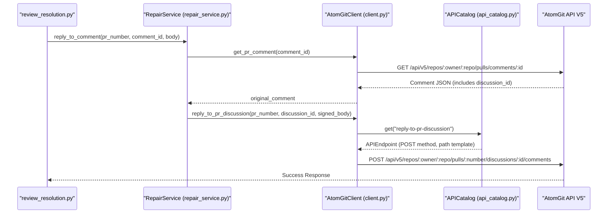
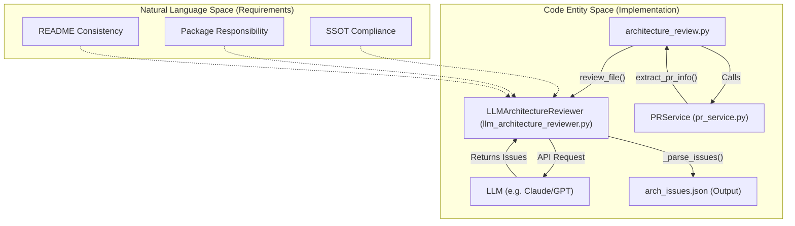

# AtomGit SDK 与 CI 自动化

<details>
<summary>相关源文件</summary>

以下文件被用作生成此 wiki 页面时的上下文：

- [.agents/skills/atomgit-collaboration/SKILL.md](https://atomgit.com/openeuler/IB_Robot/blob/master/.agents/skills/atomgit-collaboration/SKILL.md)
- [.agents/skills/atomgit-issue/SKILL.md](https://atomgit.com/openeuler/IB_Robot/blob/master/.agents/skills/atomgit-issue/SKILL.md)
- [.agents/skills/atomgit-issue/scripts/issue_management.py](https://atomgit.com/openeuler/IB_Robot/blob/master/.agents/skills/atomgit-issue/scripts/issue_management.py)
- [.agents/skills/atomgit-pr-architecture-review/SKILL.md](https://atomgit.com/openeuler/IB_Robot/blob/master/.agents/skills/atomgit-pr-architecture-review/SKILL.md)
- [.agents/skills/atomgit-pr-architecture-review/lib/__init__.py](https://atomgit.com/openeuler/IB_Robot/blob/master/.agents/skills/atomgit-pr-architecture-review/lib/__init__.py)
- [.agents/skills/atomgit-pr-architecture-review/lib/comment_formatter.py](https://atomgit.com/openeuler/IB_Robot/blob/master/.agents/skills/atomgit-pr-architecture-review/lib/comment_formatter.py)
- [.agents/skills/atomgit-pr-architecture-review/lib/llm_architecture_reviewer.py](https://atomgit.com/openeuler/IB_Robot/blob/master/.agents/skills/atomgit-pr-architecture-review/lib/llm_architecture_reviewer.py)
- [.agents/skills/atomgit-pr-architecture-review/scripts/architecture_review.py](https://atomgit.com/openeuler/IB_Robot/blob/master/.agents/skills/atomgit-pr-architecture-review/scripts/architecture_review.py)
- [.agents/skills/atomgit-pr-review/SKILL.md](https://atomgit.com/openeuler/IB_Robot/blob/master/.agents/skills/atomgit-pr-review/SKILL.md)
- [.agents/skills/atomgit-pr-review/scripts/pr_review.py](https://atomgit.com/openeuler/IB_Robot/blob/master/.agents/skills/atomgit-pr-review/scripts/pr_review.py)
- [.agents/skills/atomgit-pr/SKILL.md](https://atomgit.com/openeuler/IB_Robot/blob/master/.agents/skills/atomgit-pr/SKILL.md)
- [.agents/skills/atomgit-pr/scripts/pr_creation.py](https://atomgit.com/openeuler/IB_Robot/blob/master/.agents/skills/atomgit-pr/scripts/pr_creation.py)
- [.agents/skills/atomgit-pr/scripts/pr_management.py](https://atomgit.com/openeuler/IB_Robot/blob/master/.agents/skills/atomgit-pr/scripts/pr_management.py)
- [.agents/skills/atomgit-review-resolution/SKILL.md](https://atomgit.com/openeuler/IB_Robot/blob/master/.agents/skills/atomgit-review-resolution/SKILL.md)
- [.agents/skills/atomgit-review-resolution/scripts/review_resolution.py](https://atomgit.com/openeuler/IB_Robot/blob/master/.agents/skills/atomgit-review-resolution/scripts/review_resolution.py)
- [config.json](https://atomgit.com/openeuler/IB_Robot/blob/master/config.json)
- [libs/atomgit_sdk/README.md](https://atomgit.com/openeuler/IB_Robot/blob/master/libs/atomgit_sdk/README.md)
- [libs/atomgit_sdk/src/atomgit_sdk/__init__.py](https://atomgit.com/openeuler/IB_Robot/blob/master/libs/atomgit_sdk/src/atomgit_sdk/__init__.py)
- [libs/atomgit_sdk/src/atomgit_sdk/api_catalog.py](https://atomgit.com/openeuler/IB_Robot/blob/master/libs/atomgit_sdk/src/atomgit_sdk/api_catalog.py)
- [libs/atomgit_sdk/src/atomgit_sdk/client.py](https://atomgit.com/openeuler/IB_Robot/blob/master/libs/atomgit_sdk/src/atomgit_sdk/client.py)
- [libs/atomgit_sdk/src/atomgit_sdk/config.py](https://atomgit.com/openeuler/IB_Robot/blob/master/libs/atomgit_sdk/src/atomgit_sdk/config.py)
- [libs/atomgit_sdk/src/atomgit_sdk/services/__init__.py](https://atomgit.com/openeuler/IB_Robot/blob/master/libs/atomgit_sdk/src/atomgit_sdk/services/__init__.py)
- [libs/atomgit_sdk/src/atomgit_sdk/services/issue_service.py](https://atomgit.com/openeuler/IB_Robot/blob/master/libs/atomgit_sdk/src/atomgit_sdk/services/issue_service.py)
- [libs/atomgit_sdk/src/atomgit_sdk/services/pr_service.py](https://atomgit.com/openeuler/IB_Robot/blob/master/libs/atomgit_sdk/src/atomgit_sdk/services/pr_service.py)
- [libs/atomgit_sdk/src/atomgit_sdk/services/repair_service.py](https://atomgit.com/openeuler/IB_Robot/blob/master/libs/atomgit_sdk/src/atomgit_sdk/services/repair_service.py)
- [libs/atomgit_sdk/src/atomgit_sdk/utils/url.py](https://atomgit.com/openeuler/IB_Robot/blob/master/libs/atomgit_sdk/src/atomgit_sdk/utils/url.py)
- [libs/atomgit_sdk/test_sdk_core.py](https://atomgit.com/openeuler/IB_Robot/blob/master/libs/atomgit_sdk/test_sdk_core.py)
- [libs/atomgit_sdk/tests/test_api_catalog.py](https://atomgit.com/openeuler/IB_Robot/blob/master/libs/atomgit_sdk/tests/test_api_catalog.py)
- [libs/atomgit_sdk/tests/test_client_retry.py](https://atomgit.com/openeuler/IB_Robot/blob/master/libs/atomgit_sdk/tests/test_client_retry.py)
- [libs/atomgit_sdk/tests/test_issue_label_validation.py](https://atomgit.com/openeuler/IB_Robot/blob/master/libs/atomgit_sdk/tests/test_issue_label_validation.py)
- [libs/atomgit_sdk/tests/test_repair_service.py](https://atomgit.com/openeuler/IB_Robot/blob/master/libs/atomgit_sdk/tests/test_repair_service.py)

</details>


本页说明 `atomgit_sdk` 库，以及 IB_Robot 仓库中用于 Pull Request（PR）管理、Issue 跟踪和架构审查的 AI 驱动 CI 自动化工作流。

## 概览

IB_Robot 项目使用统一的 Python SDK 与 AtomGit/GitCode API 交互 [libs/atomgit_sdk/src/atomgit_sdk/__init__.py:1-6](https://atomgit.com/openeuler/IB_Robot/blob/master/libs/atomgit_sdk/src/atomgit_sdk/__init__.py#L1-L6)。该 SDK 支持自动化协作工作流，包括：
*   **PR 管理**：获取 PR 详情、文件和 diff，用于自动生成描述 [libs/atomgit_sdk/src/atomgit_sdk/services/pr_service.py:52-71](https://atomgit.com/openeuler/IB_Robot/blob/master/libs/atomgit_sdk/src/atomgit_sdk/services/pr_service.py#L52-L71)。
*   **架构审查**：AI 驱动扫描 PR，检查是否符合 IB_Robot 架构支柱（SSOT、Contract-Driven 等）[.agents/skills/atomgit-pr-architecture-review/SKILL.md:57-89](https://atomgit.com/openeuler/IB_Robot/blob/master/.agents/skills/atomgit-pr-architecture-review/SKILL.md#L57-L89)。
*   **Review 闭环**：根据 reviewer 评论自动回复并应用代码修复 [.agents/skills/atomgit-review-resolution/SKILL.md:7-11](https://atomgit.com/openeuler/IB_Robot/blob/master/.agents/skills/atomgit-review-resolution/SKILL.md#L7-L11)。

## AtomGit SDK 架构

SDK 由用于底层 HTTP 请求的核心 client，以及用于领域特定逻辑的高层 service 组成 [libs/atomgit_sdk/src/atomgit_sdk/__init__.py:10-23](https://atomgit.com/openeuler/IB_Robot/blob/master/libs/atomgit_sdk/src/atomgit_sdk/__init__.py#L10-L23)。

### 核心 Client (`AtomGitClient`)
`AtomGitClient` 通过 Bearer token 管理认证，并处理与 AtomGit API 的原始 HTTP 通信 [libs/atomgit_sdk/src/atomgit_sdk/client.py:18-30](https://atomgit.com/openeuler/IB_Robot/blob/master/libs/atomgit_sdk/src/atomgit_sdk/client.py#L18-L30)。它为安全方法（`GET`、`HEAD`、`OPTIONS`）内置重试机制，用于处理临时网络失败或 SSL 错误 [libs/atomgit_sdk/src/atomgit_sdk/client.py:32-35](https://atomgit.com/openeuler/IB_Robot/blob/master/libs/atomgit_sdk/src/atomgit_sdk/client.py#L32-L35)。

### Service 层
*   **PRService**：处理 PR 专用工作流，例如提取完整 PR 上下文供 LLM 使用，以及提交批量评论 [libs/atomgit_sdk/src/atomgit_sdk/services/pr_service.py:14-18](https://atomgit.com/openeuler/IB_Robot/blob/master/libs/atomgit_sdk/src/atomgit_sdk/services/pr_service.py#L14-L18)。
*   **IssueService**：管理 Issue 生命周期，包括创建、更新和评论管理 [libs/atomgit_sdk/src/atomgit_sdk/services/issue_service.py:8-12](https://atomgit.com/openeuler/IB_Robot/blob/master/libs/atomgit_sdk/src/atomgit_sdk/services/issue_service.py#L8-L12)。
*   **RepairService**：聚焦 review discussion，支持线程回复、discussion 分组和线程解决 [libs/atomgit_sdk/src/atomgit_sdk/services/repair_service.py:12-16](https://atomgit.com/openeuler/IB_Robot/blob/master/libs/atomgit_sdk/src/atomgit_sdk/services/repair_service.py#L12-L16)。

### 数据流：SDK 请求生命周期

下图展示一个高层 service 调用如何通过内部 catalog 转换为 AtomGit API 请求。

**Diagram: SDK Request Execution Flow**

来源：[libs/atomgit_sdk/src/atomgit_sdk/services/repair_service.py:114-150](https://atomgit.com/openeuler/IB_Robot/blob/master/libs/atomgit_sdk/src/atomgit_sdk/services/repair_service.py#L114-L150)、[libs/atomgit_sdk/src/atomgit_sdk/client.py:99-115](https://atomgit.com/openeuler/IB_Robot/blob/master/libs/atomgit_sdk/src/atomgit_sdk/client.py#L99-L115)、[libs/atomgit_sdk/src/atomgit_sdk/client.py:143-148](https://atomgit.com/openeuler/IB_Robot/blob/master/libs/atomgit_sdk/src/atomgit_sdk/client.py#L143-L148)

## AI 驱动的架构审查

仓库实现了专用 skill `atomgit-pr-architecture-review`，使用 LLM 强制检查 IB_Robot 架构支柱 [.agents/skills/atomgit-pr-architecture-review/SKILL.md:1-3](https://atomgit.com/openeuler/IB_Robot/blob/master/.agents/skills/atomgit-pr-architecture-review/SKILL.md#L1-L3)。

### 审查用架构支柱
审查过程根据具体 IB_Robot 架构支柱评估代码 [.agents/skills/atomgit-pr-architecture-review/SKILL.md:57-89](https://atomgit.com/openeuler/IB_Robot/blob/master/.agents/skills/atomgit-pr-architecture-review/SKILL.md#L57-L89)：
1.  **SSOT (Single Source of Truth)**：确保配置统一且未硬编码。
2.  **Contract-Driven Design**：验证接口完整性和依赖注入。
3.  **Control Mode Architecture**：检查控制策略之间是否清晰分离。
4.  **Package-Specific Compliance**：验证变更是否保持在 ROS 包定义的职责边界内。
5.  **README Consistency**：确保包文档与代码变更保持同步。

### 实现与逻辑空间映射

下图把自然语言的“Review Pillars”桥接到实现扫描和报告的代码实体。

**Diagram: Architecture Review Logic Mapping**

来源：[.agents/skills/atomgit-pr-architecture-review/scripts/architecture_review.py:41-49](https://atomgit.com/openeuler/IB_Robot/blob/master/.agents/skills/atomgit-pr-architecture-review/scripts/architecture_review.py#L41-L49)、[libs/atomgit_sdk/src/atomgit_sdk/services/pr_service.py:73-115](https://atomgit.com/openeuler/IB_Robot/blob/master/libs/atomgit_sdk/src/atomgit_sdk/services/pr_service.py#L73-L115)、[.agents/skills/atomgit-pr-architecture-review/SKILL.md:90-107](https://atomgit.com/openeuler/IB_Robot/blob/master/.agents/skills/atomgit-pr-architecture-review/SKILL.md#L90-L107)

## Review 闭环工作流

`atomgit-review-resolution` skill 自动化人类 reviewer 与 AI agent 之间的反馈闭环 [.agents/skills/atomgit-review-resolution/SKILL.md:7-11](https://atomgit.com/openeuler/IB_Robot/blob/master/.agents/skills/atomgit-review-resolution/SKILL.md#L7-L11)。

### 关键操作
`review_resolution.py` 脚本支持多种模式 [.agents/skills/atomgit-review-resolution/scripts/review_resolution.py:4-8](https://atomgit.com/openeuler/IB_Robot/blob/master/.agents/skills/atomgit-review-resolution/scripts/review_resolution.py#L4-L8)：
*   **获取评论**：使用 `RepairService.get_review_threads` 获取分组后的 review discussion [libs/atomgit_sdk/src/atomgit_sdk/services/repair_service.py:41-56](https://atomgit.com/openeuler/IB_Robot/blob/master/libs/atomgit_sdk/src/atomgit_sdk/services/repair_service.py#L41-L56)。
*   **应用修复**：基于 `fixes.json` 输入，通过 `apply_code_fix` 自动修改本地文件 [libs/atomgit_sdk/src/atomgit_sdk/services/repair_service.py:258-260](https://atomgit.com/openeuler/IB_Robot/blob/master/libs/atomgit_sdk/src/atomgit_sdk/services/repair_service.py#L258-L260)。
*   **自动回复**：使用 AI 签名格式化并向 AtomGit discussion thread 提交回复 [libs/atomgit_sdk/src/atomgit_sdk/services/repair_service.py:33-54](https://atomgit.com/openeuler/IB_Robot/blob/master/libs/atomgit_sdk/src/atomgit_sdk/services/repair_service.py#L33-L54)。

### 线程 Discussion 支持
SDK 处理 AtomGit discussion threading 的复杂性。它按 `discussion_id` 对评论分组，并提供 `reply_mode` 选项（`threaded` 与 `visible`）[libs/atomgit_sdk/src/atomgit_sdk/services/repair_service.py:41-56](https://atomgit.com/openeuler/IB_Robot/blob/master/libs/atomgit_sdk/src/atomgit_sdk/services/repair_service.py#L41-L56)。

| 特性 | 实现 | SDK 方法 |
| :--- | :--- | :--- |
| **分组** | 按 `discussion_id` 聚合评论 | `get_review_threads()` [libs/atomgit_sdk/src/atomgit_sdk/services/repair_service.py:41-56](https://atomgit.com/openeuler/IB_Robot/blob/master/libs/atomgit_sdk/src/atomgit_sdk/services/repair_service.py#L41-L56) |
| **线程回复** | 向已有线程发布嵌套回复 | `_reply_to_comment_threaded()` [libs/atomgit_sdk/src/atomgit_sdk/services/repair_service.py:152-181](https://atomgit.com/openeuler/IB_Robot/blob/master/libs/atomgit_sdk/src/atomgit_sdk/services/repair_service.py#L152-L181) |
| **可见性** | 发布顶层回复以提高可见性 | `_reply_to_comment_visible()` [libs/atomgit_sdk/src/atomgit_sdk/services/repair_service.py:183-214](https://atomgit.com/openeuler/IB_Robot/blob/master/libs/atomgit_sdk/src/atomgit_sdk/services/repair_service.py#L183-L214) |
| **解决状态** | 标记线程为已解决或未解决 | `resolve_comment()` [libs/atomgit_sdk/src/atomgit_sdk/services/repair_service.py:216-230](https://atomgit.com/openeuler/IB_Robot/blob/master/libs/atomgit_sdk/src/atomgit_sdk/services/repair_service.py#L216-L230) |

来源：[libs/atomgit_sdk/src/atomgit_sdk/services/repair_service.py:41-112](https://atomgit.com/openeuler/IB_Robot/blob/master/libs/atomgit_sdk/src/atomgit_sdk/services/repair_service.py#L41-L112)、[libs/atomgit_sdk/src/atomgit_sdk/services/repair_service.py:114-150](https://atomgit.com/openeuler/IB_Robot/blob/master/libs/atomgit_sdk/src/atomgit_sdk/services/repair_service.py#L114-L150)、[libs/atomgit_sdk/src/atomgit_sdk/services/repair_service.py:183-214](https://atomgit.com/openeuler/IB_Robot/blob/master/libs/atomgit_sdk/src/atomgit_sdk/services/repair_service.py#L183-L214)

## CI 集成

该自动化设计为由开发者或 AI Agent 触发。运行依赖 SDK 的脚本前，必须先初始化环境，使 SDK 加入 `PYTHONPATH` [.agents/skills/atomgit-review-resolution/SKILL.md:18-27](https://atomgit.com/openeuler/IB_Robot/blob/master/.agents/skills/atomgit-review-resolution/SKILL.md#L18-L27)。

```bash
# Initialize SDK path
source .shrc_local

# Example: Fetch unresolved comments for PR #84
python3 review_resolution.py --pr 84 --fetch-comments
```

工作流会在 `./tmp` 目录生成中间 JSON 产物，方便在 AI agent 提交评论或应用代码变更前进行人工验证 [.agents/skills/atomgit-pr/scripts/pr_management.py:98-102](https://atomgit.com/openeuler/IB_Robot/blob/master/.agents/skills/atomgit-pr/scripts/pr_management.py#L98-L102)。

来源：[.agents/skills/atomgit-review-resolution/SKILL.md:18-27](https://atomgit.com/openeuler/IB_Robot/blob/master/.agents/skills/atomgit-review-resolution/SKILL.md#L18-L27)、[.agents/skills/atomgit-pr/scripts/pr_management.py:38-47](https://atomgit.com/openeuler/IB_Robot/blob/master/.agents/skills/atomgit-pr/scripts/pr_management.py#L38-L47)、[.agents/skills/atomgit-review-resolution/scripts/review_resolution.py:194-200](https://atomgit.com/openeuler/IB_Robot/blob/master/.agents/skills/atomgit-review-resolution/scripts/review_resolution.py#L194-L200)

