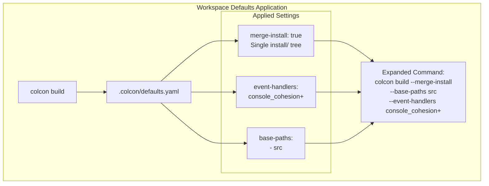
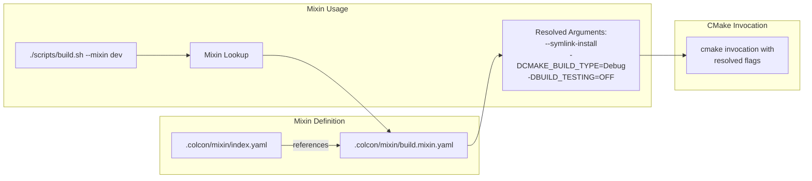
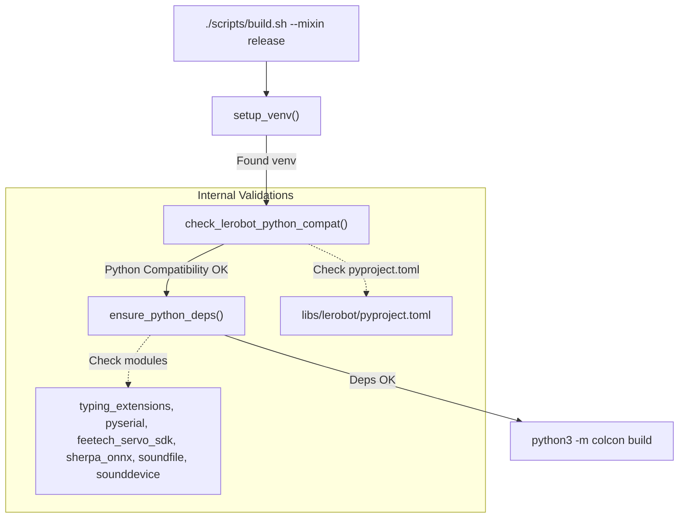

# 构建系统与 Mixins

<details>
<summary>相关源文件</summary>

以下文件被用作生成此 wiki 页面时的上下文：

- [.pre-commit-config.yaml](https://atomgit.com/openeuler/IB_Robot/blob/master/.pre-commit-config.yaml)
- [pyproject.toml](https://atomgit.com/openeuler/IB_Robot/blob/master/pyproject.toml)
- [scripts/build.sh](https://atomgit.com/openeuler/IB_Robot/blob/master/scripts/build.sh)
- [scripts/setup.sh](https://atomgit.com/openeuler/IB_Robot/blob/master/scripts/setup.sh)
- [scripts/setup/README.en.md](https://atomgit.com/openeuler/IB_Robot/blob/master/scripts/setup/README.en.md)
- [scripts/setup/lerobot_filter_series.py](https://atomgit.com/openeuler/IB_Robot/blob/master/scripts/setup/lerobot_filter_series.py)
- [scripts/setup/lerobot_patches.sh](https://atomgit.com/openeuler/IB_Robot/blob/master/scripts/setup/lerobot_patches.sh)
- [scripts/setup/lerobot_resolve_active.py](https://atomgit.com/openeuler/IB_Robot/blob/master/scripts/setup/lerobot_resolve_active.py)
- [third_party/patches/lerobot/INDEX.yaml](https://atomgit.com/openeuler/IB_Robot/blob/master/third_party/patches/lerobot/INDEX.yaml)

</details>


## 目标与范围

本页说明 IB-Robot 工作空间中使用的 colcon 构建系统配置和 mixin 系统。内容涵盖工作空间级默认值、面向不同配置（debug、release、dev、prod）的构建 mixin，以及用于开发的 VS Code 集成。

构建系统用于处理 ROS 2 Humble、Python 虚拟环境和带 patch 的 LeRobot 库之间的复杂依赖，确保 Ubuntu、openEuler 和 OpenHarmony 平台上的环境保持一致。

---

## 构建系统概览

IB-Robot 工作空间使用 **colcon**（collective construction），这是标准 ROS 2 构建工具，可编排多个 package 的构建。系统与专用 Python 虚拟环境紧密集成，确保 ROS 2 Humble 与 LeRobot 等现代机器学习库兼容。

### 工作空间目录结构

```text
IB_Robot/
├── src/                    # Source packages (C++ and Python)
├── libs/                   # Third-party libraries (e.g., lerobot)
├── scripts/                # Build and setup utilities
│   ├── build.sh            # Main build entry point
│   └── setup.sh            # Environment initialization script
├── .colcon/                # Workspace-level colcon configuration
│   ├── defaults.yaml       # Default colcon arguments
│   └── mixin/              # Local mixin definitions
└── .vscode/                # IDE integration tasks and settings
```

该工作空间遵循标准 ROS 2 overlay 模式，`install/` 包含已构建 package。IB-Robot 的一个关键区别是使用 `scripts/build.sh` 作为包装入口，以确保虚拟环境被正确 source，并设置 `PYTHONNOUSERSITE=1` 防止宿主机级别 package 干扰。

**来源：** [scripts/build.sh:13-15](https://atomgit.com/openeuler/IB_Robot/blob/master/scripts/build.sh#L13-L15)、[scripts/build.sh:204-207](https://atomgit.com/openeuler/IB_Robot/blob/master/scripts/build.sh#L204-L207)、[scripts/setup.sh:68](https://atomgit.com/openeuler/IB_Robot/blob/master/scripts/setup.sh#L68)、[README.md:62-102](https://atomgit.com/openeuler/IB_Robot/blob/master/README.md#L62-L102)、[README.en.md:64-105](https://atomgit.com/openeuler/IB_Robot/blob/master/README.en.md#L64-L105)

---

## 工作空间默认配置

`.colcon/defaults.yaml` 中的工作空间级默认值会自动应用到所有 colcon 命令，确保开发环境一致。

### 默认构建配置



**Diagram: Workspace defaults automatic expansion**

### 关键默认设置

| 设置 | 值 | 用途 |
|---------|-------|---------|
| `merge-install` | `true` | 将所有 package 合并到单个 `install/` 目录。这对维护虚拟环境中的干净 `PYTHONPATH` 很关键。 |
| `event-handlers` | `console_cohesion+` | 按 package 聚合控制台输出，避免并行构建期间日志交错。 |
| `base-paths` | `src` | 指定 ROS 2 package 的主要源码目录。 |

**来源：** [.colcon/defaults.yaml:5-18](https://atomgit.com/openeuler/IB_Robot/blob/master/.colcon/defaults.yaml#L5-L18)

---

## 构建 Mixin 系统

### 什么是 Mixin？

Mixin 是可复用的 colcon 命令行参数集合。在 IB-Robot 中，它们定义在 `.colcon/mixin/build.mixin.yaml` 中，允许在优化的生产构建和符号链接开发构建之间切换，不需要手动管理 flag。

### Mixin 架构



**Diagram: Mixin resolution via build.sh and colcon**

**来源：** [.colcon/mixin/index.yaml:1-4](https://atomgit.com/openeuler/IB_Robot/blob/master/.colcon/mixin/index.yaml#L1-L4)、[.colcon/mixin/build.mixin.yaml:1-19](https://atomgit.com/openeuler/IB_Robot/blob/master/.colcon/mixin/build.mixin.yaml#L1-L19)、[scripts/build.sh:87-93](https://atomgit.com/openeuler/IB_Robot/blob/master/scripts/build.sh#L87-L93)

---

## 可用构建 Mixin

工作空间为机器人生命周期的不同阶段提供预配置 mixin。

### 构建配置 Mixin

| Mixin 名称 | CMake Build Type | Symlink Install | Testing | 使用场景 |
|------------|------------------|-----------------|---------|----------|
| `debug` | Debug | No | Default | 带符号的标准 C++ 调试 |
| `release` | Release | No | Default | 优化后的性能测试 |
| `dev` | Debug | **Yes** | OFF | **默认**，迭代式 Python/C++ 开发 |
| `prod` | Release | No | OFF | 生产部署，禁用 tracing |
| `ci` | Default | No | ON | CI 构建（release + tests + linting） |
| `asan` | Default | No | Default | AddressSanitizer |
| `tsan` | Default | No | Default | ThreadSanitizer |

### Mixin 定义参考

#### Development Mixin (`dev`)
```yaml
dev:
  symlink-install: true
  cmake-args: ["-DCMAKE_BUILD_TYPE=Debug", "-DCMAKE_EXPORT_COMPILE_COMMANDS=ON", "-DBUILD_TESTING=OFF"]
```
**用途：** 这是 `scripts/build.sh` 使用的默认 mixin [scripts/build.sh:127](https://atomgit.com/openeuler/IB_Robot/blob/master/scripts/build.sh#L127)。它启用 `symlink-install`，让 Python 源文件和 ROS 2 launch 文件的改动无需重新构建即可生效。

#### Production Mixin (`prod`)
```yaml
prod:
  cmake-args: ["-DCMAKE_BUILD_TYPE=Release", "-DBUILD_TESTING=OFF", "-DTRACETOOLS_DISABLED=ON"]
```
**用途：** 面向部署优化。它禁用 `TRACETOOLS` 以减少开销，并使用完整 `Release` 优化。

**来源：** [.colcon/mixin/build.mixin.yaml:1-19](https://atomgit.com/openeuler/IB_Robot/blob/master/.colcon/mixin/build.mixin.yaml#L1-L19)、[scripts/build.sh:42-47](https://atomgit.com/openeuler/IB_Robot/blob/master/scripts/build.sh#L42-L47)、[scripts/build.sh:127](https://atomgit.com/openeuler/IB_Robot/blob/master/scripts/build.sh#L127)

---

## 构建包装器 (`build.sh`)

虽然可以直接调用 `colcon build`，但推荐入口是 `scripts/build.sh`。它会在开始构建前执行多项关键环境检查。

### 构建逻辑和数据流



**Diagram: Build wrapper validation logic**

### build.sh 关键特性
1.  **虚拟环境强制使用**：自动 source `${WORKSPACE}/venv/bin/activate` 或其他常见 venv 路径，确保 ML 依赖与系统 Python 隔离 [scripts/build.sh:132-147](https://atomgit.com/openeuler/IB_Robot/blob/master/scripts/build.sh#L132-L147)。
2.  **LeRobot 兼容性检查**：解析 `libs/lerobot/pyproject.toml`，确保当前 Python 解释器满足 LeRobot 子模块所需的最低版本 [scripts/build.sh:163-190](https://atomgit.com/openeuler/IB_Robot/blob/master/scripts/build.sh#L163-L190)。该检查很关键，因为 LeRobot 的传递依赖有时会与 ROS 2 Humble 的 Python ABI 要求冲突，尤其是 NumPy 和 OpenCV。`setup.sh` 通过允许 LeRobot 安装其偏好的版本，再强制重装兼容版本的 NumPy 和 OpenCV 来处理该问题 [scripts/setup.sh:70-81](https://atomgit.com/openeuler/IB_Robot/blob/master/scripts/setup.sh#L70-L81)。
3.  **自动依赖注入**：在构建依赖它们的 package 前，确保 venv 中存在 `typing_extensions`、`pyserial`、`feetech_servo_sdk`、`sherpa_onnx`、`soundfile`、`sounddevice` 等关键非 ROS Python 依赖 [scripts/build.sh:149-161](https://atomgit.com/openeuler/IB_Robot/blob/master/scripts/build.sh#L149-L161)。
4.  **Python 隔离**：设置 `PYTHONNOUSERSITE=1`，确保构建只看到 venv 和 ROS 系统路径中的 package，避免与 `~/.local/lib/pythonX.X/site-packages` 冲突 [scripts/build.sh:204-207](https://atomgit.com/openeuler/IB_Robot/blob/master/scripts/build.sh#L204-L207)。

**来源：** [scripts/build.sh:132-215](https://atomgit.com/openeuler/IB_Robot/blob/master/scripts/build.sh#L132-L215)、[scripts/setup.sh:70-81](https://atomgit.com/openeuler/IB_Robot/blob/master/scripts/setup.sh#L70-L81)

---

## VS Code 集成

工作空间包含预配置的设置和 task，用于在 IDE 中简化构建流程。

### 构建 Task 和设置

-   **Python 解释器**：默认配置为 `${workspaceFolder}/venv/bin/python3`，确保 IDE 与命令行构建系统一致 [.vscode/settings.json:2](https://atomgit.com/openeuler/IB_Robot/blob/master/.vscode/settings.json#L2)。
-   **路径解析**：`python.analysis.extraPaths` 和 `PYTHONPATH` 设置包含 `libs/lerobot/src` 和 `src`，确保 IntelliSense 对混合工作空间正常工作 [.vscode/settings.json:3-19](https://atomgit.com/openeuler/IB_Robot/blob/master/.vscode/settings.json#L3-L19)。
-   **构建 Task**：`.vscode/tasks.json` 定义了标准 `colcon build` task，显式 source ROS 2 Humble 环境和工作空间 venv [.vscode/tasks.json:5-17](https://atomgit.com/openeuler/IB_Robot/blob/master/.vscode/tasks.json#L5-L17)。

### 配置验证

开发者可以使用 `scripts/validate_config.py`，在部署前确保 `robot_config` 中的关节定义与 controller 和 MoveIt 配置的期望一致。

```bash
# Validate configuration consistency
python3 scripts/validate_config.py --robot-config src/robot_config/config/so101/robot_config.yaml
```

**来源：** [.vscode/settings.json:1-34](https://atomgit.com/openeuler/IB_Robot/blob/master/.vscode/settings.json#L1-L34)、[.vscode/tasks.json:1-26](https://atomgit.com/openeuler/IB_Robot/blob/master/.vscode/tasks.json#L1-L26)、[scripts/validate_config.py:1-17](https://atomgit.com/openeuler/IB_Robot/blob/master/scripts/validate_config.py#L1-L17)

---

## 构建工作流示例

### 标准开发
```bash
# Full build with default 'dev' mixin (symlinks enabled)
./scripts/build.sh
```

### 生产部署
```bash
# Optimized build for hardware deployment
./scripts/build.sh --mixin prod
```

### 定向 Package 构建
```bash
# Build only a specific package and its dependencies
./scripts/build.sh -- --packages-up-to tensormsg
```

### 干净构建
```bash
# Clean CMake cache and rebuild
./scripts/build.sh --clean --mixin release
```

**来源：** [scripts/build.sh:5-9](https://atomgit.com/openeuler/IB_Robot/blob/master/scripts/build.sh#L5-L9)、[scripts/build.sh:51-58](https://atomgit.com/openeuler/IB_Robot/blob/master/scripts/build.sh#L51-L58)、[scripts/build.sh:98-101](https://atomgit.com/openeuler/IB_Robot/blob/master/scripts/build.sh#L98-L101)

