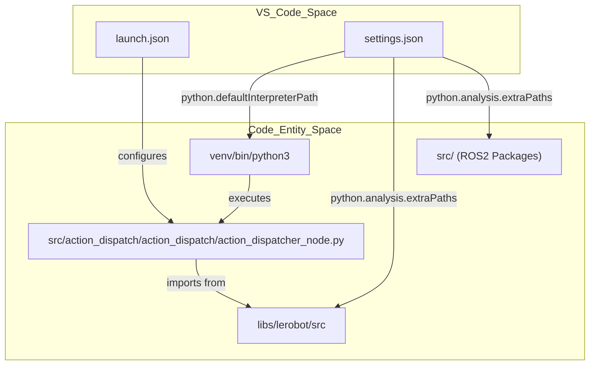
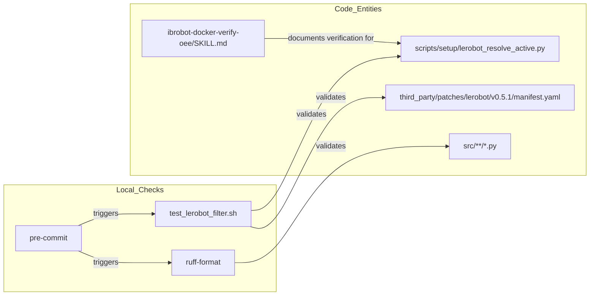
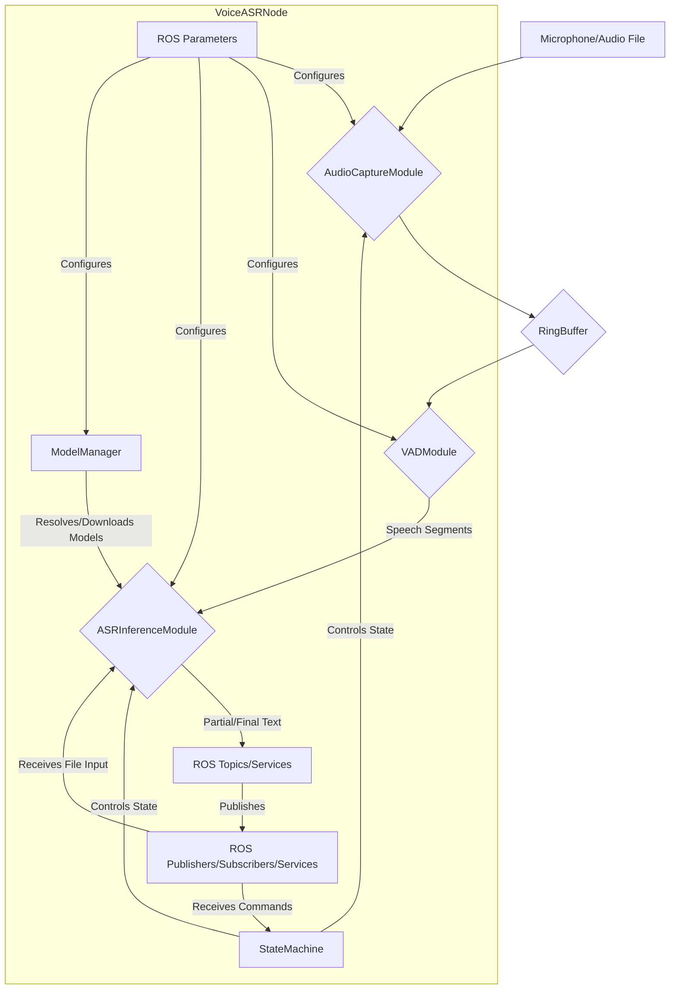

# 调试与测试

<details>
<summary>相关源文件</summary>

以下文件被用作生成此 wiki 页面时的上下文：

- [.agents/skills/ibrobot-docker-verify-oee/SKILL.md](https://atomgit.com/openeuler/IB_Robot/blob/master/.agents/skills/ibrobot-docker-verify-oee/SKILL.md)
- [.agents/skills/ibrobot-docker-verify/SKILL.md](https://atomgit.com/openeuler/IB_Robot/blob/master/.agents/skills/ibrobot-docker-verify/SKILL.md)
- [CONTRIBUTING.en.md](https://atomgit.com/openeuler/IB_Robot/blob/master/CONTRIBUTING.en.md)
- [CONTRIBUTING.md](https://atomgit.com/openeuler/IB_Robot/blob/master/CONTRIBUTING.md)
- [src/hardware_mock/hardware_mock/__init__.py](https://atomgit.com/openeuler/IB_Robot/blob/master/src/hardware_mock/hardware_mock/__init__.py)
- [src/hardware_mock/launch/hardware_mock.launch.py](https://atomgit.com/openeuler/IB_Robot/blob/master/src/hardware_mock/launch/hardware_mock.launch.py)
- [src/hardware_mock/package.xml](https://atomgit.com/openeuler/IB_Robot/blob/master/src/hardware_mock/package.xml)
- [src/hardware_mock/resource/hardware_mock](https://atomgit.com/openeuler/IB_Robot/blob/master/src/hardware_mock/resource/hardware_mock)
- [src/hardware_mock/setup.cfg](https://atomgit.com/openeuler/IB_Robot/blob/master/src/hardware_mock/setup.cfg)
- [src/hardware_mock/setup.py](https://atomgit.com/openeuler/IB_Robot/blob/master/src/hardware_mock/setup.py)
- [src/hardware_mock/test/test_contract_plan.py](https://atomgit.com/openeuler/IB_Robot/blob/master/src/hardware_mock/test/test_contract_plan.py)
- [src/hardware_mock/test/test_image_sources.py](https://atomgit.com/openeuler/IB_Robot/blob/master/src/hardware_mock/test/test_image_sources.py)
- [src/hardware_mock/test/test_joint_model.py](https://atomgit.com/openeuler/IB_Robot/blob/master/src/hardware_mock/test/test_joint_model.py)
- [src/robot_config/robot_config/config.py](https://atomgit.com/openeuler/IB_Robot/blob/master/src/robot_config/robot_config/config.py)
- [src/robot_config/test/test_config.py](https://atomgit.com/openeuler/IB_Robot/blob/master/src/robot_config/test/test_config.py)
- [src/voice_asr_service/README.md](https://atomgit.com/openeuler/IB_Robot/blob/master/src/voice_asr_service/README.md)
- [src/voice_asr_service/voice_asr_service/asr_inference_module.py](https://atomgit.com/openeuler/IB_Robot/blob/master/src/voice_asr_service/voice_asr_service/asr_inference_module.py)
- [src/voice_asr_service/voice_asr_service/audio_capture_module.py](https://atomgit.com/openeuler/IB_Robot/blob/master/src/voice_asr_service/voice_asr_service/audio_capture_module.py)
- [src/voice_asr_service/voice_asr_service/defaults.py](https://atomgit.com/openeuler/IB_Robot/blob/master/src/voice_asr_service/voice_asr_service/defaults.py)
- [src/voice_asr_service/voice_asr_service/model_manager.py](https://atomgit.com/openeuler/IB_Robot/blob/master/src/voice_asr_service/voice_asr_service/model_manager.py)
- [src/voice_asr_service/voice_asr_service/vad_module.py](https://atomgit.com/openeuler/IB_Robot/blob/master/src/voice_asr_service/voice_asr_service/vad_module.py)
- [src/voice_asr_service/voice_asr_service/voice_asr_node.py](https://atomgit.com/openeuler/IB_Robot/blob/master/src/voice_asr_service/voice_asr_service/voice_asr_node.py)

</details>


本页说明 IB-Robot 开发中的调试和测试基础设施，涵盖 VS Code 调试配置、基于 pytest 的单元测试、用于调试的构建系统配置、配置验证工具，以及第三方 patch 管理的回归 harness。

---

## VS Code 调试基础设施

工作空间提供预配置 launch 配置，可在正确环境中调试 Python ROS2 节点。

### Python 环境配置

Python 调试器需要显式配置 `PYTHONPATH`，以定位 ROS2 包、LeRobot 库和工作空间包。该配置由 `.vscode/settings.json` 管理，它将工作空间结构映射到 Python 解释器。

```yaml
Key Path Configurations:
- venv/bin/python3              # Project virtual environment
- libs/lerobot/src              # LeRobot library source
- src                           # Workspace ROS2 packages
- /opt/ros/humble/lib/python3.10/site-packages # ROS 2 core
```
来源：[.vscode/settings.json:1-33](https://atomgit.com/openeuler/IB_Robot/blob/master/.vscode/settings.json#L1-L33)

---

### Launch 配置

工作空间在 [.vscode/launch.json:1-28](https://atomgit.com/openeuler/IB_Robot/blob/master/.vscode/launch.json#L1-L28) 中定义主要调试配置：

#### 通用 Python 节点调试器
- **名称**：`ROS2: Debug Python Node (Current File)`
- **功能**：把当前打开的 Python 文件作为独立脚本调试。
- **环境**：继承工作空间级 `PYTHONPATH`。

#### Action Dispatcher 节点调试器
- **名称**：`ROS2: Action Dispatcher Node`
- **功能**：面向 `action_dispatcher_node.py` 的预配置调试器。
- **参数**：将 `robot_name` 参数设置为 `test_single_arm_single_cam`。

来源：[.vscode/launch.json:1-28](https://atomgit.com/openeuler/IB_Robot/blob/master/.vscode/launch.json#L1-L28)

---

### 调试环境图

下图展示 VS Code 配置实体如何映射到物理代码结构和 Python runtime。

"VS Code to Code Entity Mapping"

来源：[.vscode/launch.json:1-28](https://atomgit.com/openeuler/IB_Robot/blob/master/.vscode/launch.json#L1-L28)、[.vscode/settings.json:1-33](https://atomgit.com/openeuler/IB_Robot/blob/master/.vscode/settings.json#L1-L33)

---

## 使用 pytest 进行单元测试

代码库使用 `pytest` 对 Python 模块进行单元测试。测试依赖定义在 package manifest 中，例如 `src/dataset_tools/package.xml`。

### 测试套件组织

| 包 | 测试位置 | 用途 |
|---------|---------------|---------|
| `robot_config` | `src/robot_config/test/` | 验证 YAML 加载、Contract 生成和 Launch readiness |
| `action_dispatch` | `src/action_dispatch/test/` | 验证 `TemporalSmoother` 逻辑和队列 |
| `dataset_tools` | `src/dataset_tools/test/` | 验证 `bag_to_lerobot` 转换和 `episode_recorder` helper |
| `hardware_mock` | `src/hardware_mock/test/` | 验证 contract plan 生成和架构规则 |

### 配置和 Contract 测试
`test_config.py` 套件验证“Single Source of Truth”模式，确保 YAML 配置能正确转换为带类型的 `Contract` 对象。

- **RobotConfig 加载**：`test_load_single_arm_config` 验证 `so101_single_arm.yaml` 能以正确硬件插件和外设数量加载 [src/robot_config/test/test_config.py:35-69](https://atomgit.com/openeuler/IB_Robot/blob/master/src/robot_config/test/test_config.py#L35-L69)。
- **Contract 映射**：`test_dict_contract_builder_matches_typed_contract_shape` 确保基于 dict 的 loader 生成与 dataclass loader 相同的 contract 形状 [src/robot_config/test/test_config.py:87-106](https://atomgit.com/openeuler/IB_Robot/blob/master/src/robot_config/test/test_config.py#L87-L106)。
- **错误处理**：`test_dict_contract_builder_requires_topic_without_peripheral` 验证缺少 topic 和 peripheral 引用的 observation 会抛出 `ValueError` [src/robot_config/test/test_config.py:183-201](https://atomgit.com/openeuler/IB_Robot/blob/master/src/robot_config/test/test_config.py#L183-L201)。

`hardware_mock` 包也包含 contract plan 生成测试。例如，`test_build_plan_happy_path_matches_so101_layout` 验证 `build_plan` 函数能正确处理基础机器人配置，提取 joint ID、初始位置和 observation/action 详情 [src/hardware_mock/test/test_contract_plan.py:90-109](https://atomgit.com/openeuler/IB_Robot/blob/master/src/hardware_mock/test/test_contract_plan.py#L90-L109)。`test_unknown_observation_type_rejected` 和 `test_unknown_action_type_rejected` 等测试确保不支持的 message 类型会被拒绝，从而强制架构验证规则 [src/hardware_mock/test/test_contract_plan.py:111-123](https://atomgit.com/openeuler/IB_Robot/blob/master/src/hardware_mock/test/test_contract_plan.py#L111-L123)。

### Launch Readiness 测试
`test_launch_readiness.py` 确保 launch 时逻辑稳定，例如 controller 超时和仿真后端选择。

- **Controller 状态**：`test_missing_inactive_controllers_returns_only_non_active` 验证等待 `ros2_control` 硬件激活时使用的逻辑 [src/robot_config/test/test_launch_readiness.py:30-43](https://atomgit.com/openeuler/IB_Robot/blob/master/src/robot_config/test/test_launch_readiness.py#L30-L43)。
- **Tracing 解析**：`test_default_trace_session_auto_suffixes_on_collision` 验证 tracing builder 会在文件名冲突时追加时间戳 [src/robot_config/test/test_launch_readiness.py:109-126](https://atomgit.com/openeuler/IB_Robot/blob/master/src/robot_config/test/test_launch_readiness.py#L109-L126)。

来源：[src/robot_config/test/test_config.py:1-201](https://atomgit.com/openeuler/IB_Robot/blob/master/src/robot_config/test/test_config.py#L1-L201)、[src/robot_config/test/test_launch_readiness.py:1-200](https://atomgit.com/openeuler/IB_Robot/blob/master/src/robot_config/test/test_launch_readiness.py#L1-L200)、[src/hardware_mock/test/test_contract_plan.py:1-170](https://atomgit.com/openeuler/IB_Robot/blob/master/src/hardware_mock/test/test_contract_plan.py#L1-L170)

---

## 构建系统调试配置

`colcon` 构建系统通过 `.colcon/mixin` 目录中定义的 mixin 支持多种构建配置。

### 可用 Mixin
[.colcon/mixin/build.mixin.yaml:1-19](https://atomgit.com/openeuler/IB_Robot/blob/master/.colcon/mixin/build.mixin.yaml#L1-L19)

| Mixin | 用途 | CMake 参数 |
|-------|---------|-----------------|
| `debug` | 启用符号 | `-DCMAKE_BUILD_TYPE=Debug` |
| `release` | 优化构建 | `-DCMAKE_BUILD_TYPE=Release` |
| `dev` | 开发模式 | `symlink-install`、Debug mode、no tests |
| `prod` | 生产模式 | Release mode、no tests、tracing disabled |

来源：[.colcon/mixin/build.mixin.yaml:1-19](https://atomgit.com/openeuler/IB_Robot/blob/master/.colcon/mixin/build.mixin.yaml#L1-L19)

---

## Pre-commit 和 CI 自动化

项目使用 `pre-commit` 在提交前执行代码质量检查和本地回归测试。

### Ruff 集成
项目使用 `ruff` 做 lint 和 format，在 `pyproject.toml` 中配置，行宽为 120，并排除特定第三方库 [pyproject.toml:1-14](https://atomgit.com/openeuler/IB_Robot/blob/master/pyproject.toml#L1-L14)。

### 回归 Harness
当 patch manifest 或解析脚本变化时，本地 hook 会运行 `lerobot` patch 分发回归 harness [.pre-commit-config.yaml:13-27](https://atomgit.com/openeuler/IB_Robot/blob/master/.pre-commit-config.yaml#L13-L27)。

`test_lerobot_filter.sh` 脚本 mock host facts（OS、Python 版本、硬件 profile），验证 `lerobot_filter_series.py` 能从 `manifest.yaml` 中正确选择 patch [scripts/setup/tests/test_lerobot_filter.sh:1-100](https://atomgit.com/openeuler/IB_Robot/blob/master/scripts/setup/tests/test_lerobot_filter.sh#L1-L100)。

项目还包含面向特定平台的 Docker 验证 skill，例如 openEuler Embedded（OEE）。`ibrobot-docker-verify-oee` skill 描述了在模拟 AArch64 OEE Docker 容器中验证 `setup.sh` 和 `build.sh` 的流程，确保在 chroot 环境中兼容并正确执行 [.agents/skills/ibrobot-docker-verify-oee/SKILL.md:1-204](https://atomgit.com/openeuler/IB_Robot/blob/master/.agents/skills/ibrobot-docker-verify-oee/SKILL.md#L1-L204)。该流程包括启动 privileged Docker 容器、修复 chroot 环境（DNS、`/var/log`、`/proc`、`/sys` 挂载）、配置 `git safe.directory`，以及处理 DNF GPGME 仿真 bug [.agents/skills/ibrobot-docker-verify-oee/SKILL.md:66-97](https://atomgit.com/openeuler/IB_Robot/blob/master/.agents/skills/ibrobot-docker-verify-oee/SKILL.md#L66-L97)。

"CI and Pre-commit Data Flow"

来源：[.pre-commit-config.yaml:1-28](https://atomgit.com/openeuler/IB_Robot/blob/master/.pre-commit-config.yaml#L1-L28)、[scripts/setup/tests/test_lerobot_filter.sh:1-100](https://atomgit.com/openeuler/IB_Robot/blob/master/scripts/setup/tests/test_lerobot_filter.sh#L1-L100)、[third_party/patches/lerobot/v0.5.1/manifest.yaml:1-150](https://atomgit.com/openeuler/IB_Robot/blob/master/third_party/patches/lerobot/v0.5.1/manifest.yaml#L1-L150)、[.agents/skills/ibrobot-docker-verify-oee/SKILL.md:1-204](https://atomgit.com/openeuler/IB_Robot/blob/master/.agents/skills/ibrobot-docker-verify-oee/SKILL.md#L1-L204)

---

## 配置验证

`validate_config.py` 脚本会强制 `robot_config` 包中 YAML 文件之间的配置一致性。

### 验证逻辑
validator 确保不同子系统（Hardware、Controllers、MoveIt）中的关节定义保持一致。

**关键验证**：
1. **Joint Set 一致性**：验证 “all joints” 集合等于 “arm” 和 “gripper” joints 的并集 [scripts/validate_config.py:103-131](https://atomgit.com/openeuler/IB_Robot/blob/master/scripts/validate_config.py#L103-L131)。
2. **路径解析**：支持 `$(find package_name)` 等 ROS 风格替换，以定位工作空间中的配置文件 [scripts/validate_config.py:53-101](https://atomgit.com/openeuler/IB_Robot/blob/master/scripts/validate_config.py#L53-L101)。

来源：[scripts/validate_config.py:1-351](https://atomgit.com/openeuler/IB_Robot/blob/master/scripts/validate_config.py#L1-L351)

---

## Voice ASR 调试

`voice_asr_service` 包含用于调试音频流水线和模型管理的专用模块。`VoiceASRNode` 本身作为编排器，将具体功能委托给内部模块 [src/voice_asr_service/voice_asr_service/voice_asr_node.py:60-60](https://atomgit.com/openeuler/IB_Robot/blob/master/src/voice_asr_service/voice_asr_service/voice_asr_node.py#L60-L60)。

### 音频和 VAD 调试
- **音频采集**：`AudioCaptureModule` 提供 `list_audio_devices()` 静态方法，用于排查麦克风索引和后端（pyaudio vs sounddevice）[src/voice_asr_service/voice_asr_service/audio_capture_module.py:131-173](https://atomgit.com/openeuler/IB_Robot/blob/master/src/voice_asr_service/voice_asr_service/audio_capture_module.py#L131-L173)。它管理预滚音频的环形缓冲，并处理异步采集 [src/voice_asr_service/voice_asr_service/audio_capture_module.py:39-100](https://atomgit.com/openeuler/IB_Robot/blob/master/src/voice_asr_service/voice_asr_service/audio_capture_module.py#L39-L100)。
- **VAD 状态**：`VADModule` 管理 `SILENCE`、`STARTING`、`SPEAKING`、`ENDING` 状态之间的转换 [src/voice_asr_service/voice_asr_service/vad_module.py:25-30](https://atomgit.com/openeuler/IB_Robot/blob/master/src/voice_asr_service/voice_asr_service/vad_module.py#L25-L30)。它支持使用 `silero-vad` 和能量阈值的两阶段检测策略 [src/voice_asr_service/voice_asr_service/vad_module.py:7-10](https://atomgit.com/openeuler/IB_Robot/blob/master/src/voice_asr_service/voice_asr_service/vad_module.py#L7-L10)。该模块可以从本地 JIT 或 ONNX 文件加载 VAD 模型，如果本地未找到模型，则回退到 `torch.hub` [src/voice_asr_service/voice_asr_service/vad_module.py:107-173](https://atomgit.com/openeuler/IB_Robot/blob/master/src/voice_asr_service/voice_asr_service/vad_module.py#L107-L173)。

### 模型管理器
`model_manager.py` 工具可预下载和解析 ASR 模型 bundle，这对离线或受限 CI 环境很关键 [src/voice_asr_service/voice_asr_service/model_manager.py:135-177](https://atomgit.com/openeuler/IB_Robot/blob/master/src/voice_asr_service/voice_asr_service/model_manager.py#L135-L177)。它会根据 `model_path`、`model_type`、`active_mode` 和 `language` 等配置参数推断合适的模型 bundle（流式或离线）[src/voice_asr_service/voice_asr_service/model_manager.py:117-132](https://atomgit.com/openeuler/IB_Robot/blob/master/src/voice_asr_service/voice_asr_service/model_manager.py#L117-L132)。如果 `model_path` 为空且启用了 `auto_download_model`，`resolve_model_assets` 函数会处理自动下载 [src/voice_asr_service/voice_asr_service/model_manager.py:190-208](https://atomgit.com/openeuler/IB_Robot/blob/master/src/voice_asr_service/voice_asr_service/model_manager.py#L190-L208)。

### ASR 推理模块
`ASRInferenceModule` 管理 `sherpa-onnx` recognizer 生命周期并执行解码 [src/voice_asr_service/voice_asr_service/asr_inference_module.py:50-55](https://atomgit.com/openeuler/IB_Robot/blob/master/src/voice_asr_service/voice_asr_service/asr_inference_module.py#L50-L55)。它支持流式（`OnlineRecognizer`）和非流式（`OfflineRecognizer`）模型，并在未显式指定时自动检测模型类型 [src/voice_asr_service/voice_asr_service/asr_inference_module.py:108-114](https://atomgit.com/openeuler/IB_Robot/blob/master/src/voice_asr_service/voice_asr_service/asr_inference_module.py#L108-L114)。同时支持热词增强 [src/voice_asr_service/voice_asr_service/asr_inference_module.py:300-310](https://atomgit.com/openeuler/IB_Robot/blob/master/src/voice_asr_service/voice_asr_service/asr_inference_module.py#L300-L310)。

### VoiceASRNode 运行方式
`VoiceASRNode` 集成这些模块。它声明 ASR 行为、音频/VAD 设置和模型路径相关 ROS 参数 [src/voice_asr_service/voice_asr_service/voice_asr_node.py:139-158](https://atomgit.com/openeuler/IB_Robot/blob/master/src/voice_asr_service/voice_asr_service/voice_asr_node.py#L139-L158)。节点状态机（`StateMachine`）管理 `IDLE`、`READY`、`RECOGNIZING`、`ERROR` 状态之间的转换 [src/voice_asr_service/voice_asr_service/voice_asr_node.py:61-70](https://atomgit.com/openeuler/IB_Robot/blob/master/src/voice_asr_service/voice_asr_service/voice_asr_node.py#L61-L70)。它将识别文本发布到 `output_topic`（默认 `/voice_command`），并提供用于开始/停止识别和设置热词的 service [src/voice_asr_service/voice_asr_service/voice_asr_node.py:195-228](https://atomgit.com/openeuler/IB_Robot/blob/master/src/voice_asr_service/voice_asr_service/voice_asr_node.py#L195-L228)。

"Voice ASR Node Architecture"

来源：[src/voice_asr_service/voice_asr_service/audio_capture_module.py:131-173](https://atomgit.com/openeuler/IB_Robot/blob/master/src/voice_asr_service/voice_asr_service/audio_capture_module.py#L131-L173)、[src/voice_asr_service/voice_asr_service/vad_module.py:1-100](https://atomgit.com/openeuler/IB_Robot/blob/master/src/voice_asr_service/voice_asr_service/vad_module.py#L1-L100)、[src/voice_asr_service/voice_asr_service/model_manager.py:1-180](https://atomgit.com/openeuler/IB_Robot/blob/master/src/voice_asr_service/voice_asr_service/model_manager.py#L1-L180)、[src/voice_asr_service/voice_asr_service/asr_inference_module.py:50-55](https://atomgit.com/openeuler/IB_Robot/blob/master/src/voice_asr_service/voice_asr_service/asr_inference_module.py#L50-L55)、[src/voice_asr_service/voice_asr_service/voice_asr_node.py:60-60](https://atomgit.com/openeuler/IB_Robot/blob/master/src/voice_asr_service/voice_asr_service/voice_asr_node.py#L60-L60)、[src/voice_asr_service/voice_asr_service/voice_asr_node.py:139-158](https://atomgit.com/openeuler/IB_Robot/blob/master/src/voice_asr_service/voice_asr_service/voice_asr_node.py#L139-L158)、[src/voice_asr_service/voice_asr_service/voice_asr_node.py:61-70](https://atomgit.com/openeuler/IB_Robot/blob/master/src/voice_asr_service/voice_asr_service/voice_asr_node.py#L61-L70)、[src/voice_asr_service/voice_asr_service/voice_asr_node.py:195-228](https://atomgit.com/openeuler/IB_Robot/blob/master/src/voice_asr_service/voice_asr_service/voice_asr_node.py#L195-L228)

