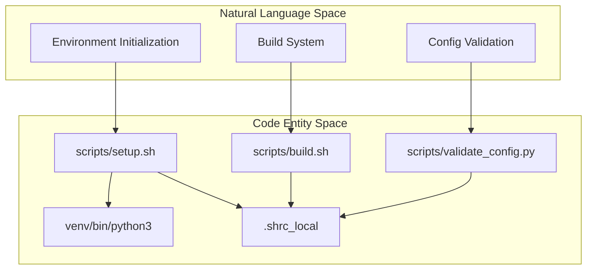
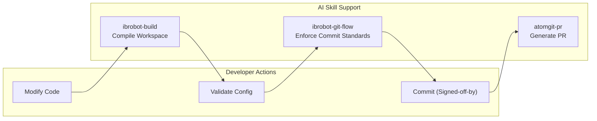

# 开发指南概述

<details>
<summary>相关源文件</summary>

以下文件被用作生成此 wiki 页面时的上下文：

- [.agents/skills/ibrobot-architecture/SKILL.md](https://atomgit.com/openeuler/IB_Robot/blob/master/.agents/skills/ibrobot-architecture/SKILL.md)
- [.agents/skills/ibrobot-build/SKILL.md](https://atomgit.com/openeuler/IB_Robot/blob/master/.agents/skills/ibrobot-build/SKILL.md)
- [.agents/skills/ibrobot-env/SKILL.md](https://atomgit.com/openeuler/IB_Robot/blob/master/.agents/skills/ibrobot-env/SKILL.md)
- [.agents/skills/ibrobot-git-flow/SKILL.md](https://atomgit.com/openeuler/IB_Robot/blob/master/.agents/skills/ibrobot-git-flow/SKILL.md)
- [.agents/skills/ibrobot-launch/SKILL.md](https://atomgit.com/openeuler/IB_Robot/blob/master/.agents/skills/ibrobot-launch/SKILL.md)
- [.pre-commit-config.yaml](https://atomgit.com/openeuler/IB_Robot/blob/master/.pre-commit-config.yaml)
- [pyproject.toml](https://atomgit.com/openeuler/IB_Robot/blob/master/pyproject.toml)
- [scripts/setup/README.en.md](https://atomgit.com/openeuler/IB_Robot/blob/master/scripts/setup/README.en.md)
- [scripts/setup/lerobot_filter_series.py](https://atomgit.com/openeuler/IB_Robot/blob/master/scripts/setup/lerobot_filter_series.py)
- [scripts/setup/lerobot_resolve_active.py](https://atomgit.com/openeuler/IB_Robot/blob/master/scripts/setup/lerobot_resolve_active.py)
- [third_party/patches/lerobot/INDEX.yaml](https://atomgit.com/openeuler/IB_Robot/blob/master/third_party/patches/lerobot/INDEX.yaml)

</details>


本页为参与 IB-Robot 代码库开发的开发者提供实践指导，涵盖环境配置、IDE 设置、构建系统使用、调试技巧和验证工作流。

---

## 开发环境架构

IB-Robot 开发环境围绕“Build → Launch”工作流构建，并严格要求环境继承。任何依赖项目变量（ROS 2 Humble、venv、`PYTHONPATH` 和 `ROS_DOMAIN_ID`）的执行，都必须先 source `.shrc_local`。

### 环境和代码实体映射

下图把概念层面的开发环境连接到实际管理它们的文件实体和脚本。



**来源**：[.agents/skills/ibrobot-build/SKILL.md:39-43](https://atomgit.com/openeuler/IB_Robot/blob/master/.agents/skills/ibrobot-build/SKILL.md#L39-L43)、[.agents/skills/ibrobot-env/SKILL.md:40-43](https://atomgit.com/openeuler/IB_Robot/blob/master/.agents/skills/ibrobot-env/SKILL.md#L40-L43)

---

## 环境与构建系统

### 核心要求：环境继承
由于 Bash 工具运行在隔离的 subshell 中，一次调用中通过 `source` 设置的环境变量**不会保留**到另一次调用。因此，必须在同一次调用中组合 `source .shrc_local` 和目标命令。

**标准模式**：
```bash
source .shrc_local && export ROS_DOMAIN_ID=42 && <your_command>
```
`ROS_DOMAIN_ID=42` 对所有 ROS 2 运行时操作都很关键，可避免冲突并支持节点通信。

### 构建脚本 (`build.sh`)
`scripts/build.sh` 是编译工作空间的主入口。它负责 source ROS 2 环境、激活 Python venv、设置 `PYTHONPATH`，并运行 `colcon build`。构建过程可以使用 `colcon` mixin 配置。

| Mixin | 用途 |
|-------|---------|
| `dev` | 开发模式（debug、symlink-install、不跑测试），**默认** |
| `debug` | 带完整符号的 Debug 构建 |
| `release` | 优化后的 Release 构建 |
| `prod` | 生产模式（优化、无 debug/tests/tracing） |

### 配置验证
部署前或修改机器人参数后，使用 `scripts/validate_config.py` 确保 `robot_config` YAML、MoveIt controller 和 ROS 2 controller 之间保持一致。

关于构建系统和 mixin 的详情，见 **[构建系统与 Mixins](./build_system_and_mixins.md)**。

**来源**：[.agents/skills/ibrobot-build/SKILL.md:179-187](https://atomgit.com/openeuler/IB_Robot/blob/master/.agents/skills/ibrobot-build/SKILL.md#L179-L187)、[.agents/skills/ibrobot-build/SKILL.md:112-116](https://atomgit.com/openeuler/IB_Robot/blob/master/.agents/skills/ibrobot-build/SKILL.md#L112-L116)、[.agents/skills/ibrobot-env/SKILL.md:12-15](https://atomgit.com/openeuler/IB_Robot/blob/master/.agents/skills/ibrobot-env/SKILL.md#L12-L15)

---

## VS Code 配置

工作空间包含预配置设置，确保 IntelliSense 和调试能与 ROS 2 及 Python 虚拟环境顺畅协同。

### 工作空间设置
该配置确保 Python language server 可以正确解析 `lerobot` 库和 ROS 2 包。

| 设置 | 值 / 作用 |
|---------|--------------|
| `python.defaultInterpreterPath` | `${workspaceFolder}/venv/bin/python3` |
| `python.analysis.extraPaths` | 包含 `libs/lerobot/src`、`src` 和 ROS 2 路径 |
| `terminal.integrated.env.linux` | 为集成终端设置 `PYTHONPATH` |

本地 IDE 配置详情见 **[VS Code 配置](./vs_code_configuration.md)**。

---

## 调试与测试

### 调试配置
工作空间提供可直接使用的 launch 配置，可在 VS Code 中通过工作空间虚拟环境直接调试 Python 节点。

### AI 辅助排障
仓库包含面向 AI agent（如 Claude Code 或 Gemini）的“Skills”，可用于诊断仓库状态。例如，`ibrobot-build` skill 提供构建和运行代码的必需流程，包括常见构建命令和环境设置细节。`ibrobot-launch` skill 描述完整节点启动工作流，强调“Build → Launch”流程和 `ROS_DOMAIN_ID` 等关键环境变量。

Python 节点调试和测试套件运行详情见 **[调试与测试](./debugging_and_testing.md)**。

**来源**：[.agents/skills/ibrobot-build/SKILL.md:8-10](https://atomgit.com/openeuler/IB_Robot/blob/master/.agents/skills/ibrobot-build/SKILL.md#L8-L10)、[.agents/skills/ibrobot-launch/SKILL.md:9-20](https://atomgit.com/openeuler/IB_Robot/blob/master/.agents/skills/ibrobot-launch/SKILL.md#L9-L20)

---

## 贡献工作流

### AtomGit 集成
项目使用 AtomGit 托管仓库并管理 PR。`atomgit_sdk` 库用于 PR/Issue 管理和 AI 驱动的代码审查 skill。

### 自动化质量保障
贡献工作流由 `.agents/skills/` 中的 AI skill 辅助。`ibrobot-git-flow` skill 自动化 Git commit 流程，强制执行 openEuler Embedded 的提交消息格式和 signed commit 规范。pre-commit hook 使用 `ruff` 做 Python lint 和 format；本地 hook `lerobot-filter-fixtures` 会在相关输入变化时运行 `lerobot` patch 分发回归 harness [pyproject.toml:1-50](https://atomgit.com/openeuler/IB_Robot/blob/master/pyproject.toml#L1-L50)、[.pre-commit-config.yaml:1-28](https://atomgit.com/openeuler/IB_Robot/blob/master/.pre-commit-config.yaml#L1-L28)。



CI/CD 流水线和自动化协作工具详情见 **[AtomGit SDK 与 CI 自动化](./atomgit_sdk_ci_automation.md)**。

**来源**：[.agents/skills/ibrobot-git-flow/SKILL.md:7-10](https://atomgit.com/openeuler/IB_Robot/blob/master/.agents/skills/ibrobot-git-flow/SKILL.md#L7-L10)、[.pre-commit-config.yaml:1-28](https://atomgit.com/openeuler/IB_Robot/blob/master/.pre-commit-config.yaml#L1-L28)、[pyproject.toml:1-50](https://atomgit.com/openeuler/IB_Robot/blob/master/pyproject.toml#L1-L50)

