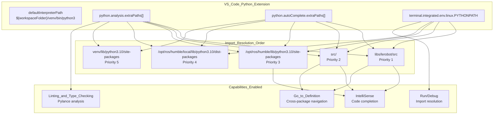
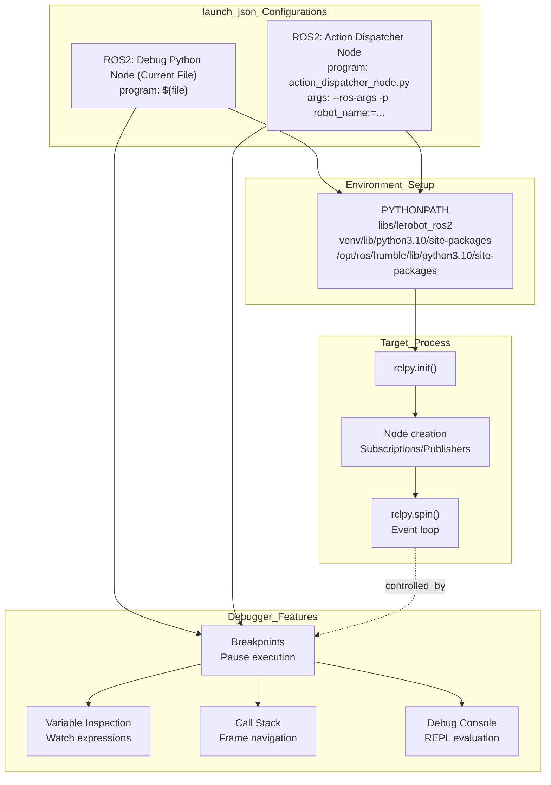
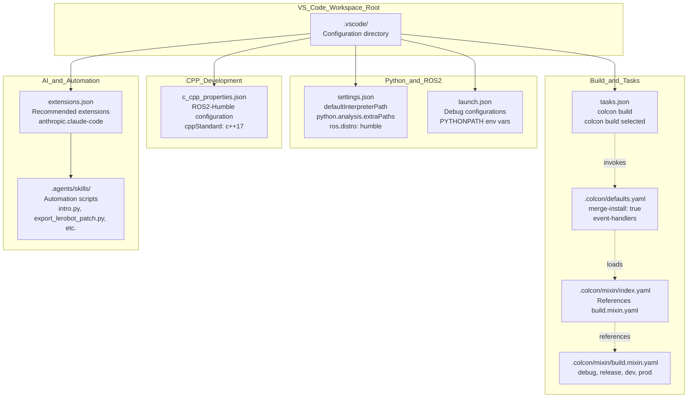

# VS Code 配置

<details>
<summary>相关源文件</summary>

以下文件被用作生成此 wiki 页面时的上下文：

- [.agents/skills/README.md](https://atomgit.com/openeuler/IB_Robot/blob/master/.agents/skills/README.md)
- [.agents/skills/ibrobot-architecture/SKILL.md](https://atomgit.com/openeuler/IB_Robot/blob/master/.agents/skills/ibrobot-architecture/SKILL.md)
- [.agents/skills/ibrobot-build/SKILL.md](https://atomgit.com/openeuler/IB_Robot/blob/master/.agents/skills/ibrobot-build/SKILL.md)
- [.agents/skills/ibrobot-env/SKILL.md](https://atomgit.com/openeuler/IB_Robot/blob/master/.agents/skills/ibrobot-env/SKILL.md)
- [.agents/skills/ibrobot-git-flow/SKILL.md](https://atomgit.com/openeuler/IB_Robot/blob/master/.agents/skills/ibrobot-git-flow/SKILL.md)
- [.agents/skills/ibrobot-launch/SKILL.md](https://atomgit.com/openeuler/IB_Robot/blob/master/.agents/skills/ibrobot-launch/SKILL.md)
- [.agents/skills/ibrobot-lerobot-patch/SKILL.md](https://atomgit.com/openeuler/IB_Robot/blob/master/.agents/skills/ibrobot-lerobot-patch/SKILL.md)
- [.agents/skills/ibrobot-lerobot-patch/scripts/export_lerobot_patch.py](https://atomgit.com/openeuler/IB_Robot/blob/master/.agents/skills/ibrobot-lerobot-patch/scripts/export_lerobot_patch.py)
- [.agents/skills/intro/SKILL.md](https://atomgit.com/openeuler/IB_Robot/blob/master/.agents/skills/intro/SKILL.md)
- [.agents/skills/intro/scripts/intro.py](https://atomgit.com/openeuler/IB_Robot/blob/master/.agents/skills/intro/scripts/intro.py)
- [.vscode/settings.json](https://atomgit.com/openeuler/IB_Robot/blob/master/.vscode/settings.json)
- [scripts/validate_config.py](https://atomgit.com/openeuler/IB_Robot/blob/master/scripts/validate_config.py)

</details>


本页说明 IB_Robot 工作空间中的 VS Code 配置文件，包括 Python 环境集成、ROS2 工具支持、构建 task 和调试配置。这些设置为 Python 和 C++ 组件提供正确的 IntelliSense、代码导航和调试能力。

关于构建系统本身（colcon mixin 和编译选项），见 [构建系统与 Mixins](./build_system_and_mixins.md)。关于调试策略和测试基础设施，见 [调试与测试](./debugging_and_testing.md)。

---

## Python 环境集成

工作空间配置 VS Code 使用项目虚拟环境，并正确解析跨 ROS2、LeRobot 和工作空间 package 的 Python import。

### 解释器和路径配置

Python 解释器配置为使用工作空间虚拟环境 [.vscode/settings.json:2](https://atomgit.com/openeuler/IB_Robot/blob/master/.vscode/settings.json#L2)：

```json
"python.defaultInterpreterPath": "${workspaceFolder}/venv/bin/python3"
```

Python analysis 和 autocomplete 会按以下顺序搜索路径 [.vscode/settings.json:3-16](https://atomgit.com/openeuler/IB_Robot/blob/master/.vscode/settings.json#L3-L16)：

| 优先级 | 路径 | 用途 |
|----------|------|---------|
| 1 | `${workspaceFolder}/libs/lerobot/src` | LeRobot 库源码（子模块） |
| 2 | `${workspaceFolder}/src` | 工作空间 ROS2 package |
| 3 | `/opt/ros/humble/lib/python3.10/site-packages` | ROS2 Humble Python package |
| 4 | `/opt/ros/humble/local/lib/python3.10/dist-packages` | ROS2 local package |
| 5 | `${workspaceFolder}/venv/lib/python3.10/site-packages` | 虚拟环境 package |

该配置让 IntelliSense 可以解析：
- ROS2 包（`rclpy`、`sensor_msgs`、`std_msgs` 等）
- LeRobot 库（`lerobot.common.robot_devices`、policy classes）
- 工作空间包（`robot_config`、`tensormsg`、`inference_service` 等）

### 终端环境

集成终端会自动配置 `PYTHONPATH` [.vscode/settings.json:17-19](https://atomgit.com/openeuler/IB_Robot/blob/master/.vscode/settings.json#L17-L19)：

```json
"terminal.integrated.env.linux": {
    "PYTHONPATH": "${workspaceFolder}/libs/lerobot/src:${workspaceFolder}/src:/opt/ros/humble/lib/python3.10/site-packages:/opt/ros/humble/local/lib/python3.10/dist-packages:${PYTHONPATH}"
}
```

这确保从终端运行的 Python 脚本无需手动设置环境即可 import 所需模块。

**Diagram: Python Path Resolution Architecture**



**来源：** [.vscode/settings.json:2-19](https://atomgit.com/openeuler/IB_Robot/blob/master/.vscode/settings.json#L2-L19)

---

## ROS2 集成

工作空间通过 RDE（ROS Development Environment）扩展配置 ROS2 工具支持。

### ROS 发行版和设置

ROS2 Humble 被配置为目标发行版 [.vscode/settings.json:29-33](https://atomgit.com/openeuler/IB_Robot/blob/master/.vscode/settings.json#L29-L33)：

```json
"ros.distro": "humble",
"ros.setupSource": "/opt/ros/humble/setup.sh",
"rde.ros.distro": "humble",
"rde.ros.setupSource": "/opt/ros/humble/setup.sh",
"ROS2.distro": "humble"
```

这些设置启用：
- ROS2 command palette 集成
- Launch 文件语法高亮
- Package 发现和导航
- 终端中的 ROS2 CLI 集成

**来源：** [.vscode/settings.json:29-33](https://atomgit.com/openeuler/IB_Robot/blob/master/.vscode/settings.json#L29-L33)

---

## 构建 Tasks

VS Code task 提供对 colcon 构建命令的快速访问，并带有正确的环境 source。

### 默认构建 Task

默认构建 task 以 release 模式编译整个工作空间 [.vscode/tasks.json:4-17](https://atomgit.com/openeuler/IB_Robot/blob/master/.vscode/tasks.json#L4-L17)：

| 属性 | 值 |
|----------|-------|
| Label | `colcon build` |
| Type | `shell` |
| Command | `source /opt/ros/humble/setup.sh && source venv/bin/activate && colcon build --symlink-install --cmake-args -DCMAKE_BUILD_TYPE=Release` |
| Shortcut | `Ctrl+Shift+B`（默认构建 task） |

关键特性：
- Source ROS2 Humble 环境
- 激活 Python 虚拟环境
- 使用 `--symlink-install` 加快迭代速度（Python 文件以 symlink 方式安装，不复制）
- 默认以 `Release` 模式构建
- 始终在新面板中显示输出

### 选择性 Package 构建

选择性构建 task 只编译当前文件所在 package [.vscode/tasks.json:18-24](https://atomgit.com/openeuler/IB_Robot/blob/master/.vscode/tasks.json#L18-L24)：

```json
{
    "label": "colcon build selected",
    "command": "source /opt/ros/humble/setup.sh && source venv/bin/activate && colcon build --symlink-install --packages-select ${relativeFileDirname}"
}
```

该 task 使用 `${relativeFileDirname}` 从当前文件路径自动检测 package。

**Diagram: Build Task Execution Flow**

```mermaid
graph LR
    subgraph "User_Action"
        SHORTCUT["Ctrl+Shift+B<br/>or Task Menu"]
    end
    
    subgraph "tasks_json_Configuration"
        DEFAULT["colcon build<br/>isDefault: true"]
        SELECTED["colcon build selected<br/>${relativeFileDirname}"]
    end
    
    subgraph "Environment_Setup"
        ROS_SOURCE["source /opt/ros/humble/setup.sh"]
        VENV_ACT["source venv/bin/activate"]
    end
    
    subgraph "Colcon_Execution"
        SYMLINK["--symlink-install"]
        CMAKE["--cmake-args -DCMAKE_BUILD_TYPE=Release"]
        PKG_SEL["--packages-select <package>"]
        
        BUILD_ALL["Build all packages in src/"]
        BUILD_ONE["Build single package"]
    end
    
    subgraph "Output"
        BUILD_DIR["build/<br/>Intermediate files"]
        INSTALL_DIR["install/<br/>Merged install space"]
        LOG_DIR["log/<br/>Build logs"]
    end
    
    SHORTCUT --> DEFAULT
    SHORTCUT --> SELECTED
    
    DEFAULT --> ROS_SOURCE
    SELECTED --> ROS_SOURCE
    
    ROS_SOURCE --> VENV_ACT
    VENV_ACT --> SYMLINK
    
    SYMLINK --> CMAKE
    SYMLINK --> PKG_SEL
    
    CMAKE --> BUILD_ALL
    PKG_SEL --> BUILD_ONE
    
    BUILD_ALL --> BUILD_DIR
    BUILD_ONE --> BUILD_DIR
    
    BUILD_DIR --> INSTALL_DIR
    BUILD_DIR --> LOG_DIR
```



**来源：** [.vscode/tasks.json:1-26](https://atomgit.com/openeuler/IB_Robot/blob/master/.vscode/tasks.json#L1-L26)

---

## 调试配置

工作空间为调试 ROS2 Python 节点提供 launch 配置。

### 通用 Python 节点调试器

通用配置用于调试当前打开的 Python 文件 [.vscode/launch.json:4-13](https://atomgit.com/openeuler/IB_Robot/blob/master/.vscode/launch.json#L4-L13)：

```json
{
    "name": "ROS2: Debug Python Node (Current File)",
    "type": "python",
    "request": "launch",
    "program": "${file}",
    "console": "integratedTerminal",
    "env": {
        "PYTHONPATH": "${workspaceFolder}/libs/lerobot_ros2:${workspaceFolder}/venv/lib/python3.10/site-packages:/opt/ros/humble/lib/python3.10/site-packages:${PYTHONPATH}"
    }
}
```

**用法：**
1. 打开 Python 节点文件，例如 `action_dispatcher_node.py`
2. 设置断点
3. 按 `F5`，或从 debug 菜单选择该配置
4. 节点会在附加调试器的状态下运行

### Action Dispatcher 节点配置

用于 `action_dispatcher_node` 的预配置 launcher [.vscode/launch.json:14-27](https://atomgit.com/openeuler/IB_Robot/blob/master/.vscode/launch.json#L14-L27)：

| 属性 | 值 |
|----------|-------|
| Program | `${workspaceFolder}/src/action_dispatch/action_dispatch/action_dispatcher_node.py` |
| Arguments | `--ros-args -p robot_name:=test_single_arm_single_cam` |
| Environment | 包含 LeRobot 和 ROS2 路径的自定义 `PYTHONPATH` |

该配置展示如何使用指定参数调试节点。可按此模式添加其他节点配置。

**Diagram: Debug Configuration Structure**



**来源：** [.vscode/launch.json:1-28](https://atomgit.com/openeuler/IB_Robot/blob/master/.vscode/launch.json#L1-L28)

---

## AI Agent 集成

工作空间通过 `anthropic.claude-code` 扩展和专用 skills 库支持 AI 辅助开发 [.vscode/extensions.json:10](https://atomgit.com/openeuler/IB_Robot/blob/master/.vscode/extensions.json#L10)。

### 项目 Skills 库
`.agents/skills/` 目录包含 AI agent 用于自动化工作流的专用工具。这些 skill 通过精确触发条件和上下文支持复杂任务 [.agents/skills/README.md:2-3](https://atomgit.com/openeuler/IB_Robot/blob/master/.agents/skills/README.md#L2-L3)。

- **Intro Skill (`intro`)**：该 skill 是所有其他 skill 的统一导航入口。它展示分类 skill 列表、使用示例，并根据当前仓库状态智能推荐最合适的 skill [.agents/skills/intro/SKILL.md:2-3](https://atomgit.com/openeuler/IB_Robot/blob/master/.agents/skills/intro/SKILL.md#L2-L3)。`intro.py` 脚本定义 `check_uncommitted_changes()` [.agents/skills/intro/scripts/intro.py:28-47](https://atomgit.com/openeuler/IB_Robot/blob/master/.agents/skills/intro/scripts/intro.py#L28-L47)、`check_build_artifacts()` [.agents/skills/intro/scripts/intro.py:50-62](https://atomgit.com/openeuler/IB_Robot/blob/master/.agents/skills/intro/scripts/intro.py#L50-L62) 和 `generate_recommendations()` [.agents/skills/intro/scripts/intro.py:138-191](https://atomgit.com/openeuler/IB_Robot/blob/master/.agents/skills/intro/scripts/intro.py#L138-L191) 等函数，用于分析工作空间状态并推荐相关动作。
- **IB-Robot 核心操作**：提供 `ibrobot-build` 用于项目编译 [.agents/skills/ibrobot-build/SKILL.md:2-3](https://atomgit.com/openeuler/IB_Robot/blob/master/.agents/skills/ibrobot-build/SKILL.md#L2-L3)、`ibrobot-launch` 用于启动机器人系统或仿真 [.agents/skills/ibrobot-launch/SKILL.md:2-3](https://atomgit.com/openeuler/IB_Robot/blob/master/.agents/skills/ibrobot-launch/SKILL.md#L2-L3)，以及 `ibrobot-env` 用于环境设置 [.agents/skills/ibrobot-env/SKILL.md:2-3](https://atomgit.com/openeuler/IB_Robot/blob/master/.agents/skills/ibrobot-env/SKILL.md#L2-L3)。
- **AtomGit 自动化工具**：这些 skill 集成 AtomGit API，用于自动化 PR/Issue 生命周期和代码审查。例如 `atomgit-pr-review` 用于代码质量审查 [.agents/skills/README.md:25](https://atomgit.com/openeuler/IB_Robot/blob/master/.agents/skills/README.md#L25)，`atomgit-pr-architecture-review` 用于检查架构合规性 [.agents/skills/README.md:26](https://atomgit.com/openeuler/IB_Robot/blob/master/.agents/skills/README.md#L26)。`intro.py` 中的 `check_open_prs_with_comments()` 函数展示了与 `atomgit_sdk` 的集成，用于检查存在未处理评论的开放 PR [.agents/skills/intro/scripts/intro.py:65-108](https://atomgit.com/openeuler/IB_Robot/blob/master/.agents/skills/intro/scripts/intro.py#L65-L108)。
- **工作流 Skill**：包括 `ibrobot-lerobot-patch`，用于将本地 `libs/lerobot` 变更管理为受控 patch [.agents/skills/ibrobot-lerobot-patch/SKILL.md:2-3](https://atomgit.com/openeuler/IB_Robot/blob/master/.agents/skills/ibrobot-lerobot-patch/SKILL.md#L2-L3)；以及 `ibrobot-git-flow`，用于在代码提交期间强制执行 openEuler DCO/Commit 规范 [.agents/skills/ibrobot-git-flow/SKILL.md:2-3](https://atomgit.com/openeuler/IB_Robot/blob/master/.agents/skills/ibrobot-git-flow/SKILL.md#L2-L3)。

**Diagram: AI Agent Skill Integration**

```mermaid
graph TD
    USER[("User Input<br/>(Natural Language)")] --> CLAUDE_CODE["anthropic.claude-code<br/>(VS Code Extension)"]

    subgraph "IB_Robot_Agent_Skills"
        direction LR
        INTRO["intro<br/>(SKILL.md, intro.py)"]
        IB_BUILD["ibrobot-build<br/>(SKILL.md)"]
        IB_LAUNCH["ibrobot-launch<br/>(SKILL.md)"]
        IB_ENV["ibrobot-env<br/>(SKILL.md)"]
        IB_ARCH["ibrobot-architecture<br/>(SKILL.md)"]
        IB_LEROBOT_PATCH["ibrobot-lerobot-patch<br/>(SKILL.md, export_lerobot_patch.py)"]
        IB_GIT_FLOW["ibrobot-git-flow<br/>(SKILL.md)"]
        ATOMGIT_COLLAB["atomgit-collaboration<br/>(SKILL.md)"]
        ATOMGIT_PR_REVIEW["atomgit-pr-review<br/>(SKILL.md)"]
        ATOMGIT_PR_ARCH_REVIEW["atomgit-pr-architecture-review<br/>(SKILL.md)"]
        ATOMGIT_REVIEW_RES["atomgit-review-resolution<br/>(SKILL.md)"]
        ATOMGIT_PR["atomgit-pr<br/>(SKILL.md)"]
        ATOMGIT_ISSUE["atomgit-issue<br/>(SKILL.md)"]
    end

    CLAUDE_CODE --> INTRO
    INTRO -->|"Recommends based on repo state"| IB_BUILD
    INTRO -->|"Recommends based on repo state"| ATOMGIT_REVIEW_RES
    INTRO -->|"Recommends based on repo state"| IB_GIT_FLOW
    INTRO -->|"Recommends based on repo state"| ATOMGIT_PR
    INTRO -->|"Recommends based on repo state"| IB_LAUNCH

    CLAUDE_CODE -->|"Directly triggers"| IB_BUILD
    CLAUDE_CODE -->|"Directly triggers"| IB_LAUNCH
    CLAUDE_CODE -->|"Directly triggers"| IB_ENV
    CLAUDE_CODE -->|"Directly triggers"| IB_ARCH
    CLAUDE_CODE -->|"Directly triggers"| IB_LEROBOT_PATCH
    CLAUDE_CODE -->|"Directly triggers"| IB_GIT_FLOW
    CLAUDE_CODE -->|"Directly triggers"| ATOMGIT_COLLAB
    CLAUDE_CODE -->|"Directly triggers"| ATOMGIT_PR_REVIEW
    CLAUDE_CODE -->|"Directly triggers"| ATOMGIT_PR_ARCH_REVIEW
    CLAUDE_CODE -->|"Directly triggers"| ATOMGIT_REVIEW_RES
    CLAUDE_CODE -->|"Directly triggers"| ATOMGIT_PR
    CLAUDE_CODE -->|"Directly triggers"| ATOMGIT_ISSUE

    INTRO -->|"Calls script to check state"| INTRO_PY[".agents/skills/intro/scripts/intro.py"]
    INTRO_PY -->|"Checks git status"| GIT_STATUS["git status"]
    INTRO_PY -->|"Checks build artifacts"| BUILD_ARTIFACTS["install/, build/ directories"]
    INTRO_PY -->|"Checks PRs with comments"| ATOMGIT_SDK["atomgit_sdk (Python library)"]
    IB_LEROBOT_PATCH -->|"Calls script to export patches"| EXPORT_PATCH_PY[".agents/skills/ibrobot-lerobot-patch/scripts/export_lerobot_patch.py"]
    EXPORT_PATCH_PY -->|"Uses git format-patch"| GIT_FORMAT_PATCH["git format-patch"]
    IB_GIT_FLOW -->|"Enforces commit rules"| GIT_COMMIT_S["git commit -s"]

    style INTRO fill:#f9f,stroke:#333,stroke-width:2px
    style IB_BUILD fill:#f9f,stroke:#333,stroke-width:2px
    style IB_LAUNCH fill:#f9f,stroke:#333,stroke-width:2px
    style IB_ENV fill:#f9f,stroke:#333,stroke-width:2px
    style IB_ARCH fill:#f9f,stroke:#333,stroke-width:2px
    style IB_LEROBOT_PATCH fill:#f9f,stroke:#333,stroke-width:2px
    style IB_GIT_FLOW fill:#f9f,stroke:#333,stroke-width:2px
    style ATOMGIT_COLLAB fill:#f9f,stroke:#333,stroke-width:2px
    style ATOMGIT_PR_REVIEW fill:#f9f,stroke:#333,stroke-width:2px
    style ATOMGIT_PR_ARCH_REVIEW fill:#f9f,stroke:#333,stroke-width:2px
    style ATOMGIT_REVIEW_RES fill:#f9f,stroke:#333,stroke-width:2px
    style ATOMGIT_PR fill:#f9f,stroke:#333,stroke-width:2px
    style ATOMGIT_ISSUE fill:#f9f,stroke:#333,stroke-width:2px
```



**来源：** [.agents/skills/README.md:1-28](https://atomgit.com/openeuler/IB_Robot/blob/master/.agents/skills/README.md#L1-L28)、[.agents/skills/intro/SKILL.md:1-117](https://atomgit.com/openeuler/IB_Robot/blob/master/.agents/skills/intro/SKILL.md#L1-L117)、[.agents/skills/intro/scripts/intro.py:1-206](https://atomgit.com/openeuler/IB_Robot/blob/master/.agents/skills/intro/scripts/intro.py#L1-L206)、[.agents/skills/ibrobot-build/SKILL.md:1-207](https://atomgit.com/openeuler/IB_Robot/blob/master/.agents/skills/ibrobot-build/SKILL.md#L1-L207)、[.agents/skills/ibrobot-launch/SKILL.md:1-207](https://atomgit.com/openeuler/IB_Robot/blob/master/.agents/skills/ibrobot-launch/SKILL.md#L1-L207)、[.agents/skills/ibrobot-env/SKILL.md:1-59](https://atomgit.com/openeuler/IB_Robot/blob/master/.agents/skills/ibrobot-env/SKILL.md#L1-L59)、[.agents/skills/ibrobot-architecture/SKILL.md:1-196](https://atomgit.com/openeuler/IB_Robot/blob/master/.agents/skills/ibrobot-architecture/SKILL.md#L1-L196)、[.agents/skills/ibrobot-lerobot-patch/SKILL.md:1-210](https://atomgit.com/openeuler/IB_Robot/blob/master/.agents/skills/ibrobot-lerobot-patch/SKILL.md#L1-L210)、[.agents/skills/ibrobot-lerobot-patch/scripts/export_lerobot_patch.py:1-218](https://atomgit.com/openeuler/IB_Robot/blob/master/.agents/skills/ibrobot-lerobot-patch/scripts/export_lerobot_patch.py#L1-L218)、[.agents/skills/ibrobot-git-flow/SKILL.md:1-82](https://atomgit.com/openeuler/IB_Robot/blob/master/.agents/skills/ibrobot-git-flow/SKILL.md#L1-L82)、[.vscode/extensions.json:10](https://atomgit.com/openeuler/IB_Robot/blob/master/.vscode/extensions.json#L10)

---

## 推荐扩展

工作空间推荐 ROS2 和 Python 开发所需的核心扩展 [.vscode/extensions.json:2-11](https://atomgit.com/openeuler/IB_Robot/blob/master/.vscode/extensions.json#L2-L11)：

| 扩展 | 用途 |
|-----------|---------|
| `ms-python.python` | Python IntelliSense、调试、linting |
| `ms-vscode.cpptools` | 用于 ros2_control 插件的 C++ IntelliSense |
| `vadimcn.vscode-lldb` | 使用 LLDB 调试 C++ |
| `ms-vscode.cmake-tools` | CMake 项目管理 |
| `redhat.vscode-yaml` | YAML 语法高亮和验证 |
| `vscot-team.vscode-smart-column` | 智能列选择 |
| `Ranch-Hand-Robotics.rde-pack` | ROS Development Environment |
| `anthropic.claude-code` | AI 辅助开发和自动化 |

**来源：** [.vscode/extensions.json:1-12](https://atomgit.com/openeuler/IB_Robot/blob/master/.vscode/extensions.json#L1-L12)

---

## C++ IntelliSense 配置

C++ IntelliSense 配置用于 ROS2 Humble 开发 [.vscode/c_cpp_properties.json:3-14](https://atomgit.com/openeuler/IB_Robot/blob/master/.vscode/c_cpp_properties.json#L3-L14)：

```json
{
    "name": "ROS2-Humble",
    "includePath": [
        "${workspaceFolder}/**",
        "/opt/ros/humble/include/**",
        "/usr/include/**"
    ],
    "cppStandard": "c++17",
    "intelliSenseMode": "linux-gcc-x64",
    "compilerPath": "/usr/bin/gcc"
}
```

该配置启用：
- ROS2 C++ API（`rclcpp`、`sensor_msgs` 等）的代码补全
- ROS2 头文件的 Go to definition
- C++ 硬件插件（如 `so101_hardware`）中的错误检测
- C++17 标准合规检查

**来源：** [.vscode/c_cpp_properties.json:1-17](https://atomgit.com/openeuler/IB_Robot/blob/master/.vscode/c_cpp_properties.json#L1-L17)

---

## 工作空间设置

### 搜索排除

搜索功能会排除构建产物以提升性能 [.vscode/settings.json:23-28](https://atomgit.com/openeuler/IB_Robot/blob/master/.vscode/settings.json#L23-L28)：

```json
"search.exclude": {
    "**/build": true,
    "**/install": true,
    "**/log": true,
    "**/venv": true
}
```

### 文件关联

用于仓库管理的自定义文件关联 [.vscode/settings.json:20-22](https://atomgit.com/openeuler/IB_Robot/blob/master/.vscode/settings.json#L20-L22)：

```json
"files.associations": {
    "*.repos": "yaml"
}
```

**来源：** [.vscode/settings.json:20-28](https://atomgit.com/openeuler/IB_Robot/blob/master/.vscode/settings.json#L20-L28)

---

## 配置文件层级

**Diagram: VS Code Configuration File Relationships**



**来源：** [.vscode/settings.json:1-33](https://atomgit.com/openeuler/IB_Robot/blob/master/.vscode/settings.json#L1-L33)、[.vscode/tasks.json:1-26](https://atomgit.com/openeuler/IB_Robot/blob/master/.vscode/tasks.json#L1-L26)、[.vscode/launch.json:1-28](https://atomgit.com/openeuler/IB_Robot/blob/master/.vscode/launch.json#L1-L28)、[.vscode/c_cpp_properties.json:1-17](https://atomgit.com/openeuler/IB_Robot/blob/master/.vscode/c_cpp_properties.json#L1-L17)、[.vscode/extensions.json:1-12](https://atomgit.com/openeuler/IB_Robot/blob/master/.vscode/extensions.json#L1-L12)、[.colcon/mixin/build.mixin.yaml:1-19](https://atomgit.com/openeuler/IB_Robot/blob/master/.colcon/mixin/build.mixin.yaml#L1-L19)、[.agents/skills/README.md:1-28](https://atomgit.com/openeuler/IB_Robot/blob/master/.agents/skills/README.md#L1-L28)

---

## 与构建系统集成

VS Code 配置通过环境变量和路径解析接入工作空间构建系统。[构建系统与 Mixins](./build_system_and_mixins.md) 页面说明构建 task 引用的 colcon mixin 配置：

| Mixin | CMake Args | 使用场景 |
|-------|------------|----------|
| `debug` | `-DCMAKE_BUILD_TYPE=Debug` | 调试 C++ 插件 |
| `release` | `-DCMAKE_BUILD_TYPE=Release` | 生产构建 |
| `dev` | `Debug + --symlink-install` | 快速 Python 迭代 |
| `prod` | `Release + -DTRACETOOLS_DISABLED` | 部署构建 |

**来源：** [.colcon/mixin/build.mixin.yaml:1-19](https://atomgit.com/openeuler/IB_Robot/blob/master/.colcon/mixin/build.mixin.yaml#L1-L19)、[.vscode/tasks.json:4-17](https://atomgit.com/openeuler/IB_Robot/blob/master/.vscode/tasks.json#L4-L17)

