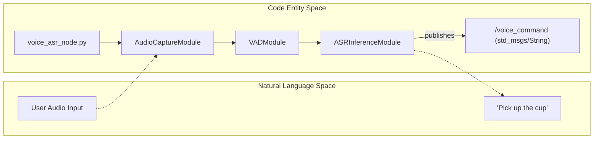
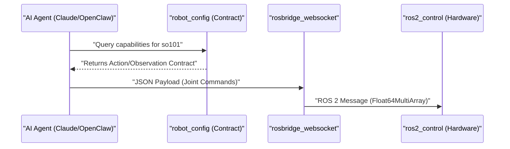

# 扩展能力概述

相关源文件

以下文件被用作生成此 wiki 页面时的上下文：

- [docs/architecture.md](https://atomgit.com/openeuler/IB_Robot/blob/master/docs/architecture.md)
- [docs/ib_robot_social_skill.md](https://atomgit.com/openeuler/IB_Robot/blob/master/docs/ib_robot_social_skill.md)
- [docs/pictures/architecture.png](https://atomgit.com/openeuler/IB_Robot/blob/master/docs/pictures/architecture.png)
- [docs/roadmap.md](https://atomgit.com/openeuler/IB_Robot/blob/master/docs/roadmap.md)
- [docs/videos/openclaw_real.mp4](https://atomgit.com/openeuler/IB_Robot/blob/master/docs/videos/openclaw_real.mp4)
- [docs/videos/openclaw_sim.mp4](https://atomgit.com/openeuler/IB_Robot/blob/master/docs/videos/openclaw_sim.mp4)
- [scripts/start_rosclaw.sh](https://atomgit.com/openeuler/IB_Robot/blob/master/scripts/start_rosclaw.sh)
- [src/robot_config/robot_config/config.py](https://atomgit.com/openeuler/IB_Robot/blob/master/src/robot_config/robot_config/config.py)
- [src/robot_config/test/test_config.py](https://atomgit.com/openeuler/IB_Robot/blob/master/src/robot_config/test/test_config.py)
- [src/voice_asr_service/README.md](https://atomgit.com/openeuler/IB_Robot/blob/master/src/voice_asr_service/README.md)
- [src/voice_asr_service/voice_asr_service/asr_inference_module.py](https://atomgit.com/openeuler/IB_Robot/blob/master/src/voice_asr_service/voice_asr_service/asr_inference_module.py)
- [src/voice_asr_service/voice_asr_service/audio_capture_module.py](https://atomgit.com/openeuler/IB_Robot/blob/master/src/voice_asr_service/voice_asr_service/audio_capture_module.py)
- [src/voice_asr_service/voice_asr_service/defaults.py](https://atomgit.com/openeuler/IB_Robot/blob/master/src/voice_asr_service/voice_asr_service/defaults.py)
- [src/voice_asr_service/voice_asr_service/model_manager.py](https://atomgit.com/openeuler/IB_Robot/blob/master/src/voice_asr_service/voice_asr_service/model_manager.py)
- [src/voice_asr_service/voice_asr_service/vad_module.py](https://atomgit.com/openeuler/IB_Robot/blob/master/src/voice_asr_service/voice_asr_service/vad_module.py)
- [src/voice_asr_service/voice_asr_service/voice_asr_node.py](https://atomgit.com/openeuler/IB_Robot/blob/master/src/voice_asr_service/voice_asr_service/voice_asr_node.py)

IB-Robot 系统不仅包含核心运动控制和推理能力，还扩展了复杂的交互层、自动化开发工作流和深入的性能分析能力。这些能力让机器人可以在社交环境中运行，接入大语言模型（LLM）Agent，并为开发者提供分析高频控制循环所需的工具。

## 语音 ASR 服务

`voice_asr_service` 包为机器人提供语音转文本能力，支持自然语言交互。它集成 **sherpa-onnx** 引擎进行高效本地推理，并使用 Voice Activity Detection（VAD）模块管理音频流 [src/voice_asr_service/voice_asr_service/voice_asr_node.py:22-28](https://atomgit.com/openeuler/IB_Robot/blob/master/src/voice_asr_service/voice_asr_service/voice_asr_node.py#L22-L28)。

`VoiceASRNode` 作为状态机运行，会根据音频输入或 ROS service 调用在 `IDLE`、`LISTENING`、`PROCESSING` 等状态之间切换 [src/voice_asr_service/voice_asr_service/state_machine.py:27-35](https://atomgit.com/openeuler/IB_Robot/blob/master/src/voice_asr_service/voice_asr_service/state_machine.py#L27-L35)。它同时支持实时麦克风采集和基于文件的识别，后者通过 `RecognizeFile` service 提供 [src/voice_asr_service/voice_asr_service/voice_asr_node.py:173-181](https://atomgit.com/openeuler/IB_Robot/blob/master/src/voice_asr_service/voice_asr_service/voice_asr_node.py#L173-L181)。系统采用“配置驱动”设计，`model_path`、`vad_sensitivity`、`output_topic` 等参数由中心化 `robot_config` 管理 [src/robot_config/robot_config/config.py:109-130](https://atomgit.com/openeuler/IB_Robot/blob/master/src/robot_config/robot_config/config.py#L109-L130)。

**关键组件：**
*   **AudioCaptureModule**：管理硬件麦克风接口、设备选择，以及用于预滚音频的环形缓冲区 [src/voice_asr_service/voice_asr_service/audio_capture_module.py:93-107](https://atomgit.com/openeuler/IB_Robot/blob/master/src/voice_asr_service/voice_asr_service/audio_capture_module.py#L93-L107)。
*   **VADModule**：使用 Silero-VAD（Torch JIT 或 ONNX）过滤静音并检测语音边界 [src/voice_asr_service/voice_asr_service/vad_module.py:54-74](https://atomgit.com/openeuler/IB_Robot/blob/master/src/voice_asr_service/voice_asr_service/vad_module.py#L54-L74)。
*   **ASRInferenceModule**：管理 `sherpa-onnx` 生命周期，同时支持用于流式处理的 `OnlineRecognizer` 和用于文件处理的 `OfflineRecognizer` [src/voice_asr_service/voice_asr_service/asr_inference_module.py:47-65](https://atomgit.com/openeuler/IB_Robot/blob/master/src/voice_asr_service/voice_asr_service/asr_inference_module.py#L47-L65)。
*   **ModelManager**：在本地路径缺失时，自动解析并下载默认 ASR bundle，例如用于流式识别的 Zipformer 和用于离线识别的 Paraformer [src/voice_asr_service/voice_asr_service/model_manager.py:180-209](https://atomgit.com/openeuler/IB_Robot/blob/master/src/voice_asr_service/voice_asr_service/model_manager.py#L180-L209)。

详情见 [语音 ASR 服务](./voice_asr_service.md)。

**Voice ASR Architecture**

来源：[src/voice_asr_service/voice_asr_service/voice_asr_node.py:51-129](https://atomgit.com/openeuler/IB_Robot/blob/master/src/voice_asr_service/voice_asr_service/voice_asr_node.py#L51-L129)、[src/voice_asr_service/README.md:65-77](https://atomgit.com/openeuler/IB_Robot/blob/master/src/voice_asr_service/README.md#L65-L77)、[src/robot_config/robot_config/config.py:109-130](https://atomgit.com/openeuler/IB_Robot/blob/master/src/robot_config/robot_config/config.py#L109-L130)

## 社交控制与 AI Agent 集成

IB-Robot 提供“Social Control”层，用于连接高层 AI agent 与底层 ROS 2 控制器。该能力主要通过 **RosClaw** 桥接器和专用 **Skill System** 实现。

### RosClaw 和 Web 接口
系统包含到 **OpenClaw** AI agent 框架的桥接。它使用 `rosbridge_websocket` 将 ROS topic 和 service 暴露给基于 Web 的前端和外部 LLM agent。这样，agent 可以订阅机器人状态，并发布 `/arm_position_controller/commands` 等命令 topic。

### AI Agent Skill System
系统与 AI agent 框架集成，用于自动化机器人控制和开发。这些能力包括：
*   **任务执行**：将高层命令映射到 `robot_config` 契约中定义的具体机器人技能 [src/robot_config/robot_config/config.py:163-182](https://atomgit.com/openeuler/IB_Robot/blob/master/src/robot_config/robot_config/config.py#L163-L182)。
*   **自动化审查**：使用工具确保代码变更遵循 Single Source of Truth（SSOT）模式，并通过配置验证 [src/robot_config/robot_config/loader.py:25-26](https://atomgit.com/openeuler/IB_Robot/blob/master/src/robot_config/robot_config/loader.py#L25-L26)。
*   **CI 自动化**：通过 `atomgit_sdk` 管理 PR 和 Issue，支持协作开发。

详情见 [社交控制与 AI Agent 集成](./social_control_ai_agent_integration.md)。

**Agent Interaction Flow**

来源：[src/robot_config/robot_config/config.py:134-150](https://atomgit.com/openeuler/IB_Robot/blob/master/src/robot_config/robot_config/config.py#L134-L150)、[docs/architecture.md:225-240](https://atomgit.com/openeuler/IB_Robot/blob/master/docs/architecture.md#L225-L240)

## 性能追踪

为保证高频推理流水线和动作分发的确定性执行，IB-Robot 集成了性能追踪基础设施。它对于定位策略节点与硬件接口之间通信链路的瓶颈很关键。

系统使用 **LTTng**（Linux Trace Toolkit: next generation）和 **ros2_tracing** 跨节点边界捕获高保真时序数据。开发者可以分析：
*   **推理延迟**：从通过 `CameraConfig` 获取图像 [src/robot_config/robot_config/config.py:20-39](https://atomgit.com/openeuler/IB_Robot/blob/master/src/robot_config/robot_config/config.py#L20-L39) 到 tensor 输出的耗时。
*   **控制抖动**：`action_dispatch` 周期中的波动。
*   **配置验证**：使用 `validate_config` 确保关节定义和外设设置在系统内保持一致 [src/robot_config/robot_config/loader.py:25-26](https://atomgit.com/openeuler/IB_Robot/blob/master/src/robot_config/robot_config/loader.py#L25-L26)。

详情见 [性能追踪](./performance_tracing.md)。

来源：[src/robot_config/test/test_config.py:20-26](https://atomgit.com/openeuler/IB_Robot/blob/master/src/robot_config/test/test_config.py#L20-L26)、[docs/architecture.md:112-114](https://atomgit.com/openeuler/IB_Robot/blob/master/docs/architecture.md#L112-L114)

