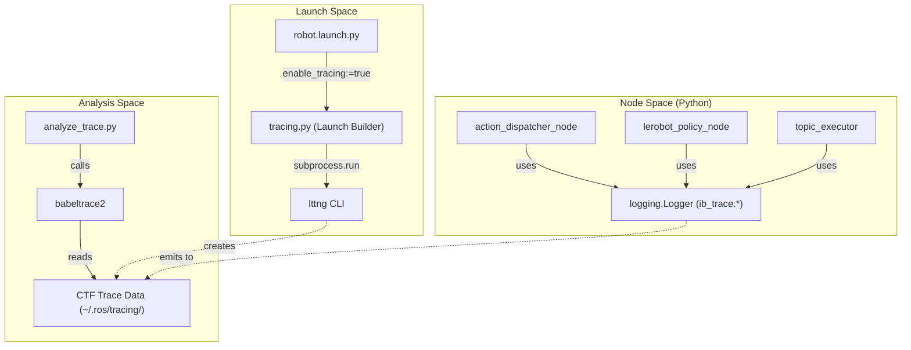
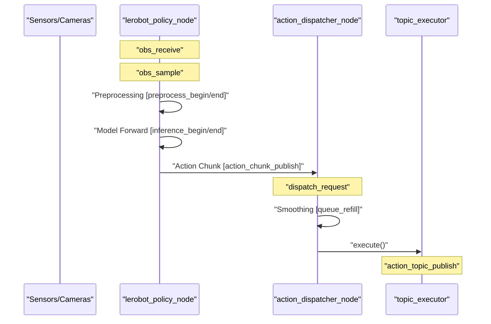

# 性能追踪

<details>
<summary>相关源文件</summary>

以下文件被用作生成此 wiki 页面时的上下文：

- [scripts/tracing/README.en.md](https://atomgit.com/openeuler/IB_Robot/blob/master/scripts/tracing/README.en.md)
- [scripts/tracing/README.md](https://atomgit.com/openeuler/IB_Robot/blob/master/scripts/tracing/README.md)
- [scripts/tracing/analyze_trace.py](https://atomgit.com/openeuler/IB_Robot/blob/master/scripts/tracing/analyze_trace.py)
- [scripts/tracing/setup_tracing.sh](https://atomgit.com/openeuler/IB_Robot/blob/master/scripts/tracing/setup_tracing.sh)
- [scripts/tracing/start_trace.sh](https://atomgit.com/openeuler/IB_Robot/blob/master/scripts/tracing/start_trace.sh)
- [scripts/tracing/stop_trace.sh](https://atomgit.com/openeuler/IB_Robot/blob/master/scripts/tracing/stop_trace.sh)
- [src/robot_config/robot_config/launch_builders/tracing.py](https://atomgit.com/openeuler/IB_Robot/blob/master/src/robot_config/robot_config/launch_builders/tracing.py)

</details>


IB-Robot 的性能追踪基于低开销基础设施构建，使用 **LTTng**（Linux Trace Toolkit Next Generation）和 **ros2_tracing**。系统为推理流水线提供深入可见性，让开发者可以跨节点边界分析延迟，从观测采样一直到硬件命令执行。

## 基础设施概览

追踪架构遵循标准 ROS 2 方式，将 Userspace Tracer（UST）事件与 Python 域业务逻辑事件结合。这个双层方案可以把 ROS 2 中间件行为（如 executor 调度和消息传输）与高层应用事件（如模型推理开始和结束）关联起来。

### 核心组件
*   **LTTng**：底层内核和用户态 tracer，提供高性能、低开销的数据采集 [scripts/tracing/README.en.md:1-5](https://atomgit.com/openeuler/IB_Robot/blob/master/scripts/tracing/README.en.md#L1-L5)。
*   **ros2_tracing**：启用标准 ROS 2 tracepoint（如 `ros2:*`）的集成包 [scripts/tracing/README.en.md:23-34](https://atomgit.com/openeuler/IB_Robot/blob/master/scripts/tracing/README.en.md#L23-L34)。
*   **Python Trace Domain**：自定义 LTTng domain（`ib_trace.*`），用于直接从 Python 节点记录业务层事件 [scripts/tracing/README.en.md:73-76](https://atomgit.com/openeuler/IB_Robot/blob/master/scripts/tracing/README.en.md#L73-L76)。
*   **追踪分析工具**：一组脚本，用于解析 Common Trace Format（CTF）数据并生成延迟拆解 [scripts/tracing/analyze_trace.py:3-8](https://atomgit.com/openeuler/IB_Robot/blob/master/scripts/tracing/analyze_trace.py#L3-L8)。

### 数据流和代码映射

下图把高层追踪请求桥接到负责 session 管理和事件发射的具体代码实体。

**Tracing Infrastructure Mapping**

来源：[src/robot_config/robot_config/launch_builders/tracing.py:136-154](https://atomgit.com/openeuler/IB_Robot/blob/master/src/robot_config/robot_config/launch_builders/tracing.py#L136-L154)、[scripts/tracing/analyze_trace.py:130-148](https://atomgit.com/openeuler/IB_Robot/blob/master/scripts/tracing/analyze_trace.py#L130-L148)

## 实现细节

### Session 管理
LTTng session 的生命周期由 `robot_config.launch_builders.tracing` 模块管理。当 launch 文件中的 `enable_tracing` 设置为 `true` 时，builder 会：
1.  **解析 Session 名称**：通过 `_trace_session_exists` 检查已有 session，并通过 `_resolve_trace_session` 自动追加时间戳，避免覆盖数据 [src/robot_config/robot_config/launch_builders/tracing.py:44-88](https://atomgit.com/openeuler/IB_Robot/blob/master/src/robot_config/robot_config/launch_builders/tracing.py#L44-L88)。
2.  **配置事件**：使用 `lttng enable-event` 命令启用 `ros2:*` 用户态事件和 `ib_trace.*` Python domain [src/robot_config/robot_config/launch_builders/tracing.py:91-105](https://atomgit.com/openeuler/IB_Robot/blob/master/src/robot_config/robot_config/launch_builders/tracing.py#L91-L105)。
3.  **自动清理**：通过 `_make_trace_shutdown_handler` 注册 `OnShutdown` handler，在 ROS 2 launch 进程终止时停止并销毁 LTTng session [src/robot_config/robot_config/launch_builders/tracing.py:113-133](https://atomgit.com/openeuler/IB_Robot/blob/master/src/robot_config/robot_config/launch_builders/tracing.py#L113-L133)。

### Python 事件发射
节点使用标准 Python logging 发射 tracepoint，并配置为输出到 `ib_trace.*` domain。具体方式是获取名称以 `ib_trace.` 为前缀的 logger，例如 `logging.getLogger('ib_trace.dispatch')`。当 LTTng 处于活动状态并配置为捕获 `ib_trace.*` 事件时，这些日志消息会写入 trace。

```python
# Example from action_dispatcher_node
import logging
_trace = logging.getLogger('ib_trace.dispatch')

# ... later in the code ...
_trace.info(
    "[dispatch_request] request_id=%s watermark_ns=%d",
    request_id,
    watermark_ns,
)
```
来源：[scripts/tracing/README.en.md:84-86](https://atomgit.com/openeuler/IB_Robot/blob/master/scripts/tracing/README.en.md#L84-L86)

## 业务 Tracepoint

系统在推理和分发流水线中定义了具体 tracepoint，用于测量端到端性能。这些事件以 `logging.info("[event_name] key=value ...")` 形式发射 [scripts/tracing/README.en.md:84-86](https://atomgit.com/openeuler/IB_Robot/blob/master/scripts/tracing/README.en.md#L84-L86)。

| 事件 | Logger | 节点/组件 |
| :--- | :--- | :--- |
| `dispatch_request` | `ib_trace.dispatch` | `action_dispatcher_node` |
| `dispatch_result` | `ib_trace.dispatch` | `action_dispatcher_node` |
| `dispatch_decode` | `ib_trace.dispatch` | `action_dispatcher_node` |
| `queue_refill` | `ib_trace.dispatch` | `action_dispatcher_node` |
| `action_execute` | `ib_trace.dispatch` | `action_dispatcher_node` |
| `action_topic_publish` | `ib_trace.execute` | `topic_executor` |
| `obs_receive` | `ib_trace.policy` | `lerobot_policy_node` |
| `obs_sample` | `ib_trace.policy` | `lerobot_policy_node` |
| `obs_frame` | `ib_trace.policy` | `lerobot_policy_node` |
| `preprocess_begin/end` | `ib_trace.policy` | `lerobot_policy_node` |
| `inference_begin/end` | `ib_trace.policy` / `ib_trace.inference` | `lerobot_policy_node` / `PureInferenceEngine` |
| `postprocess_begin/end` | `ib_trace.policy` | `lerobot_policy_node` |
| `action_chunk_publish` | `ib_trace.policy` | `lerobot_policy_node` |
| `edge_publish` | `ib_trace.policy` | `lerobot_policy_node` |
| `edge_receive` | `ib_trace.policy` | `lerobot_policy_node` |

来源：[scripts/tracing/README.en.md:84-105](https://atomgit.com/openeuler/IB_Robot/blob/master/scripts/tracing/README.en.md#L84-L105)

## Trace 分析

`analyze_trace.py` 脚本通过 `babeltrace2` 解析 CTF trace 来处理采集到的数据 [scripts/tracing/analyze_trace.py:130-148](https://atomgit.com/openeuler/IB_Robot/blob/master/scripts/tracing/analyze_trace.py#L130-L148)。它生成两个主要视图：
1.  **请求级阶段延迟**：使用 `RequestTrace.span_ms` 拆解预处理、推理和后处理耗时 [scripts/tracing/analyze_trace.py:188-214](https://atomgit.com/openeuler/IB_Robot/blob/master/scripts/tracing/analyze_trace.py#L188-L214)。
2.  **观测新鲜度**：统计传感器数据“年龄”（采样时间减去原始消息时间戳）和传输延迟 [scripts/tracing/README.en.md:63-65](https://atomgit.com/openeuler/IB_Robot/blob/master/scripts/tracing/README.en.md#L63-L65)。

### 延迟流水线图
下图展示 analyzer 测量的阶段，以及每次转换涉及的代码实体。

**Inference Latency Pipeline**

来源：[scripts/tracing/analyze_trace.py:192-214](https://atomgit.com/openeuler/IB_Robot/blob/master/scripts/tracing/analyze_trace.py#L192-L214)、[scripts/tracing/README.en.md:84-105](https://atomgit.com/openeuler/IB_Robot/blob/master/scripts/tracing/README.en.md#L84-L105)

## 设置与使用

### 环境配置
追踪依赖（LTTng、ros2_tracing、babeltrace2）通过 `scripts/tracing/setup_tracing.sh` 或主 `scripts/setup.sh` 安装 [scripts/tracing/setup_tracing.sh:14-30](https://atomgit.com/openeuler/IB_Robot/blob/master/scripts/tracing/setup_tracing.sh#L14-L30)。用户必须加入 `tracing` 组，才能在不使用 sudo 的情况下运行 trace [scripts/tracing/setup_tracing.sh:39-42](https://atomgit.com/openeuler/IB_Robot/blob/master/scripts/tracing/setup_tracing.sh#L39-L42)。

### 命令
*   **在 launch 时启用**：
    ```bash
    ros2 launch robot_config robot.launch.py enable_tracing:=true
    ```
    [scripts/tracing/README.en.md:25-29](https://atomgit.com/openeuler/IB_Robot/blob/master/scripts/tracing/README.en.md#L25-L29)
*   **手动控制 session**：
    ```bash
    bash scripts/tracing/start_trace.sh
    bash scripts/tracing/stop_trace.sh
    ```
    [scripts/tracing/start_trace.sh:1-48](https://atomgit.com/openeuler/IB_Robot/blob/master/scripts/tracing/start_trace.sh#L1-L48)、[scripts/tracing/stop_trace.sh:1-20](https://atomgit.com/openeuler/IB_Robot/blob/master/scripts/tracing/stop_trace.sh#L1-L20)
*   **运行分析**：
    ```bash
    python3 scripts/tracing/analyze_trace.py --trace-dir ~/.ros/tracing/ib_robot_trace
    ```
    [scripts/tracing/analyze_trace.py:1-20](https://atomgit.com/openeuler/IB_Robot/blob/master/scripts/tracing/analyze_trace.py#L1-L20)

来源：[scripts/tracing/setup_tracing.sh:14-42](https://atomgit.com/openeuler/IB_Robot/blob/master/scripts/tracing/setup_tracing.sh#L14-L42)、[src/robot_config/robot_config/launch_builders/tracing.py:136-154](https://atomgit.com/openeuler/IB_Robot/blob/master/src/robot_config/robot_config/launch_builders/tracing.py#L136-L154)、[scripts/tracing/README.en.md:56-61](https://atomgit.com/openeuler/IB_Robot/blob/master/scripts/tracing/README.en.md#L56-L61)

