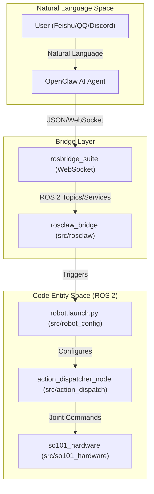
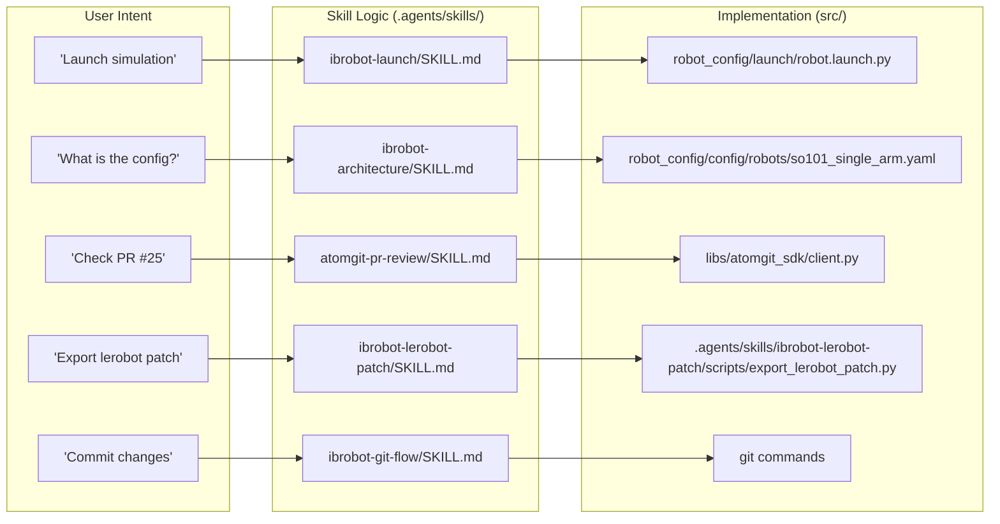

# 社交控制与 AI Agent 集成

相关源文件

以下文件被用作生成此 wiki 页面时的上下文：

- [.agents/skills/README.md](https://atomgit.com/openeuler/IB_Robot/blob/master/.agents/skills/README.md)
- [.agents/skills/ibrobot-architecture/SKILL.md](https://atomgit.com/openeuler/IB_Robot/blob/master/.agents/skills/ibrobot-architecture/SKILL.md)
- [.agents/skills/ibrobot-build/SKILL.md](https://atomgit.com/openeuler/IB_Robot/blob/master/.agents/skills/ibrobot-build/SKILL.md)
- [.agents/skills/ibrobot-env/SKILL.md](https://atomgit.com/openeuler/IB_Robot/blob/master/.agents/skills/ibrobot-env/SKILL.md)
- [.agents/skills/ibrobot-git-flow/SKILL.md](https://atomgit.com/openeuler/IB_Robot/blob/master/.agents/skills/ibrobot-git-flow/SKILL.md)
- [.agents/skills/ibrobot-launch/SKILL.md](https://atomgit.com/openeuler/IB_Robot/blob/master/.agents/skills/ibrobot-launch/SKILL.md)
- [.agents/skills/ibrobot-lerobot-patch/SKILL.md](https://atomgit.com/openeuler/IB_Robot/blob/master/.agents/skills/ibrobot-lerobot-patch/SKILL.md)
- [.agents/skills/ibrobot-lerobot-patch/scripts/export_lerobot_patch.py](https://atomgit.com/openeuler/IB_Robot/blob/master/.agents/skills/ibrobot-lerobot-patch/scripts/export_lerobot_patch.py)
- [.agents/skills/intro/SKILL.md](https://atomgit.com/openeuler/IB_Robot/blob/master/.agents/skills/intro/SKILL.md)
- [.agents/skills/intro/scripts/intro.py](https://atomgit.com/openeuler/IB_Robot/blob/master/.agents/skills/intro/scripts/intro.py)
- [.vscode/settings.json](https://atomgit.com/openeuler/IB_Robot/blob/master/.vscode/settings.json)
- [docs/architecture.md](https://atomgit.com/openeuler/IB_Robot/blob/master/docs/architecture.md)
- [docs/ib_robot_social_skill.md](https://atomgit.com/openeuler/IB_Robot/blob/master/docs/ib_robot_social_skill.md)
- [docs/pictures/architecture.png](https://atomgit.com/openeuler/IB_Robot/blob/master/docs/pictures/architecture.png)
- [docs/roadmap.md](https://atomgit.com/openeuler/IB_Robot/blob/master/docs/roadmap.md)
- [docs/videos/openclaw_real.mp4](https://atomgit.com/openeuler/IB_Robot/blob/master/docs/videos/openclaw_real.mp4)
- [docs/videos/openclaw_sim.mp4](https://atomgit.com/openeuler/IB_Robot/blob/master/docs/videos/openclaw_sim.mp4)
- [scripts/start_rosclaw.sh](https://atomgit.com/openeuler/IB_Robot/blob/master/scripts/start_rosclaw.sh)
- [scripts/validate_config.py](https://atomgit.com/openeuler/IB_Robot/blob/master/scripts/validate_config.py)

IB-Robot 框架提供完整的“Social Control”层，让用户可以通过常见社交平台（Feishu、QQ、Discord）用自然语言与机器人交互。该能力通过集成 **OpenClaw** AI Agent 框架、**rosbridge** WebSocket 接口，以及结构化 **Agent Skill** 系统实现，把高层人类意图转换为可执行的机器人命令。

## 概览与目标

社交控制集成的主要目标，是打通“Natural Language Space”（人类沟通）和“Code Entity Space”（ROS 2 节点、action 和 service）。通过 `rosbridge` 接口和 OpenClaw AI Agent 框架，系统支持：
1.  **远程遥操作**：通过聊天界面控制机器人 [docs/architecture.md:103-104](https://atomgit.com/openeuler/IB_Robot/blob/master/docs/architecture.md#L103-L104)。
2.  **自动化技能执行**：使用 AI Agent 触发 `ibrobot-launch` 或 `ibrobot-build` 等预定义工作流 [.agents/skills/README.md:11-12](https://atomgit.com/openeuler/IB_Robot/blob/master/.agents/skills/README.md#L11-L12)。
3.  **跨平台交互**：通过基于意图的启动方式，同时支持 Gazebo 仿真和真实 SO-101 硬件 [.agents/skills/ibrobot-launch/SKILL.md:49-71](https://atomgit.com/openeuler/IB_Robot/blob/master/.agents/skills/ibrobot-launch/SKILL.md#L49-L71)。
4.  **协作开发**：通过 AtomGit 集成实现 AI 驱动的代码审查和 PR 管理 [.agents/skills/README.md:17-22](https://atomgit.com/openeuler/IB_Robot/blob/master/.agents/skills/README.md#L17-L22)。

来源：[docs/architecture.md:86-105](https://atomgit.com/openeuler/IB_Robot/blob/master/docs/architecture.md#L86-L105)、[.agents/skills/README.md:1-22](https://atomgit.com/openeuler/IB_Robot/blob/master/.agents/skills/README.md#L1-L22)。

## 系统架构与数据流

该集成依赖分层架构，其中 OpenClaw agent 作为决策者，通过 WebSocket 桥接器与 ROS 2 生态通信。

### 社交控制数据流图

下图展示从社交应用中的用户消息，到机器人硬件执行命令的流转过程。

Title: Social Control and AI Agent Data Flow

来源：[docs/architecture.md:86-177](https://atomgit.com/openeuler/IB_Robot/blob/master/docs/architecture.md#L86-L177)、[.agents/skills/ibrobot-launch/SKILL.md:38-40](https://atomgit.com/openeuler/IB_Robot/blob/master/.agents/skills/ibrobot-launch/SKILL.md#L38-L40)、[.agents/skills/ibrobot-architecture/SKILL.md:117-140](https://atomgit.com/openeuler/IB_Robot/blob/master/.agents/skills/ibrobot-architecture/SKILL.md#L117-L140)。

## AI Agent Skill 系统 (`SKILL.md`)

IB-Robot 使用位于 `.agents/skills/` 的结构化 skill 系统，定义 AI Agent（如 Claude Code）可用的能力。每个 skill 都由一个 `SKILL.md` 文件定义，其中包含触发条件（Description）和技术参考 [.agents/skills/README.md:1-4](https://atomgit.com/openeuler/IB_Robot/blob/master/.agents/skills/README.md#L1-L4)。

### 关键 Skill 和代码实体

| Skill 名称 | 主要职责 | 相关代码实体 |
| :--- | :--- | :--- |
| `intro` | 引导用户查看可用 skill | `.agents/skills/intro/SKILL.md` |
| `ibrobot-launch` | 启动机器人节点和仿真 | `src/robot_config/launch/robot.launch.py` |
| `ibrobot-build` | 使用指定标志编译工作空间 | `scripts/build.sh` |
| `ibrobot-env` | 管理 shell 上下文和 ROS_DOMAIN_ID | `.shrc_local` |
| `ibrobot-architecture` | 解释 SSOT 和 Contract 逻辑 | `src/robot_config/robot_config/config.py` |
| `ibrobot-lerobot-patch` | 管理 `libs/lerobot` patch 栈 | `.agents/skills/ibrobot-lerobot-patch/scripts/export_lerobot_patch.py` |
| `ibrobot-git-flow` | 处理 Git commit 和 push 工作流 | `git` commands, DCO compliance |
| `atomgit-collaboration` | 路由通用 AtomGit 请求 | AtomGit API |
| `atomgit-pr` | 管理 PR 生命周期 | AtomGit API |
| `atomgit-issue` | 管理 Issue 生命周期 | AtomGit API |
| `atomgit-pr-review` | 自动化代码质量和逻辑检查 | `libs/atomgit_sdk` |
| `atomgit-pr-architecture-review` | 检查 PR 架构合规性 | `libs/atomgit_sdk` |
| `atomgit-review-resolution` | 处理 review 评论和修复 | `libs/atomgit_sdk` |

来源：[.agents/skills/README.md:7-27](https://atomgit.com/openeuler/IB_Robot/blob/master/.agents/skills/README.md#L7-L27)、[.agents/skills/intro/SKILL.md:16-47](https://atomgit.com/openeuler/IB_Robot/blob/master/.agents/skills/intro/SKILL.md#L16-L47)、[.agents/skills/ibrobot-architecture/SKILL.md:24-27](https://atomgit.com/openeuler/IB_Robot/blob/master/.agents/skills/ibrobot-architecture/SKILL.md#L24-L27)、[.agents/skills/ibrobot-git-flow/SKILL.md:8-12](https://atomgit.com/openeuler/IB_Robot/blob/master/.agents/skills/ibrobot-git-flow/SKILL.md#L8-L12)、[.agents/skills/ibrobot-lerobot-patch/SKILL.md:11-19](https://atomgit.com/openeuler/IB_Robot/blob/master/.agents/skills/ibrobot-lerobot-patch/SKILL.md#L11-L19)。

### 将自然语言映射到代码实体

下图把用户意图桥接到处理请求的具体 Python 类和配置文件。

Title: Mapping Intent to Code Entities

来源：[.agents/skills/ibrobot-launch/SKILL.md:52-53](https://atomgit.com/openeuler/IB_Robot/blob/master/.agents/skills/ibrobot-launch/SKILL.md#L52-L53)、[.agents/skills/ibrobot-architecture/SKILL.md:24-27](https://atomgit.com/openeuler/IB_Robot/blob/master/.agents/skills/ibrobot-architecture/SKILL.md#L24-L27)、[.agents/skills/README.md:17-22](https://atomgit.com/openeuler/IB_Robot/blob/master/.agents/skills/README.md#L17-L22)、[.agents/skills/ibrobot-lerobot-patch/SKILL.md:11-19](https://atomgit.com/openeuler/IB_Robot/blob/master/.agents/skills/ibrobot-lerobot-patch/SKILL.md#L11-L19)、[.agents/skills/ibrobot-git-flow/SKILL.md:47-77](https://atomgit.com/openeuler/IB_Robot/blob/master/.agents/skills/ibrobot-git-flow/SKILL.md#L47-L77)。

## rosclaw 桥接器与 OpenClaw 集成

OpenClaw 框架的集成点由 `rosbridge_suite` 提供。它把社交消息转换为 ROS 2 service 调用和 topic 发布，让 Agent 可以像本地节点一样与机器人交互。

### 关键实现细节
- **环境继承**：agent 执行的每个命令都必须 source `.shrc_local`，确保 `venv` 和 `PYTHONPATH`（包括 `libs/lerobot/src`）正确设置 [.agents/skills/ibrobot-build/SKILL.md:170-175](https://atomgit.com/openeuler/IB_Robot/blob/master/.agents/skills/ibrobot-build/SKILL.md#L170-L175)。VS Code 用户的 `PYTHONPATH` 在 `.vscode/settings.json` 中配置 [.vscode/settings.json:3-16](https://atomgit.com/openeuler/IB_Robot/blob/master/.vscode/settings.json#L3-L16)。
- **DDS 发现**：桥接器和所有启动的节点都必须使用 `ROS_DOMAIN_ID=42` 才能有效通信 [.agents/skills/ibrobot-launch/SKILL.md:107-112](https://atomgit.com/openeuler/IB_Robot/blob/master/.agents/skills/ibrobot-launch/SKILL.md#L107-L112)。这对 ROS 2 运行时操作很关键，否则 controller 会启动失败，节点也无法互相发现 [.agents/skills/ibrobot-build/SKILL.md:180-184](https://atomgit.com/openeuler/IB_Robot/blob/master/.agents/skills/ibrobot-build/SKILL.md#L180-L184)。
- **Build Launch 工作流**：agent 遵循严格的“先构建，再启动”协议，保证二进制一致性 [.agents/skills/ibrobot-launch/SKILL.md:10-20](https://atomgit.com/openeuler/IB_Robot/blob/master/.agents/skills/ibrobot-launch/SKILL.md#L10-L20)。该流程先使用 `ibrobot-build` skill 构建项目，再在单个 Bash 调用中带环境启动 [.agents/skills/ibrobot-launch/SKILL.md:23-46](https://atomgit.com/openeuler/IB_Robot/blob/master/.agents/skills/ibrobot-launch/SKILL.md#L23-L46)。

来源：[.agents/skills/ibrobot-build/SKILL.md:170-184](https://atomgit.com/openeuler/IB_Robot/blob/master/.agents/skills/ibrobot-build/SKILL.md#L170-L184)、[.agents/skills/ibrobot-launch/SKILL.md:10-112](https://atomgit.com/openeuler/IB_Robot/blob/master/.agents/skills/ibrobot-launch/SKILL.md#L10-L112)、[.vscode/settings.json:3-16](https://atomgit.com/openeuler/IB_Robot/blob/master/.vscode/settings.json#L3-L16)。

## 配置与设置

要启用自动化协作（AtomGit），系统需要具备 `repo` 和 `pull_request` 权限的 Personal Access Token [.agents/skills/README.md:46-54](https://atomgit.com/openeuler/IB_Robot/blob/master/.agents/skills/README.md#L46-L54)。

### AtomGit 配置
配置通常存放在项目根目录的 `config.json` 中，并通过 `$ATOMGIT_TOKEN` 环境变量引用 [.agents/skills/README.md:56-61](https://atomgit.com/openeuler/IB_Robot/blob/master/.agents/skills/README.md#L56-L61)。`atomgit_sdk` 库用于 AtomGit API 交互，`intro.py` 脚本会检查它是否可用，用于生成推荐项 [.agents/skills/intro/scripts/intro.py:74-78](https://atomgit.com/openeuler/IB_Robot/blob/master/.agents/skills/intro/scripts/intro.py#L74-L78)。

### 多平台验证
skill 系统包含面向不同环境的专用验证工具：
- **Ubuntu 22.04**：`ibrobot-docker-verify` 用于标准 clean-room 测试 [.agents/skills/README.md:15](https://atomgit.com/openeuler/IB_Robot/blob/master/.agents/skills/README.md#L15)。
- **openEuler Embedded**：`ibrobot-docker-verify-oee` 使用 `qemu-user` 模拟 aarch64 硬件环境 [.agents/skills/README.md:16](https://atomgit.com/openeuler/IB_Robot/blob/master/.agents/skills/README.md#L16)。

来源：[.agents/skills/README.md:15-16](https://atomgit.com/openeuler/IB_Robot/blob/master/.agents/skills/README.md#L15-L16)、[.agents/skills/README.md:46-61](https://atomgit.com/openeuler/IB_Robot/blob/master/.agents/skills/README.md#L46-L61)、[.agents/skills/intro/scripts/intro.py:74-78](https://atomgit.com/openeuler/IB_Robot/blob/master/.agents/skills/intro/scripts/intro.py#L74-L78)。

## 交互工作流

1.  **用户消息**：用户在社交频道中发送 "Launch SO-101 simulation"。
2.  **意图识别**：AI Agent 根据 "launch" 或 "启动" 等关键词识别 `ibrobot-launch` skill [.agents/skills/ibrobot-launch/SKILL.md:2-4](https://atomgit.com/openeuler/IB_Robot/blob/master/.agents/skills/ibrobot-launch/SKILL.md#L2-L4)。
3.  **环境设置**：agent 通过 source `.shrc_local` 并导出 `ROS_DOMAIN_ID=42` 来准备 shell [.agents/skills/ibrobot-launch/SKILL.md:38](https://atomgit.com/openeuler/IB_Robot/blob/master/.agents/skills/ibrobot-launch/SKILL.md#L38)。
4.  **命令执行**：agent 执行启动命令：
    `source .shrc_local && export ROS_DOMAIN_ID=42 && source install/setup.zsh && ros2 launch robot_config robot.launch.py robot_config:=so101_single_arm use_sim:=true` [.agents/skills/ibrobot-launch/SKILL.md:52](https://atomgit.com/openeuler/IB_Robot/blob/master/.agents/skills/ibrobot-launch/SKILL.md#L52)。
5.  **反馈**：agent 监控进程输出中的错误，例如 "Controllers fail to spawn"，并向用户提供排障建议 [.agents/skills/ibrobot-launch/SKILL.md:153-166](https://atomgit.com/openeuler/IB_Robot/blob/master/.agents/skills/ibrobot-launch/SKILL.md#L153-L166)。`intro.py` 脚本也会根据当前仓库状态提供智能推荐，例如在缺少构建产物时建议 `ibrobot-build`，或在有未处理 PR 评论时建议 `atomgit-review-resolution` [.agents/skills/intro/SKILL.md:91-99](https://atomgit.com/openeuler/IB_Robot/blob/master/.agents/skills/intro/SKILL.md#L91-L99)。

来源：[.agents/skills/ibrobot-launch/SKILL.md:1-195](https://atomgit.com/openeuler/IB_Robot/blob/master/.agents/skills/ibrobot-launch/SKILL.md#L1-L195)、[.agents/skills/ibrobot-build/SKILL.md:1-206](https://atomgit.com/openeuler/IB_Robot/blob/master/.agents/skills/ibrobot-build/SKILL.md#L1-L206)、[.agents/skills/intro/SKILL.md:91-99](https://atomgit.com/openeuler/IB_Robot/blob/master/.agents/skills/intro/SKILL.md#L91-L99)、[.agents/skills/intro/scripts/intro.py:148-183](https://atomgit.com/openeuler/IB_Robot/blob/master/.agents/skills/intro/scripts/intro.py#L148-L183)。

