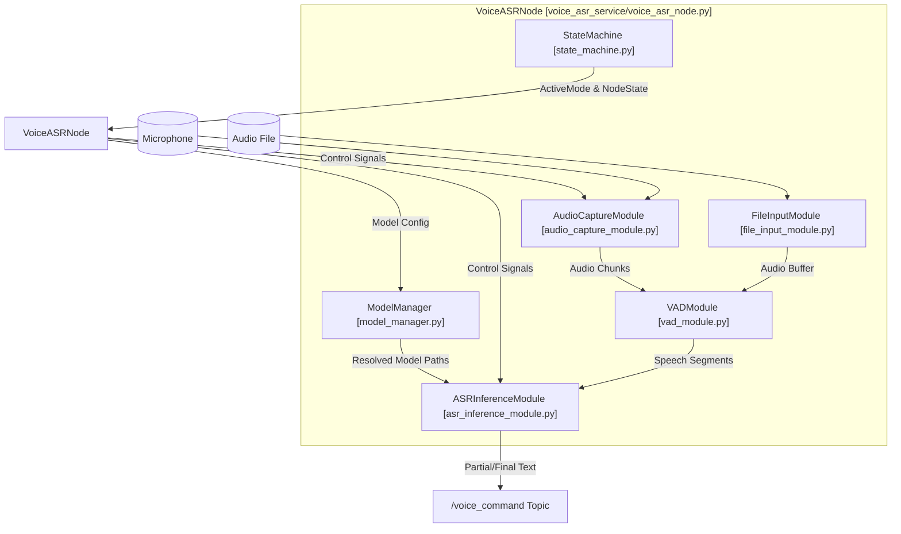
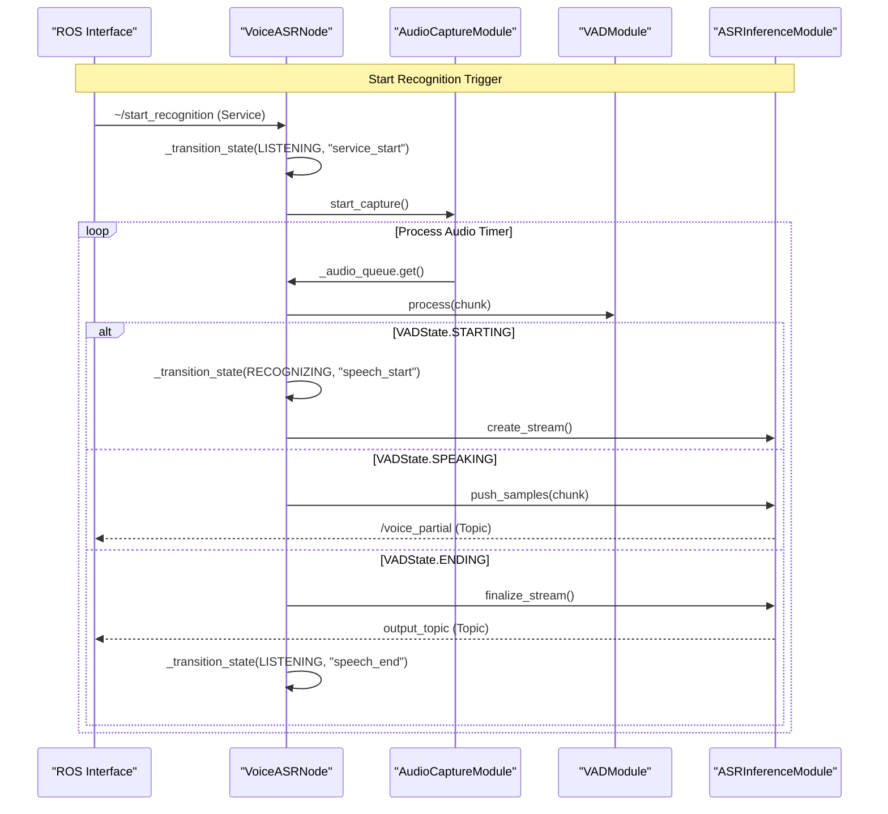

# 语音 ASR 服务

相关源文件

以下文件被用作生成此 wiki 页面时的上下文：

- [src/robot_config/package.xml](https://atomgit.com/openeuler/IB_Robot/blob/master/src/robot_config/package.xml)
- [src/robot_config/robot_config/config.py](https://atomgit.com/openeuler/IB_Robot/blob/master/src/robot_config/robot_config/config.py)
- [src/robot_config/robot_config/launch_builders/voice_asr.py](https://atomgit.com/openeuler/IB_Robot/blob/master/src/robot_config/robot_config/launch_builders/voice_asr.py)
- [src/robot_config/robot_config/loader.py](https://atomgit.com/openeuler/IB_Robot/blob/master/src/robot_config/robot_config/loader.py)
- [src/robot_config/test/test_config.py](https://atomgit.com/openeuler/IB_Robot/blob/master/src/robot_config/test/test_config.py)
- [src/voice_asr_service/README.md](https://atomgit.com/openeuler/IB_Robot/blob/master/src/voice_asr_service/README.md)
- [src/voice_asr_service/package.xml](https://atomgit.com/openeuler/IB_Robot/blob/master/src/voice_asr_service/package.xml)
- [src/voice_asr_service/voice_asr_service/__init__.py](https://atomgit.com/openeuler/IB_Robot/blob/master/src/voice_asr_service/voice_asr_service/__init__.py)
- [src/voice_asr_service/voice_asr_service/asr_inference_module.py](https://atomgit.com/openeuler/IB_Robot/blob/master/src/voice_asr_service/voice_asr_service/asr_inference_module.py)
- [src/voice_asr_service/voice_asr_service/audio_capture_module.py](https://atomgit.com/openeuler/IB_Robot/blob/master/src/voice_asr_service/voice_asr_service/audio_capture_module.py)
- [src/voice_asr_service/voice_asr_service/defaults.py](https://atomgit.com/openeuler/IB_Robot/blob/master/src/voice_asr_service/voice_asr_service/defaults.py)
- [src/voice_asr_service/voice_asr_service/model_manager.py](https://atomgit.com/openeuler/IB_Robot/blob/master/src/voice_asr_service/voice_asr_service/model_manager.py)
- [src/voice_asr_service/voice_asr_service/vad_module.py](https://atomgit.com/openeuler/IB_Robot/blob/master/src/voice_asr_service/voice_asr_service/vad_module.py)
- [src/voice_asr_service/voice_asr_service/voice_asr_node.py](https://atomgit.com/openeuler/IB_Robot/blob/master/src/voice_asr_service/voice_asr_service/voice_asr_node.py)

`voice_asr_service` 包为 IB-Robot 系统提供 Speech-to-Text（STT）接口。它集成 `sherpa-onnx` 引擎执行高性能本地推理，使用 Voice Activity Detection（VAD）切分语音，并通过状态机管理 idle、listening、recognizing 等状态之间的切换。

## 系统架构

`VoiceASRNode` 作为中心协调器，编排多个专用模块，用于处理来自麦克风或本地文件的音频流。

### 组件关系
下图展示 `voice_asr_service` 内部代码实体如何协作，将原始音频转换为文本命令。

**Voice ASR Component Map**

来源：[src/voice_asr_service/voice_asr_service/voice_asr_node.py:22-29](https://atomgit.com/openeuler/IB_Robot/blob/master/src/voice_asr_service/voice_asr_service/voice_asr_node.py#L22-L29)、[src/voice_asr_service/README.md:67-77](https://atomgit.com/openeuler/IB_Robot/blob/master/src/voice_asr_service/README.md#L67-L77)

## 核心模块

### 1. ASR 推理模块
`ASRInferenceModule` 封装 `sherpa-onnx` 库。它同时支持流式模型（Transducer/Paraformer）和离线模型（Paraformer）。节点会根据目录结构或路径提示自动检测模型类型。

*   **初始化**：使用 `_create_streaming_recognizer` 或 `_create_offline_recognizer` 加载模型和 tokens [src/voice_asr_service/voice_asr_service/asr_inference_module.py:173-240](https://atomgit.com/openeuler/IB_Robot/blob/master/src/voice_asr_service/voice_asr_service/asr_inference_module.py#L173-L240)。
*   **模型检测**：`_detect_model_type` 检查是否存在 `encoder*.onnx`、`decoder*.onnx`、`joiner*.onnx` 文件，以识别流式能力 [src/voice_asr_service/voice_asr_service/asr_inference_module.py:144-171](https://atomgit.com/openeuler/IB_Robot/blob/master/src/voice_asr_service/voice_asr_service/asr_inference_module.py#L144-L171)。
*   **安全性**：包含初始化保护 `_ensure_asr_ready`，避免模型文件缺失或损坏时节点崩溃 [src/voice_asr_service/voice_asr_service/voice_asr_node.py:92-101](https://atomgit.com/openeuler/IB_Robot/blob/master/src/voice_asr_service/voice_asr_service/voice_asr_node.py#L92-L101)。

来源：[src/voice_asr_service/voice_asr_service/asr_inference_module.py:1-143](https://atomgit.com/openeuler/IB_Robot/blob/master/src/voice_asr_service/voice_asr_service/asr_inference_module.py#L1-L143)

### 2. VAD 模块
`VADModule` 识别语音边界，避免 ASR 引擎处理静音。它使用多层策略：
1.  **Silero VAD**：基于神经网络的高精度检测，支持 JIT 或 ONNX 后端 [src/voice_asr_service/voice_asr_service/vad_module.py:107-160](https://atomgit.com/openeuler/IB_Robot/blob/master/src/voice_asr_service/voice_asr_service/vad_module.py#L107-L160)。
2.  **基于能量的 VAD**：使用自适应能量阈值的回退机制 [src/voice_asr_service/voice_asr_service/vad_module.py:175-180](https://atomgit.com/openeuler/IB_Robot/blob/master/src/voice_asr_service/voice_asr_service/vad_module.py#L175-L180)。
3.  **预滚缓冲区**：维护一小段音频缓冲（`realtime_pre_roll_seconds`），避免句首被截断 [src/voice_asr_service/voice_asr_service/voice_asr_node.py:154](https://atomgit.com/openeuler/IB_Robot/blob/master/src/voice_asr_service/voice_asr_service/voice_asr_node.py#L154)。

来源：[src/voice_asr_service/voice_asr_service/vad_module.py:1-106](https://atomgit.com/openeuler/IB_Robot/blob/master/src/voice_asr_service/voice_asr_service/vad_module.py#L1-L106)

### 3. 音频采集模块
`AudioCaptureModule` 处理麦克风输入，在 `pyaudio` 或 `sounddevice` 之上提供统一接口。它管理 `RingBuffer` 以保存预滚音频，并在独立线程中运行，避免阻塞 ROS 主循环。

*   **设备枚举**：`list_audio_devices()` 识别可用输入设备 [src/voice_asr_service/voice_asr_service/audio_capture_module.py:131-174](https://atomgit.com/openeuler/IB_Robot/blob/master/src/voice_asr_service/voice_asr_service/audio_capture_module.py#L131-L174)。
*   **环形缓冲区**：`RingBuffer` 类 [src/voice_asr_service/voice_asr_service/audio_capture_module.py:39-91](https://atomgit.com/openeuler/IB_Robot/blob/master/src/voice_asr_service/voice_asr_service/audio_capture_module.py#L39-L91) 保存音频块，便于高效获取最近的预滚音频。
*   **错误处理**：包含重试机制和错误回调，用于稳定运行 [src/voice_asr_service/voice_asr_service/audio_capture_module.py:214-221](https://atomgit.com/openeuler/IB_Robot/blob/master/src/voice_asr_service/voice_asr_service/audio_capture_module.py#L214-L221)。

来源：[src/voice_asr_service/voice_asr_service/audio_capture_module.py:1-130](https://atomgit.com/openeuler/IB_Robot/blob/master/src/voice_asr_service/voice_asr_service/audio_capture_module.py#L1-L130)

### 4. 模型管理器
`model_manager.py` 模块负责解析并可选自动下载 ASR 模型 bundle。它根据配置参数选择合适的模型（流式或离线），并确保模型资源在本地可用。

*   **模型 Bundle**：定义用于流式和离线中文模型的 `ModelBundle` dataclass，包括 URL 和必需文件模式 [src/voice_asr_service/voice_asr_service/model_manager.py:17-66](https://atomgit.com/openeuler/IB_Robot/blob/master/src/voice_asr_service/voice_asr_service/model_manager.py#L17-L66)。
*   **推理逻辑**：`infer_model_bundle` 根据 `model_path` 提示、`model_type`、`active_mode` 和 `language` 选择 bundle [src/voice_asr_service/voice_asr_service/model_manager.py:117-132](https://atomgit.com/openeuler/IB_Robot/blob/master/src/voice_asr_service/voice_asr_service/model_manager.py#L117-L132)。
*   **自动下载**：如果本地未找到模型且启用了 `auto_download_model`，`download_model_bundle` 会从指定 URL 拉取并解压模型归档 [src/voice_asr_service/voice_asr_service/model_manager.py:135-178](https://atomgit.com/openeuler/IB_Robot/blob/master/src/voice_asr_service/voice_asr_service/model_manager.py#L135-L178)。

来源：[src/voice_asr_service/voice_asr_service/model_manager.py:1-179](https://atomgit.com/openeuler/IB_Robot/blob/master/src/voice_asr_service/voice_asr_service/model_manager.py#L1-L179)

### 5. 状态机
`StateMachine` 管理运行生命周期和交互模式 [src/voice_asr_service/voice_asr_service/state_machine.py:1-40](https://atomgit.com/openeuler/IB_Robot/blob/master/src/voice_asr_service/voice_asr_service/state_machine.py#L1-L40)。

| 状态 (`NodeState`) | 说明 |
| :--- | :--- |
| `IDLE` | 默认状态，不处理音频 [src/voice_asr_service/voice_asr_service/state_machine.py:10](https://atomgit.com/openeuler/IB_Robot/blob/master/src/voice_asr_service/voice_asr_service/state_machine.py#L10)。 |
| `LISTENING` | 主动监听音频，等待 VAD 触发 [src/voice_asr_service/voice_asr_service/state_machine.py:11](https://atomgit.com/openeuler/IB_Robot/blob/master/src/voice_asr_service/voice_asr_service/state_machine.py#L11)。 |
| `RECOGNIZING` | VAD 已检测到语音，音频正在送入 ASR [src/voice_asr_service/voice_asr_service/state_machine.py:12](https://atomgit.com/openeuler/IB_Robot/blob/master/src/voice_asr_service/voice_asr_service/state_machine.py#L12)。 |
| `BUSY` | 正在处理文件输入或被 service 阻塞 [src/voice_asr_service/voice_asr_service/state_machine.py:13](https://atomgit.com/openeuler/IB_Robot/blob/master/src/voice_asr_service/voice_asr_service/state_machine.py#L13)。 |

来源：[src/voice_asr_service/voice_asr_service/state_machine.py:8-15](https://atomgit.com/openeuler/IB_Robot/blob/master/src/voice_asr_service/voice_asr_service/state_machine.py#L8-L15)、[src/voice_asr_service/README.md:90-98](https://atomgit.com/openeuler/IB_Robot/blob/master/src/voice_asr_service/README.md#L90-L98)

## 数据流和 ROS 接口

该服务支持两种主要输入模式：**实时麦克风** 和 **基于文件的识别**。

### 识别序列
下图将识别请求的逻辑流程映射到内部类方法。

**Recognition Logic Flow**

来源：[src/voice_asr_service/voice_asr_service/voice_asr_node.py:388-460](https://atomgit.com/openeuler/IB_Robot/blob/master/src/voice_asr_service/voice_asr_service/voice_asr_node.py#L388-L460)、[src/voice_asr_service/README.md:144-161](https://atomgit.com/openeuler/IB_Robot/blob/master/src/voice_asr_service/README.md#L144-L161)

### ROS API 参考

#### Topics
*   **`output_topic`**（默认：`/voice_command`）：最终识别文本 [src/voice_asr_service/voice_asr_service/voice_asr_node.py:150](https://atomgit.com/openeuler/IB_Robot/blob/master/src/voice_asr_service/voice_asr_service/voice_asr_node.py#L150)。
*   **`/voice_partial`**：语音识别过程中的中间结果 [src/voice_asr_service/voice_asr_service/voice_asr_node.py:246](https://atomgit.com/openeuler/IB_Robot/blob/master/src/voice_asr_service/voice_asr_service/voice_asr_node.py#L246)。
*   **`/voice_status`**：当前状态机状态 [src/voice_asr_service/voice_asr_service/voice_asr_node.py:247](https://atomgit.com/openeuler/IB_Robot/blob/master/src/voice_asr_service/voice_asr_service/voice_asr_node.py#L247)。
*   **`/voice_control`**：用于文本控制命令的 subscriber，例如 "start"、"stop" [src/voice_asr_service/voice_asr_service/voice_asr_node.py:252](https://atomgit.com/openeuler/IB_Robot/blob/master/src/voice_asr_service/voice_asr_service/voice_asr_node.py#L252)。
*   **`/voice_confidence`**：最终结果的置信度分数 [src/voice_asr_service/voice_asr_service/voice_asr_node.py:248](https://atomgit.com/openeuler/IB_Robot/blob/master/src/voice_asr_service/voice_asr_service/voice_asr_node.py#L248)。
*   **`/voice_file_input`**：用于提交文件路径进行异步识别的 topic [src/voice_asr_service/voice_asr_service/voice_asr_node.py:253](https://atomgit.com/openeuler/IB_Robot/blob/master/src/voice_asr_service/voice_asr_service/voice_asr_node.py#L253)。
*   **`/voice_file_progress`**：文件识别进度 [src/voice_asr_service/voice_asr_service/voice_asr_node.py:249](https://atomgit.com/openeuler/IB_Robot/blob/master/src/voice_asr_service/voice_asr_service/voice_asr_node.py#L249)。

来源：[src/voice_asr_service/README.md:195-209](https://atomgit.com/openeuler/IB_Robot/blob/master/src/voice_asr_service/README.md#L195-L209)

#### Services
*   **`~/start_recognition`** (`std_srvs/srv/Empty`)：开始实时麦克风监听 [src/voice_asr_service/voice_asr_service/voice_asr_node.py:255](https://atomgit.com/openeuler/IB_Robot/blob/master/src/voice_asr_service/voice_asr_service/voice_asr_node.py#L255)。
*   **`~/stop_recognition`** (`std_srvs/srv/Empty`)：停止当前实时麦克风监听 [src/voice_asr_service/voice_asr_service/voice_asr_node.py:256](https://atomgit.com/openeuler/IB_Robot/blob/master/src/voice_asr_service/voice_asr_service/voice_asr_node.py#L256)。
*   **`~/set_hotwords`** (`ibrobot_msgs/srv/SetHotwords`)：动态更新热词增强分数 [src/voice_asr_service/voice_asr_service/voice_asr_node.py:257](https://atomgit.com/openeuler/IB_Robot/blob/master/src/voice_asr_service/voice_asr_service/voice_asr_node.py#L257)。
*   **`~/recognize_file`** (`ibrobot_msgs/srv/RecognizeFile`)：同步识别本地 WAV 文件 [src/voice_asr_service/voice_asr_service/voice_asr_node.py:258](https://atomgit.com/openeuler/IB_Robot/blob/master/src/voice_asr_service/voice_asr_service/voice_asr_node.py#L258)。

来源：[src/voice_asr_service/README.md:223-227](https://atomgit.com/openeuler/IB_Robot/blob/master/src/voice_asr_service/README.md#L223-L227)

## 配置 (`robot_config`)

`voice_asr_service` 通常通过 `robot_config` launch 系统启动。`generate_voice_asr_nodes` builder 从机器人 YAML 中提取参数并解析文件路径。

| 参数 | 说明 | 默认值 |
| :--- | :--- | :--- |
| `active_mode` | 激活策略（`manual`、`continuous`） | `continuous` |
| `model_path` | 模型目录或文件路径 | `""`（为空且启用时自动下载） |
| `tokens_path` | tokens 文件路径 | `""`（为空时自动解析） |
| `provider` | 推理后端（`cpu`、`cuda`、`coreml`） | `cpu` |
| `model_type` | 模型类型提示（`auto`、`streaming`、`offline`） | `auto` |
| `auto_download_model` | 缺失时自动下载默认 bundle | `True` |
| `max_recording_duration` | 单次实时录音最大时长 | `10.0` |
| `vad_sensitivity` | VAD 灵敏度阈值（0.0 到 1.0） | `0.6` |
| `realtime_pre_roll_seconds` | 拼接到识别前的音频缓冲 | `0.5` |
| `publish_partial` | 是否发布部分识别结果 | `True` |
| `output_topic` | 最终识别文本的 ROS topic | `/voice_command` |
| `sample_rate` | 音频采样率 | `16000` |
| `chunk_size` | 以帧为单位的音频块大小 | `512` |
| `buffer_seconds` | 音频采集环形缓冲区大小，单位秒 | `5.0` |
| `device_index` | 音频输入设备索引 | `-1`（自动检测） |
| `device_name` | 音频输入设备名称（子串匹配） | `""` |
| `exit_on_init_failure` | ASR 初始化失败时退出节点 | `True` |

来源：[src/robot_config/robot_config/config.py:109-130](https://atomgit.com/openeuler/IB_Robot/blob/master/src/robot_config/robot_config/config.py#L109-L130)、[src/robot_config/robot_config/launch_builders/voice_asr.py:132-185](https://atomgit.com/openeuler/IB_Robot/blob/master/src/robot_config/robot_config/launch_builders/voice_asr.py#L132-L185)、[src/voice_asr_service/voice_asr_service/defaults.py:3-23](https://atomgit.com/openeuler/IB_Robot/blob/master/src/voice_asr_service/voice_asr_service/defaults.py#L3-L23)

