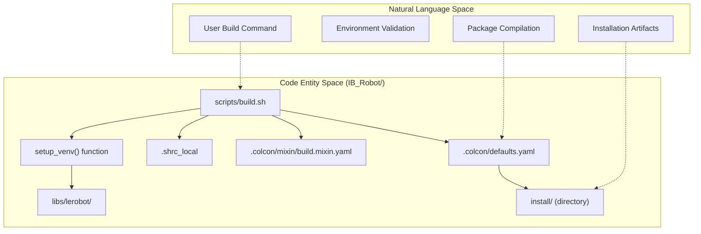
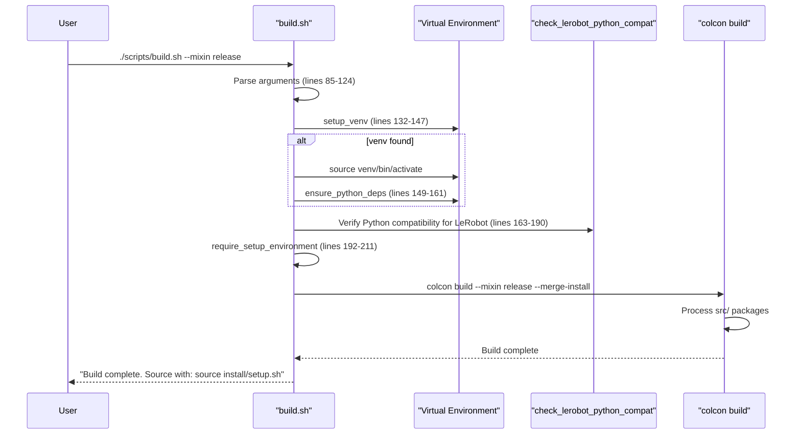
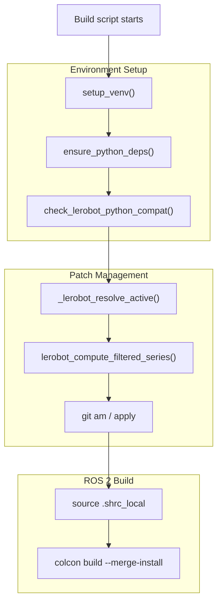

# 项目构建

<details>
<summary>相关源文件</summary>

以下文件被用作生成本 wiki 页面时的上下文：

- [.agents/skills/ibrobot-architecture/SKILL.md](https://atomgit.com/openeuler/IB_Robot/blob/master/.agents/skills/ibrobot-architecture/SKILL.md)
- [.agents/skills/ibrobot-build/SKILL.md](https://atomgit.com/openeuler/IB_Robot/blob/master/.agents/skills/ibrobot-build/SKILL.md)
- [.agents/skills/ibrobot-env/SKILL.md](https://atomgit.com/openeuler/IB_Robot/blob/master/.agents/skills/ibrobot-env/SKILL.md)
- [.agents/skills/ibrobot-git-flow/SKILL.md](https://atomgit.com/openeuler/IB_Robot/blob/master/.agents/skills/ibrobot-git-flow/SKILL.md)
- [.agents/skills/ibrobot-launch/SKILL.md](https://atomgit.com/openeuler/IB_Robot/blob/master/.agents/skills/ibrobot-launch/SKILL.md)
- [scripts/build.sh](https://atomgit.com/openeuler/IB_Robot/blob/master/scripts/build.sh)
- [scripts/setup.sh](https://atomgit.com/openeuler/IB_Robot/blob/master/scripts/setup.sh)
- [scripts/setup/lerobot_patches.sh](https://atomgit.com/openeuler/IB_Robot/blob/master/scripts/setup/lerobot_patches.sh)

</details>


本页说明如何使用 `colcon` 构建系统构建 IB-Robot 工作空间，如何通过 mixins 配置构建选项，以及如何将构建流程与 VS Code 集成，以获得高效的开发工作流。环境配置说明，虚拟环境创建、子模块初始化和依赖安装，见[环境配置](./environment_setup.md)。

---

## 构建系统概览

IB-Robot 使用 ROS 2 标准构建工具 `colcon` 编译 C++ packages，并在整个 workspace 中安装 Python packages。构建系统由 workspace defaults、自定义 mixins 和统一的 `build.sh` 脚本共同配置。

**关键组件：**
- **`colcon`**：协调 CMake (C++) 和 setuptools (Python) 的 meta-build system。
- **Workspace Defaults**：[.colcon/defaults.yaml:1-23](https://atomgit.com/openeuler/IB_Robot/blob/master/.colcon/defaults.yaml#L1-L23) 提供 workspace-wide 设置，如 `merge-install` 和 `symlink-install`。
- **Mixin System**：[.colcon/mixin/build.mixin.yaml:1-19](https://atomgit.com/openeuler/IB_Robot/blob/master/.colcon/mixin/build.mixin.yaml#L1-L19) 定义可复用构建配置，debug、release、prod。
- **Build Script**：[scripts/build.sh:1-229](https://atomgit.com/openeuler/IB_Robot/blob/master/scripts/build.sh#L1-L229) 对 colcon 进行封装，提供便捷功能、环境验证和依赖检查。

### 构建系统架构

下图将构建系统组件映射到实现它们的代码实体。

Title: Build System Implementation Map

**来源**：[scripts/build.sh:1-229](https://atomgit.com/openeuler/IB_Robot/blob/master/scripts/build.sh#L1-L229), [.colcon/defaults.yaml:1-23](https://atomgit.com/openeuler/IB_Robot/blob/master/.colcon/defaults.yaml#L1-L23), [.colcon/mixin/build.mixin.yaml:1-19](https://atomgit.com/openeuler/IB_Robot/blob/master/.colcon/mixin/build.mixin.yaml#L1-L19), [.agents/skills/ibrobot-build/SKILL.md:32-50](https://atomgit.com/openeuler/IB_Robot/blob/master/.agents/skills/ibrobot-build/SKILL.md#L32-L50)

---

## 使用 Build Script

推荐使用 `build.sh` 脚本构建 workspace。它会处理 virtual environment 激活、依赖安装和构建配置。

### 基本用法

```bash
# Default development build (debug + symlink-install + no tests)
./scripts/build.sh

# Release build (optimized)
./scripts/build.sh --mixin release

# Debug build with tests enabled
./scripts/build.sh --mixin debug test

# Clean build (removes CMake cache)
./scripts/build.sh --clean --mixin release
```

### 命令行选项

| 选项 | 说明 | 示例 |
|--------|-------------|---------|
| `--mixin NAME [NAME...]` | 应用一个或多个 build mixins | `--mixin release test` |
| `--list-mixins` | 显示可用 mixins 并退出 | `--list-mixins` |
| `--clean` | 清理构建，运行 `cmake-clean-cache` | `--clean` |
| `--this` | 只构建当前目录中的 packages | `--this` |
| `-v, --verbose` | 显示详细构建输出 | `-v` |
| `-h, --help` | 显示帮助信息 | `--help` |
| `-- ARGS...` | 将额外参数传给 colcon | `-- --packages-select tensormsg` |

**来源**：[scripts/build.sh:27-59](https://atomgit.com/openeuler/IB_Robot/blob/master/scripts/build.sh#L27-L59)

### Build Script 工作流

脚本在调用 `colcon` 前执行关键检查，包括检查 `lerobot` 的 Python 版本兼容性 [scripts/build.sh:163-190](https://atomgit.com/openeuler/IB_Robot/blob/master/scripts/build.sh#L163-L190)，并确保 virtual environment 中存在 `pyserial` 和 `feetech-servo-sdk` 等必要 Python 依赖 [scripts/build.sh:149-161](https://atomgit.com/openeuler/IB_Robot/blob/master/scripts/build.sh#L149-L161)。

Title: Build Execution Sequence


**来源**：[scripts/build.sh:78-229](https://atomgit.com/openeuler/IB_Robot/blob/master/scripts/build.sh#L78-L229), [scripts/setup/lerobot_patches.sh:1-31](https://atomgit.com/openeuler/IB_Robot/blob/master/scripts/setup/lerobot_patches.sh#L1-L31)

---

## Mixin System

Mixins 提供可组合的可复用构建配置。IB-Robot 在 [.colcon/mixin/build.mixin.yaml:1-19](https://atomgit.com/openeuler/IB_Robot/blob/master/.colcon/mixin/build.mixin.yaml#L1-L19) 中定义 workspace-local mixins。

### 可用 Mixins

| Mixin | CMake Build Type | Testing | Compile Commands | 使用场景 |
|-------|------------------|---------|------------------|----------|
| `dev` | Debug | OFF | ON | **默认**：使用 symlink-install 的开发构建  |
| `debug` | Debug | - | ON | 带完整符号的调试  |
| `release` | Release | - | ON | 优化后的生产构建  |
| `rel-with-deb-info` | RelWithDebInfo | - | ON | 带调试符号的优化构建  |
| `test` | - | ON | - | 启用测试 targets  |
| `no-test` | - | OFF | - | 禁用测试 targets  |
| `lint` | - | ON + Linting | - | CI linting 检查  |
| `prod` | Release | OFF | - | 生产构建，无 debug 和 tracing  |

**来源**：[.colcon/mixin/build.mixin.yaml:2-18](https://atomgit.com/openeuler/IB_Robot/blob/master/.colcon/mixin/build.mixin.yaml#L2-L18)

---

## 虚拟环境与 Patch 管理

构建系统与 `setup.sh` 执行的环境配置紧密耦合 [scripts/setup.sh:1-68](https://atomgit.com/openeuler/IB_Robot/blob/master/scripts/setup.sh#L1-L68)。它会自动管理 Python virtual environment，将 ML 依赖与系统 ROS 2 安装隔离。

### Patch Stack 应用
构建准备期间，系统依赖 `lerobot_patches.sh` 模块向 `libs/lerobot` submodule 应用平台感知 patches [scripts/setup/lerobot_patches.sh:6-12](https://atomgit.com/openeuler/IB_Robot/blob/master/scripts/setup/lerobot_patches.sh#L6-L12)。这确保 ML library 与 ROS 2 Humble 环境和特定硬件兼容，例如 Ascend NPU 或通用 GPU。

Title: Environment and Patch Flow


**来源**：[scripts/build.sh:132-190](https://atomgit.com/openeuler/IB_Robot/blob/master/scripts/build.sh#L132-L190), [scripts/setup/lerobot_patches.sh:33-148](https://atomgit.com/openeuler/IB_Robot/blob/master/scripts/setup/lerobot_patches.sh#L33-L148), [.agents/skills/ibrobot-env/SKILL.md:10-16](https://atomgit.com/openeuler/IB_Robot/blob/master/.agents/skills/ibrobot-env/SKILL.md#L10-L16)

---

## VS Code 集成

VS Code 通过 `.vscode` 目录中定义的 tasks 和 environment settings 与 IB-Robot 构建系统配合。

### Workspace 配置

Workspace settings 确保 Python IntelliSense 和 terminal 使用 ROS 2 与本地 virtual environment 的正确 paths。

- **Python Interpreter**：指向 workspace `venv`，确保可发现 `lerobot` 和 `torch` [.agents/skills/ibrobot-build/SKILL.md:190-197](https://atomgit.com/openeuler/IB_Robot/blob/master/.agents/skills/ibrobot-build/SKILL.md#L190-L197)。
- **Terminal Environment**：所有 terminal 操作都必须 source `.shrc_local`，以设置 `PYTHONPATH` 和 `ROS_DOMAIN_ID=42` [.agents/skills/ibrobot-build/SKILL.md:26-30](https://atomgit.com/openeuler/IB_Robot/blob/master/.agents/skills/ibrobot-build/SKILL.md#L26-L30)。

### 开发快捷方式 (Aliases)
`.shrc_local` 脚本提供多个 aliases，加快 build-test 循环：
- `cb`：完整构建，`colcon build --symlink-install --cmake-args -DCMAKE_BUILD_TYPE=Release` [.agents/skills/ibrobot-build/SKILL.md:82](https://atomgit.com/openeuler/IB_Robot/blob/master/.agents/skills/ibrobot-build/SKILL.md#L82)。
- `cbp <pkg>`：构建指定 package [.agents/skills/ibrobot-build/SKILL.md:83](https://atomgit.com/openeuler/IB_Robot/blob/master/.agents/skills/ibrobot-build/SKILL.md#L83)。
- `src`：刷新 ROS 2 环境 [.agents/skills/ibrobot-build/SKILL.md:84](https://atomgit.com/openeuler/IB_Robot/blob/master/.agents/skills/ibrobot-build/SKILL.md#L84)。

**来源**：[.agents/skills/ibrobot-build/SKILL.md:79-106](https://atomgit.com/openeuler/IB_Robot/blob/master/.agents/skills/ibrobot-build/SKILL.md#L79-L106), [.agents/skills/ibrobot-env/SKILL.md:39-43](https://atomgit.com/openeuler/IB_Robot/blob/master/.agents/skills/ibrobot-env/SKILL.md#L39-L43)

---

## 构建输出结构

```text
IB_Robot/
├── build/                    # Intermediate build artifacts
├── install/                  # Final installation (source this directory)
│   ├── setup.zsh            # Master setup script for Zsh
│   ├── setup.bash           # Master setup script for Bash
│   ├── lib/                 # Compiled libraries
│   └── share/               # Package resources (launch files, configs)
└── log/                      # Build and test logs
```

**关键文件**：
- **`install/setup.zsh`**：每次构建后 source 该文件以更新环境变量 [.agents/skills/ibrobot-launch/SKILL.md:101-106](https://atomgit.com/openeuler/IB_Robot/blob/master/.agents/skills/ibrobot-launch/SKILL.md#L101-L106)。
- **`.colcon/defaults.yaml`**：确保始终使用 `merge-install: true`，简化环境 [.colcon/defaults.yaml:7](https://atomgit.com/openeuler/IB_Robot/blob/master/.colcon/defaults.yaml#L7)。

**来源**：[.colcon/defaults.yaml:1-23](https://atomgit.com/openeuler/IB_Robot/blob/master/.colcon/defaults.yaml#L1-L23), [scripts/build.sh:1-229](https://atomgit.com/openeuler/IB_Robot/blob/master/scripts/build.sh#L1-L229), [.agents/skills/ibrobot-launch/SKILL.md:92-114](https://atomgit.com/openeuler/IB_Robot/blob/master/.agents/skills/ibrobot-launch/SKILL.md#L92-L114)

