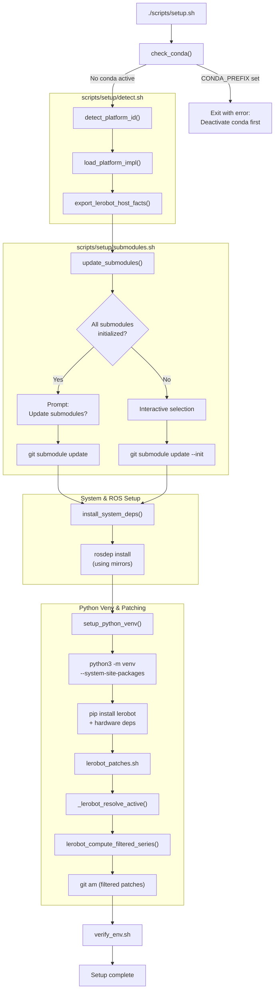
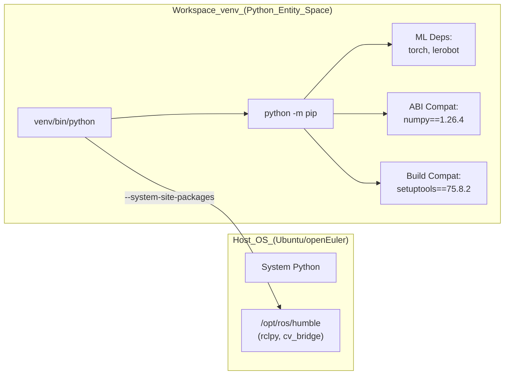

# 环境配置

相关源文件

以下文件被用作生成本 wiki 页面时的上下文：

- [requirements/base.txt](https://atomgit.com/openeuler/IB_Robot/blob/master/requirements/base.txt)
- [requirements/dev-tools.txt](https://atomgit.com/openeuler/IB_Robot/blob/master/requirements/dev-tools.txt)
- [requirements/hardware.txt](https://atomgit.com/openeuler/IB_Robot/blob/master/requirements/hardware.txt)
- [requirements/openeuler-24.03.txt](https://atomgit.com/openeuler/IB_Robot/blob/master/requirements/openeuler-24.03.txt)
- [scripts/build.sh](https://atomgit.com/openeuler/IB_Robot/blob/master/scripts/build.sh)
- [scripts/install_ros.sh](https://atomgit.com/openeuler/IB_Robot/blob/master/scripts/install_ros.sh)
- [scripts/setup.sh](https://atomgit.com/openeuler/IB_Robot/blob/master/scripts/setup.sh)
- [scripts/setup/README.md](https://atomgit.com/openeuler/IB_Robot/blob/master/scripts/setup/README.md)
- [scripts/setup/common.sh](https://atomgit.com/openeuler/IB_Robot/blob/master/scripts/setup/common.sh)
- [scripts/setup/detect.sh](https://atomgit.com/openeuler/IB_Robot/blob/master/scripts/setup/detect.sh)
- [scripts/setup/lerobot_patches.sh](https://atomgit.com/openeuler/IB_Robot/blob/master/scripts/setup/lerobot_patches.sh)
- [scripts/setup/platforms/openeuler-embedded-24.03.sh](https://atomgit.com/openeuler/IB_Robot/blob/master/scripts/setup/platforms/openeuler-embedded-24.03.sh)
- [scripts/setup/platforms/openharmony-5.1.0-musl.sh](https://atomgit.com/openeuler/IB_Robot/blob/master/scripts/setup/platforms/openharmony-5.1.0-musl.sh)
- [scripts/setup/platforms/ubuntu-22.04.sh](https://atomgit.com/openeuler/IB_Robot/blob/master/scripts/setup/platforms/ubuntu-22.04.sh)
- [scripts/setup/python_venv.sh](https://atomgit.com/openeuler/IB_Robot/blob/master/scripts/setup/python_venv.sh)
- [scripts/setup/rosdep.sh](https://atomgit.com/openeuler/IB_Robot/blob/master/scripts/setup/rosdep.sh)
- [scripts/setup/submodules.sh](https://atomgit.com/openeuler/IB_Robot/blob/master/scripts/setup/submodules.sh)
- [scripts/setup/verify_env.sh](https://atomgit.com/openeuler/IB_Robot/blob/master/scripts/setup/verify_env.sh)

本文档围绕 `setup.sh` 脚本，详细说明 IB-Robot 环境初始化流程。内容包括前置检查、平台检测、git submodule 管理、系统依赖安装，以及 ROS 2 与 LeRobot 集成所需的多层 Python 环境配置。

---

## 概览

环境配置流程会准备一个集成 LeRobot 能力的 ROS 2 Humble workspace。`setup.sh` 脚本协调五个主要阶段：

1.  **环境验证**：检测冲突的 Python 环境，Conda，以及主机元数据。
2.  **平台检测**：识别 OS，Ubuntu、openEuler 或 OpenHarmony，并应用平台专属配置。
3.  **仓库管理**：初始化 git submodules，并通过过滤后的 patch stack 管理 LeRobot 集成。
4.  **系统依赖**：通过 `rosdep` 和系统包管理器，`apt`/`dnf`，安装 ROS 2 packages。
5.  **Python 环境与 Patching**：创建隔离的 `venv`，安装依赖，并将过滤后的兼容性 patch stack 应用到 LeRobot submodule。

**来源**：[scripts/setup.sh:1-62](https://atomgit.com/openeuler/IB_Robot/blob/master/scripts/setup.sh#L1-L62), [scripts/setup/README.md:5-17](https://atomgit.com/openeuler/IB_Robot/blob/master/scripts/setup/README.md#L5-L17)

---

## 配置工作流

下图展示 `scripts/setup.sh` 及其 `scripts/setup/` 模块组件执行的完整配置序列。

### 配置序列图

**来源**：[scripts/setup.sh:149-181](https://atomgit.com/openeuler/IB_Robot/blob/master/scripts/setup.sh#L149-L181), [scripts/setup/detect.sh:199-205](https://atomgit.com/openeuler/IB_Robot/blob/master/scripts/setup/detect.sh#L199-L205), [scripts/setup/submodules.sh:36-91](https://atomgit.com/openeuler/IB_Robot/blob/master/scripts/setup/submodules.sh#L36-L91), [scripts/setup/lerobot_patches.sh:60-148](https://atomgit.com/openeuler/IB_Robot/blob/master/scripts/setup/lerobot_patches.sh#L60-L148), [scripts/setup/verify_env.sh:27-140](https://atomgit.com/openeuler/IB_Robot/blob/master/scripts/setup/verify_env.sh#L27-L140)

---

## 前置条件与平台支持

setup script 具备平台感知能力，并通过 `scripts/setup/platforms/` 中的模块化平台脚本支持三个主要目标：

| 平台 | ID | 主要使用场景 |
| :--- | :--- | :--- |
| **Ubuntu 22.04** | `ubuntu-22.04` | 标准开发工作站，x86_64 或 aarch64。 |
| **openEuler 24.03** | `openeuler-embedded-24.03` | 搭载 ROS 2 Humble 的嵌入式目标，aarch64。 |
| **OpenHarmony 5.1** | `openharmony-5.1.0-musl` | 板端 runtime 验证，基于 musl。 |

### 平台专属逻辑
- **openEuler**：覆盖 `ROS_OS_OVERRIDE=rhel:8` 以兼容 `rosdep`。它安装 `ffmpeg-devel` 和 `nlohmann-json-devel` 等原生包，以满足 `dnf` 无法通过 RHEL macros 解析的依赖。[scripts/setup/platforms/openeuler-embedded-24.03.sh:10-28](https://atomgit.com/openeuler/IB_Robot/blob/master/scripts/setup/platforms/openeuler-embedded-24.03.sh#L10-L28), [scripts/setup/platforms/openeuler-embedded-24.03.sh:134-154](https://atomgit.com/openeuler/IB_Robot/blob/master/scripts/setup/platforms/openeuler-embedded-24.03.sh#L134-L154)
- **Ubuntu**：通过 `apt` 安装 `python3-colcon-common-extensions`，并确保存在 `lttng-tools` 和 `babeltrace2` 等 tracing tools。[scripts/setup/platforms/ubuntu-22.04.sh:14-34](https://atomgit.com/openeuler/IB_Robot/blob/master/scripts/setup/platforms/ubuntu-22.04.sh#L14-L34)
- **OpenHarmony**：跳过本地 `venv` 和 `colcon` 配置，因为 OpenHarmony artifacts 必须在 host machine 上使用 `scripts/openharmony/build_ibrobot_oh_custom.sh` 交叉构建。[scripts/setup/platforms/openharmony-5.1.0-musl.sh:30-57](https://atomgit.com/openeuler/IB_Robot/blob/master/scripts/setup/platforms/openharmony-5.1.0-musl.sh#L30-L57)

**来源**：[scripts/setup/detect.sh:143-169](https://atomgit.com/openeuler/IB_Robot/blob/master/scripts/setup/detect.sh#L143-L169), [scripts/setup/platforms/openeuler-embedded-24.03.sh:1-154](https://atomgit.com/openeuler/IB_Robot/blob/master/scripts/setup/platforms/openeuler-embedded-24.03.sh#L1-L154), [scripts/setup/platforms/ubuntu-22.04.sh:1-40](https://atomgit.com/openeuler/IB_Robot/blob/master/scripts/setup/platforms/ubuntu-22.04.sh#L1-L40)

---

## Git Submodule 与 Patch 管理

工作空间将 `libs/lerobot` 作为 submodule 管理，但会应用动态 patch stack，确保它兼容不同 Python 版本和硬件 profiles。

### 单一事实源：INDEX.yaml
`third_party/patches/lerobot/INDEX.yaml` 文件定义 LeRobot 的 active version。`_lerobot_resolve_active()` 函数使用 `lerobot_resolve_active.py` 解析 active tag，并与 manifest 和 submodule state 交叉验证。[scripts/setup/lerobot_patches.sh:60-109](https://atomgit.com/openeuler/IB_Robot/blob/master/scripts/setup/lerobot_patches.sh#L60-L109)

### Patch 过滤逻辑
由于代码库支持多个平台，并非所有 patches 都会应用到每个环境。`lerobot_filter_series.py` 脚本会评估 `manifest.yaml` 中的 predicates：

| Predicate | 说明 |
| :--- | :--- |
| `python_min` / `python_max` | 处理语法变化的 PEP 440 specifiers，例如 Python 3.12 兼容性。 |
| `profiles` | 逻辑分组，如 `core`、`ros`、`hardware`、`ascend` 或 `openeuler`。 |

profiles 按以下优先级解析：
1. CLI argument `--lerobot-profiles`。
2. Environment variable `IBR_LEROBOT_PROFILES`。
3. `platform_lerobot_profiles()` 的平台默认值，例如 openEuler 使用 `core,ros,hardware,openeuler`。

**来源**：[scripts/setup/lerobot_patches.sh:6-31](https://atomgit.com/openeuler/IB_Robot/blob/master/scripts/setup/lerobot_patches.sh#L6-L31), [scripts/setup/README.md:21-34](https://atomgit.com/openeuler/IB_Robot/blob/master/scripts/setup/README.md#L21-L34), [scripts/setup/platforms/openeuler-embedded-24.03.sh:6-8](https://atomgit.com/openeuler/IB_Robot/blob/master/scripts/setup/platforms/openeuler-embedded-24.03.sh#L6-L8)

---

## Python 虚拟环境

虚拟环境 `venv/` 被配置为连接系统级 ROS 2 binaries 与 ML 级 Python 依赖。

### 环境桥接图

### 关键约束与实现
1.  **System Site Packages**：venv 使用 `--system-site-packages` 创建，让 Python interpreter 能访问系统安装的 ROS 2 `rclpy` 和 `cv_bridge` modules。[scripts/setup/python_venv.sh:125-128](https://atomgit.com/openeuler/IB_Robot/blob/master/scripts/setup/python_venv.sh#L125-L128)
2.  **NumPy ABI 兼容性**：为防止 ROS 2 C++ extensions，例如 `cv_bridge`，出现 segmentation faults，NumPy 被固定到 `1.26.x` 系列。脚本允许 LeRobot 安装其默认版本，通常为 2.x，然后强制重装 `1.26.4` 以恢复兼容。[scripts/setup.sh:70-81](https://atomgit.com/openeuler/IB_Robot/blob/master/scripts/setup.sh#L70-L81), [scripts/setup/python_venv.sh:47-74](https://atomgit.com/openeuler/IB_Robot/blob/master/scripts/setup/python_venv.sh#L47-L74)
3.  **Setuptools 固定**：`setuptools` 被固定为 `75.8.2`，同时满足 LeRobot 要求和 `colcon` 构建系统约束。[scripts/setup/python_venv.sh:157-158](https://atomgit.com/openeuler/IB_Robot/blob/master/scripts/setup/python_venv.sh#L157-L158)
4.  **隔离安装**：导出 `PYTHONNOUSERSITE=1` 以忽略 `~/.local` site-packages，确保 build-time 视图与 runtime 视图一致。[scripts/setup.sh:63-68](https://atomgit.com/openeuler/IB_Robot/blob/master/scripts/setup.sh#L63-L68)

**来源**：[scripts/setup.sh:63-81](https://atomgit.com/openeuler/IB_Robot/blob/master/scripts/setup.sh#L63-L81), [scripts/setup/python_venv.sh:91-170](https://atomgit.com/openeuler/IB_Robot/blob/master/scripts/setup/python_venv.sh#L91-L170)

---

## 环境验证

安装后，脚本使用 `scripts/setup/verify_env.sh` 对环境执行多点检查。

### 验证步骤
- **ROS 2 连接**：验证 source ROS setup script 后，例如 `/opt/ros/humble/setup.bash`，venv 可以 import `rclpy`。[scripts/setup/verify_env.sh:27-46](https://atomgit.com/openeuler/IB_Robot/blob/master/scripts/setup/verify_env.sh#L27-L46)
- **Colcon 完整性**：确保 `python3 -m colcon` 在 venv 中可用。[scripts/setup/verify_env.sh:48-67](https://atomgit.com/openeuler/IB_Robot/blob/master/scripts/setup/verify_env.sh#L48-L67)
- **NumPy 兼容性**：验证 NumPy 固定在 `1.26.x` 系列，且 `Empy` 为 `3.x` 版本，`rosidl_adapter` 需要该版本。[scripts/setup/verify_env.sh:85-108](https://atomgit.com/openeuler/IB_Robot/blob/master/scripts/setup/verify_env.sh#L85-L108)
- **LeRobot 可用性**：确认可从 venv import `lerobot`。[scripts/setup/verify_env.sh:110-121](https://atomgit.com/openeuler/IB_Robot/blob/master/scripts/setup/verify_env.sh#L110-L121)
- **Tracing Tools**：检查受支持平台上的 `lttng`、`babeltrace` 和 `ros2 trace` 可用性。[scripts/setup/verify_env.sh:141-187](https://atomgit.com/openeuler/IB_Robot/blob/master/scripts/setup/verify_env.sh#L141-L187)

**来源**：[scripts/setup/verify_env.sh:1-187](https://atomgit.com/openeuler/IB_Robot/blob/master/scripts/setup/verify_env.sh#L1-L187)

---

## 故障排查

| 问题 | 原因 | 解决方法 |
| :--- | :--- | :--- |
| `Active Conda environment detected` | Conda 与 ROS paths 冲突。 | 运行 `conda deactivate`。[scripts/setup.sh:25-33](https://atomgit.com/openeuler/IB_Robot/blob/master/scripts/setup.sh#L25-L33) |
| `libs/lerobot HEAD ... is not in the manifest` | Submodule 位于错误 commit。 | 运行 `git submodule update --init`。[scripts/setup/lerobot_patches.sh:118-142](https://atomgit.com/openeuler/IB_Robot/blob/master/scripts/setup/lerobot_patches.sh#L118-L142) |
| `PyYAML required but missing` | Resolver 无法解析 YAML。 | 脚本会自动安装 `pyyaml`，请确保 `pip` 可访问 mirrors。[scripts/setup/python_venv.sh:168-169](https://atomgit.com/openeuler/IB_Robot/blob/master/scripts/setup/python_venv.sh#L168-L169) |
| `rclpy` import failure | 缺少 `--system-site-packages` 或未 source ROS。 | 删除 `venv/` 并重新运行 `setup.sh`。[scripts/setup/verify_env.sh:43-45](https://atomgit.com/openeuler/IB_Robot/blob/master/scripts/setup/verify_env.sh#L43-L45) |
| `NumPy` version mismatch | `lerobot` 重新安装了 NumPy 2.x。 | 重新运行 `setup.sh` 以触发强制重装 `1.26.4`。[scripts/setup.sh:76-81](https://atomgit.com/openeuler/IB_Robot/blob/master/scripts/setup.sh#L76-L81) |

**来源**：[scripts/setup.sh:25-81](https://atomgit.com/openeuler/IB_Robot/blob/master/scripts/setup.sh#L25-L81), [scripts/setup/lerobot_patches.sh:118-142](https://atomgit.com/openeuler/IB_Robot/blob/master/scripts/setup/lerobot_patches.sh#L118-L142), [scripts/setup/verify_env.sh:43-45](https://atomgit.com/openeuler/IB_Robot/blob/master/scripts/setup/verify_env.sh#L43-L45)

