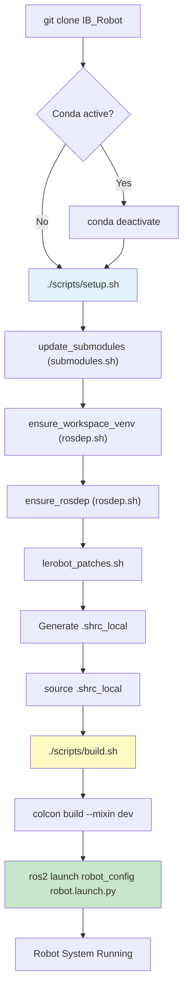
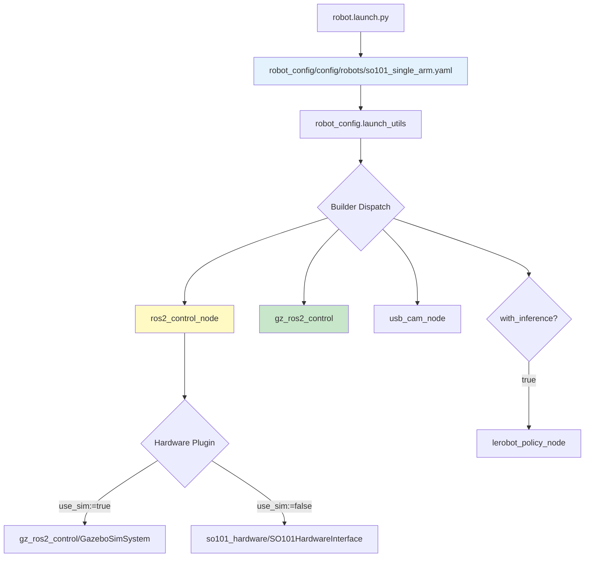

# 入门指南概述

<details>
<summary>相关源文件</summary>

以下文件被用作生成本 wiki 页面时的上下文：

- [scripts/build.sh](https://atomgit.com/openeuler/IB_Robot/blob/master/scripts/build.sh)
- [scripts/setup.sh](https://atomgit.com/openeuler/IB_Robot/blob/master/scripts/setup.sh)
- [scripts/setup/README.md](https://atomgit.com/openeuler/IB_Robot/blob/master/scripts/setup/README.md)
- [scripts/setup/detect.sh](https://atomgit.com/openeuler/IB_Robot/blob/master/scripts/setup/detect.sh)
- [scripts/setup/lerobot_patches.sh](https://atomgit.com/openeuler/IB_Robot/blob/master/scripts/setup/lerobot_patches.sh)
- [scripts/setup/platforms/openeuler-embedded-24.03.sh](https://atomgit.com/openeuler/IB_Robot/blob/master/scripts/setup/platforms/openeuler-embedded-24.03.sh)
- [scripts/setup/platforms/openharmony-5.1.0-musl.sh](https://atomgit.com/openeuler/IB_Robot/blob/master/scripts/setup/platforms/openharmony-5.1.0-musl.sh)
- [scripts/setup/platforms/ubuntu-22.04.sh](https://atomgit.com/openeuler/IB_Robot/blob/master/scripts/setup/platforms/ubuntu-22.04.sh)
- [scripts/setup/rosdep.sh](https://atomgit.com/openeuler/IB_Robot/blob/master/scripts/setup/rosdep.sh)
- [scripts/setup/submodules.sh](https://atomgit.com/openeuler/IB_Robot/blob/master/scripts/setup/submodules.sh)

</details>


本页提供 IB-Robot 开发环境配置与首次运行机器人系统的实用指南。内容涵盖初始工作空间配置、构建流程，以及开始开发或实验所需的基础系统验证步骤。

**范围**：本页覆盖从全新克隆仓库到可运行机器人系统，仿真或硬件，所需的核心工作流。详细环境配置见[环境配置](./environment_setup.md)。构建系统细节和 mixins 见[项目构建](./building_the_project.md)。架构概念见[系统架构](../architecture.md)。

---

## 前置条件

### 系统要求

IB-Robot 在三平台协同工作流上开发和测试：

| 组件 | 要求 |
|-----------|-------------|
| **Operating Systems** | Ubuntu 22.04 (Host/Sim), openEuler Embedded 24.03 (Edge), OpenHarmony 5.1 (Edge) |
| **ROS Version** | ROS 2 Humble Hawksbill |
| **Python** | System Python 3.10+ (openEuler uses 3.11, OpenHarmony uses 3.12) |
| **Conda** | **配置前必须停用**，避免库冲突 |

**关键要求**：配置流程使用 Python virtual environment (`venv`) 将机器学习依赖，PyTorch、LeRobot，与系统包隔离。在激活的 Conda 环境中运行 setup 或 build scripts 会导致动态库冲突，尤其是 `libstdc++` 和 NumPy 版本。`setup.sh` 脚本会显式设置 `PYTHONNOUSERSITE=1`，确保环境干净。

来源：[scripts/setup.sh:68-82](https://atomgit.com/openeuler/IB_Robot/blob/master/scripts/setup.sh#L68-L82), [scripts/setup/platforms/openeuler-embedded-24.03.sh:114-116](https://atomgit.com/openeuler/IB_Robot/blob/master/scripts/setup/platforms/openeuler-embedded-24.03.sh#L114-L116), [scripts/setup/platforms/openharmony-5.1.0-musl.sh:22-26](https://atomgit.com/openeuler/IB_Robot/blob/master/scripts/setup/platforms/openharmony-5.1.0-musl.sh#L22-L26)

---

## 快速开始工作流

下图展示从克隆仓库到运行系统的完整流程：

### 图：初始配置与启动流程



来源：[scripts/setup.sh:119-128](https://atomgit.com/openeuler/IB_Robot/blob/master/scripts/setup.sh#L119-L128), [scripts/setup/submodules.sh:36-41](https://atomgit.com/openeuler/IB_Robot/blob/master/scripts/setup/submodules.sh#L36-L41), [scripts/setup/rosdep.sh:79-85](https://atomgit.com/openeuler/IB_Robot/blob/master/scripts/setup/rosdep.sh#L79-L85), [scripts/build.sh:132-147](https://atomgit.com/openeuler/IB_Robot/blob/master/scripts/build.sh#L132-L147)

---

## 分步配置

### 1. 克隆仓库

```bash
git clone https://atomgit.com/openeuler/IB_Robot.git
cd IB_Robot
```

### 2. 运行初始配置

执行 setup script 初始化开发环境：

```bash
./scripts/setup.sh
```

`setup.sh` 脚本会自动执行以下操作：

#### 子模块与依赖管理
脚本通过 `git submodule sync` 和 `update` 处理仓库同步。它使用安装在 `venv` 内的 workspace-local `rosdep` 实例管理系统依赖。在 openEuler 上，它会配置 `ROS_OS_OVERRIDE=rhel:8` 以保持兼容。

来源：[scripts/setup/submodules.sh:43-45](https://atomgit.com/openeuler/IB_Robot/blob/master/scripts/setup/submodules.sh#L43-L45), [scripts/setup/rosdep.sh:105-112](https://atomgit.com/openeuler/IB_Robot/blob/master/scripts/setup/rosdep.sh#L105-L112), [scripts/setup/platforms/openeuler-embedded-24.03.sh:11-12](https://atomgit.com/openeuler/IB_Robot/blob/master/scripts/setup/platforms/openeuler-embedded-24.03.sh#L11-L12)

#### LeRobot Patch 应用
IB-Robot 为 `libs/lerobot` 子模块维护 patch stack，以确保它兼容 ROS 2 和特定硬件平台。`lerobot_patches.sh` 脚本使用 `lerobot_resolve_active.py` 从 `INDEX.yaml` 识别正确 tag，并基于平台 profile，例如 `core`、`ros`、`hardware`，应用 patches。

来源：[scripts/setup/lerobot_patches.sh:6-19](https://atomgit.com/openeuler/IB_Robot/blob/master/scripts/setup/lerobot_patches.sh#L6-L19), [scripts/setup/README.md:21-34](https://atomgit.com/openeuler/IB_Robot/blob/master/scripts/setup/README.md#L21-L34), [scripts/setup/platforms/ubuntu-22.04.sh:6-8](https://atomgit.com/openeuler/IB_Robot/blob/master/scripts/setup/platforms/ubuntu-22.04.sh#L6-L8)

#### Tracing 基础设施
配置流程会自动安装 LTTng 和 tracing 依赖。在 Ubuntu 上，它安装 `lttng-tools` 和 `babeltrace2`；在 openEuler 上，它通过 extras repository 处理 `python3-lttngust`。

来源：[scripts/setup/platforms/ubuntu-22.04.sh:33-35](https://atomgit.com/openeuler/IB_Robot/blob/master/scripts/setup/platforms/ubuntu-22.04.sh#L33-L35), [scripts/setup/platforms/openeuler-embedded-24.03.sh:147-154](https://atomgit.com/openeuler/IB_Robot/blob/master/scripts/setup/platforms/openeuler-embedded-24.03.sh#L147-L154)

### 3. 构建工作空间

使用提供的 wrapper script 编译 ROS 2 packages：

```bash
./scripts/build.sh --mixin dev
```

`build.sh` 脚本会验证 `colcon` 可从 workspace `venv` 导入，检查 `libs/lerobot` 的 Python 版本兼容性，要求 Python >= 3.10，并安装缺失的运行时依赖，如 `pyserial` 或 `sherpa-onnx`。

来源：[scripts/build.sh:149-161](https://atomgit.com/openeuler/IB_Robot/blob/master/scripts/build.sh#L149-L161), [scripts/build.sh:163-190](https://atomgit.com/openeuler/IB_Robot/blob/master/scripts/build.sh#L163-L190), [scripts/build.sh:203-208](https://atomgit.com/openeuler/IB_Robot/blob/master/scripts/build.sh#L203-L208)

---

## 首次启动

### 启动仿真

要验证安装，请在仿真中启动机器人：

```bash
ros2 launch robot_config robot.launch.py \
    robot_config:=so101_single_arm \
    use_sim:=true
```

### 图：robot.launch.py 执行流程

该图将高层启动流程映射到 `robot_config` 包中定义的代码实体和硬件接口逻辑。



来源：[scripts/setup/platforms/openeuler-embedded-24.03.sh:131-132](https://atomgit.com/openeuler/IB_Robot/blob/master/scripts/setup/platforms/openeuler-embedded-24.03.sh#L131-L132), [scripts/build.sh:152-153](https://atomgit.com/openeuler/IB_Robot/blob/master/scripts/build.sh#L152-L153)

---

## Package 参考概览

工作空间按功能层组织：

| Package | 角色 |
|---------|------|
| `robot_config` | 中央配置、URDFs 和统一 launch 入口。 |
| `tensormsg` | ROS messages 与 ML tensors 之间的双向转换。 |
| `inference_service` | 管理 policy 执行，LeRobot/ACT/Diffusion/VLA。 |
| `action_dispatch` | Temporal smoothing 和 command queue 管理。 |
| `voice_asr_service` | 基于 `sherpa-onnx` 的语音命令接口。 |

来源：[scripts/build.sh:9](https://atomgit.com/openeuler/IB_Robot/blob/master/scripts/build.sh#L9), [scripts/build.sh:152-153](https://atomgit.com/openeuler/IB_Robot/blob/master/scripts/build.sh#L152-L153)

---

## 下一步

1. **详细环境配置**：深入排障或手动配置见[环境配置](./environment_setup.md)。
2. **构建配置**：在[项目构建](./building_the_project.md)中了解不同 build mixins，release、debug、asan。
3. **核心概念**：在[核心概念](../core_concepts/overview.md)中理解契约驱动设计和单一事实源。

来源：[scripts/build.sh:41-49](https://atomgit.com/openeuler/IB_Robot/blob/master/scripts/build.sh#L41-L49)

