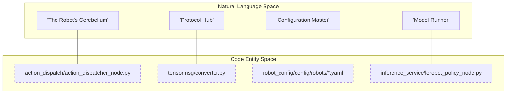
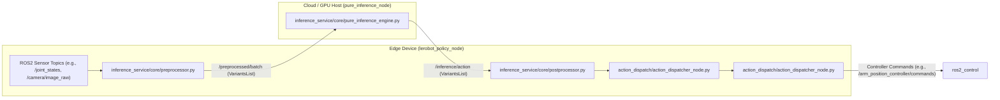

# 术语表

相关源文件

以下文件被用作生成此 wiki 页面时的上下文：

- [README.en.md](https://atomgit.com/openeuler/IB_Robot/blob/master/README.en.md)
- [README.md](https://atomgit.com/openeuler/IB_Robot/blob/master/README.md)
- [docs/pictures/openclaw_real.gif](https://atomgit.com/openeuler/IB_Robot/blob/master/docs/pictures/openclaw_real.gif)
- [docs/pictures/openclaw_sim.gif](https://atomgit.com/openeuler/IB_Robot/blob/master/docs/pictures/openclaw_sim.gif)
- [scripts/setup/tests/test_lerobot_filter.sh](https://atomgit.com/openeuler/IB_Robot/blob/master/scripts/setup/tests/test_lerobot_filter.sh)
- [src/README.md](https://atomgit.com/openeuler/IB_Robot/blob/master/src/README.md)
- [src/action_dispatch/README.en.md](https://atomgit.com/openeuler/IB_Robot/blob/master/src/action_dispatch/README.en.md)
- [src/inference_service/README.en.md](https://atomgit.com/openeuler/IB_Robot/blob/master/src/inference_service/README.en.md)
- [src/inference_service/README.md](https://atomgit.com/openeuler/IB_Robot/blob/master/src/inference_service/README.md)
- [src/inference_service/inference_service/core/_policy_config.py](https://atomgit.com/openeuler/IB_Robot/blob/master/src/inference_service/inference_service/core/_policy_config.py)
- [src/inference_service/inference_service/core/compiled_policy.py](https://atomgit.com/openeuler/IB_Robot/blob/master/src/inference_service/inference_service/core/compiled_policy.py)
- [src/inference_service/inference_service/core/postprocessor.py](https://atomgit.com/openeuler/IB_Robot/blob/master/src/inference_service/inference_service/core/postprocessor.py)
- [src/inference_service/inference_service/core/preprocessor.py](https://atomgit.com/openeuler/IB_Robot/blob/master/src/inference_service/inference_service/core/preprocessor.py)
- [src/inference_service/inference_service/core/pure_inference_engine.py](https://atomgit.com/openeuler/IB_Robot/blob/master/src/inference_service/inference_service/core/pure_inference_engine.py)
- [src/inference_service/inference_service/pure_inference_node.py](https://atomgit.com/openeuler/IB_Robot/blob/master/src/inference_service/inference_service/pure_inference_node.py)
- [src/inference_service/tests/test_ascend_om.py](https://atomgit.com/openeuler/IB_Robot/blob/master/src/inference_service/tests/test_ascend_om.py)
- [src/inference_service/tests/test_policy_config.py](https://atomgit.com/openeuler/IB_Robot/blob/master/src/inference_service/tests/test_policy_config.py)
- [src/robot_config/README.en.md](https://atomgit.com/openeuler/IB_Robot/blob/master/src/robot_config/README.en.md)
- [src/robot_config/README.md](https://atomgit.com/openeuler/IB_Robot/blob/master/src/robot_config/README.md)
- [src/robot_config/robot_config/utils.py](https://atomgit.com/openeuler/IB_Robot/blob/master/src/robot_config/robot_config/utils.py)
- [src/robot_config/test/test_joint_conversion.py](https://atomgit.com/openeuler/IB_Robot/blob/master/src/robot_config/test/test_joint_conversion.py)
- [src/so101_hardware/README.en.md](https://atomgit.com/openeuler/IB_Robot/blob/master/src/so101_hardware/README.en.md)
- [src/so101_hardware/README.md](https://atomgit.com/openeuler/IB_Robot/blob/master/src/so101_hardware/README.md)
- [third_party/patches/lerobot/v0.5.1/0009-adaptive-weight-prerequisites.patch](https://atomgit.com/openeuler/IB_Robot/blob/master/third_party/patches/lerobot/v0.5.1/0009-adaptive-weight-prerequisites.patch)
- [third_party/patches/lerobot/v0.5.1/0010-weighted-training.patch](https://atomgit.com/openeuler/IB_Robot/blob/master/third_party/patches/lerobot/v0.5.1/0010-weighted-training.patch)
- [third_party/patches/lerobot/v0.5.1/0011-knowledge-distillation.patch](https://atomgit.com/openeuler/IB_Robot/blob/master/third_party/patches/lerobot/v0.5.1/0011-knowledge-distillation.patch)
- [third_party/patches/lerobot/v0.5.1/0012-mt-act-model.patch](https://atomgit.com/openeuler/IB_Robot/blob/master/third_party/patches/lerobot/v0.5.1/0012-mt-act-model.patch)
- [third_party/patches/lerobot/v0.5.1/0014-training-logs.patch](https://atomgit.com/openeuler/IB_Robot/blob/master/third_party/patches/lerobot/v0.5.1/0014-training-logs.patch)
- [third_party/patches/lerobot/v0.5.1/manifest.yaml](https://atomgit.com/openeuler/IB_Robot/blob/master/third_party/patches/lerobot/v0.5.1/manifest.yaml)
- [third_party/patches/lerobot/v0.5.1/series.master-parity-candidates.txt](https://atomgit.com/openeuler/IB_Robot/blob/master/third_party/patches/lerobot/v0.5.1/series.master-parity-candidates.txt)
- [third_party/patches/lerobot/v0.5.1/series.txt](https://atomgit.com/openeuler/IB_Robot/blob/master/third_party/patches/lerobot/v0.5.1/series.txt)

本术语表定义 IB-Robot 代码库中的技术术语、架构模式和缩写，帮助新加入的工程师理解 ROS 2 与 LeRobot 机器学习生态之间的集成。

## 核心架构术语

### Single Source of Truth (SSOT)
指 `robot_config` YAML 文件是机器人硬件和软件配置的最终权威来源。它通过从单一文件派生 ROS 2 launch 参数、硬件接口参数和机器学习 contract，消除重复配置 [README.md:57-60](https://atomgit.com/openeuler/IB_Robot/blob/master/README.md#L57-L60)。

### Contract
定义 ROS 2 topic 与机器学习 tensor 之间映射的抽象。它描述 observation space（模型输入）和 action space（模型输出），包括数据类型、形状和重采样频率。contract 确保遥操作采集的数据与推理时使用的数据结构一致 [README.md:25](https://atomgit.com/openeuler/IB_Robot/blob/master/README.md#L25)、[README.md:51-52](https://atomgit.com/openeuler/IB_Robot/blob/master/README.md#L51-L52)。

### Dual-Mode Control
系统在端到端神经网络控制（如 ACT、Diffusion Policy）和传统分层运动规划（MoveIt 2）之间切换的能力 [README.md:25-27](https://atomgit.com/openeuler/IB_Robot/blob/master/README.md#L25-L27)。两种模式都会通过 `action_dispatch` 包收敛到同一个硬件接口 [README.md:55-58](https://atomgit.com/openeuler/IB_Robot/blob/master/README.md#L55-L58)。

**来源：** [README.md:23-28](https://atomgit.com/openeuler/IB_Robot/blob/master/README.md#L23-L28)、[README.md:51-60](https://atomgit.com/openeuler/IB_Robot/blob/master/README.md#L51-L60)

## ROS 2 与系统组件

### action_dispatch
作为机器人“小脑”的包。它维护 action 队列，并以固定频率（例如 `control_frequency: 100.0`）将 action 分发到硬件 controller [src/action_dispatch/README.en.md:10-11](https://atomgit.com/openeuler/IB_Robot/blob/master/src/action_dispatch/README.en.md#L10-L11)。它处理时间平滑和 action chunking [src/action_dispatch/README.en.md:12-13](https://atomgit.com/openeuler/IB_Robot/blob/master/src/action_dispatch/README.en.md#L12-L13)。

### tensormsg
协议转换枢纽。它在 `ros_msg` 类型和 `tensor` 对象之间执行双向转换 [README.md:51-52](https://atomgit.com/openeuler/IB_Robot/blob/master/README.md#L51-L52)。它使用 **Contract** 机制确保整个流水线中的类型安全和一致性 [README.en.md:51-52](https://atomgit.com/openeuler/IB_Robot/blob/master/README.en.md#L51-L52)。

### robot_config
中心配置包。它包含 YAML 文件（如 `so101_single_arm.yaml`）和 launch builder，用于动态生成 ROS 2 graph，包括硬件接口、controller 和相机驱动 [src/robot_config/README.md:1-11](https://atomgit.com/openeuler/IB_Robot/blob/master/src/robot_config/README.md#L1-L11)。

### inference_service
提供多模型推理和部署服务的包 [README.md:90](https://atomgit.com/openeuler/IB_Robot/blob/master/README.md#L90)。它支持 vision-language-action（VLA）模型，以及 ACT 或 Diffusion Policy 等端到端策略 [README.md:53-54](https://atomgit.com/openeuler/IB_Robot/blob/master/README.md#L53-L54)。

**来源：** [src/action_dispatch/README.en.md:10-13](https://atomgit.com/openeuler/IB_Robot/blob/master/src/action_dispatch/README.en.md#L10-L13)、[README.md:51-60](https://atomgit.com/openeuler/IB_Robot/blob/master/README.md#L51-L60)、[src/robot_config/README.md:1-11](https://atomgit.com/openeuler/IB_Robot/blob/master/src/robot_config/README.md#L1-L11)

## 机器学习与推理术语

### Action Chunking
模型输出未来一段 action 序列（chunk），而不是单步 action 的技术。`action_dispatch` 包负责 **Action Chunking** 调度和高频插值 [README.md:56](https://atomgit.com/openeuler/IB_Robot/blob/master/README.md#L56)。

### Temporal Smoothing
将连续推理步骤中重叠的 action chunk 混合，以避免动作抖动的过程。该过程由 `action_dispatch` 包管理 [README.md:56](https://atomgit.com/openeuler/IB_Robot/blob/master/README.md#L56)。

### Monolithic vs. Distributed Inference
*   **Monolithic**：预处理、推理和后处理都在单个进程（`lerobot_policy_node.py`）中执行，以实现 zero-copy tensor 传递 [src/inference_service/README.md:20-26](https://atomgit.com/openeuler/IB_Robot/blob/master/src/inference_service/README.md#L20-L26)。
*   **Distributed**：**Edge Node**（`lerobot_policy_node.py`）处理本地预处理和后处理，**Cloud Node**（`pure_inference_node.py`）执行 GPU/NPU 推理，并通过 `/preprocessed/batch` 和 `/inference/action` 等 ROS 2 topic 通信 [src/inference_service/README.md:29-54](https://atomgit.com/openeuler/IB_Robot/blob/master/src/inference_service/README.md#L29-L54)。

**来源：** [README.md:56](https://atomgit.com/openeuler/IB_Robot/blob/master/README.md#L56)、[src/inference_service/README.md:20-54](https://atomgit.com/openeuler/IB_Robot/blob/master/src/inference_service/README.md#L20-L54)

## 系统实体映射

### 自然语言到代码实体空间
该图把高层系统概念映射到具体实现类和文件。

**System Concept Mapping**

**来源：** [src/action_dispatch/README.en.md:10](https://atomgit.com/openeuler/IB_Robot/blob/master/src/action_dispatch/README.en.md#L10)、[README.en.md:51](https://atomgit.com/openeuler/IB_Robot/blob/master/README.en.md#L51)、[src/robot_config/README.md:63](https://atomgit.com/openeuler/IB_Robot/blob/master/src/robot_config/README.md#L63)、[src/inference_service/README.md:20](https://atomgit.com/openeuler/IB_Robot/blob/master/src/inference_service/README.md#L20)

### 数据流实体映射
下图展示分布式推理周期中数据如何流经具体代码实体。

**Distributed Inference Flow**

**来源：** [src/inference_service/README.md:29-54](https://atomgit.com/openeuler/IB_Robot/blob/master/src/inference_service/README.md#L29-L54)、[src/inference_service/inference_service/core/preprocessor.py:73](https://atomgit.com/openeuler/IB_Robot/blob/master/src/inference_service/inference_service/core/preprocessor.py#L73)、[src/inference_service/inference_service/core/pure_inference_engine.py:15](https://atomgit.com/openeuler/IB_Robot/blob/master/src/inference_service/inference_service/core/pure_inference_engine.py#L15)、[src/inference_service/inference_service/core/postprocessor.py:70](https://atomgit.com/openeuler/IB_Robot/blob/master/src/inference_service/inference_service/core/postprocessor.py#L70)、[src/inference_service/inference_service/pure_inference_node.py:38](https://atomgit.com/openeuler/IB_Robot/blob/master/src/inference_service/inference_service/pure_inference_node.py#L38)、[src/robot_config/README.md:205-206](https://atomgit.com/openeuler/IB_Robot/blob/master/src/robot_config/README.md#L205-L206)

## 平台与环境术语

| 术语 | 定义 | 代码指针 |
| :--- | :--- | :--- |
| **openEuler Embedded** | 面向边缘部署的目标 OS（24.03 LTS），运行在 Aarch64 开发板上。 | [README.md:37](https://atomgit.com/openeuler/IB_Robot/blob/master/README.md#L37)、[third_party/patches/lerobot/v0.5.1/manifest.yaml:33](https://atomgit.com/openeuler/IB_Robot/blob/master/third_party/patches/lerobot/v0.5.1/manifest.yaml#L33) |
| **OpenHarmony** | 面向板端 runtime 的目标 OS（5.1），使用 HDC 调试。 | [README.md:38](https://atomgit.com/openeuler/IB_Robot/blob/master/README.md#L38)、[third_party/patches/lerobot/v0.5.1/manifest.yaml:34](https://atomgit.com/openeuler/IB_Robot/blob/master/third_party/patches/lerobot/v0.5.1/manifest.yaml#L34) |
| **Ascend NPU** | 华为 AI 加速器（310B/310P），通过自定义 LeRobot patch 和 `PureInferenceEngine` 中的 `ascend_om` 设备类型支持。 | [README.md:115](https://atomgit.com/openeuler/IB_Robot/blob/master/README.md#L115)、[src/inference_service/inference_service/core/pure_inference_engine.py:39](https://atomgit.com/openeuler/IB_Robot/blob/master/src/inference_service/inference_service/core/pure_inference_engine.py#L39)、[src/inference_service/README.md:160-175](https://atomgit.com/openeuler/IB_Robot/blob/master/src/inference_service/README.md#L160-L175) |
| **RKNN** | Rockchip RKNN NPU 后端，通过 `PureInferenceEngine` 中的 `rknn` 设备类型支持 RK3588/OpenHarmony 板。 | [src/inference_service/inference_service/core/pure_inference_engine.py:41](https://atomgit.com/openeuler/IB_Robot/blob/master/src/inference_service/inference_service/core/pure_inference_engine.py#L41)、[src/inference_service/README.md:177-188](https://atomgit.com/openeuler/IB_Robot/blob/master/src/inference_service/README.md#L177-L188) |
| **Patch Stack** | 在 setup 期间应用到 `libs/lerobot` 子模块的一组受版本控制修改，由 `manifest.yaml` 定义。 | [third_party/patches/lerobot/v0.5.1/manifest.yaml:18-22](https://atomgit.com/openeuler/IB_Robot/blob/master/third_party/patches/lerobot/v0.5.1/manifest.yaml#L18-L22) |
| **Colcon Mixin** | `build.sh` 使用的构建配置（如 `release`、`debug`、`dev`），用于应用特定构建 flag。 | [README.en.md:192](https://atomgit.com/openeuler/IB_Robot/blob/master/README.en.md#L192) |
| **ROS_DOMAIN_ID** | 用于在共享网络中隔离 ROS 2 流量的环境变量。所有参与通信的机器必须使用相同 ID。 | [README.md:157-164](https://atomgit.com/openeuler/IB_Robot/blob/master/README.md#L157-L164) |

**来源：** [README.md:30-39](https://atomgit.com/openeuler/IB_Robot/blob/master/README.md#L30-L39)、[third_party/patches/lerobot/v0.5.1/manifest.yaml:28-45](https://atomgit.com/openeuler/IB_Robot/blob/master/third_party/patches/lerobot/v0.5.1/manifest.yaml#L28-L45)、[README.en.md:192](https://atomgit.com/openeuler/IB_Robot/blob/master/README.en.md#L192)、[README.md:157-164](https://atomgit.com/openeuler/IB_Robot/blob/master/README.md#L157-L164)、[src/inference_service/inference_service/core/pure_inference_engine.py:39-41](https://atomgit.com/openeuler/IB_Robot/blob/master/src/inference_service/inference_service/core/pure_inference_engine.py#L39-L41)、[src/inference_service/README.md:160-188](https://atomgit.com/openeuler/IB_Robot/blob/master/src/inference_service/README.md#L160-L188)
