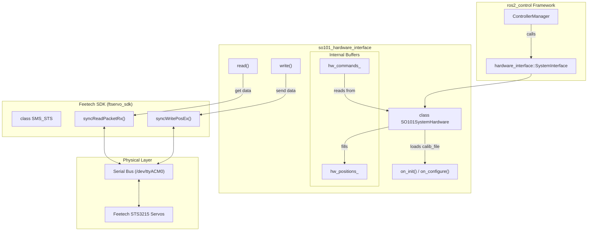
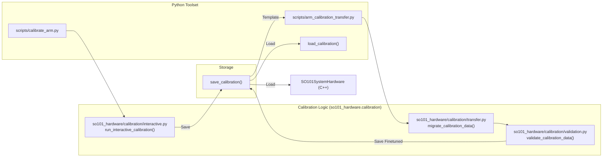

# 硬件插件

Relevant source files

The following files were used as context for generating this wiki page:

- [src/so101_hardware/CMakeLists.txt](https://atomgit.com/openeuler/IB_Robot/blob/master/src/so101_hardware/CMakeLists.txt)
- [src/so101_hardware/docs/tools/arm_calibration_checker.md](https://atomgit.com/openeuler/IB_Robot/blob/master/src/so101_hardware/docs/tools/arm_calibration_checker.md)
- [src/so101_hardware/docs/tools/arm_calibration_transfer.md](https://atomgit.com/openeuler/IB_Robot/blob/master/src/so101_hardware/docs/tools/arm_calibration_transfer.md)
- [src/so101_hardware/package.xml](https://atomgit.com/openeuler/IB_Robot/blob/master/src/so101_hardware/package.xml)
- [src/so101_hardware/scripts/arm_calibration_checker.py](https://atomgit.com/openeuler/IB_Robot/blob/master/src/so101_hardware/scripts/arm_calibration_checker.py)
- [src/so101_hardware/scripts/arm_calibration_transfer.py](https://atomgit.com/openeuler/IB_Robot/blob/master/src/so101_hardware/scripts/arm_calibration_transfer.py)
- [src/so101_hardware/so101_hardware/calibration/checker.py](https://atomgit.com/openeuler/IB_Robot/blob/master/src/so101_hardware/so101_hardware/calibration/checker.py)
- [src/so101_hardware/so101_hardware/calibration/interactive.py](https://atomgit.com/openeuler/IB_Robot/blob/master/src/so101_hardware/so101_hardware/calibration/interactive.py)
- [src/so101_hardware/so101_hardware/calibration/transfer.py](https://atomgit.com/openeuler/IB_Robot/blob/master/src/so101_hardware/so101_hardware/calibration/transfer.py)
- [src/so101_hardware/so101_hardware/calibration/validation.py](https://atomgit.com/openeuler/IB_Robot/blob/master/src/so101_hardware/so101_hardware/calibration/validation.py)
- [src/so101_hardware/test/test_checker.py](https://atomgit.com/openeuler/IB_Robot/blob/master/src/so101_hardware/test/test_checker.py)
- [src/so101_hardware/test/test_transfer.py](https://atomgit.com/openeuler/IB_Robot/blob/master/src/so101_hardware/test/test_transfer.py)

## 目的与范围

本文说明 IB-Robot 用于连接实体机器人和仿真环境的硬件插件实现。硬件插件实现 `ros2_control` 硬件接口，提供统一抽象层，使同一套控制代码可以同时用于真实硬件和仿真。

本文聚焦两个主要硬件插件实现：
- **`SO101SystemHardware`**: 使用 Feetech 舵机 SDK 的 SO-101 真实硬件插件。
- **`gz_ros2_control`**: 用于基于物理仿真的 Gazebo 仿真插件。

**来源**: [src/so101_hardware/package.xml:6-6](https://atomgit.com/openeuler/IB_Robot/blob/master/src/so101_hardware/package.xml#L6-L6)

---

## 硬件插件架构

IB-Robot 中的硬件插件实现 `ros2_control` 的 `SystemInterface`，该接口定义由 `rclcpp_lifecycle` 框架管理的生命周期方法。系统会根据机器人配置 YAML 中的 `hardware_plugin` 字段动态加载这些插件。

### 硬件插件集成流程

下图展示 C++ 硬件插件如何把 ROS 2 control 框架桥接到实体 Feetech 电机总线。

| 系统名称 | 代码实体 |
| :--- | :--- |
| **硬件插件** | `so101_hardware::SO101SystemHardware` |
| **舵机 SDK** | `SMS_STS`（Feetech SDK 类） |
| **状态缓冲区** | `hw_positions_`, `hw_velocities_` |
| **命令缓冲区** | `hw_commands_` |

**来源**: [src/so101_hardware/package.xml:35-35](https://atomgit.com/openeuler/IB_Robot/blob/master/src/so101_hardware/package.xml#L35-L35), [src/so101_hardware/CMakeLists.txt:46-60](https://atomgit.com/openeuler/IB_Robot/blob/master/src/so101_hardware/CMakeLists.txt#L46-L60)

---

## SO101SystemHardware 插件

`SO101SystemHardware` 插件提供 `ros2_control` 与 Feetech 舵机之间的接口。它使用 C++ 实现，并通过 `pluginlib` 导出为 `so101_hardware/SO101SystemHardware`。

### 初始化与配置
在 `on_init` 期间，插件从 URDF/Hardware 描述解析参数，包括串口 `port`、`calib_file` 和 `reset_positions`。

在 `on_configure` 中，插件读取 JSON 标定文件并填充：
- `homing_offsets_`
- `range_mins_`
- `range_maxes_`

**来源**: [src/so101_hardware/package.xml:17-19](https://atomgit.com/openeuler/IB_Robot/blob/master/src/so101_hardware/package.xml#L17-L19)

### 电机通信（SMS_STS）
插件使用 Feetech SDK 中的 `SMS_STS` 类。该 SDK 在构建过程中作为 Git 子模块获取 [src/so101_hardware/CMakeLists.txt:23-28](https://atomgit.com/openeuler/IB_Robot/blob/master/src/so101_hardware/CMakeLists.txt#L23-L28)，并编译为静态库 `ftservo_sdk` [src/so101_hardware/CMakeLists.txt:32-38](https://atomgit.com/openeuler/IB_Robot/blob/master/src/so101_hardware/CMakeLists.txt#L32-L38)。
- **激活**: 在 `on_activate` 中，对每个电机 ID 执行 ping 以确认连通性，并提供 3 次重试机制。
- **安全**: 解锁 EPROM 写入标定参数（偏移和限位），然后重新上锁以持久化。
- **同步读写**: 使用 `syncReadPacketTx`/`Rx` 高效更新多电机状态，使用 `syncWritePosEx` 同时下发命令。

**来源**: [src/so101_hardware/CMakeLists.txt:23-38](https://atomgit.com/openeuler/IB_Robot/blob/master/src/so101_hardware/CMakeLists.txt#L23-L38)

### 坐标转换
插件处理 ROS 弧度与 Feetech “ticks”（0-4095 范围）之间的转换。
- **Ticks 到弧度**: `rad = (static_cast<double>(pos) - 2048.0) / TICKS_PER_RAD`。
- **弧度到 Ticks**: 转换发生在 `write()` 循环中，使用同一个 `TICKS_PER_RAD` 常量（4096.0 / 2π）。

---

## 标定与工具

IB-Robot 提供一组 Python 工具来管理硬件标定，这些工具对 C++ 插件正常工作至关重要。工具使用 `lerobot.motors` 库进行电机抽象。

### 标定数据流

下图把 Python 标定工具连接到底层 C++ 硬件接口使用的数据结构。

| 系统名称 | 代码实体 |
| :--- | :--- |
| **标定脚本** | `calibrate_arm.py` |
| **标定对象** | `lerobot.motors.MotorCalibration` |
| **迁移工具** | `arm_calibration_transfer.py` |
| **检查工具** | `arm_calibration_checker.py` |

**来源**: [src/so101_hardware/so101_hardware/calibration/interactive.py:21-79](https://atomgit.com/openeuler/IB_Robot/blob/master/src/so101_hardware/so101_hardware/calibration/interactive.py#L21-L79), [src/so101_hardware/so101_hardware/calibration/interactive.py:88-118](https://atomgit.com/openeuler/IB_Robot/blob/master/src/so101_hardware/so101_hardware/calibration/interactive.py#L88-L118), [src/so101_hardware/so101_hardware/calibration/interactive.py:119-161](https://atomgit.com/openeuler/IB_Robot/blob/master/src/so101_hardware/so101_hardware/calibration/interactive.py#L119-L161), [src/so101_hardware/so101_hardware/calibration/transfer.py:121-146](https://atomgit.com/openeuler/IB_Robot/blob/master/src/so101_hardware/so101_hardware/calibration/transfer.py#L121-L146), [src/so101_hardware/so101_hardware/calibration/validation.py:18-59](https://atomgit.com/openeuler/IB_Robot/blob/master/src/so101_hardware/so101_hardware/calibration/validation.py#L18-L59)

### 关键工具

| 工具 | 用途 | 来源 |
| :--- | :--- | :--- |
| **`calibrate_arm`** | 运行交互式流程，通过释放扭矩查找回零偏移和物理范围，并把标定数据保存为 JSON 文件。 | [src/so101_hardware/so101_hardware/calibration/interactive.py:21-79](https://atomgit.com/openeuler/IB_Robot/blob/master/src/so101_hardware/so101_hardware/calibration/interactive.py#L21-L79) |
| **`arm_calibration_transfer`** | 将旧版 LeRobot 标定文件（使用 `shoulder_pan` 等命名关节）迁移到新的基于 ID 的 schema（例如 "1"、"2"）。它根据旧数据中的回零偏移和 drive mode 计算新范围限位，并应用到模板。 | [src/so101_hardware/so101_hardware/calibration/transfer.py:13-22](https://atomgit.com/openeuler/IB_Robot/blob/master/src/so101_hardware/so101_hardware/calibration/transfer.py#L13-L22), [src/so101_hardware/so101_hardware/calibration/transfer.py:38-63](https://atomgit.com/openeuler/IB_Robot/blob/master/src/so101_hardware/so101_hardware/calibration/transfer.py#L38-L63), [src/so101_hardware/docs/tools/arm_calibration_transfer.md:1-10](https://atomgit.com/openeuler/IB_Robot/blob/master/src/so101_hardware/docs/tools/arm_calibration_transfer.md#L1-L10) |
| **`arm_calibration_checker`** | 重放固定姿态序列（30°、60°、90° 和夹爪检查）以验证装配精度。它加载标定数据并向硬件后端发送命令。 | [src/so101_hardware/scripts/arm_calibration_checker.py:9-14](https://atomgit.com/openeuler/IB_Robot/blob/master/src/so101_hardware/scripts/arm_calibration_checker.py#L9-L14), [src/so101_hardware/so101_hardware/calibration/checker.py:189-197](https://atomgit.com/openeuler/IB_Robot/blob/master/src/so101_hardware/so101_hardware/calibration/checker.py#L189-L197), [src/so101_hardware/test/test_checker.py:20-41](https://atomgit.com/openeuler/IB_Robot/blob/master/src/so101_hardware/test/test_checker.py#L20-L41) |

**来源**: [src/so101_hardware/so101_hardware/calibration/interactive.py:21-79](https://atomgit.com/openeuler/IB_Robot/blob/master/src/so101_hardware/so101_hardware/calibration/interactive.py#L21-L79), [src/so101_hardware/docs/tools/arm_calibration_checker.md:15-28](https://atomgit.com/openeuler/IB_Robot/blob/master/src/so101_hardware/docs/tools/arm_calibration_checker.md#L15-L28)

---

## 仿真后端

`robot_config` 启动系统会根据 `use_sim` 标志动态切换硬件后端。

### Gazebo 集成（`gz_ros2_control`）
在 Gazebo 仿真中，系统使用 `gz_ros2_control`。启动构建器 `generate_ros2_control_nodes` 负责把 `robot_description` 注入 `controller_manager`。

- **URDF 生成**: `description.py` 中的 `generate_robot_description` 处理 xacro，并为 Gazebo 环境注入相机传感器。
- **控制器启动**: `generate_controller_spawners` 创建节点，在仿真就绪后激活指定控制器，例如 `arm_position_controller`。

### 硬件切换机制
选择逻辑位于 `robot_config` 启动构建器中：

| 模式 | 选择逻辑 | 插件 / 驱动 |
| :--- | :--- | :--- |
| **Real** | `control.py` 中 `is_sim` 为 False | `so101_hardware/SO101SystemHardware` |
| **Sim** | `control.py` 中 `is_sim` 为 True | `gz_ros2_control/GazeboSimSystem` |
| **Peripherals** | 仿真中 `generate_camera_nodes` 跳过物理驱动 | `usb_cam`, `realsense2_camera` |

---

## 故障排查

### 常见硬件问题
- **缺少标定文件**: 如果插件因 "Calibration file not found" 失败，它会给出要运行的具体命令：`ros2 run so101_hardware calibrate_arm --arm follower --port /dev/ttyACM0`。
- **电机连接**: 如果激活期间 ping 失败，插件会记录 "Motor ID X is NOT responding"。
- **Controller Manager 不匹配**: 启动构建器使用临时 YAML 文件传递 `robot_description`，避免 `ros2_control_node` 与 `controller_manager` 服务之间的命名空间不匹配。

