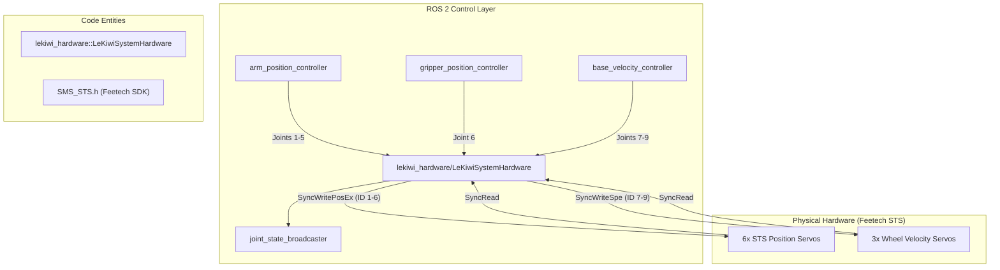
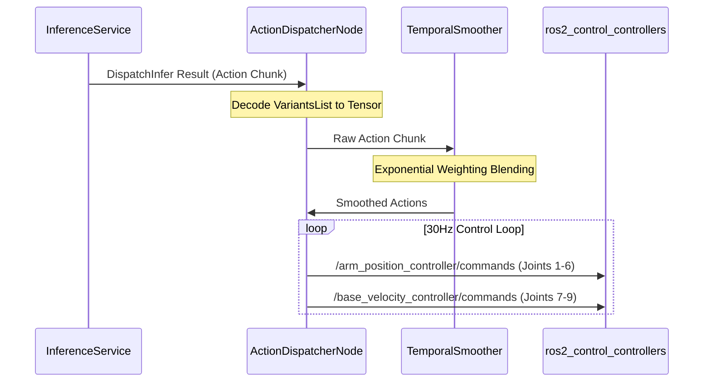

# LeKiwi 移动机械臂

Relevant source files

The following files were used as context for generating this wiki page:

- [.gitattributes](https://atomgit.com/openeuler/IB_Robot/blob/master/.gitattributes)
- [src/lekiwi_description/CMakeLists.txt](https://atomgit.com/openeuler/IB_Robot/blob/master/src/lekiwi_description/CMakeLists.txt)
- [src/lekiwi_description/meshes/bno055_imu.stl](https://atomgit.com/openeuler/IB_Robot/blob/master/src/lekiwi_description/meshes/bno055_imu.stl)
- [src/lekiwi_description/meshes/hd_webcam.stl](https://atomgit.com/openeuler/IB_Robot/blob/master/src/lekiwi_description/meshes/hd_webcam.stl)
- [src/lekiwi_description/meshes/ld06_lidar.stl](https://atomgit.com/openeuler/IB_Robot/blob/master/src/lekiwi_description/meshes/ld06_lidar.stl)
- [src/lekiwi_description/meshes/lekiwi_base.stl](https://atomgit.com/openeuler/IB_Robot/blob/master/src/lekiwi_description/meshes/lekiwi_base.stl)
- [src/lekiwi_description/meshes/omni_wheel.stl](https://atomgit.com/openeuler/IB_Robot/blob/master/src/lekiwi_description/meshes/omni_wheel.stl)
- [src/lekiwi_description/package.xml](https://atomgit.com/openeuler/IB_Robot/blob/master/src/lekiwi_description/package.xml)
- [src/lekiwi_description/urdf/base.common.xacro](https://atomgit.com/openeuler/IB_Robot/blob/master/src/lekiwi_description/urdf/base.common.xacro)
- [src/lekiwi_description/urdf/base.control.xacro](https://atomgit.com/openeuler/IB_Robot/blob/master/src/lekiwi_description/urdf/base.control.xacro)
- [src/lekiwi_description/urdf/base.urdf](https://atomgit.com/openeuler/IB_Robot/blob/master/src/lekiwi_description/urdf/base.urdf)
- [src/lekiwi_description/urdf/lekiwi_assembled.urdf.xacro](https://atomgit.com/openeuler/IB_Robot/blob/master/src/lekiwi_description/urdf/lekiwi_assembled.urdf.xacro)
- [src/lekiwi_hardware/CMakeLists.txt](https://atomgit.com/openeuler/IB_Robot/blob/master/src/lekiwi_hardware/CMakeLists.txt)
- [src/lekiwi_hardware/README.md](https://atomgit.com/openeuler/IB_Robot/blob/master/src/lekiwi_hardware/README.md)
- [src/lekiwi_hardware/config/lekiwi_controllers.yaml](https://atomgit.com/openeuler/IB_Robot/blob/master/src/lekiwi_hardware/config/lekiwi_controllers.yaml)
- [src/lekiwi_hardware/include/lekiwi_hardware/lekiwi_system_hardware.hpp](https://atomgit.com/openeuler/IB_Robot/blob/master/src/lekiwi_hardware/include/lekiwi_hardware/lekiwi_system_hardware.hpp)
- [src/lekiwi_hardware/lekiwi_hardware_plugin.xml](https://atomgit.com/openeuler/IB_Robot/blob/master/src/lekiwi_hardware/lekiwi_hardware_plugin.xml)
- [src/lekiwi_hardware/package.xml](https://atomgit.com/openeuler/IB_Robot/blob/master/src/lekiwi_hardware/package.xml)
- [src/lekiwi_hardware/src/lekiwi_system_hardware.cpp](https://atomgit.com/openeuler/IB_Robot/blob/master/src/lekiwi_hardware/src/lekiwi_system_hardware.cpp)
- [src/lekiwi_hardware/tools/scan_motors.cpp](https://atomgit.com/openeuler/IB_Robot/blob/master/src/lekiwi_hardware/tools/scan_motors.cpp)
- [src/robot_config/config/robots/lekiwi_navi.yaml](https://atomgit.com/openeuler/IB_Robot/blob/master/src/robot_config/config/robots/lekiwi_navi.yaml)

LeKiwi 平台是集成到 IB-Robot 框架中的三轮全向移动机械臂。它把 6-DOF SO101 机械臂和自定义移动底盘组合在一起，通过 `lekiwi_hardware` 插件使用 Feetech STS 协议统一控制基于位置的机械臂关节和基于速度的底盘电机。

## 系统架构

LeKiwi 系统作为 `ros2_control` `SystemInterface` 运行，把 9 个物理电机（6 个机械臂，3 个底盘）抽象为标准 ROS 2 命令接口和状态接口。

### 硬件映射图
下图展示高层 ROS 2 控制器与底层 `LeKiwiSystemHardware` 实现之间的关系。

**来源:** [src/lekiwi_hardware/README.md:17-40](https://atomgit.com/openeuler/IB_Robot/blob/master/src/lekiwi_hardware/README.md#L17-L40), [src/lekiwi_hardware/include/lekiwi_hardware/lekiwi_system_hardware.hpp:19-25](https://atomgit.com/openeuler/IB_Robot/blob/master/src/lekiwi_hardware/include/lekiwi_hardware/lekiwi_system_hardware.hpp#L19-L25), [src/lekiwi_hardware/config/lekiwi_controllers.yaml:1-20](https://atomgit.com/openeuler/IB_Robot/blob/master/src/lekiwi_hardware/config/lekiwi_controllers.yaml#L1-L20)

## 硬件接口（lekiwi_hardware）

`lekiwi_hardware` 包提供 `LeKiwiSystemHardware` 插件，实现 `hardware_interface::SystemInterface` [src/lekiwi_hardware/include/lekiwi_hardware/lekiwi_system_hardware.hpp:25-25](https://atomgit.com/openeuler/IB_Robot/blob/master/src/lekiwi_hardware/include/lekiwi_hardware/lekiwi_system_hardware.hpp#L25-L25)。它通过 1 Mbps 串口连接管理与 Feetech SMS_STS 舵机的通信 [src/lekiwi_hardware/README.md:225-226](https://atomgit.com/openeuler/IB_Robot/blob/master/src/lekiwi_hardware/README.md#L225-L226)。

### 关键函数和控制循环
*   **`on_init`**: 初始化硬件接口，调整内部缓冲区大小，并从 `HardwareInfo` 对象解析电机 ID。它还会从硬件参数中提取串口和标定文件路径 [src/lekiwi_hardware/src/lekiwi_system_hardware.cpp:13-54](https://atomgit.com/openeuler/IB_Robot/blob/master/src/lekiwi_hardware/src/lekiwi_system_hardware.cpp#L13-L54)。
*   **`on_configure`**: 解析 `calib_file_` 指定的 JSON 标定文件，为机械臂电机加载回零偏移和关节限位。底盘电机不需要标定数据 [src/lekiwi_hardware/src/lekiwi_system_hardware.cpp:56-102](https://atomgit.com/openeuler/IB_Robot/blob/master/src/lekiwi_hardware/src/lekiwi_system_hardware.cpp#L56-L102)。
*   **`on_activate`**: 建立与电机的串口通信，ping 每个电机确认连通性，并配置机械臂电机为位置控制、底盘电机为轮式（速度）模式。它还初始化 `syncReadBegin`，用于高效状态读取 [src/lekiwi_hardware/src/lekiwi_system_hardware.cpp:133-210](https://atomgit.com/openeuler/IB_Robot/blob/master/src/lekiwi_hardware/src/lekiwi_system_hardware.cpp#L133-L210)。
*   **`read()`**: 使用 `syncReadPacketTx/Rx` 在单次事务中获取全部 9 个电机的位置和速度，确保时间一致性 [src/lekiwi_hardware/README.md:226-226](https://atomgit.com/openeuler/IB_Robot/blob/master/src/lekiwi_hardware/README.md#L226-L226)。原始电机数据会转换为 ROS 单位，并存储在 `hw_positions_` 和 `hw_velocities_` 中 [src/lekiwi_hardware/src/lekiwi_system_hardware.cpp:212-249](https://atomgit.com/openeuler/IB_Robot/blob/master/src/lekiwi_hardware/src/lekiwi_system_hardware.cpp#L212-L249)。
*   **`write()`**: 
    *   **机械臂（ID 1-6）**: 将命令位置从弧度转换为原始 ticks，应用回零偏移，并限制在定义范围内。然后发送包含目标位置、速度和加速度的 `SyncWritePosEx` 包 [src/lekiwi_hardware/README.md:227-227](https://atomgit.com/openeuler/IB_Robot/blob/master/src/lekiwi_hardware/README.md#L227-L227), [src/lekiwi_hardware/src/lekiwi_system_hardware.cpp:251-280](https://atomgit.com/openeuler/IB_Robot/blob/master/src/lekiwi_hardware/src/lekiwi_system_hardware.cpp#L251-L280)。
    *   **底盘（ID 7-9）**: 将命令速度从 rad/s 转换为原始 steps/s 并进行限幅。随后发送 `SyncWriteSpe` 包，实现连续旋转速度控制 [src/lekiwi_hardware/README.md:228-228](https://atomgit.com/openeuler/IB_Robot/blob/master/src/lekiwi_hardware/README.md#L228-L228), [src/lekiwi_hardware/src/lekiwi_system_hardware.cpp:282-297](https://atomgit.com/openeuler/IB_Robot/blob/master/src/lekiwi_hardware/src/lekiwi_system_hardware.cpp#L282-L297)。
*   **控制频率**: `controller_manager` 配置为 100 Hz 运行 [src/lekiwi_hardware/config/lekiwi_controllers.yaml:3-3](https://atomgit.com/openeuler/IB_Robot/blob/master/src/lekiwi_hardware/config/lekiwi_controllers.yaml#L3-L3)。

### 坐标与单位转换
插件负责 ROS 2 标准单位（弧度、rad/s）与 Feetech 原始 ticks 之间的转换。转换逻辑集中在 `lekiwi_conversions.hpp` 中 [src/lekiwi_hardware/README.md:210-210](https://atomgit.com/openeuler/IB_Robot/blob/master/src/lekiwi_hardware/README.md#L210-L210)。

| 函数 | 用途 |
|---|---|
| `ticks_to_radians(raw_ticks)` | 机械臂位置：raw ticks → radians |
| `radians_to_ticks(radians)` | 机械臂位置：radians → ticks（限幅到 [0, 4095]） |
| `steps_to_rad_s(raw_speed)` | 速度：raw steps/s → rad/s |
| `rad_s_to_steps(rad_per_sec)` | 速度：rad/s → steps/s（限幅到 [-32768, 32767]） |
| `decode_motor_register(low, high)` | 解码 2 字节寄存器（bit 15 为符号位） |
| `encode_homing_offset(offset)` | 编码回零偏移（bit 11 为符号位） |

**来源:** [src/lekiwi_hardware/src/lekiwi_system_hardware.cpp](https://atomgit.com/openeuler/IB_Robot/blob/master/src/lekiwi_hardware/src/lekiwi_system_hardware.cpp), [src/lekiwi_hardware/README.md:172-180](https://atomgit.com/openeuler/IB_Robot/blob/master/src/lekiwi_hardware/README.md#L172-L180), [src/lekiwi_hardware/include/lekiwi_hardware/lekiwi_conversions.hpp](https://atomgit.com/openeuler/IB_Robot/blob/master/src/lekiwi_hardware/include/lekiwi_hardware/lekiwi_conversions.hpp)

## 机器人描述（lekiwi_description）

`lekiwi_description` 包包含平台的 URDF/Xacro 模型。主模型是 `lekiwi_assembled.urdf.xacro`，它把 SO101 机械臂与 LeKiwi 三轮底盘合并 [src/lekiwi_description/urdf/lekiwi_assembled.urdf.xacro:5-8](https://atomgit.com/openeuler/IB_Robot/blob/master/src/lekiwi_description/urdf/lekiwi_assembled.urdf.xacro#L5-L8)。

### 运动学配置
*   **底盘**: 三轮全向驱动系统。车轮相对于 +X 轴布置在 60°、180° 和 300° [src/lekiwi_description/urdf/lekiwi_assembled.urdf.xacro:127-152](https://atomgit.com/openeuler/IB_Robot/blob/master/src/lekiwi_description/urdf/lekiwi_assembled.urdf.xacro#L127-L152)。
*   **机械臂安装**: 机械臂基座（`world` link）以固定偏移和 90 度 Z 轴旋转安装到 `base_link` [src/lekiwi_description/urdf/lekiwi_assembled.urdf.xacro:157-161](https://atomgit.com/openeuler/IB_Robot/blob/master/src/lekiwi_description/urdf/lekiwi_assembled.urdf.xacro#L157-L161)。
*   **关节命名**: 关节以 "1" 到 "9" 的数字命名，保持与 `robot_config` 和硬件 ID 的直接映射 [src/lekiwi_description/urdf/lekiwi_assembled.urdf.xacro:185-240](https://atomgit.com/openeuler/IB_Robot/blob/master/src/lekiwi_description/urdf/lekiwi_assembled.urdf.xacro#L185-L240)。
*   **`ros2_control` 集成**: `lekiwi_assembled.urdf.xacro` 文件包含 `ros2_control` 标签，会根据 `use_sim` 参数动态加载真实硬件的 `lekiwi_hardware/LeKiwiSystemHardware` 插件，或仿真插件（例如 `gz_ros2_control/GazeboSimSystem`）[src/lekiwi_description/urdf/lekiwi_assembled.urdf.xacro:165-181](https://atomgit.com/openeuler/IB_Robot/blob/master/src/lekiwi_description/urdf/lekiwi_assembled.urdf.xacro#L165-L181)。它还为每个关节定义命令和状态接口 [src/lekiwi_description/urdf/lekiwi_assembled.urdf.xacro:183-240](https://atomgit.com/openeuler/IB_Robot/blob/master/src/lekiwi_description/urdf/lekiwi_assembled.urdf.xacro#L183-L240)。

**来源:** [src/lekiwi_description/urdf/lekiwi_assembled.urdf.xacro:1-161](https://atomgit.com/openeuler/IB_Robot/blob/master/src/lekiwi_description/urdf/lekiwi_assembled.urdf.xacro#L1-L161), [src/lekiwi_description/urdf/base.common.xacro:1-32](https://atomgit.com/openeuler/IB_Robot/blob/master/src/lekiwi_description/urdf/base.common.xacro#L1-L32)

## 机器人配置（lekiwi_navi）

`lekiwi_navi.yaml` 文件是移动操作任务的 **Single Source of Truth**，定义控制模式、导航参数和模型推理设置 [src/robot_config/config/robots/lekiwi_navi.yaml:2-6](https://atomgit.com/openeuler/IB_Robot/blob/master/src/robot_config/config/robots/lekiwi_navi.yaml#L2-L6)。

### 控制模式
该配置定义三种运行模式：

1.  **`teleop`**: Human-in-the-loop 控制，使用 leader arm 和键盘控制底盘。推理被显式禁用 [src/robot_config/config/robots/lekiwi_navi.yaml:40-56](https://atomgit.com/openeuler/IB_Robot/blob/master/src/robot_config/config/robots/lekiwi_navi.yaml#L40-L56)。
2.  **`model_inference`**: 使用 ACT（Action Chunking with Transformers）策略的自主控制，采用分布式执行模式 [src/robot_config/config/robots/lekiwi_navi.yaml:58-78](https://atomgit.com/openeuler/IB_Robot/blob/master/src/robot_config/config/robots/lekiwi_navi.yaml#L58-L78)。
3.  **`navi`**: 集成导航与操作模式。该模式启用 `action_dispatch` 节点，并将 `watermark_threshold` 设置为 20，在移动任务中管理 action 队列，同时设置 `navigation_mode` 为 true，用于导航期间的显式底盘控制 [src/robot_config/config/robots/lekiwi_navi.yaml:80-98](https://atomgit.com/openeuler/IB_Robot/blob/master/src/robot_config/config/robots/lekiwi_navi.yaml#L80-L98)。

### 导航集成
LeKiwi 使用 `navigation` 块中定义的完整导航栈：
*   **SLAM/定位**: 使用 `rtabmap` 通过 RealSense 相机做视觉 SLAM，并使用 EKF 做传感器融合。`database_path` 和 `map_file` 可配置 [src/robot_config/config/robots/lekiwi_navi.yaml:123-144](https://atomgit.com/openeuler/IB_Robot/blob/master/src/robot_config/config/robots/lekiwi_navi.yaml#L123-L144)。
*   **`cmd_vel_bridge`**: 该节点把标准 `geometry_msgs/Twist` 命令转换为三轮全向底盘所需的各轮速度。它发布 `odom`，也可以选择发布 `tf` [src/robot_config/config/robots/lekiwi_navi.yaml:146-159](https://atomgit.com/openeuler/IB_Robot/blob/master/src/robot_config/config/robots/lekiwi_navi.yaml#L146-L159)。
*   **`robot_navigation`**: 该包提供高层导航逻辑，包括语音控制集成和预定义目的地 [src/robot_config/config/robots/lekiwi_navi.yaml:161-179](https://atomgit.com/openeuler/IB_Robot/blob/master/src/robot_config/config/robots/lekiwi_navi.yaml#L161-L179)。
*   **语音接口**: 与 `voice_asr` 集成后，可通过语音触发导航到 `point_a`、`point_b` 或 `origin` 等预定义目的地 [src/robot_config/config/robots/lekiwi_navi.yaml:101-113](https://atomgit.com/openeuler/IB_Robot/blob/master/src/robot_config/config/robots/lekiwi_navi.yaml#L101-L113), [src/robot_config/config/robots/lekiwi_navi.yaml:162-179](https://atomgit.com/openeuler/IB_Robot/blob/master/src/robot_config/config/robots/lekiwi_navi.yaml#L162-L179)。

### Action Dispatch 数据流
下图描述 LeKiwi 平台如何处理推理结果。

**来源:** [src/robot_config/config/robots/lekiwi_navi.yaml:92-98](https://atomgit.com/openeuler/IB_Robot/blob/master/src/robot_config/config/robots/lekiwi_navi.yaml#L92-L98)

## 外设配置
该平台配备多个相机和传感器，作为 peripherals 定义：
*   **前置相机**: 基于 OpenCV 的前向相机驱动，用于全局导航和障碍检测 [src/robot_config/config/robots/lekiwi_navi.yaml:210-227](https://atomgit.com/openeuler/IB_Robot/blob/master/src/robot_config/config/robots/lekiwi_navi.yaml#L210-L227)。
*   **腕部相机**: 安装在机械臂上的 RealSense 相机，用于精细操作和抓取。其 RGB 和深度话题会为 `rtabmap` 重映射 [src/robot_config/config/robots/lekiwi_navi.yaml:229-246](https://atomgit.com/openeuler/IB_Robot/blob/master/src/robot_config/config/robots/lekiwi_navi.yaml#L229-L246), [src/robot_config/config/robots/lekiwi_navi.yaml:133-136](https://atomgit.com/openeuler/IB_Robot/blob/master/src/robot_config/config/robots/lekiwi_navi.yaml#L133-L136)。
*   **IMU**: BNO055 传感器，为 EKF 定位提供姿态数据 [src/lekiwi_description/urdf/base.common.xacro:28-30](https://atomgit.com/openeuler/IB_Robot/blob/master/src/lekiwi_description/urdf/base.common.xacro#L28-L30)。

**来源:** [src/robot_config/config/robots/lekiwi_navi.yaml:209-246](https://atomgit.com/openeuler/IB_Robot/blob/master/src/robot_config/config/robots/lekiwi_navi.yaml#L209-L246), [src/lekiwi_description/urdf/base.common.xacro:1-32](https://atomgit.com/openeuler/IB_Robot/blob/master/src/lekiwi_description/urdf/base.common.xacro#L1-L32)

