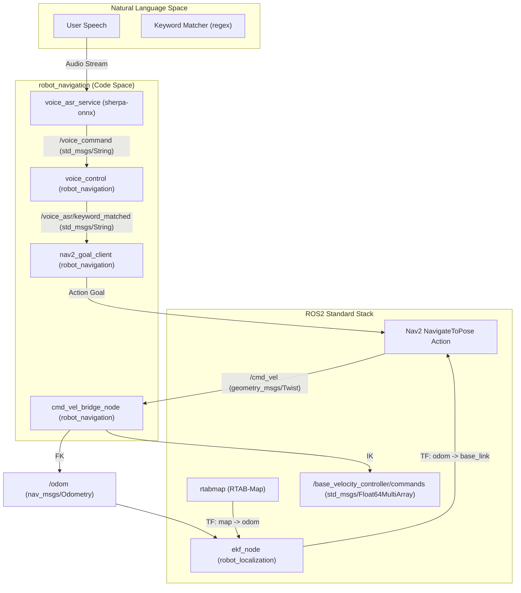
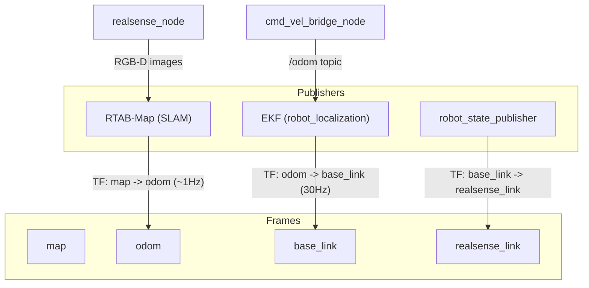

# 导航栈

<details>
<summary>Relevant source files</summary>

The following files were used as context for generating this wiki page:

- [src/lekiwi_description/urdf/lekiwi_assembled.urdf.xacro](https://atomgit.com/openeuler/IB_Robot/blob/master/src/lekiwi_description/urdf/lekiwi_assembled.urdf.xacro)
- [src/lekiwi_hardware/CMakeLists.txt](https://atomgit.com/openeuler/IB_Robot/blob/master/src/lekiwi_hardware/CMakeLists.txt)
- [src/lekiwi_hardware/README.md](https://atomgit.com/openeuler/IB_Robot/blob/master/src/lekiwi_hardware/README.md)
- [src/lekiwi_hardware/config/lekiwi_controllers.yaml](https://atomgit.com/openeuler/IB_Robot/blob/master/src/lekiwi_hardware/config/lekiwi_controllers.yaml)
- [src/lekiwi_hardware/include/lekiwi_hardware/lekiwi_conversions.hpp](https://atomgit.com/openeuler/IB_Robot/blob/master/src/lekiwi_hardware/include/lekiwi_hardware/lekiwi_conversions.hpp)
- [src/lekiwi_hardware/include/lekiwi_hardware/lekiwi_system_hardware.hpp](https://atomgit.com/openeuler/IB_Robot/blob/master/src/lekiwi_hardware/include/lekiwi_hardware/lekiwi_system_hardware.hpp)
- [src/lekiwi_hardware/lekiwi_hardware_plugin.xml](https://atomgit.com/openeuler/IB_Robot/blob/master/src/lekiwi_hardware/lekiwi_hardware_plugin.xml)
- [src/lekiwi_hardware/package.xml](https://atomgit.com/openeuler/IB_Robot/blob/master/src/lekiwi_hardware/package.xml)
- [src/lekiwi_hardware/src/lekiwi_system_hardware.cpp](https://atomgit.com/openeuler/IB_Robot/blob/master/src/lekiwi_hardware/src/lekiwi_system_hardware.cpp)
- [src/lekiwi_hardware/test/test_lekiwi_conversions.cpp](https://atomgit.com/openeuler/IB_Robot/blob/master/src/lekiwi_hardware/test/test_lekiwi_conversions.cpp)
- [src/robot_config/config/robots/lekiwi_navi.yaml](https://atomgit.com/openeuler/IB_Robot/blob/master/src/robot_config/config/robots/lekiwi_navi.yaml)
- [src/robot_config/robot_config/launch_builders/voice_nav.py](https://atomgit.com/openeuler/IB_Robot/blob/master/src/robot_config/robot_config/launch_builders/voice_nav.py)
- [src/robot_navigation/README.md](https://atomgit.com/openeuler/IB_Robot/blob/master/src/robot_navigation/README.md)
- [src/robot_navigation/package.xml](https://atomgit.com/openeuler/IB_Robot/blob/master/src/robot_navigation/package.xml)
- [src/robot_navigation/setup.py](https://atomgit.com/openeuler/IB_Robot/blob/master/src/robot_navigation/setup.py)

</details>


`robot_navigation` 包为 LeKiwi 移动机械臂提供完整导航方案。它集成 Nav2 栈、通过 FunASR 进行实时语音命令处理、使用 RTAB-Map 做视觉 SLAM，并为三轮全向底盘提供自定义运动学桥接。

## 系统架构

导航栈采用分层架构，高层语音命令会分解为导航目标，再由 Nav2 控制器执行，并转换成硬件专用电机速度。

### 数据流和功能块

下图展示从自然语言输入到电机命令的流程。

**Voice-to-Action Pipeline**

来源: [src/robot_navigation/README.md:15-38](https://atomgit.com/openeuler/IB_Robot/blob/master/src/robot_navigation/README.md#L15-L38), [src/robot_navigation/README.md:155-164](https://atomgit.com/openeuler/IB_Robot/blob/master/src/robot_navigation/README.md#L155-L164)

## 语音触发导航

系统与 `voice_asr_service` 集成，该服务使用 sherpa-onnx 进行本地 ASR；同时与 `voice_control` 节点集成，为导航提供语音接口。

### 关键组件
*   **`voice_asr_service`**: 该包（在 12.1 Voice ASR Service 中说明）执行语音转文本，并把识别文本发布到 `/voice_command` [src/robot_config/config/robots/lekiwi_navi.yaml:103](https://atomgit.com/openeuler/IB_Robot/blob/master/src/robot_config/config/robots/lekiwi_navi.yaml#L103)。
*   **`voice_control` 节点**: 订阅 `/voice_command`，并把识别短语与可配置的关键词和目的地名称匹配。
    *   **关键词匹配**: 根据通过参数提供的 JSON 字符串中定义的模式匹配识别文本 [src/robot_config/robot_config/launch_builders/voice_nav.py:70-89](https://atomgit.com/openeuler/IB_Robot/blob/master/src/robot_config/robot_config/launch_builders/voice_nav.py#L70-L89)。
    *   **目的地映射**: 将位置名称（例如 "Point A"）映射到机器人配置 YAML 中定义的笛卡尔坐标 `{x, y, theta}` [src/robot_config/robot_config/launch_builders/voice_nav.py:99-101](https://atomgit.com/openeuler/IB_Robot/blob/master/src/robot_config/robot_config/launch_builders/voice_nav.py#L99-L101)。
    *   **输出**: 将匹配到的关键词发布到 `/voice_asr/keyword_matched`，并将导航停止命令发布到 `/voice_asr/nav_stop` [src/robot_navigation/README.md:162-163](https://atomgit.com/openeuler/IB_Robot/blob/master/src/robot_navigation/README.md#L162-L163)。
*   **`nav2_goal_client` 节点**: 订阅 `/voice_asr/keyword_matched` 和 `/voice_asr/nav_stop`。当匹配到目的地关键词时，它向 Nav2 发送 `NavigateToPose` action goal。
    *   **Action 触发**: 到达目的地后，`nav2_goal_client` 可以自动触发 `/action_dispatcher/start_evaluate` 服务，启动模型推理或其他任务 [src/robot_navigation/README.md:185](https://atomgit.com/openeuler/IB_Robot/blob/master/src/robot_navigation/README.md#L185)。

来源: [src/robot_navigation/README.md:16-17](https://atomgit.com/openeuler/IB_Robot/blob/master/src/robot_navigation/README.md#L16-L17), [src/robot_navigation/README.md:155-177](https://atomgit.com/openeuler/IB_Robot/blob/master/src/robot_navigation/README.md#L155-L177), [src/robot_config/config/robots/lekiwi_navi.yaml:100-113](https://atomgit.com/openeuler/IB_Robot/blob/master/src/robot_config/config/robots/lekiwi_navi.yaml#L100-L113), [src/robot_config/robot_config/launch_builders/voice_nav.py:21-66](https://atomgit.com/openeuler/IB_Robot/blob/master/src/robot_config/robot_config/launch_builders/voice_nav.py#L21-L66), [src/robot_config/robot_config/launch_builders/voice_nav.py:92-123](https://atomgit.com/openeuler/IB_Robot/blob/master/src/robot_config/robot_config/launch_builders/voice_nav.py#L92-L123)

## 全向轮运动学桥接

`cmd_vel_bridge_node` 是 LeKiwi 三轮全向底盘的专用驱动。它负责在标准 ROS 2 导航消息和 `ros2_control` 速度接口之间转换。

### 运动学实现

该节点实现逆运动学（IK），把 `/cmd_vel` 上接收到的车体速度 $(v_x, v_y, \dot{\theta})$ 转换为各车轮角速度（rad/s），再发布到 `/base_velocity_controller/commands`。它也会根据 `/joint_states` 上接收到的车轮反馈执行正运动学（FK）计算里程计，并发布到 `/odom`。

| 函数 | 说明 |
| :--- | :--- |
| `_build_kinematics_matrix` | 根据车轮安装角（150°、-90°、30°）和底盘半径构造 3x3 矩阵。 |
| `_body_to_wheel_radps` | IK：根据车体速度计算车轮速度，并按 `max_radps` 缩放。 |
| `_wheel_radps_to_body` | FK：将车轮 `JointState` 反馈转换为车体坐标系速度，用于里程计。 |

### 里程计和 TF 策略
该桥接节点发布 `/odom` 话题（类型 `nav_msgs/Odometry`），但当 EKF 启用时默认 `publish_tf: false` [src/robot_config/config/robots/lekiwi_navi.yaml:153](https://atomgit.com/openeuler/IB_Robot/blob/master/src/robot_config/config/robots/lekiwi_navi.yaml#L153)。这样 `robot_localization` 节点可以把原始里程计与其他传感器融合，并发布 `odom -> base_link` TF。

来源: [src/robot_navigation/README.md:8-9](https://atomgit.com/openeuler/IB_Robot/blob/master/src/robot_navigation/README.md#L8-L9), [src/robot_navigation/README.md:36-38](https://atomgit.com/openeuler/IB_Robot/blob/master/src/robot_navigation/README.md#L36-L38), [src/robot_navigation/README.md:107-112](https://atomgit.com/openeuler/IB_Robot/blob/master/src/robot_navigation/README.md#L107-L112)

## 定位和 SLAM

定位栈采用双层方案，既保证平滑局部控制，也提供准确全局定位。

**TF Hierarchy and Localization Fusion**

来源: [src/robot_navigation/README.md:40-53](https://atomgit.com/openeuler/IB_Robot/blob/master/src/robot_navigation/README.md#L40-L53), [src/robot_config/config/robots/lekiwi_navi.yaml:131-133](https://atomgit.com/openeuler/IB_Robot/blob/master/src/robot_config/config/robots/lekiwi_navi.yaml#L131-L133)

### 定位组件
1.  **EKF（`robot_localization`）**: 融合来自 `/odom` 话题的车轮里程计（X/Y 速度和 Yaw rate），提供高频（30Hz）、平滑的 `odom -> base_link` 变换。EKF 配置在 `lekiwi_navi.yaml` 的 `navigation` 块中由 `ekf` 段指定 [src/robot_config/config/robots/lekiwi_navi.yaml:144-145](https://atomgit.com/openeuler/IB_Robot/blob/master/src/robot_config/config/robots/lekiwi_navi.yaml#L144-L145)。
2.  **RTAB-Map**: 使用来自 RealSense 相机的 RGB-D 数据（话题 `/camera/realsense_camera/color/image_raw`、`/camera/realsense_camera/aligned_depth_to_color/image_raw`、`/camera/realsense_camera/color/camera_info`）执行视觉 SLAM，提供 `map -> odom` 修正，补偿长期里程计漂移 [src/robot_config/config/robots/lekiwi_navi.yaml:130-143](https://atomgit.com/openeuler/IB_Robot/blob/master/src/robot_config/config/robots/lekiwi_navi.yaml#L130-L143)。RTAB-Map 配置为使用 `realsense_link` 作为 `frame_id`，使用 `odom` 作为 `odom_frame_id` [src/robot_config/config/robots/lekiwi_navi.yaml:133-134](https://atomgit.com/openeuler/IB_Robot/blob/master/src/robot_config/config/robots/lekiwi_navi.yaml#L133-L134)。
3.  **Nav2 AMCL**: Nav2 用于路径规划和控制，但 AMCL 的 `tf_broadcast` 参数通常设为 `false`，以避免与 RTAB-Map 的 `map -> odom` TF 冲突 [src/robot_navigation/README.md:51-52](https://atomgit.com/openeuler/IB_Robot/blob/master/src/robot_navigation/README.md#L51-L52)。

来源: [src/robot_navigation/README.md:10](https://atomgit.com/openeuler/IB_Robot/blob/master/src/robot_navigation/README.md#L10), [src/robot_config/config/robots/lekiwi_navi.yaml:129-145](https://atomgit.com/openeuler/IB_Robot/blob/master/src/robot_config/config/robots/lekiwi_navi.yaml#L129-L145)

## 启动配置（`robot_config` 集成）

导航栈由 `robot_config` 包根据机器人 YAML 定义动态构建。

### 启动构建器
系统使用模块化构建器组装导航节点：

*   **`navigation.py`**: 入口，根据架构在 “Sim-style”（轻量 EKF）和 “Real-hardware”（完整栈）之间分发。
*   **`nav2.py`**: 配置 Nav2 bringup，包括 map file 和 `nav2_params.yaml`。
*   **`voice_nav.py`**: 使用 YAML 中的目的地坐标初始化 `nav2_goal_client` 和 `voice_control` 节点 [src/robot_config/robot_config/launch_builders/voice_nav.py:21-66](https://atomgit.com/openeuler/IB_Robot/blob/master/src/robot_config/robot_config/launch_builders/voice_nav.py#L21-L66)。
*   **`static_tf.py`**: 为基坐标系生成 `static_transform_publisher` 节点。

### YAML 配置示例
导航行为通过机器人配置中的 `navigation` 块控制，例如 `lekiwi_navi.yaml`：
```yaml
navigation:
  enabled: true
  nav2_bringup:
    enabled: true
    map_file: "~/workspace/map/rtabmap.yaml"
  ekf_rtabmap:
    enabled: true
    rtabmap:
      database_path: "~/workspace/map/rtabmap.db"
      localization: true
      frame_id: realsense_link
      odom_frame_id: odom
      rgb_topic: /camera/realsense_camera/color/image_raw
      depth_topic: /camera/realsense_camera/aligned_depth_to_color/image_raw
      camera_info_topic: /camera/realsense_camera/color/camera_info
      approx_sync: true
      queue_size: 20
      rtabmap_args: "--Mem/InitWMWithAllNodes true --Mem/IncrementalMemory true --Mem/PermanentMemory false --Mem/STMSize 8 --Reg/Force3DoF true"
      log_level: error
    ekf:
      config_file: ""
  cmd_vel_bridge:
    enabled: true
    wheel_radius: 0.05
    base_radius: 0.125
    max_radps: 4.602  # Max wheel angular velocity (rad/s)
    odom_frame: odom
    base_frame: base_link
    publish_tf: false
    control_frequency: 50.0
    cmd_timeout: 0.5
    cmd_vel_topic: /cmd_vel
    joint_states_topic: /joint_states
    odom_topic: /odom
  robot_navigation:
    enabled: true
    enable_voice_control: true
    keywords_file: ""
    global_frame: map
    enable_feedback: true
    trigger_evaluation: false
    destinations:
      point_a:
        x: 0.0
        y: 0.2
        theta: 1.5708  # rad (90 deg)
      point_b:
        x: 0.2
        y: 0.0
        theta: 0.0
      origin:
        x: 0.0
        y: 0.0
        theta: 0.0
  rviz:
    enabled: true
    config_file: ""
```
来源: [src/robot_config/config/robots/lekiwi_navi.yaml:117-184](https://atomgit.com/openeuler/IB_Robot/blob/master/src/robot_config/config/robots/lekiwi_navi.yaml#L117-L184), [src/robot_navigation/README.md:97-122](https://atomgit.com/openeuler/IB_Robot/blob/master/src/robot_navigation/README.md#L97-L122)

