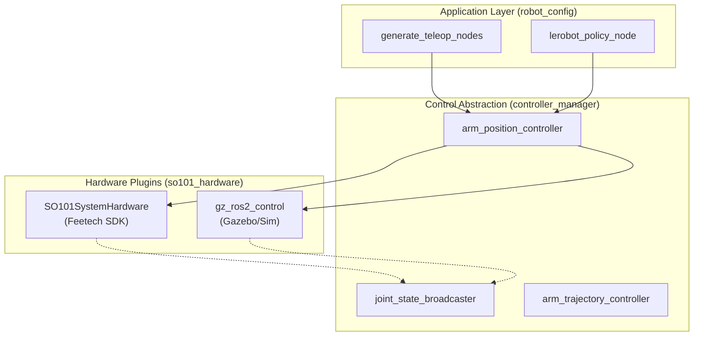
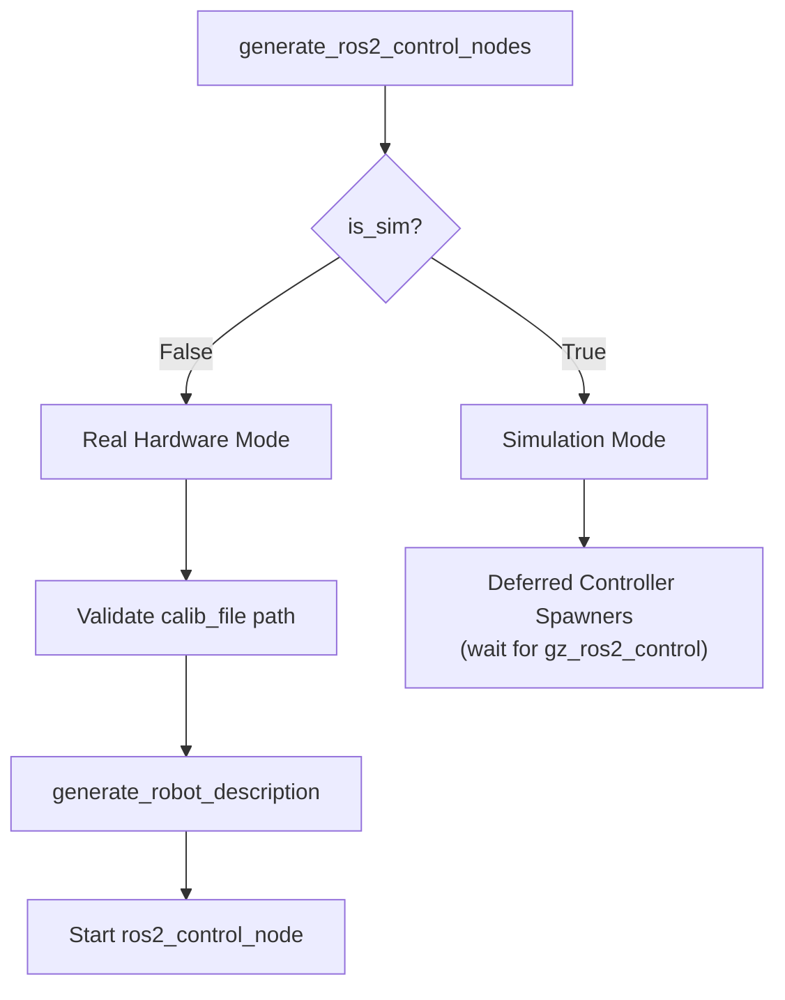
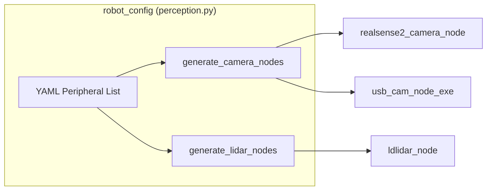

# 硬件集成概述

Relevant source files

The following files were used as context for generating this wiki page:

- [src/robot_config/config/robots/so101_single_arm_rgbd.yaml](https://atomgit.com/openeuler/IB_Robot/blob/master/src/robot_config/config/robots/so101_single_arm_rgbd.yaml)
- [src/robot_config/launch/robot.launch.py](https://atomgit.com/openeuler/IB_Robot/blob/master/src/robot_config/launch/robot.launch.py)
- [src/robot_config/robot_config/launch_builders/control.py](https://atomgit.com/openeuler/IB_Robot/blob/master/src/robot_config/robot_config/launch_builders/control.py)
- [src/robot_config/robot_config/launch_builders/description.py](https://atomgit.com/openeuler/IB_Robot/blob/master/src/robot_config/robot_config/launch_builders/description.py)
- [src/robot_config/robot_config/launch_builders/perception.py](https://atomgit.com/openeuler/IB_Robot/blob/master/src/robot_config/robot_config/launch_builders/perception.py)
- [src/robot_config/robot_config/launch_builders/sim_backend/camera_presets.py](https://atomgit.com/openeuler/IB_Robot/blob/master/src/robot_config/robot_config/launch_builders/sim_backend/camera_presets.py)
- [src/robot_config/robot_config/launch_builders/sim_backend/mujoco_adapter.py](https://atomgit.com/openeuler/IB_Robot/blob/master/src/robot_config/robot_config/launch_builders/sim_backend/mujoco_adapter.py)
- [src/robot_description/urdf/lerobot/so101/so101_gazebo.xacro](https://atomgit.com/openeuler/IB_Robot/blob/master/src/robot_description/urdf/lerobot/so101/so101_gazebo.xacro)
- [src/so101_hardware/CMakeLists.txt](https://atomgit.com/openeuler/IB_Robot/blob/master/src/so101_hardware/CMakeLists.txt)
- [src/so101_hardware/docs/tools/arm_calibration_transfer.md](https://atomgit.com/openeuler/IB_Robot/blob/master/src/so101_hardware/docs/tools/arm_calibration_transfer.md)
- [src/so101_hardware/scripts/arm_calibration_transfer.py](https://atomgit.com/openeuler/IB_Robot/blob/master/src/so101_hardware/scripts/arm_calibration_transfer.py)
- [src/so101_hardware/so101_hardware/calibration/transfer.py](https://atomgit.com/openeuler/IB_Robot/blob/master/src/so101_hardware/so101_hardware/calibration/transfer.py)
- [src/so101_hardware/so101_hardware/calibration/validation.py](https://atomgit.com/openeuler/IB_Robot/blob/master/src/so101_hardware/so101_hardware/calibration/validation.py)
- [src/so101_hardware/test/test_transfer.py](https://atomgit.com/openeuler/IB_Robot/blob/master/src/so101_hardware/test/test_transfer.py)

## 目的与范围

本文说明 IB-Robot 的硬件抽象层。该层让相同的高层控制逻辑可以同时用于真实机器人和仿真环境。系统以 `ros2_control` 作为抽象边界，下层是硬件专用插件，上层是与控制模式无关的控制器。

详情见：
- [ros2_control 配置](./ros2_control_configuration.md) — 硬件插件配置和关节定义。
- [硬件插件](./hardware_plugins.md) — 面向 Feetech SDK 和 Gazebo 集成的 `so101_hardware` 插件。
- [仿真后端](./simulation_backends.md) — Gazebo 和 MuJoCo 仿真适配器。
- [LeKiwi 移动机械臂](./lekiwi_mobile_manipulator.md) — 6-DOF 全向移动平台的专用配置。
- [导航栈 (robot_navigation)](./navigation_stack.md) — 导航和 SLAM 集成。

---

## ros2_control 架构

IB-Robot 使用标准 ROS 2 Control 框架，将控制逻辑与硬件驱动清晰分离。`robot_config` 包会根据 YAML 配置动态生成所需节点。

### 系统数据流

下图把高层控制模式连接到底层 `ros2_control` 实体。

来源: [src/robot_config/robot_config/launch_builders/control.py:26-63](https://atomgit.com/openeuler/IB_Robot/blob/master/src/robot_config/robot_config/launch_builders/control.py#L26-L63), [src/robot_config/robot_config/launch_builders/teleop.py:184-188](https://atomgit.com/openeuler/IB_Robot/blob/master/src/robot_config/robot_config/launch_builders/teleop.py#L184-L188), [src/so101_hardware/CMakeLists.txt:16-28](https://atomgit.com/openeuler/IB_Robot/blob/master/src/so101_hardware/CMakeLists.txt#L16-L28)

---

## 硬件插件系统

`ros2_control` 硬件接口由插件实现，这些插件与真实硬件或仿真环境通信。启动系统中的 `use_sim` 参数决定选用哪类插件。

### 插件选择逻辑

`control.py` 中的 `generate_ros2_control_nodes` 函数负责初始化真实硬件或仿真后端。真实硬件模式下，它会先检查 `calib_file`。

来源: [src/robot_config/robot_config/launch_builders/control.py:66-115](https://atomgit.com/openeuler/IB_Robot/blob/master/src/robot_config/robot_config/launch_builders/control.py#L66-L115), [src/robot_config/robot_config/launch_builders/description.py:164-180](https://atomgit.com/openeuler/IB_Robot/blob/master/src/robot_config/robot_config/launch_builders/description.py#L164-L180)

### SO101SystemHardware（真实硬件）
实体 SO-101 机器人由 `SO101SystemHardware` 插件控制，该插件使用 Feetech Servo SDK。它需要串口 `port` 和 `calib_file`（JSON），用于把原始编码器单位映射到机器人关节角。在 `on_activate` 期间，插件会对所有配置的 `motor_ids_` 执行 `Ping` 检查，以确认连通性。

| 参数 | 作用 | 来源 |
| :--- | :--- | :--- |
| `port` | 串口设备路径，例如 `/dev/ttyACM0` | [src/so101_hardware/src/so101_system_hardware.cpp:18](https://atomgit.com/openeuler/IB_Robot/blob/master/src/so101_hardware/src/so101_system_hardware.cpp#L18) |
| `calib_file` | 回零偏移和限位文件路径 | [src/so101_hardware/src/so101_system_hardware.cpp:19](https://atomgit.com/openeuler/IB_Robot/blob/master/src/so101_hardware/src/so101_system_hardware.cpp#L19) |
| `reset_positions` | 启动默认关节角 | [src/so101_hardware/src/so101_system_hardware.cpp:20](https://atomgit.com/openeuler/IB_Robot/blob/master/src/so101_hardware/src/so101_system_hardware.cpp#L20) |

来源: [src/so101_hardware/src/so101_system_hardware.cpp:106-137](https://atomgit.com/openeuler/IB_Robot/blob/master/src/so101_hardware/src/so101_system_hardware.cpp#L106-L137), [src/robot_config/config/robots/so101_single_arm_rgbd.yaml:107-110](https://atomgit.com/openeuler/IB_Robot/blob/master/src/robot_config/config/robots/so101_single_arm_rgbd.yaml#L107-L110)

---

## 仿真后端

IB-Robot 支持多种仿真后端，便于在没有实体硬件时开发。

### Gazebo 和 MuJoCo 集成
`description.py` 模块处理 URDF 生成，并动态注入仿真专用标签。对于 MuJoCo，`_inject_mujoco_camera_sensors` 会直接把 `<sensor>` 块插入 `ros2_control` URDF 元素，确保 YAML 中的 `optical_frame_id` 是仿真的单一事实源。

| 后端 | 硬件插件 | 说明 |
| :--- | :--- | :--- |
| **Gazebo** | `gz_ros2_control/GazeboSimSystem` | 使用 Ignition/Gazebo Sim 的高保真物理。 |
| **MuJoCo** | `mujoco_ros2_control/MujocoSystem` | 面向强化学习和快速接触动力学优化。 |

来源: [src/robot_config/robot_config/launch_builders/description.py:113-161](https://atomgit.com/openeuler/IB_Robot/blob/master/src/robot_config/robot_config/launch_builders/description.py#L113-L161), [src/robot_config/robot_config/launch_builders/control.py:75-79](https://atomgit.com/openeuler/IB_Robot/blob/master/src/robot_config/robot_config/launch_builders/control.py#L75-L79)

---

## 标定与工具

真实硬件需要精确标定。`so101_hardware` 包提供多种工具来管理这些参数。

*   **`calibrate_arm`**: 用于生成 `calib_file` 的交互式脚本。
*   **`arm_calibration_transfer`**: 将旧版 SO-101 标定数据迁移到当前 schema 的 Python 脚本。它读取模板标定文件和旧文件，再根据旧数据中的 `homing_offset` 和 `drive_mode` 计算新的 `range_min` 与 `range_max`，最后写入新的 JSON 文件。[src/so101_hardware/scripts/arm_calibration_transfer.py:1-65](https://atomgit.com/openeuler/IB_Robot/blob/master/src/so101_hardware/scripts/arm_calibration_transfer.py#L1-L65)
*   **`SO101SystemHardware::on_configure`**: 读取标定 JSON，填充 `homing_offsets_`、`range_mins_` 和 `range_maxes_`。

`so101_hardware.calibration.transfer` 模块包含迁移标定数据的核心逻辑，包括 `compute_migrated_limits`，该函数使用特定公式调整关节限位。[src/so101_hardware/so101_hardware/calibration/transfer.py:38-62](https://atomgit.com/openeuler/IB_Robot/blob/master/src/so101_hardware/so101_hardware/calibration/transfer.py#L38-L62)
`so101_hardware.calibration.validation` 模块提供 `collect_validation_errors`，用于检查标定数据完整性，包括缺失字段、重复电机 ID 和有效范围。[src/so101_hardware/so101_hardware/calibration/validation.py:18-59](https://atomgit.com/openeuler/IB_Robot/blob/master/src/so101_hardware/so101_hardware/calibration/validation.py#L18-L59)

来源: [src/so101_hardware/src/so101_system_hardware.cpp:58-83](https://atomgit.com/openeuler/IB_Robot/blob/master/src/so101_hardware/src/so101_system_hardware.cpp#L58-L83), [src/robot_config/robot_config/launch_builders/control.py:106-110](https://atomgit.com/openeuler/IB_Robot/blob/master/src/robot_config/robot_config/launch_builders/control.py#L106-L110)

---

## 外设集成

硬件集成不仅包括关节，还包括相机和 LiDAR。`perception.py` 构建器会根据机器人配置中的 `peripherals` 列表生成驱动节点，例如 `usb_cam`、`camera_ros`、`realsense2_camera`、`ldlidar`。

来源: [src/robot_config/robot_config/launch_builders/perception.py:18-52](https://atomgit.com/openeuler/IB_Robot/blob/master/src/robot_config/robot_config/launch_builders/perception.py#L18-L52), [src/robot_config/robot_config/launch_builders/perception.py:167-185](https://atomgit.com/openeuler/IB_Robot/blob/master/src/robot_config/robot_config/launch_builders/perception.py#L167-L185), [src/robot_config/config/robots/so101_single_arm_rgbd.yaml:131-154](https://atomgit.com/openeuler/IB_Robot/blob/master/src/robot_config/config/robots/so101_single_arm_rgbd.yaml#L131-L154)

