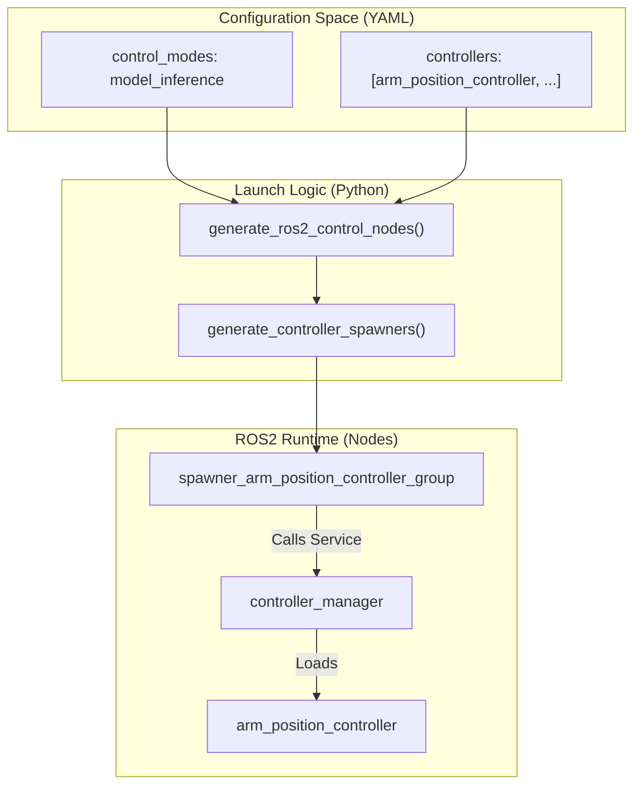
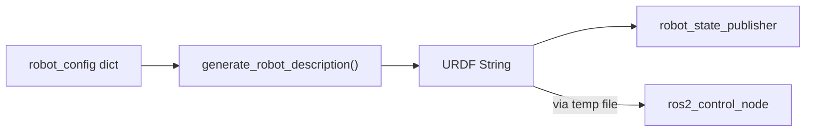

# ros2_control 配置

<details>
<summary>Relevant source files</summary>

The following files were used as context for generating this wiki page:

- [scripts/cleanup_ros.sh](https://atomgit.com/openeuler/IB_Robot/blob/master/scripts/cleanup_ros.sh)
- [src/robot_config/config/robots/so101_single_arm_rgbd.yaml](https://atomgit.com/openeuler/IB_Robot/blob/master/src/robot_config/config/robots/so101_single_arm_rgbd.yaml)
- [src/robot_config/launch/robot.launch.py](https://atomgit.com/openeuler/IB_Robot/blob/master/src/robot_config/launch/robot.launch.py)
- [src/robot_config/robot_config/launch_builders/control.py](https://atomgit.com/openeuler/IB_Robot/blob/master/src/robot_config/robot_config/launch_builders/control.py)
- [src/robot_config/robot_config/launch_builders/description.py](https://atomgit.com/openeuler/IB_Robot/blob/master/src/robot_config/robot_config/launch_builders/description.py)
- [src/robot_config/robot_config/launch_builders/perception.py](https://atomgit.com/openeuler/IB_Robot/blob/master/src/robot_config/robot_config/launch_builders/perception.py)
- [src/robot_config/robot_config/launch_builders/sim_backend/camera_presets.py](https://atomgit.com/openeuler/IB_Robot/blob/master/src/robot_config/robot_config/launch_builders/sim_backend/camera_presets.py)
- [src/robot_config/robot_config/launch_builders/sim_backend/mujoco_adapter.py](https://atomgit.com/openeuler/IB_Robot/blob/master/src/robot_config/robot_config/launch_builders/sim_backend/mujoco_adapter.py)
- [src/robot_description/CMakeLists.txt](https://atomgit.com/openeuler/IB_Robot/blob/master/src/robot_description/CMakeLists.txt)
- [src/robot_description/urdf/lerobot/so101/so101_gazebo.xacro](https://atomgit.com/openeuler/IB_Robot/blob/master/src/robot_description/urdf/lerobot/so101/so101_gazebo.xacro)
- [src/robot_description/urdf/lerobot/so101/so101_ros2_control.xacro](https://atomgit.com/openeuler/IB_Robot/blob/master/src/robot_description/urdf/lerobot/so101/so101_ros2_control.xacro)

</details>


本文说明 `robot_config` YAML 文件中的 ros2_control 配置系统。它解释如何指定硬件插件、控制器和关节定义，从而在真实机器人与仿真之间提供硬件抽象。

关于整体配置系统架构，见 **Configuration System (robot_config)**。关于硬件插件实现细节，见 **Hardware Plugins**。关于控制模式选择和执行器集成，见 **Control Mode Architecture**。

---

## 目的与范围

robot_config YAML 文件中的 `ros2_control` 段，是 IB-Robot 系统与 `ros2_control` 硬件抽象框架之间的配置桥梁。该配置是硬件接口参数的 **Single Source of Truth**，避免在启动文件、URDF 文件和控制器配置之间重复定义。

主要职责包括：
- **硬件插件选择**: 指定要加载的硬件接口插件，例如 `so101_hardware/SO101SystemHardware`。[src/robot_config/config/robots/so101_single_arm_rgbd.yaml:108](https://atomgit.com/openeuler/IB_Robot/blob/master/src/robot_config/config/robots/so101_single_arm_rgbd.yaml#L108)
- **硬件参数**: 连接端口、标定文件和关节名称。[src/robot_config/config/robots/so101_single_arm_rgbd.yaml:109-111](https://atomgit.com/openeuler/IB_Robot/blob/master/src/robot_config/config/robots/so101_single_arm_rgbd.yaml#L109-L111)
- **控制器配置**: 链接定义控制器类型和参数的 YAML 文件。[src/robot_config/config/robots/so101_single_arm_rgbd.yaml:122](https://atomgit.com/openeuler/IB_Robot/blob/master/src/robot_config/config/robots/so101_single_arm_rgbd.yaml#L122)
- **URDF 集成**: 指定用于运动学和状态发布的机器人 URDF/Xacro 描述。[src/robot_config/config/robots/so101_single_arm_rgbd.yaml:119](https://atomgit.com/openeuler/IB_Robot/blob/master/src/robot_config/config/robots/so101_single_arm_rgbd.yaml#L119)

**来源**: [src/robot_config/config/robots/so101_single_arm_rgbd.yaml:107-129](https://atomgit.com/openeuler/IB_Robot/blob/master/src/robot_config/config/robots/so101_single_arm_rgbd.yaml#L107-L129), [src/robot_config/robot_config/launch_builders/control.py:85-91](https://atomgit.com/openeuler/IB_Robot/blob/master/src/robot_config/robot_config/launch_builders/control.py#L85-L91)

---

## 配置结构

配置位于 `robot.ros2_control` 段。下面是 SO-101 机械臂变体使用的结构：

```yaml
# Example from so101_single_arm_rgbd.yaml
ros2_control:
  hardware_plugin: so101_hardware/SO101SystemHardware
  port: /dev/ttyACM2
  calib_file: $(env HOME)/.calibrate/so101_follower_calibrate.json
  joint_names: ["1", "2", "3", "4", "5", "6"]
  reset_positions:
    "1": 0.0
    "2": 0.0
    "3": 0.0
  urdf_path: $(find robot_description)/urdf/lerobot/so101/so101.urdf.xacro
  controllers_config: $(find so101_hardware)/config/so101_controllers.yaml
  controllers:
    - joint_state_broadcaster
    - arm_controller
    - gripper_controller
```

**来源**: [src/robot_config/config/robots/so101_single_arm_rgbd.yaml:107-129](https://atomgit.com/openeuler/IB_Robot/blob/master/src/robot_config/config/robots/so101_single_arm_rgbd.yaml#L107-L129)

---

## 硬件插件配置

### 插件指定

`hardware_plugin` 字段使用 ROS2 包资源命名：`<package_name>/<PluginClassName>`。该插件必须实现 `hardware_interface::SystemInterface`。`so101_hardware` 包中的 `SO101SystemHardware` 类是 Feetech 舵机的主要实现。[src/robot_config/config/robots/so101_single_arm_rgbd.yaml:108](https://atomgit.com/openeuler/IB_Robot/blob/master/src/robot_config/config/robots/so101_single_arm_rgbd.yaml#L108)

| 字段 | 类型 | 说明 |
|-------|------|-------------|
| `hardware_plugin` | string | 完整限定插件类名。[src/robot_config/config/robots/so101_single_arm_rgbd.yaml:108](https://atomgit.com/openeuler/IB_Robot/blob/master/src/robot_config/config/robots/so101_single_arm_rgbd.yaml#L108) |
| `port` | string | 硬件通信串口。[src/robot_config/config/robots/so101_single_arm_rgbd.yaml:109](https://atomgit.com/openeuler/IB_Robot/blob/master/src/robot_config/config/robots/so101_single_arm_rgbd.yaml#L109) |
| `calib_file` | string | 关节标定 JSON 路径。[src/robot_config/config/robots/so101_single_arm_rgbd.yaml:110](https://atomgit.com/openeuler/IB_Robot/blob/master/src/robot_config/config/robots/so101_single_arm_rgbd.yaml#L110) |
| `joint_names` | list | URDF 中定义的关节 ID/名称。[src/robot_config/config/robots/so101_single_arm_rgbd.yaml:111](https://atomgit.com/openeuler/IB_Robot/blob/master/src/robot_config/config/robots/so101_single_arm_rgbd.yaml#L111) |
| `urdf_path` | string | Xacro/URDF 文件路径。[src/robot_config/config/robots/so101_single_arm_rgbd.yaml:119](https://atomgit.com/openeuler/IB_Robot/blob/master/src/robot_config/config/robots/so101_single_arm_rgbd.yaml#L119) |

### 路径解析

路径支持通过 `resolve_ros_path()` 动态解析：
- `$(find <pkg>)`: 解析为包 share 目录。[src/robot_config/robot_config/launch_builders/control.py:163](https://atomgit.com/openeuler/IB_Robot/blob/master/src/robot_config/robot_config/launch_builders/control.py#L163)
- `$(env <VAR>)`: 解析环境变量，例如 `$HOME`。[src/robot_config/robot_config/launch_builders/control.py:103](https://atomgit.com/openeuler/IB_Robot/blob/master/src/robot_config/robot_config/launch_builders/control.py#L103)

**来源**: [src/robot_config/robot_config/launch_builders/control.py:94-114](https://atomgit.com/openeuler/IB_Robot/blob/master/src/robot_config/robot_config/launch_builders/control.py#L94-L114), [src/robot_config/config/robots/so101_single_arm_rgbd.yaml:107-129](https://atomgit.com/openeuler/IB_Robot/blob/master/src/robot_config/config/robots/so101_single_arm_rgbd.yaml#L107-L129)

---

## 控制器配置

### 控制器配置文件

`controllers_config` 字段指定包含 `controller_manager` 参数定义的 YAML 文件。该文件定义可用控制器类型，例如 `joint_state_broadcaster` 或 `arm_controller`。[src/robot_config/config/robots/so101_single_arm_rgbd.yaml:122-127](https://atomgit.com/openeuler/IB_Robot/blob/master/src/robot_config/config/robots/so101_single_arm_rgbd.yaml#L122-L127)

**来源**: [src/robot_config/config/robots/so101_single_arm_rgbd.yaml:122](https://atomgit.com/openeuler/IB_Robot/blob/master/src/robot_config/config/robots/so101_single_arm_rgbd.yaml#L122), [src/robot_config/robot_config/launch_builders/control.py:163](https://atomgit.com/openeuler/IB_Robot/blob/master/src/robot_config/robot_config/launch_builders/control.py#L163)

### 按控制模式选择控制器

系统使用 `control_modes` 决定要激活哪些控制器。`generate_ros2_control_nodes` 函数解析这些模式，根据系统处于仿真还是硬件模式选择对应控制器列表。[src/robot_config/robot_config/launch_builders/control.py:134-161](https://atomgit.com/openeuler/IB_Robot/blob/master/src/robot_config/robot_config/launch_builders/control.py#L134-L161)

#### 数据流：模式到控制器 spawner

下图展示机器人 YAML 中定义的 `control_mode` 如何映射到具体代码实体和 ROS2 节点。

Title: Control Mode to Code Entity Mapping

**来源**: [src/robot_config/robot_config/launch_builders/control.py:26-63](https://atomgit.com/openeuler/IB_Robot/blob/master/src/robot_config/robot_config/launch_builders/control.py#L26-L63), [src/robot_config/robot_config/launch_builders/control.py:134-161](https://atomgit.com/openeuler/IB_Robot/blob/master/src/robot_config/robot_config/launch_builders/control.py#L134-L161), [src/robot_config/config/robots/so101_single_arm_rgbd.yaml:76-92](https://atomgit.com/openeuler/IB_Robot/blob/master/src/robot_config/config/robots/so101_single_arm_rgbd.yaml#L76-L92)

---

## 配置加载流程

`control.py` 中的 `generate_ros2_control_nodes` 函数处理配置。

### 实现细节
1. **验证**: 调用 `validate_joint_config`，确保配置文件中的关节一致性。[src/robot_config/robot_config/launch_builders/control.py:117](https://atomgit.com/openeuler/IB_Robot/blob/master/src/robot_config/robot_config/launch_builders/control.py#L117)
2. **URDF 生成**: 调用 `generate_robot_description` 处理 Xacro，并从 `peripherals` 列表注入相机 links/joints。[src/robot_config/robot_config/launch_builders/control.py:120-124](https://atomgit.com/openeuler/IB_Robot/blob/master/src/robot_config/robot_config/launch_builders/control.py#L120-L124), [src/robot_config/robot_config/launch_builders/description.py:165-170](https://atomgit.com/openeuler/IB_Robot/blob/master/src/robot_config/robot_config/launch_builders/description.py#L165-L170)
3. **控制器选择**: 检查 `is_sim`，决定为当前模式加载 `sim_controllers`、`hardware_controllers` 或默认 `controllers` 列表。[src/robot_config/robot_config/launch_builders/control.py:148-153](https://atomgit.com/openeuler/IB_Robot/blob/master/src/robot_config/robot_config/launch_builders/control.py#L148-L153)
4. **参数注入**: 真实硬件模式下，把 `robot_description` 写入临时 YAML 文件，绕过启动期间的 `controller_manager` 命名空间问题。[src/robot_config/robot_config/launch_builders/control.py:179-184](https://atomgit.com/openeuler/IB_Robot/blob/master/src/robot_config/robot_config/launch_builders/control.py#L179-L184)

Title: Launch Builder Data Flow

**来源**: [src/robot_config/robot_config/launch_builders/control.py:119-132](https://atomgit.com/openeuler/IB_Robot/blob/master/src/robot_config/robot_config/launch_builders/control.py#L119-L132), [src/robot_config/robot_config/launch_builders/control.py:179-184](https://atomgit.com/openeuler/IB_Robot/blob/master/src/robot_config/robot_config/launch_builders/control.py#L179-L184)

---

## 与启动系统集成

`robot.launch.py` 使用这些构建器实例化控制栈。

### 硬件与仿真选择
`use_sim` 标志会显著改变行为：
- **真实硬件**: 直接使用 YAML 中的参数（端口、标定）启动 `ros2_control_node`。[src/robot_config/robot_config/launch_builders/control.py:165-184](https://atomgit.com/openeuler/IB_Robot/blob/master/src/robot_config/robot_config/launch_builders/control.py#L165-L184)
- **仿真**: 在 Gazebo 仿真中，控制器 spawner 通常返回到 `deferred_sim_spawners`，以便在仿真环境完全初始化后启动。[src/robot_config/robot_config/launch_builders/control.py:76-78](https://atomgit.com/openeuler/IB_Robot/blob/master/src/robot_config/robot_config/launch_builders/control.py#L76-L78)
  - 对 MuJoCo 仿真，`mujoco_ros2_control` 包内嵌 `controller_manager` 并直接处理仿真。`MujocoAdapter` 确保 `ros2_control_node` 使用正确参数启动，包括 MuJoCo 模型路径和相机重映射。[src/robot_config/robot_config/launch_builders/sim_backend/mujoco_adapter.py:105-114](https://atomgit.com/openeuler/IB_Robot/blob/master/src/robot_config/robot_config/launch_builders/sim_backend/mujoco_adapter.py#L105-L114)
  - `so101_ros2_control.xacro` 文件使用 `xacro:if` 条件根据 `use_sim` 参数选择硬件插件。若 `use_sim` 为 true，则使用 `sim_plugin` 参数，默认是 `gz_ros2_control/GazeboSimSystem`；否则使用 `so101_hardware/SO101SystemHardware`。[src/robot_description/urdf/lerobot/so101/so101_ros2_control.xacro:14-29](https://atomgit.com/openeuler/IB_Robot/blob/master/src/robot_description/urdf/lerobot/so101/so101_ros2_control.xacro#L14-L29)

### 控制器启动
控制器使用 `controller_manager` 中的 `spawner` 可执行文件按组启动。`generate_controller_spawners` 函数配置超时和激活组（使用 `--activate-as-group`）。[src/robot_config/robot_config/launch_builders/control.py:26-63](https://atomgit.com/openeuler/IB_Robot/blob/master/src/robot_config/robot_config/launch_builders/control.py#L26-L63)

**来源**: [src/robot_config/robot_config/launch_builders/control.py:42-61](https://atomgit.com/openeuler/IB_Robot/blob/master/src/robot_config/robot_config/launch_builders/control.py#L42-L61), [src/robot_config/config/robots/so101_single_arm_rgbd.yaml:55-57](https://atomgit.com/openeuler/IB_Robot/blob/master/src/robot_config/config/robots/so101_single_arm_rgbd.yaml#L55-L57), [src/robot_config/robot_config/launch_builders/sim_backend/mujoco_adapter.py:105-114](https://atomgit.com/openeuler/IB_Robot/blob/master/src/robot_config/robot_config/launch_builders/sim_backend/mujoco_adapter.py#L105-L114), [src/robot_description/urdf/lerobot/so101/so101_ros2_control.xacro:14-29](https://atomgit.com/openeuler/IB_Robot/blob/master/src/robot_description/urdf/lerobot/so101/so101_ros2_control.xacro#L14-L29)

---

## 配置验证

系统会对硬件专用需求执行启动前检查。

### 标定检查
真实硬件模式下，如果定义了 `calib_file`，启动构建器会验证它是否存在于文件系统中。若缺失，它会抛出 `RuntimeError` 并给出需要运行的精确 `ros2 run so101_hardware calibrate_arm` 命令。[src/robot_config/robot_config/launch_builders/control.py:94-114](https://atomgit.com/openeuler/IB_Robot/blob/master/src/robot_config/robot_config/launch_builders/control.py#L94-L114)

### 关节一致性
`validate_joint_config` 工具确保 `joints` 段中定义的关节名称满足控制器和硬件接口要求。[src/robot_config/robot_config/launch_builders/control.py:117](https://atomgit.com/openeuler/IB_Robot/blob/master/src/robot_config/robot_config/launch_builders/control.py#L117)

**来源**: [src/robot_config/robot_config/launch_builders/control.py:94-118](https://atomgit.com/openeuler/IB_Robot/blob/master/src/robot_config/robot_config/launch_builders/control.py#L94-L118), [src/robot_config/config/robots/so101_single_arm_rgbd.yaml:110-111](https://atomgit.com/openeuler/IB_Robot/blob/master/src/robot_config/config/robots/so101_single_arm_rgbd.yaml#L110-L111)

