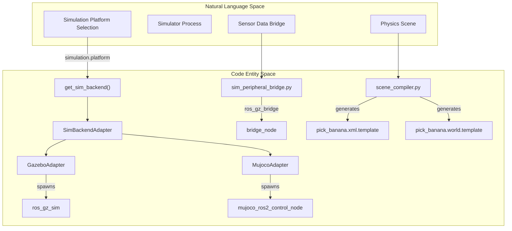
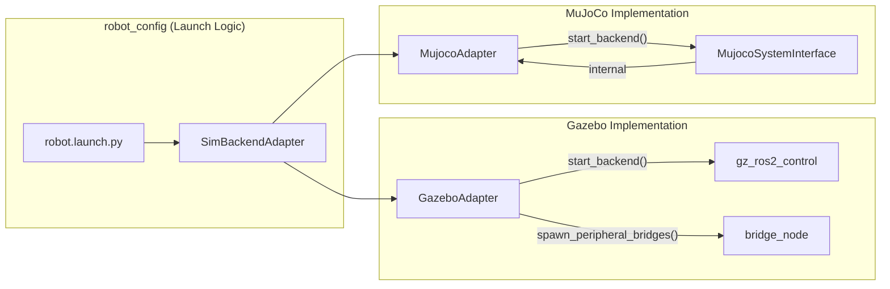
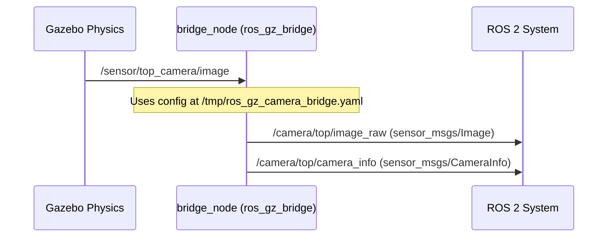
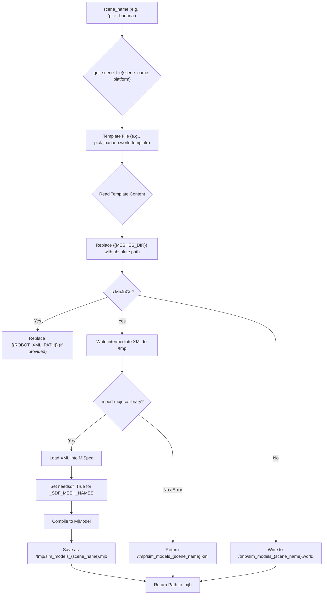

# 仿真后端

Relevant source files

The following files were used as context for generating this wiki page:

- [scripts/openharmony/build_ibrobot_oh_custom.sh](https://atomgit.com/openeuler/IB_Robot/blob/master/scripts/openharmony/build_ibrobot_oh_custom.sh)
- [src/action_dispatch/action_dispatch/topic_executor.py](https://atomgit.com/openeuler/IB_Robot/blob/master/src/action_dispatch/action_dispatch/topic_executor.py)
- [src/inference_service/inference_service/core/rknn/__init__.py](https://atomgit.com/openeuler/IB_Robot/blob/master/src/inference_service/inference_service/core/rknn/__init__.py)
- [src/inference_service/setup.py](https://atomgit.com/openeuler/IB_Robot/blob/master/src/inference_service/setup.py)
- [src/robot_config/robot_config/launch_builders/sim_backend/base_adapter.py](https://atomgit.com/openeuler/IB_Robot/blob/master/src/robot_config/robot_config/launch_builders/sim_backend/base_adapter.py)
- [src/robot_config/robot_config/launch_builders/sim_backend/gazebo_adapter.py](https://atomgit.com/openeuler/IB_Robot/blob/master/src/robot_config/robot_config/launch_builders/sim_backend/gazebo_adapter.py)
- [src/robot_config/robot_config/launch_builders/sim_peripheral_bridge.py](https://atomgit.com/openeuler/IB_Robot/blob/master/src/robot_config/robot_config/launch_builders/sim_peripheral_bridge.py)
- [src/robot_config/robot_config/launch_builders/simulation.py](https://atomgit.com/openeuler/IB_Robot/blob/master/src/robot_config/robot_config/launch_builders/simulation.py)
- [src/robot_config/test/test_sim_backend.py](https://atomgit.com/openeuler/IB_Robot/blob/master/src/robot_config/test/test_sim_backend.py)
- [src/robot_description/mujoco/so101.xml.template](https://atomgit.com/openeuler/IB_Robot/blob/master/src/robot_description/mujoco/so101.xml.template)
- [src/robot_description/urdf/lerobot/so101/so101_cameras.xacro](https://atomgit.com/openeuler/IB_Robot/blob/master/src/robot_description/urdf/lerobot/so101/so101_cameras.xacro)
- [src/sim_models/package.xml](https://atomgit.com/openeuler/IB_Robot/blob/master/src/sim_models/package.xml)
- [src/sim_models/resource/sim_models](https://atomgit.com/openeuler/IB_Robot/blob/master/src/sim_models/resource/sim_models)
- [src/sim_models/scenes/empty/empty.world.template](https://atomgit.com/openeuler/IB_Robot/blob/master/src/sim_models/scenes/empty/empty.world.template)
- [src/sim_models/scenes/empty/empty.xml.template](https://atomgit.com/openeuler/IB_Robot/blob/master/src/sim_models/scenes/empty/empty.xml.template)
- [src/sim_models/scenes/pick_banana/layout.yaml](https://atomgit.com/openeuler/IB_Robot/blob/master/src/sim_models/scenes/pick_banana/layout.yaml)
- [src/sim_models/scenes/pick_banana/meshes/banana.obj](https://atomgit.com/openeuler/IB_Robot/blob/master/src/sim_models/scenes/pick_banana/meshes/banana.obj)
- [src/sim_models/scenes/pick_banana/meshes/banana_col_0.stl](https://atomgit.com/openeuler/IB_Robot/blob/master/src/sim_models/scenes/pick_banana/meshes/banana_col_0.stl)
- [src/sim_models/scenes/pick_banana/meshes/banana_col_1.stl](https://atomgit.com/openeuler/IB_Robot/blob/master/src/sim_models/scenes/pick_banana/meshes/banana_col_1.stl)
- [src/sim_models/scenes/pick_banana/meshes/banana_col_2.stl](https://atomgit.com/openeuler/IB_Robot/blob/master/src/sim_models/scenes/pick_banana/meshes/banana_col_2.stl)
- [src/sim_models/scenes/pick_banana/meshes/banana_g.obj](https://atomgit.com/openeuler/IB_Robot/blob/master/src/sim_models/scenes/pick_banana/meshes/banana_g.obj)
- [src/sim_models/scenes/pick_banana/meshes/banana_mj.obj](https://atomgit.com/openeuler/IB_Robot/blob/master/src/sim_models/scenes/pick_banana/meshes/banana_mj.obj)
- [src/sim_models/scenes/pick_banana/meshes/bluetable.obj](https://atomgit.com/openeuler/IB_Robot/blob/master/src/sim_models/scenes/pick_banana/meshes/bluetable.obj)
- [src/sim_models/scenes/pick_banana/meshes/greencurten.obj](https://atomgit.com/openeuler/IB_Robot/blob/master/src/sim_models/scenes/pick_banana/meshes/greencurten.obj)
- [src/sim_models/scenes/pick_banana/pick_banana.world.template](https://atomgit.com/openeuler/IB_Robot/blob/master/src/sim_models/scenes/pick_banana/pick_banana.world.template)
- [src/sim_models/scenes/pick_banana/pick_banana.xml.template](https://atomgit.com/openeuler/IB_Robot/blob/master/src/sim_models/scenes/pick_banana/pick_banana.xml.template)
- [src/sim_models/setup.py](https://atomgit.com/openeuler/IB_Robot/blob/master/src/sim_models/setup.py)
- [src/sim_models/sim_models/scene_compiler.py](https://atomgit.com/openeuler/IB_Robot/blob/master/src/sim_models/sim_models/scene_compiler.py)

IB-Robot 框架提供统一的仿真抽象层，支持 **Gazebo Ignition** 和 **MuJoCo**。该架构允许相同的机器人配置和高层控制代码运行在不同物理引擎上，既支持接触丰富的操作任务（MuJoCo），也支持大规模环境导航（Gazebo）。

## 仿真架构

仿真系统围绕 `SimBackendAdapter` 抽象基类构建 [src/robot_config/robot_config/launch_builders/sim_backend/base_adapter.py:22-27](https://atomgit.com/openeuler/IB_Robot/blob/master/src/robot_config/robot_config/launch_builders/sim_backend/base_adapter.py#L22-L27)。该设计模式确保主启动系统（`robot.launch.py`）不依赖具体仿真器。

### 系统实体映射

下列图示把高层仿真概念连接到实现它们的具体代码实体和数据结构。

**Diagram: Simulation Backend Code Mapping**

**Diagram: Data Flow and Adapter Interfaces**

**来源:**
- [src/robot_config/robot_config/launch_builders/sim_backend/base_adapter.py:22-27](https://atomgit.com/openeuler/IB_Robot/blob/master/src/robot_config/robot_config/launch_builders/sim_backend/base_adapter.py#L22-L27)
- [src/robot_config/robot_config/launch_builders/sim_backend/gazebo_adapter.py:44-54](https://atomgit.com/openeuler/IB_Robot/blob/master/src/robot_config/robot_config/launch_builders/sim_backend/gazebo_adapter.py#L44-L54)
- [src/robot_config/robot_config/launch_builders/sim_backend/mujoco_adapter.py:32-33](https://atomgit.com/openeuler/IB_Robot/blob/master/src/robot_config/robot_config/launch_builders/sim_backend/mujoco_adapter.py#L32-L33)
- [src/robot_config/robot_config/launch_builders/sim_peripheral_bridge.py:138-161](https://atomgit.com/openeuler/IB_Robot/blob/master/src/robot_config/robot_config/launch_builders/sim_peripheral_bridge.py#L138-L161)

---

## Gazebo 后端实现

`GazeboAdapter` 管理 Ignition Gazebo（GZ Sim）环境的生命周期。它负责环境变量、world 文件解析和实体生成。

### 关键组件
1.  **环境设置**: 配置 `GZ_SIM_RESOURCE_PATH` 和 `GAZEBO_MODEL_PATH`，加入 `robot_description` 包和 `lekiwi_description`（如果存在），确保 mesh 可发现 [src/robot_config/robot_config/launch_builders/sim_backend/gazebo_adapter.py:68-105](https://atomgit.com/openeuler/IB_Robot/blob/master/src/robot_config/robot_config/launch_builders/sim_backend/gazebo_adapter.py#L68-L105)。
2.  **实体生成**: 使用 `ros_gz_sim` 的 `create` 可执行文件，从 `/robot_description` 话题生成机器人 [src/robot_config/robot_config/launch_builders/sim_backend/gazebo_adapter.py:175-188](https://atomgit.com/openeuler/IB_Robot/blob/master/src/robot_config/robot_config/launch_builders/sim_backend/gazebo_adapter.py#L175-L188)。
3.  **外设桥接**: Gazebo 使用自己的传输层，因此需要 `ros_gz_bridge` 把传感器数据转换为 ROS 2 话题。

### 数据流：Gazebo 传感器桥接
`sim_peripheral_bridge.py` 脚本生成 YAML 配置，将 Gazebo 传感器路径映射到 IB-Robot 命名契约。它专门使用 `parent_frame` 作为 link 名称，因为 Ignition Gazebo 6 会把固定关节子 link 合并到父 link [src/robot_config/robot_config/launch_builders/sim_peripheral_bridge.py:30-37](https://atomgit.com/openeuler/IB_Robot/blob/master/src/robot_config/robot_config/launch_builders/sim_peripheral_bridge.py#L30-L37)。

**Diagram: Gazebo Topic Mapping**

**来源:**
- [src/robot_config/robot_config/launch_builders/sim_peripheral_bridge.py:12-37](https://atomgit.com/openeuler/IB_Robot/blob/master/src/robot_config/robot_config/launch_builders/sim_peripheral_bridge.py#L12-L37)
- [src/robot_config/robot_config/launch_builders/sim_peripheral_bridge.py:45-76](https://atomgit.com/openeuler/IB_Robot/blob/master/src/robot_config/robot_config/launch_builders/sim_peripheral_bridge.py#L45-L76)
- [src/robot_config/robot_config/launch_builders/sim_backend/gazebo_adapter.py:56-65](https://atomgit.com/openeuler/IB_Robot/blob/master/src/robot_config/robot_config/launch_builders/sim_backend/gazebo_adapter.py#L56-L65)

---

## MuJoCo 后端实现

`MujocoAdapter` 使用 `mujoco_ros2_control` 提供高性能仿真环境，特别适合抓取等接触丰富任务。

### 实现细节
-   **单进程**: 与 Gazebo 不同，MuJoCo 通过 `MujocoSystemInterface` 硬件插件运行在 `ros2_control_node` 内 [src/robot_config/robot_config/launch_builders/sim_backend/mujoco_adapter.py:6-10](https://atomgit.com/openeuler/IB_Robot/blob/master/src/robot_config/robot_config/launch_builders/sim_backend/mujoco_adapter.py#L6-L10)。
-   **原生话题发布**: MuJoCo 直接发布 ROS 话题。适配器通过标准 ROS 2 Node 重映射处理相机话题，而不是使用 bridge 节点 [src/robot_config/robot_config/launch_builders/sim_backend/mujoco_adapter.py:12-16](https://atomgit.com/openeuler/IB_Robot/blob/master/src/robot_config/robot_config/launch_builders/sim_backend/mujoco_adapter.py#L12-L16)。
-   **XML 生成**: 适配器通过替换 `so101.xml.template` 中的 `{{MESHES_DIR}}`、`{{ROBOT_BASE_POS}}` 等占位符，并为 OpenCV 外设注入 `<camera>` 元素，动态生成临时 MJCF（`.xml`）文件 [src/robot_description/mujoco/so101.xml.template:1-29](https://atomgit.com/openeuler/IB_Robot/blob/master/src/robot_description/mujoco/so101.xml.template#L1-L29), [src/robot_config/robot_config/launch_builders/sim_backend/mujoco_adapter.py:153-165](https://atomgit.com/openeuler/IB_Robot/blob/master/src/robot_config/robot_config/launch_builders/sim_backend/mujoco_adapter.py#L153-L165)。

### 物理参数调优
MuJoCo 模型针对 "pick-and-place" 任务做了稳定性调优：
-   **Timestep**: 设为 `0.001s`（1ms），保持稳定裕量，使求解器时间常数至少为 timestep 的 10 倍 [src/robot_description/mujoco/so101.xml.template:39-41](https://atomgit.com/openeuler/IB_Robot/blob/master/src/robot_description/mujoco/so101.xml.template#L39-L41)。
-   **Solver**: 使用 `implicitfast`，并设置 `noslip_iterations="20"` 和 `cone="elliptic"`，防止摩擦通道中的微滑移和数值抖动 [src/robot_description/mujoco/so101.xml.template:43-53](https://atomgit.com/openeuler/IB_Robot/blob/master/src/robot_description/mujoco/so101.xml.template#L43-L53)。`noslip_iterations` 从 5 增加到 20，以改善夹爪与香蕉无滑移接触的收敛性 [src/robot_description/mujoco/so101.xml.template:43-48](https://atomgit.com/openeuler/IB_Robot/blob/master/src/robot_description/mujoco/so101.xml.template#L43-L48)。

**来源:**
- [src/robot_config/robot_config/launch_builders/sim_backend/mujoco_adapter.py:35-59](https://atomgit.com/openeuler/IB_Robot/blob/master/src/robot_config/robot_config/launch_builders/sim_backend/mujoco_adapter.py#L35-L59)
- [src/robot_description/mujoco/so101.xml.template:37-55](https://atomgit.com/openeuler/IB_Robot/blob/master/src/robot_description/mujoco/so101.xml.template#L37-L55)
- [src/robot_config/robot_config/launch_builders/sim_backend/mujoco_adapter.py:87-112](https://atomgit.com/openeuler/IB_Robot/blob/master/src/robot_config/robot_config/launch_builders/sim_backend/mujoco_adapter.py#L87-L112)

---

## 场景编译器与资源

`sim_models` 包包含 `scene_compiler`，用于统一两个后端的场景定义。

### 场景结构：`pick_banana`
`pick_banana` 场景是操作任务的主要基准。

| 对象 | 类型 | 质量 | 作用 |
| :--- | :--- | :--- | :--- |
| `bluetable` | `static_mesh` | N/A | 工作台面 [src/sim_models/scenes/pick_banana/layout.yaml:21-28](https://atomgit.com/openeuler/IB_Robot/blob/master/src/sim_models/scenes/pick_banana/layout.yaml#L21-L28) |
| `plate` | `dynamic` | 0.2 kg | 放置目标 [src/sim_models/scenes/pick_banana/layout.yaml:39-47](https://atomgit.com/openeuler/IB_Robot/blob/master/src/sim_models/scenes/pick_banana/layout.yaml#L39-L47) |
| `banana` | `dynamic` | 0.03 kg | 抓取目标 [src/sim_models/scenes/pick_banana/layout.yaml:49-57](https://atomgit.com/openeuler/IB_Robot/blob/master/src/sim_models/scenes/pick_banana/layout.yaml#L49-L57) |

### Scene Compiler（`scene_compiler.py`）
`scene_compiler.py` 模块会从模板动态生成 Gazebo 和 MuJoCo 场景文件。它处理占位符替换，并在 MuJoCo 中为特定 mesh 启用基于 SDF 的非凸碰撞。

**Diagram: Scene Compilation Process**

`_SDF_MESH_NAMES` 常量 [src/sim_models/sim_models/scene_compiler.py:49-54](https://atomgit.com/openeuler/IB_Robot/blob/master/src/sim_models/sim_models/scene_compiler.py#L49-L54) 指定 MuJoCo 中需要基于 SDF 的非凸碰撞的 mesh，例如夹爪手指（`wrist_roll_follower`、`moving_jaw`）。这能为这些复杂几何提供准确的接触物理。

**来源:**
- [src/sim_models/sim_models/scene_compiler.py:1-28](https://atomgit.com/openeuler/IB_Robot/blob/master/src/sim_models/sim_models/scene_compiler.py#L1-L28)
- [src/sim_models/sim_models/scene_compiler.py:49-54](https://atomgit.com/openeuler/IB_Robot/blob/master/src/sim_models/sim_models/scene_compiler.py#L49-L54)
- [src/sim_models/sim_models/scene_compiler.py:105-158](https://atomgit.com/openeuler/IB_Robot/blob/master/src/sim_models/sim_models/scene_compiler.py#L105-L158)

### 物理约束
为保证交互真实，场景模板定义了特定接触参数：
-   **桌面**: 高刚度（`solref="0.004 1"`），防止物体“陷入”桌面 [src/sim_models/scenes/pick_banana/pick_banana.xml.template:81-82](https://atomgit.com/openeuler/IB_Robot/blob/master/src/sim_models/scenes/pick_banana/pick_banana.xml.template#L81-L82)。
-   **香蕉碰撞**: 香蕉使用 4 个 STL 部分做凸分解碰撞 [src/sim_models/scenes/pick_banana/pick_banana.xml.template:48-51](https://atomgit.com/openeuler/IB_Robot/blob/master/src/sim_models/scenes/pick_banana/pick_banana.xml.template#L48-L51)。其摩擦参数设置为 `friction="50.0 1.0 0.05"`，分别对应滑动、扭转和滚动摩擦，并使用比夹爪略软的 `solref="0.006 1"` 缓冲冲击 [src/sim_models/scenes/pick_banana/pick_banana.xml.template:64-68](https://atomgit.com/openeuler/IB_Robot/blob/master/src/sim_models/scenes/pick_banana/pick_banana.xml.template#L64-L68)。
-   **盘子碰撞**: 盘子使用 8 个 STL 部分做凸分解碰撞 [src/sim_models/scenes/pick_banana/pick_banana.xml.template:37-44](https://atomgit.com/openeuler/IB_Robot/blob/master/src/sim_models/scenes/pick_banana/pick_banana.xml.template#L37-L44)。它带有 `free` joint 和 `damping="0.01"`，允许移动并衰减振荡 [src/sim_models/scenes/pick_banana/pick_banana.xml.template:102](https://atomgit.com/openeuler/IB_Robot/blob/master/src/sim_models/scenes/pick_banana/pick_banana.xml.template#L102)。

**来源:**
- [src/sim_models/scenes/pick_banana/layout.yaml:1-58](https://atomgit.com/openeuler/IB_Robot/blob/master/src/sim_models/scenes/pick_banana/layout.yaml#L1-L58)
- [src/sim_models/scenes/pick_banana/pick_banana.xml.template:81-82](https://atomgit.com/openeuler/IB_Robot/blob/master/src/sim_models/scenes/pick_banana/pick_banana.xml.template#L81-L82)
- [src/sim_models/scenes/pick_banana/pick_banana.xml.template:48-51](https://atomgit.com/openeuler/IB_Robot/blob/master/src/sim_models/scenes/pick_banana/pick_banana.xml.template#L48-L51)
- [src/sim_models/scenes/pick_banana/pick_banana.xml.template:64-68](https://atomgit.com/openeuler/IB_Robot/blob/master/src/sim_models/scenes/pick_banana/pick_banana.xml.template#L64-L68)
- [src/sim_models/scenes/pick_banana/pick_banana.xml.template:37-44](https://atomgit.com/openeuler/IB_Robot/blob/master/src/sim_models/scenes/pick_banana/pick_banana.xml.template#L37-L44)
- [src/sim_models/scenes/pick_banana/pick_banana.xml.template:102](https://atomgit.com/openeuler/IB_Robot/blob/master/src/sim_models/scenes/pick_banana/pick_banana.xml.template#L102)

---

## 仿真配置摘要

| 特性 | Gazebo Adapter | MuJoCo Adapter |
| :--- | :--- | :--- |
| **插件** | `gz_ros2_control-system` [src/robot_description/urdf/lerobot/so101/so101_gazebo.xacro:9](https://atomgit.com/openeuler/IB_Robot/blob/master/src/robot_description/urdf/lerobot/so101/so101_gazebo.xacro#L9) | `MujocoSystemInterface` [src/robot_config/robot_config/launch_builders/sim_backend/mujoco_adapter.py:9](https://atomgit.com/openeuler/IB_Robot/blob/master/src/robot_config/robot_config/launch_builders/sim_backend/mujoco_adapter.py#L9) |
| **话题桥接** | `ros_gz_bridge`（外部）[src/robot_config/robot_config/launch_builders/sim_peripheral_bridge.py:177](https://atomgit.com/openeuler/IB_Robot/blob/master/src/robot_config/robot_config/launch_builders/sim_peripheral_bridge.py#L177) | 直接重映射 [src/robot_config/robot_config/launch_builders/sim_backend/mujoco_adapter.py:88](https://atomgit.com/openeuler/IB_Robot/blob/master/src/robot_config/robot_config/launch_builders/sim_backend/mujoco_adapter.py#L88) |
| **模型格式** | URDF / SDF | MJCF (XML) [src/robot_description/mujoco/so101.xml.template:1](https://atomgit.com/openeuler/IB_Robot/blob/master/src/robot_description/mujoco/so101.xml.template#L1) |
| **时间源** | 来自 Gazebo 的 `/clock` | `ros2_control_node` 内部 |
| **场景加载** | `pick_banana.world.template` | `pick_banana.xml.template` |
| **GUI 规避设置** | Software GL / QT Platform [src/robot_config/robot_config/launch_builders/sim_backend/gazebo_adapter.py:112-122](https://atomgit.com/openeuler/IB_Robot/blob/master/src/robot_config/robot_config/launch_builders/sim_backend/gazebo_adapter.py#L112-L122) | 原生 MuJoCo Viewer |

**来源:**
- [src/robot_description/urdf/lerobot/so101/so101_gazebo.xacro:8-12](https://atomgit.com/openeuler/IB_Robot/blob/master/src/robot_description/urdf/lerobot/so101/so101_gazebo.xacro#L8-L12)
- [src/robot_config/robot_config/launch_builders/sim_backend/gazebo_adapter.py:52-54](https://atomgit.com/openeuler/IB_Robot/blob/master/src/robot_config/robot_config/launch_builders/sim_backend/gazebo_adapter.py#L52-L54)
- [src/robot_config/robot_config/launch_builders/sim_backend/mujoco_adapter.py:6-9](https://atomgit.com/openeuler/IB_Robot/blob/master/src/robot_config/robot_config/launch_builders/sim_backend/mujoco_adapter.py#L6-L9)
- [src/robot_config/robot_config/launch_builders/sim_peripheral_bridge.py:172-183](https://atomgit.com/openeuler/IB_Robot/blob/master/src/robot_config/robot_config/launch_builders/sim_peripheral_bridge.py#L172-L183)

