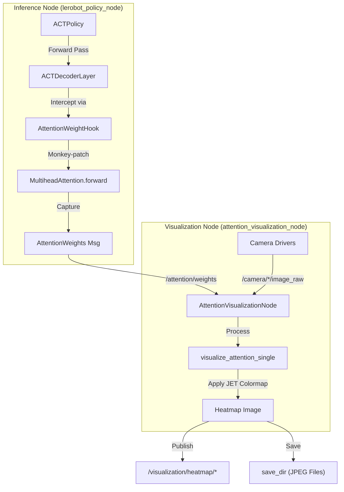
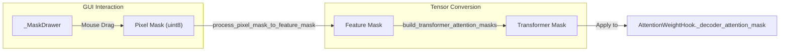

# 注意力可视化

<details>
<summary>相关源文件</summary>

生成此 wiki 页面时使用了以下文件作为上下文：

- [src/attention_viz/CMakeLists.txt](https://atomgit.com/openeuler/IB_Robot/blob/master/src/attention_viz/CMakeLists.txt)
- [src/attention_viz/README.md](https://atomgit.com/openeuler/IB_Robot/blob/master/src/attention_viz/README.md)
- [src/attention_viz/attention_viz/__init__.py](https://atomgit.com/openeuler/IB_Robot/blob/master/src/attention_viz/attention_viz/__init__.py)
- [src/attention_viz/attention_viz/attention_hook.py](https://atomgit.com/openeuler/IB_Robot/blob/master/src/attention_viz/attention_viz/attention_hook.py)
- [src/attention_viz/attention_viz/attention_masking.py](https://atomgit.com/openeuler/IB_Robot/blob/master/src/attention_viz/attention_viz/attention_masking.py)
- [src/attention_viz/attention_viz/attention_visualization_node.py](https://atomgit.com/openeuler/IB_Robot/blob/master/src/attention_viz/attention_viz/attention_visualization_node.py)
- [src/attention_viz/attention_viz/utils.py](https://atomgit.com/openeuler/IB_Robot/blob/master/src/attention_viz/attention_viz/utils.py)
- [src/attention_viz/attention_viz/visualization_core.py](https://atomgit.com/openeuler/IB_Robot/blob/master/src/attention_viz/attention_viz/visualization_core.py)
- [src/attention_viz/config/visualization_params.yaml](https://atomgit.com/openeuler/IB_Robot/blob/master/src/attention_viz/config/visualization_params.yaml)
- [src/attention_viz/launch/attention_viz.launch.py](https://atomgit.com/openeuler/IB_Robot/blob/master/src/attention_viz/launch/attention_viz.launch.py)
- [src/attention_viz/package.xml](https://atomgit.com/openeuler/IB_Robot/blob/master/src/attention_viz/package.xml)
- [src/attention_viz/test/test_attention_utils.py](https://atomgit.com/openeuler/IB_Robot/blob/master/src/attention_viz/test/test_attention_utils.py)
- [src/ibrobot_msgs/msg/AttentionWeights.msg](https://atomgit.com/openeuler/IB_Robot/blob/master/src/ibrobot_msgs/msg/AttentionWeights.msg)

</details>


`attention_viz` 包提供工具，用于在推理期间从 Action Chunking Transformer (ACT) 模型中提取、可视化并交互操作 cross-attention 权重。它用于调试模型关注区域、失败分析和视觉依赖的交互式测试。

## 概述

在基于 ACT 的策略中，decoder 使用 cross-attention 关注来自多个相机的视觉特征。`attention_viz` 通过 PyTorch hooks 截获这些权重，并将其映射回原始相机图像，生成 heatmap。

**关键能力：**
*   **注意力分布分析**：验证模型是否关注任务相关对象，例如夹爪或目标物体 [src/attention_viz/README.md:11-11](https://atomgit.com/openeuler/IB_Robot/blob/master/src/attention_viz/README.md#L11-L11)。
*   **失败归因**：判断动作失败是否由注意力转移到背景噪声或无关视觉 token 导致 [src/attention_viz/README.md:12-12](https://atomgit.com/openeuler/IB_Robot/blob/master/src/attention_viz/README.md#L12-L12)。
*   **交互式 Masking**：允许用户在相机画面上绘制 mask，手动让模型对特定区域 “失明”，测试策略对遮挡的抗扰性 [src/attention_viz/README.md:15-15](https://atomgit.com/openeuler/IB_Robot/blob/master/src/attention_viz/README.md#L15-L15)。
*   **多模式输出**：支持将 heatmap 保存到磁盘、作为 ROS 2 `sensor_msgs/Image` topic 发布，或在实时 Matplotlib GUI 中显示 [src/attention_viz/README.md:2-3](https://atomgit.com/openeuler/IB_Robot/blob/master/src/attention_viz/README.md#L2-L3)。

## 系统架构

可视化流水线连接高性能推理环境（PyTorch）与 ROS 2 消息系统。

### 数据流图

下图展示 attention 数据如何从模型层流向最终可视化结果。

"Natural Language Space to Code Entity Space: Attention Pipeline"

来源：[src/attention_viz/README.md:21-45](https://atomgit.com/openeuler/IB_Robot/blob/master/src/attention_viz/README.md#L21-L45)，[src/attention_viz/attention_viz/attention_hook.py:25-36](https://atomgit.com/openeuler/IB_Robot/blob/master/src/attention_viz/attention_viz/attention_hook.py#L25-L36)，[src/attention_viz/attention_viz/attention_visualization_node.py:57-61](https://atomgit.com/openeuler/IB_Robot/blob/master/src/attention_viz/attention_viz/attention_visualization_node.py#L57-L61)

## 关键组件

### 1. AttentionWeightHook
`AttentionWeightHook` 类负责在不修改 `lerobot` 库源码的情况下提取权重。它使用 “monkey-patching” 强制 `nn.MultiheadAttention` 返回权重，即使模型配置为高速推理（通常 `need_weights` 为 `False`）[src/attention_viz/attention_viz/attention_hook.py:8-10](https://atomgit.com/openeuler/IB_Robot/blob/master/src/attention_viz/attention_viz/attention_hook.py#L8-L10)。

*   **`install(policy)`**：遍历 ACT 模型层，并 patch decoder 中每个 `multihead_attn` 模块的 `forward` 方法 [src/attention_viz/attention_viz/attention_hook.py:52-66](https://atomgit.com/openeuler/IB_Robot/blob/master/src/attention_viz/attention_viz/attention_hook.py#L52-L66)。
*   **`get_latest()`**：从最近一次推理步骤中获取捕获的权重 [src/attention_viz/attention_viz/attention_hook.py:147-159](https://atomgit.com/openeuler/IB_Robot/blob/master/src/attention_viz/attention_viz/attention_hook.py#L147-L159)。

### 2. AttentionVisualizationNode
这是一个 ROS 2 节点，会将 attention 消息与相机帧同步，生成可视化输出。

*   **Topic 映射**：使用 `build_camera_topic_map` 自动将相机键（例如 `observation.images.top`）映射到 ROS topic（例如 `/camera/top/image_raw`）[src/attention_viz/attention_viz/utils.py:40-45](https://atomgit.com/openeuler/IB_Robot/blob/master/src/attention_viz/attention_viz/utils.py#L40-L45)。
*   **频率控制**：使用 `update_frequency` 参数避免可视化消耗过多 CPU/GPU 资源 [src/attention_viz/attention_viz/attention_visualization_node.py:110-110](https://atomgit.com/openeuler/IB_Robot/blob/master/src/attention_viz/attention_viz/attention_visualization_node.py#L110-L110)。
*   **Heatmap 生成**：调用 `visualize_attention_single`，将 attention 矩阵 resize 到图像分辨率，并应用 `cv2.COLORMAP_JET` overlay [src/attention_viz/attention_viz/visualization_core.py:39-75](https://atomgit.com/openeuler/IB_Robot/blob/master/src/attention_viz/attention_viz/visualization_core.py#L39-L75)。

### 3. 交互式 Masking
该组件位于 `attention_masking.py`，提供用于调试视觉依赖的 GUI。

"Natural Language Space to Code Entity Space: Interactive Masking"

来源：[src/attention_viz/attention_viz/attention_masking.py:53-58](https://atomgit.com/openeuler/IB_Robot/blob/master/src/attention_viz/attention_viz/attention_masking.py#L53-L58)，[src/attention_viz/attention_viz/attention_hook.py:185-194](https://atomgit.com/openeuler/IB_Robot/blob/master/src/attention_viz/attention_viz/attention_hook.py#L185-L194)

*   **功能**：用户在图像上绘制 “忽略” 区域。这些像素空间 mask 会被下采样到 transformer 的 feature map 尺寸（例如 15x20），并转换为布尔 mask，供 ACT 模型用于屏蔽特定视觉 token [src/attention_viz/attention_viz/attention_masking.py:202-206](https://atomgit.com/openeuler/IB_Robot/blob/master/src/attention_viz/attention_viz/attention_masking.py#L202-L206)。

## 配置

该包可通过 `visualization_params.yaml` 或中心化 `robot_config` 系统配置。

| 参数 | 默认值 | 说明 |
| :--- | :--- | :--- |
| `visualization_mode` | `file` | `file`（保存到磁盘）、`realtime`（GUI）或 `interactive` [src/attention_viz/config/visualization_params.yaml:3-3](https://atomgit.com/openeuler/IB_Robot/blob/master/src/attention_viz/config/visualization_params.yaml#L3-L3) |
| `queries_to_visualize` | `[0, 20, 40, 60, 80]` | 要可视化的 action chunk 中的步骤 [src/attention_viz/config/visualization_params.yaml:7-7](https://atomgit.com/openeuler/IB_Robot/blob/master/src/attention_viz/config/visualization_params.yaml#L7-L7) |
| `blend_alpha` | `0.4` | heatmap overlay 的透明度 [src/attention_viz/config/visualization_params.yaml:11-11](https://atomgit.com/openeuler/IB_Robot/blob/master/src/attention_viz/config/visualization_params.yaml#L11-L11) |
| `save_dir` | `attention_visualizations` | `file` 模式下 JPEG 输出目录 [src/attention_viz/config/visualization_params.yaml:5-5](https://atomgit.com/openeuler/IB_Robot/blob/master/src/attention_viz/config/visualization_params.yaml#L5-L5) |

来源：[src/attention_viz/config/visualization_params.yaml:1-14](https://atomgit.com/openeuler/IB_Robot/blob/master/src/attention_viz/config/visualization_params.yaml#L1-L14)

## 实现细节

### Attention 提取逻辑
系统通过对多头 attention 求平均或选择特定 head 来处理 multi-head attention。`extract_attention_per_camera` 函数会根据 `feature_map_size` 和非图像 token（如 [CLS] token 或 goal tokens）数量，对展平的 attention vector 进行切片 [src/attention_viz/attention_viz/utils.py:169-195](https://atomgit.com/openeuler/IB_Robot/blob/master/src/attention_viz/attention_viz/utils.py#L169-L195)。

```python
# Logic for slicing visual tokens per camera
feature_map_area = feature_map_size[0] * feature_map_size[1]
visual_tokens = attn[:, query_idx, num_non_image_tokens:] # Skip non-image tokens
# ...
for i, cam_key in enumerate(camera_keys):
    start = i * feature_map_area
    end = start + feature_map_area
    result[cam_key] = weights[start:end]
```
来源：[src/attention_viz/attention_viz/utils.py:210-222](https://atomgit.com/openeuler/IB_Robot/blob/master/src/attention_viz/attention_viz/utils.py#L210-L222)

### ROS 2 消息转换
自定义 `ibrobot_msgs/msg/AttentionWeights` 消息在 ROS 网络中承载原始 tensor。
*   **`attention_data_to_msg`**：将 PyTorch tensor 展平为 list 用于传输 [src/attention_viz/attention_viz/utils.py:74-78](https://atomgit.com/openeuler/IB_Robot/blob/master/src/attention_viz/attention_viz/utils.py#L74-L78)。
*   **`msg_to_attention_data`**：在接收端重构 tensor shape 以便处理 [src/attention_viz/attention_viz/utils.py:130-132](https://atomgit.com/openeuler/IB_Robot/blob/master/src/attention_viz/attention_viz/utils.py#L130-L132)。

来源：[src/attention_viz/attention_viz/utils.py:74-167](https://atomgit.com/openeuler/IB_Robot/blob/master/src/attention_viz/attention_viz/utils.py#L74-L167)

